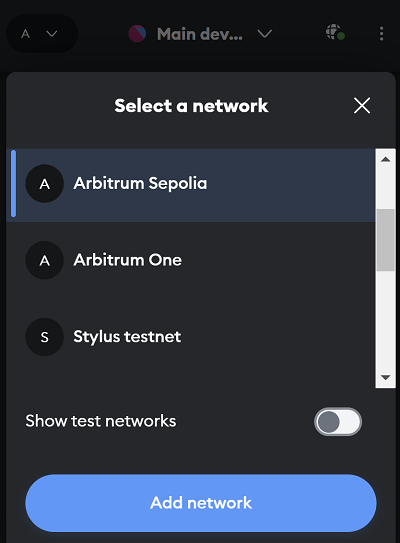
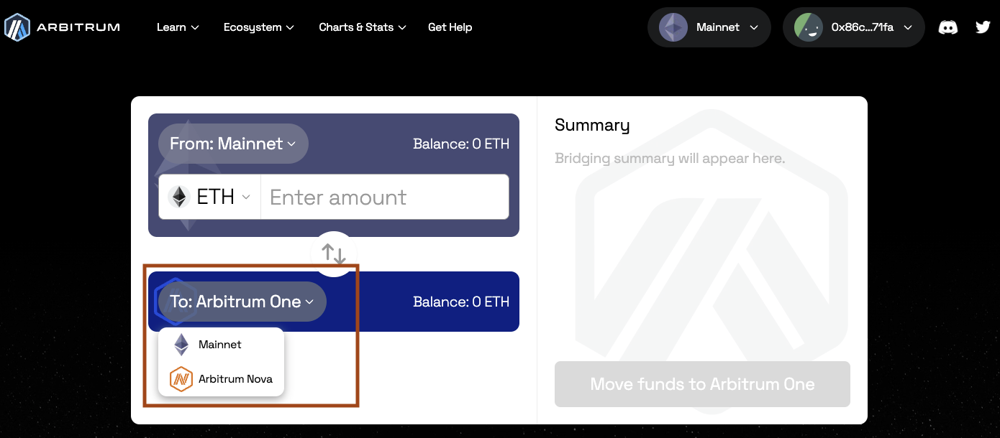
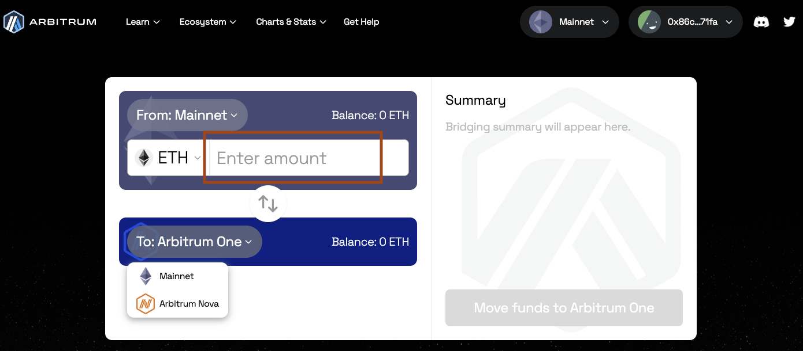
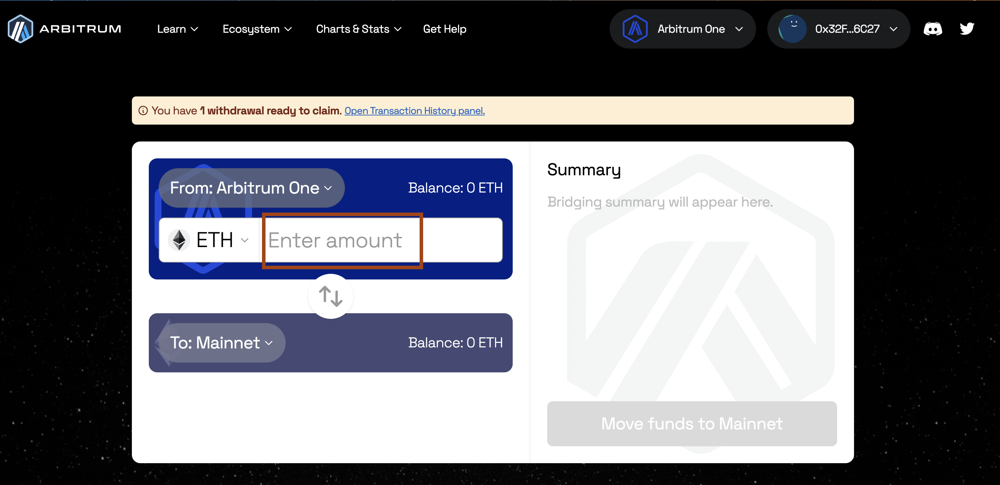
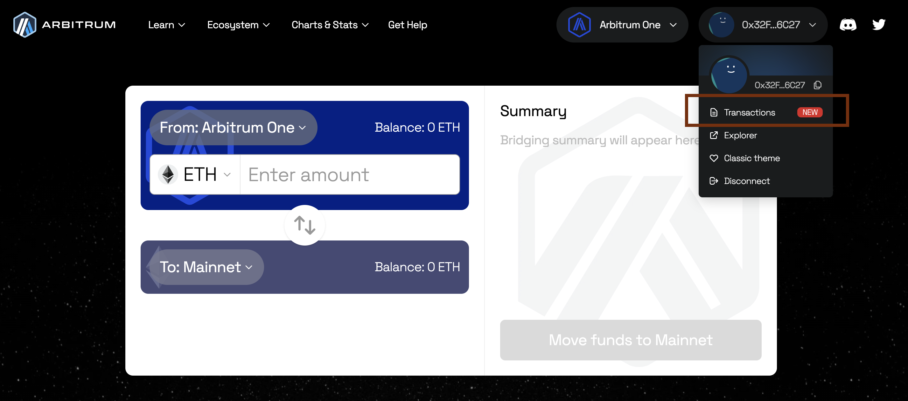

This quickstart is for users who want to "deposit" ETH or any ERC-20 tokens from a parent chain to a child chain (for example, from Ethereum to Arbitrum One, or from Arbitrum One to a Layer 3 Orbit chain), or "withdraw" from a child chain to a parent chain, using [Arbitrum's bridge](https://bridge.arbitrum.io/).

We will go through the whole process step by step with as much detail as possible. If you feel stuck in any of the steps, don't hesitate to contact us through our [Discord](https://discord.gg/arbitrum) and we will be happy to help you complete the process.

The only prerequisite for this quickstart is to have a web3 wallet installed, e.g. Metamask. If you don't have one, visit Arbitrum's [portal page](https://portal.arbitrum.io/?categories=wallet) to download one.

## Deposit ETH or ERC-20 tokens (from parent chain to child chain)

### Step 1: Get some native currency

You'll need the native currency of the parent chain to be able to bridge your assets from it to the destination chain. For example, if you want to bridge assets from Ethereum to Arbitrum One, you'll need ETH on Ethereum to initiate the process.

There are several ways to obtain the native currency:

- Using a [supported centralized exchange](https://portal.arbitrum.io/projects?chains=arbitrum-one_arbitrum-nova&subcategories=centralized-exchanges), which allows you to purchase ETH and withdraw it to your wallet. Most of the major centralized exchanges support direct withdrawal from your centralized exchange wallet to Arbitrum.
- Using an [on-ramp service](https://portal.arbitrum.io/projects?chains=arbitrum-one_arbitrum-nova&subcategories=fiat-on-ramp), which allows you to purchase ETH and send it directly to your wallet.
- If you are using a testnet, requesting funds from a faucet for [Sepolia](https://sepoliafaucet.com/) or [Arbitrum Sepolia](https://faucet.quicknode.com/arbitrum/sepolia).

### Step 2: Add the preferred network to your wallet

You'll also need to add the desired chain's RPC endpoint to your wallet. Here we provide an example for doing this using MetaMask, although the process should be similar for other wallets. You need to first click on the MetaMask extension on your browser, click the network selector dropdown on the top-left corner, and then click the `Add Network` button at the bottom. Click "Add a network manually" and then provide the information corresponding to the chain you want to send your assets to.

Here we display the information of the most common Arbitrum chains, but you can find a more exhaustive list in our [RPC endpoints and providers](/build-decentralized-apps/reference/01-node-providers.md) page.

| Parameter          | Arbitrum One                 | Arbitrum Nova                | Arbitrum Sepolia (testnet)             |
| ------------------ | ---------------------------- | ---------------------------- | -------------------------------------- |
| Network name       | Arbitrum One                 | Arbitrum Nova                | Arbitrum Sepolia                       |
| RPC URL            | https://arb1.arbitrum.io/rpc | https://nova.arbitrum.io/rpc | https://sepolia-rollup.arbitrum.io/rpc |
| Chain ID           | 42161                        | 42170                        | 421614                                 |
| Currency symbol    | ETH                          | ETH                          | SepoliaETH                             |
| Block explorer URL | https://arbiscan.io          | https://nova.arbiscan.io/    | https://sepolia.arbiscan.io            |

### Step 3: Initiate the deposit

To bridge your ETH or ERC-20 tokens to a different chain, start by visiting [bridge.arbitrum.io](https://bridge.arbitrum.io/). Log in to the bridge with your wallet and make sure you are connected to the source network (from where you want to deposit your assets) at the top of the page. Then, select the destination network (where you want your assets to go), e.g., Arbitrum One or Arbitrum Nova.

:::caution

Note that testnets like Arbitrum Sepolia only appear if you are connected to the appropriate parent testnet network (Ethereum Sepolia).

:::

Select the token you want to bridge in the token drop-down menu. You can also enable/disable the token lists by clicking `Manage token lists` button on the bottom right corner of the drop-down menu.

Enter the amount of ETH or ERC-20 tokens you want to bridge over in the **From** box and then press `Move funds`. Follow the prompts on your web3 wallet.

:::info Ensure sufficient ETH balance

Please make sure you leave enough ETH on your wallet to pay for the transaction, otherwise there will be no web3 wallet popup.

:::

After you submit the transaction through your web3 wallet you can expect your funds to arrive on the destination chain within roughly 15-30 minutes (depending on the chain congestion).

Also make sure your wallet is set to the destination chain so you can see your funds when they arrive.

## Withdraw ETH or ERC-20 tokens (from child chain to parent chain)

:::info There's at least a 7 day withdrawal period for Arbitrum One and Nova networks
Once you withdraw your funds from Arbitrum One or Nova through the Arbitrum bridge, you will have to wait for at least 7 days to receive them on Ethereum mainnet.
For more details, see [Arbitrum Bridge: Troubleshooting](/arbitrum-bridge/03-troubleshooting.mdx#how-long-does-it-take-before-i-receive-my-funds-when-i-initiate-withdrawal-from-arbitrum-chains-one-and-nova).

:::

To bridge your funds back to the parent chain, you'll need to be logged in to the [Arbitrum bridge](https://bridge.arbitrum.io/) with your wallet and make sure you are connected to the source network (from where you want to withdraw assets) at the top of the page. Then, select the destination network (where you want your assets to go), e.g., Ethereum mainnet.

:::caution

Note that testnets like Ethereum Sepolia only appear if you are connected to the appropriate child testnet network (Arbitrum Sepolia).

:::

Select the token you want to bridge in the token drop-down menu. You can also enable/disable the token lists by clicking `Manage token lists` button on the bottom right corner of the drop-down menu. Enter the amount of ETH or ERC-20 tokens you want to bridge over in the **from** box and then press `Move funds`. Follow the prompts on your web3 wallet.

:::info Ensure sufficient ETH balance

Please make sure you leave enough ETH on your wallet to pay for the transaction, otherwise there will be no web3 wallet popup.

:::

A countdown will pop up stating that you’ll get your funds in 7-8 days.

You can check the status of your withdrawal by clicking on your profile on the top right and opening the `Transactions` tab, and claim it there when it’s ready.

Once the countdown is done, switch to the destination network on your wallet and press the `Claim` button, that has now turned blue, to receive your funds!

## What's next?

The team working on Arbitrum is always interested and looking forward to engage with its users. Why not follow us on [X (Twitter)](https://x.com/arbitrum) or join our community on [Discord](https://discord.gg/arbitrum)?
