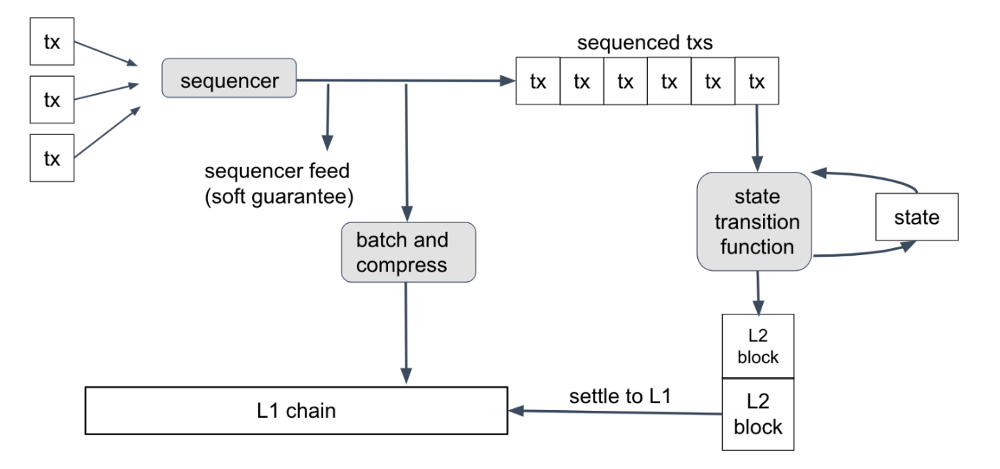

import PublicPreviewBannerPartial from '../../how-arbitrum-works/bold/partials/_bold-public-preview-banner-partial.md';

<PublicPreviewBannerPartial />

## Overview

Arbitrum's current dispute protocol involves defending against challengers individually in a 1-vs-1 tournament setting. In contrast, BoLD enables an all-vs-all battle royale between Good and Evil categories, with a single winner always determined.
This dynamic is made possible by BoLD's time-bounded, permissionless validation using deterministic Merkle proofs and hashes. This allows any party to bond in the correct state and prove their claim through interactive fraud proofs, ensuring that a single honest party bonding in the correct state will always prevail in disputes.

Validators on Arbitrum can post their claim on the validity of state roots, known as **assertions**. Ethereum, of course, does not know anything about the validity of these Arbitrum state roots, but it _can_ help prove their correctness. _Anyone_ in the world can then initiate a challenge over any unconfirmed assertion to start the protocol’s game.

The assertions being disputed concern block hashes of an <a data-quicklook-from="arbitrum-chain">Arbitrum chain</a> at a given batch/inbox position. Given that Arbitrum chains are deterministic, there is only one correct history for all parties running the standard Nitro software. Using the notion of one-step proof, Ethereum can check whether someone is making a fraudulent assertion after an interactive game is played to narrow down a dispute.

If a claim is honest, it can be confirmed on Ethereum after a 6.4-day period (although the DAO can change this period). If a claim is malicious, anyone who knows the correct Arbitrum state can successfully challenge it within that 6.4-day window _and always win_ within a <a data-quicklook-from="challenge-period">challenge period</a> plus some small delta.

The current implementation of BoLD involves both on-chain and off-chain components:

1. Rollup contracts to be deployed on Ethereum.

2. New challenge management contracts to be deployed on Ethereum.

3. [Honest validator software](https://github.com/offchainlabs/bold) equipped to submit assertions and perform challenge moves on any assertions it disagrees with. The honest validator is robust enough to win against malicious entities and always ensures honest assertions are the only ones confirmed on-chain.

### Key terminology

- **Arbitrum rollup contracts:** The set of smart contracts on Ethereum L1 that serve as both the data availability layer for Arbitrum and for confirming the rollup's state assertions after a challenge period has passed for each assertion made.
- **Assertions:** A claim posted to the Arbitrum rollup contracts on Ethereum L1 about the Arbitrum L2 execution state. Each claim consumes messages from the Arbitrum rollup inbox contract. Each assertion can be confirmed after a period of 6.4 days, and anyone can challenge it during that period. A BoLD challenge will add an additional upper bound of 6.4 days to confirm an assertion. If an assertion is challenged near the end of 6.4 days, an additional 6.4 days will be needed to complete the challenge. Gaining the right to post assertions requires placing a large, one-time bond, which can get taken away in the case of losing a challenge to a competing assertion. Opening challenges requires opening smaller “challenge-bonds” each time.
- **Validating bridge:** The smart contract that leverages Ethereum's security and censorship-resistance to unlock bridged assets from L2 back to L1. Assets can be unlocked after an assertion has been posted and confirmed after a challenge period has passed.
- **Fraud proofs:** Proofs of a single step of `WAVM` execution of Arbitrum's state transition function, which are submitted to Ethereum and verified in the `EVM` via a smart contract. These proofs allow Ethereum to be the final arbiter of disagreements over assertions in the rollup contracts, which cannot be falsified by any parties as there is only a single, correct result of executing a `WASM` instruction on a pre-state.
- **Challenge protocol:** A set of rules through which a disagreement on an assertion is resolved using Ethereum as the final arbiter. Ethereum's VM can verify one-step proofs of deterministic computation that can confirm a challenge winner in Arbitrum's rollup contracts.
- **Bonding of funds:** Creating an assertion in the rollup contracts requires the submitter to join the validator set by putting up a large bond in the form of `WETH`. Subsequent assertions posted by the same party do not require more bonds. Instead, the protocol always considers validators to be bonded to their latest posted assertion. The bonded funds are taken away if another competing assertion is confirmed. In the case of confirming an assertion, the associated bonded funds can be withdrawn.
- **Honest validator:** An entity that knows the correct state of the Arbitrum L2 chain and who may want to participate in creating assertions, confirming assertions, and/or challenging invalid assertions if they exist. More specifically, this entity must run an Arbitrum full node in `MakeNodes`, `Defensive`, `StakeLatest`, or `ResolveNodes` mode as described in the [How to run a validator](https://docs.arbitrum.io/run-arbitrum-node/more-types/run-validator-node).  Note that there must always be an active proposer to advance the chain and who will need to run a validator in `MakeNodes` mode.
- **Challenge period:** Window of time ([~6.4 days on Arbitrum One](https://docs.arbitrum.io/build-decentralized-apps/reference/chain-params)) over which an assertion can be challenged, after which the assertion can be confirmed. This is configurable by the DAO.
- **Edge:** Edges are a portion of a claim made by a validator about the history of the chain from some end state all the way back to some initial state. Edges are the fundamental unit in a challenge.
- **Delay attacks:** In a delay attack, a malicious party (or group of parties) acts within the rollup protocol, forcing the honest party to play 1-vs-1 games against them to delay the confirmation of results back to the L1 chain. BoLD has a proven, constant upper bound on confirmation times for assertions in Arbitrum, addressing the biggest flaw of the current challenge mechanism. BoLD validators don’t need to play 1-vs-1 challenges and instead can defend a single challenge against many malicious claims. With delay attacks solved, Arbitrum will be able to allow permissionless validation.
- **Permissionless validation:** The ability for anyone to interact with the Arbitrum rollup contracts on Ethereum to both post assertions and challenge others' assertions without needing permission. With the release of BoLD, the rollup contracts on Arbitrum will no longer have a permissioned list of validators.
- **Validator software:** Software that has knowledge of the correct Arbitrum L2 state at any point. It tracks the on-chain rollup contracts for assertions posted and will automatically initiate challenges on malicious assertions if configured to do so by the user. It will participate in new and existing challenges and make moves as required by the protocol to win against any number of malicious entities. Its goal is to ensure only honest assertions about Arbitrum's state are confirmed on Ethereum. All Arbitrum full nodes are watchtower validators by default. This means they do not post claims or assertions unless configured to do so but will warn in case invalid assertions are detected on-chain.

### How BoLD uses Ethereum

When it comes to implementing the protocol, BoLD needs to be deployed on a credibly-neutral, censorship-resistant backend to be fair to all participants. As such, Ethereum was chosen as the perfect candidate. Ethereum is currently the most decentralized, secure, smart contract blockchain to which the full protocol can be deployed, with challenge moves performed as transactions to the protocol’s smart contracts.

A helpful mental model for understanding the system is that it uses Ethereum itself as the ultimate referee for deciding assertion results. Participants in the challenge protocol can disagree over the _results of L2 state transitions_ and provide proofs to the protocol's smart contracts on Ethereum to determine which result is correct. Because computation is deterministic, there will always be a single correct result.

_From the **[Nitro whitepaper](https://github.com/OffchainLabs/nitro/blob/master/docs/Nitro-whitepaper.pdf)**. L2 blocks are “settled to L1” after a 6.4 day period has elapsed and nobody has challenged their validity on Ethereum._

In effect, there is a miniature Arbitrum state-transition VM[deployed as an Ethereum smart contract](https://sourcegraph.com/github.com/OffchainLabs/nitro/-/blob/contracts/src/osp/OneStepProofEntry.sol) to prove which assertions are correct. However, computation on Ethereum is expensive, which is why this mini-VM is built to handle “one-step proofs” consisting of a single step of WebAssembly code. The Arbitrum state transition logic, written in Golang, is also compiled to an assembly language called <a data-quicklook-from="wasm">`WASM`</a> and will therefore obtain the same results as the VM found in the on-chain smart contract. The soundness of the protocol depends on the assumptions that computation is deterministic and equivalent between the on-chain VM and the Golang state transition compiled to `WASM`.

All actors in the protocol have a local state from which they can produce valid proofs, and all honest parties will have the same local state. Malicious entities, however, can deviate from the honest parties in attempts to confirm invalid states through the protocol. Both the protocol and the honest validator client’s job is then to allow honest parties to always win against any number of malicious participants by always claiming the absolute truth.

### On-chain components

- **Rollup contract:** This is a smart contract that lives on Ethereum and allows validators to bond on state assertions about Arbitrum. This contract, known as `RollupCore.sol`, is already used by Arbitrum chains to post assertions. BoLD requires several changes to how assertions work in this contract, and it now contains a reference to another contract called a `ChallengeManager`, new in BoLD.
- **ChallengeManager:** This is a contract that allows for initiating challenges on assertions and provides methods for anyone to participate in challenges in a permissionless fashion. BoLD will require a new `ChallengeManager` written in Solidity and deployed to Ethereum. The challenge manager contains entry points for making challenge moves, opening leaves, creating subchallenges, and confirming challenges.

- **OneStepProver:** A set of contracts that implement a miniature `WASM` VM capable of executing one-step-proofs of computation of the L2 state transition function. This is implemented in Solidity and already exists on Ethereum. No changes to the `OSP` contracts are needed for BoLD.

**Bonding:** Participants in the protocol need to bond a certain amount of `ETH` (`WETH` is used in the BoLD testnet) to gain the privilege of posting assertions to the Rollup contracts by locking up an `ETH` bond in the protocol contracts. Whenever someone wants to challenge an assertion, they must also place a smaller bond called a challenge bond in their challenge. Bonds, their rationale, and magnitude will be covered in greater detail in the specifications section.

### Off-chain components

- **Chain bindings:** Software that can interact with an Ethereum node in order to make calls and transactions to the on-chain contracts needed for participating in the protocol. We utilize go-ethereum’s abigen utilities to create Go bindings to interact with the contracts above, with a few more developer-friendly wrappers.

- **State manager backend:** Software that can retrieve L2 chain states and produce commitments to `WAVM` histories for Arbitrum based on an execution server. The validator client, described below, will have access to a state manager backend in order to make moves on challenge vertices.
- **Validator client:** A validator client is software that knows the correct history of the Arbitrum L2 chain via a state manager backend and can create assertions on L1 about them by bonding a claim. A validator is also active in ensuring honest assertions get confirmed and participating in challenging those it disagrees with. In BoLD, an honest validator will also participate in challenges other validators are a part of to support other honest participants. It interacts with the on-chain components via chain bindings described above.
- **Challenge manager client:** Software that can manage the life cycles of challenges a validator participates in. Validators need to participate in multiple challenges at once and manage individual challenge vertices correctly to act upon, confirm, or reject them. This and the validator's responsibilities can be coupled into a single binary.

### Assertions

A key responsibility for Arbitrum proposers is to regularly post claims about the Arbitrum chains’ state to Ethereum at certain checkpoints. These are known as assertions (and are sometimes called L2 state roots). Assertions contain information, most critically:

1. The L2 block hash being claimed

2. The batch number it corresponds to for the Arbitrum chain

3. The number of messages in the Arbitrum inbox at the time the assertion was posted on-chain

The following assertion to be posted on-chain must consume, at least, the specified number of inbox messages from its parent. There is a required delay in L1 blocks for assertion posting. Currently, this value is set to equal 1 hour for BoLD.

Anyone can confirm assertions after a period of 6.4 days if they have not been challenged. In particular, assertions facilitate the process of withdrawing from Arbitrum back to Ethereum. Arbitrum withdrawals require specifying a blockhash, which must be confirmed as an assertion on-chain. This is why withdrawals have a delay of 6.4 days if they are not actively challenged.

Validators must become proposers in the Rollup contract before being allowed to post assertions. For Arbitrum One and Arbitrum Nova, this involves placing a one-time bond of 3600 `WETH` that is locked in the contract until they choose to withdraw. Validators can only withdraw their bond if their latest posted assertion gets confirmed. Every assertion a validator posts will become their latest bonded assertion. Subsequent bonds are not needed to post more assertions, instead, the protocol “moves” a validator’s bonds to their latest posted assertion.

Assertions form a chain in which there can be forks. For instance, a validator might disagree with the L2 blockhash of an assertion at a given batch. All <a data-quicklook-from="arbitrum-nitro">Arbitrum Nitro</a> nodes are configured to warn users if they observe an assertion they disagree with posted on-chain. However, if a node is configured as a validator and has deposited a bond to the Rollup contract, then that validator post the correct, rival assertion to any invalid one it just observed. The validator will also be able to initiate a challenge by posting a challenge bond and other data to the `ChallengeManager`, signaling it is disputing an assertion.

#### Overflow assertions

Given the mandatory delay of one hour between assertions posted on-chain, and each assertion is a claim to a specific Arbitrum batch, there could be a very large number of blocks in between assertions. However, a single assertion only supports a maximum of 2^26 Arbitrum blocks since its parent. If this value is overflowed, a follow-up overflow assertion needs to be posted to consume the rest of the blocks above the maximum. This overflow assertion will not be subject to the mandatory 1-hour delay between assertions.

#### Trustless bonding pools

A large upfront assertion bond is critical for discouraging malicious actors from attacking Arbitrum and spamming the network (e.g., delay attacks), especially because malicious actors will always lose challenges and their entire bond. On the other hand, requiring such a high upfront assertion bond may be prohibitive for a single honest entity to put up—especially since the cost to defend Arbitrum is proportional to the number of malicious entities and ongoing challenges at any given point in time.

To address this, there is a [contract](https://github.com/OffchainLabs/bold/blob/main/contracts/src/assertionStakingPool/AssertionStakingPoolCreator.sol) that anyone can use to deploy a trustless, bonding (or staking) pool as a way of crowdsourcing funds from others who wish to help defend Arbitrum, but who may otherwise not individually be able to put up the sizeable upfront bond itself.

Anyone can deploy an assertion bonding pool using the `AssertionStakingPoolCreator.sol` contract as a means to crowdsource funds for bonding funds to an assertion. To defend Arbitrum using one of these pools, an entity would first deploy this pool with the assertion they believe is correct and wish to bond on to challenge an adversary's assertion. Then, anyone can verify that the claimed assertion is correct by running the inputs through their node's State Transition Function (`STF`). If other parties agree that the assertion is correct, they can deposit their funds into the contract. When enough funds have been deposited, anyone can trigger the creation of the assertion on-chain to start the challenge in a trustless manner. Finally, once the dispute protocol confirms the honest parties' assertion, all involved entities will get their funds reimbursed and can withdraw.

Note that with bonding pools, there is no minimum `WETH` requirement and once the entire bond amount is raised (either 3600, 555, or 79 ETH for Arbitrum One), then the assertion can be posted by anyone trustlessly. Additionally, there is an optional feature in the Nitro node validator software that enables both the automatic deployment of a bonding pool contract and depositing of funds to challenge an observed invalid assertion. 

<a data-quicklook-from="trustless">Trustless</a> bonding pools can also be created to open challenges
and make moves on challenges without sacrificing decentralization.

### Opening challenges

To initiate a challenge, there must first be a fork in the assertion chain within the Arbitrum Rollup contracts. However, a challenge's actual start involves creating an edge claim and posting it to the `ChallengeManager` contract on the parent chain. Additionally, the validator posting the edge must attach a bond called a challenge bond to it (denominated in `WETH` for the BoLD testnet and for Arbitrum One and Arbitrum Nova). This bond is much lower than the one required to become an assertion poster.

Anyone can open a challenge on an assertion without needing to be a bonder in the Rollup contract, so long as they post a challenge bond and an edge claiming intent to start the challenge. Challenges are not tied to specific addresses or parties – instead, anyone can participate.

Recall that a challenge is a fundamental disagreement about an assertion posted to the Arbitrum chain. At its core, validators disagree about the blockhash at a certain block number, essentially, and the BoLD protocol allows them to interactively narrow down their disagreement via cryptographic proofs such that Ethereum can be the final referee and claim a winner.

At its core, the disagreement between validators looks something like this:

- Common parent assertion: `batch 5, blockhash 0xabc`

- Alice’s assertion: `batch 10, blockhash 0x123`

- Bob’s assertion: `batch 10, blockhash 0x456`

Their disagreement is about an Arbitrum block somewhere between batch 5 and batch 10. Here’s how the actual challenge begins in this example:

Validators have to fetch all blocks between batch 5 and batch 10 and create a Merkle commitment out of them as a Merkle tree with 2^26 leaves. If there are fewer than 2^26 blocks in between the assertions, the last block is repeated to pad the leaves of the tree to that value. Validators then create an “edge” data structure, which contains the following fields:

- **start_hash:** the start hash of the block from the common parent assertion

- **end_hash:** the end hash of the block at the claimed child assertion

- **merkle_root:** the Merkle root that results from committing to a Merkle tree from the start block hash to the end block hash

- **inclusion_proofs:** Merkle proofs that the start and end hashes are indeed leaves of the Merkle tree committing to a root

The concept of a history commitment is at the core of challenges and BoLD itself.

The validators above provide a Merkle proof of their commitment to some history. In this case, all the Arbitrum block hashes from batch 5 to batch 10. Using this tree, validators can narrow their disagreement to a single block using Merkle proofs.

### Challenge resolution

The fundamental unit in a challenge is an edge data structure.

#### Initiation

The first validator to create an edge initiates a challenge. The smart contracts validate the Merkle inclusion proofs and hashes provided to prove this challenge is about a specific fork in the assertion chain in the Rollup contract.

#### Bisections

When an edge is created, it claims some history from point A to B, with which validators can agree or disagree. Other validators can claim some history from point A to B’, where B’ is a different end state. A history commitment is a Merkle commitment to a list of hashes.

To narrow down a disagreement, validators have to figure out what exact hash they disagree with. To do this, the game essentially takes turns between validators playing binary search. Each move here is known as a “bisection” because each move splits a history commitment in half.

For instance:

Alice commits to 32 hashes with start = A, end = B

Bob commits to 32 hashes with start = A, end = B’

Either of them can perform a “bisection” move on their edge. For instance, if Alice “bisects” her edge E, the bisection transaction will produce two children, E_1 and E_2. E_1 commits to 16 hashes from height A to B/2, and E_2 commits to 16 hashes from height B/2 to B.

A validator can make a move on an edge as long as that edge is “rivaled”. That is, the children just created due to Alice’s bisection will have increasing timers until Bob also bisects and possibly creates rivals for Alice’s edges.

#### Subchallenges

The number of steps of execution at which validators could disagree within a single Arbitrum block has a max of 2^42. To play a game of bisections on this amount of hashes would be unreasonable from a space requirement, as each history commitment would require 4.35Tb worth of hashes. Instead, BoLD plays the bisection game over different levels of granularity of this space of 2^42 hashes.

The bisection game is an iterative process. Initially, validators disagree over Arbitrum blocks between two assertions. They create “edges” containing history commitments to all the blocks in between those two assertions, and commence the bisection game. As they progressively narrow down to a single block of disagreement, they then focus on identifying the point of disagreement in the actual `WASM` execution of the block through the Arbitrum state transition function. This marks the first “subchallenge”.

The first subchallenge is over a max of 2^26 hashes where validators need to narrow down their single hash of disagreement. As the space of hashes is too large, we explore this space in _ranges_ of steps. Each hash represents a max of 2^26 blocks, with each block containing a max of 2^42 WASM steps of execution

First, validators disagree over execution of up to 2^26 L2 Blocks. Then, they open another subchallenge once they reach a single block of disagreement. They then play a subchallenge over up to 2^19 **BigSteps**, which are each 2^23 steps of WASM execution. Once they reach a single disagreement at the BigStep level, they open a final subchallenge over up to 2^23 SmallSteps, which are each a single step of WASM execution . The bisection game is the same at each subchallenge level, and opening a subchallenge requires placing another “challenge bond”. The magnitudes of challenge bonds are different at each subchallenge level.

#### One step proof

Once validators reach a single, individual step of disagreement after reaching the deepest subchallenge level, they need to provide something called a **one step proof**, or `OSP` for short. This is a proof of `WASM` execution showing that executing the Arbitrum state transition function at hash A leads to hash B. The parent chain, like Ethereum is for Arbitrum One, then actually runs a `WASM` emulator using a smart contract for this step and will declare a winner. An evil party cannot forge a one-step proof, and unless there is a critical bug in the smart contract, the honest party will always win. At this point, the honest party’s one-step proven edge will be confirmed, and the evil party has no more moves to make. Next, the honest party’s “branch” of edges all the way from the top to the one-step proven edge will have an ever-increasing timer until the top edge can be confirmed by time.

#### Timers

Once a validator creates an edge, and if it does not have any rival edge contesting it, that edge will have a timer that ticks up called its **unrivaled timer**. Time in the protocol is measured in L1 blocks, and block numbers are used. An edge's timer stops ticking when a rival edge is created on-chain.

Edges also have an **inherited timer**, which is the sum of its unrivaled timer + the minimum inherited timer of an edge's children (recursive definition). Once one of the top-level edges that initiated a challenge has achieved an inherited timer >= a CHALLENGE_PERIOD (6.4 days), it can be confirmed. At this point, its assertion can also be confirmed as its associated challenge has completed. A minor but important detail is that edges also inherit the time their claimed assertion was unrivaled.

We believe timer inheritance from ancestor edges is fundamentally broken. Honest edges could have evil ancestors or vice versa, and edges could steal/claim timer credit from others to which they should not be entitled. The [research specification](https://arxiv.org/abs/2404.10491) goes in-depth into the proven lemmas of timer inheritance and why children's inheritance solves critical attack vectors.

#### Cached timer updates

An edge's "inherited timer" value exists on-chain and can be updated via a transaction. Given it is a recursive definition, it can be updated via multiple transactions. First, the lowermost edges have their timers updated, then their parents, etc., up to the top. Validators can track information locally to avoid sending wasteful transactions and only propagate updates once they are confident their edge is confirmable by time.

#### Confirmation

Once an edge has a total on-chain timer greater than or equal to a challenge period, it can be confirmed via a transaction. Not all edges need to be confirmed on-chain, as simply the top-level block challenge edge is enough to confirm the claimed assertion and resolve a dispute. A challenge is not complete at the one-step proof. It is only complete once the claimed assertion of a challenge is confirmed.

### Bonding in challenges

To create a challenge, there must be a fork in the Arbitrum assertion chain smart contract. A validator that wishes to initiate a challenge must then post an “edge” claiming a history of block hashes from the parent assertion to the claimed assertion they believe is correct. To do so, they need to put up some value called a "challenge bond". Note that to open a new assertion-level challenge, the challenge bond is equal to the assertion bond for <a data-quicklook-from="arbitrum-one">Arbitrum One</a>.

<a data-quicklook-from="challenge">Challenge</a> bonds are named as such because they are bonds required
for opening challenges. The mechanism of how challenge bond economics are decided is contained in the
economics deep dive, which also explains the cost profile and spam prevention in BoLD. In short, the
actual cost of a bond encompasses information such as off-chain costs + gas costs + grieving ratios between
honest and evil parties to discourage spam.

Each subchallenge that is created requires depositing a challenge bond. For Arbitrum One, the first unrivaled edge’s bond is kept in the challenge manager contract on Ethereum, while any subsequent rival bonds are kept in an excess bond receiver address. Once a challenge is complete, all bonds for an honest party are automatically refunded in-protocol while all confiscated bonds are sent to the ArbitrumDAO treasury. It is important to not offer the majority of the bonds confiscated from dishonest parties to honest parties to avoid perverse incentives, such as grieving attacks in self-challenges or to discourage needless competition between honest parties.

### Reimbursements of bonds

It is important to emphasize that the reimbursement of assertion bonds and challenge bonds for honest parties will be handled “in-band” by the protocol. While reimbursing honest parties for gas costs will not be handled “in-band” on L1 and will instead be handled by the Arbitrum Foundation. There will be a procedure, to be published later, that can be followed to calculate the reimbursements for gas costs to honest parties.

Lastly, reimbursement will not be made for off-chain compute costs as we view these as costs borne by the operator, alongside the maintenance and infra costs that regularly arise from running a node. It is also difficult to attribute computation, as honest validators that are not necessarily posting claims would still perform similar computations if they are following a challenge. However, the costs of the on-chain bonds to participate in challenges far exceed the cost of compute required to resolve these challenges.

### Upgrade mechanism

For BoLD to be deployed on an Arbitrum chain, an upgrade admin action needs to be taken using an `UpgradeExecutor` pattern. This is a smart contract that executes actions as the Rollup owner. At the upgrade, the `RollupCore.sol` contract will be updated to a new BoLD one, and additional contracts needed for BoLD challenges, such as an `EdgeChallengeManager.sol`, will also be deployed to the parent chain.

Next, assertions will then be posted to the new Rollup contract. During the upgrade period, there could have been a very large number of blocks posted in Arbitrum batches. For this purpose, BoLD assertions support the concept of an **overflow**, allowing us to efficiently handle this situation. 

:::caution Withdrawals leading up to a BoLD upgrade

The confirmation timing on any withdrawal that is in-flight when the BoLD upgrade is activated will be delayed until the first BoLD assertion is confirmed. This means that for any Arbitrum chain that upgrades to use BoLD, including Arbitrum One and Arbitrum Nova, all pending withdrawals to L1 Ethereum that were initiated _before_ the upgrade will be delayed by 1 challenge period, plus the time between the withdrawal was initiated and the time that the BOLD upgrade takes place. This is because the upgrade effectively "resets" the challenge period for that are not yet finalized. 

For example, if the upgrade happened at time _t_, then a withdrawal initiated at a time _t-2_ days will need to wait an additional _6.4_ days for their withdrawal to be finalized, totaling 8.4 days of maximum delay. Withdrawals that finalize before the upgrade takes place at time _t_ will be unaffected. In other words, the maximum delay a withdrawal will experience leading up to the upgrade is 12.8 days (two challenge periods).
:::

The upgrade pattern for an existing Arbitrum Rollup to a BoLD-enabled one is tested extensively and run as part of each of our pull requests in the BoLD repository [upgrade workflow on GitHub](https://github.com/OffchainLabs/bold/blob/c4e068b568ff662f49ed191c5c3188ea7b6138b2/.github/workflows/go.yml#L209).
