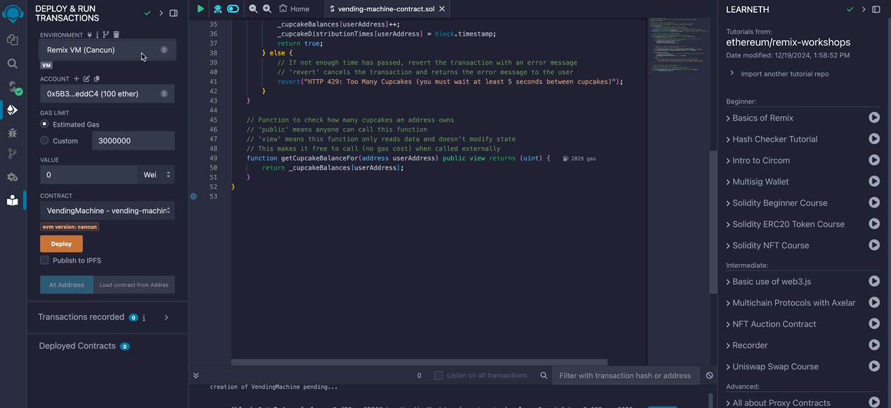

:::info Want to use Rust instead?

Head over to [the Stylus quickstart](/stylus/quickstart) if you'd like to use Rust instead of Solidity.

:::

This quickstart is for web developers who want to start building **decentralized applications** (dApps) using <a data-quicklook-from='arbitrum'>Arbitrum</a>. It makes no assumptions about your prior experience with Ethereum, Arbitrum, or Solidity. Familiarity with Javascript and yarn is expected. If you're new to Ethereum, consider studying the [Ethereum documentation](https://ethereum.org/en/developers/docs/) before proceeding.

import CustomDetails from '@site/src/components/CustomDetails';
import { VendingMachine } from '@site/src/components/VendingMachine/VendingMachine';

### What we'll learn

In this tutorial we will learn:

1. The basics of Ethereum vs. client/server architecture
2. What is a Solidity smart contract
3. How to compile and deploy a smart contract
4. How to use an Ethereum wallet

We're going to build a digital cupcake vending machine using Solidity smart contracts[^1]. This vending machine will follow two rules:

1. The vending machine will distribute a cupcake to anyone who hasn't recently received one.
2. The vending machine's rules can't be changed by anyone.

Here's the vending machine implemented with Javascript.
To use it, enter a name in the form below and press the 'Cupcake please!' button, you should see your cupcake balance go up.

<VendingMachine id="dumb-cupcakes" type="web2" />

We can assume that this vending machine operates as we expect, but it's largely up to the **centralized service provider** that hosts it.
In the case of a compromised cloud host:

1. Our centralized service provider can deny access to particular users.
2. A malicious actor can change the rules of the vending machine at any time, for example, to give their friends extra cupcakes.

Centralized third-party intermediaries represent a **single point of failure** that malicious actors can exploit. With a blockchain infrastructure such as Ethereum, we decentralize our vending machine's **business logic and data**, making this type of exploits nearly impossible.

This is Arbitrum's core value proposition to you, dear developer. Arbitrum makes it easy for you to deploy your vending machines to Ethereum's permissionless, <a data-quicklook-from='trustless'>trustless</a>, decentralized network of nodes[^2] **while keeping costs low for you and your users**.

Let's implement the "Web3" version of the above vending machine using Arbitrum.

### Prerequisites

<CustomDetails summary="VS Code">
  VS Code is the IDE we'll use to build our vending machine. See
  [code.visualstudio.com](https://code.visualstudio.com/) to install.
</CustomDetails>

<CustomDetails summary="Web3 wallet">
  The <a data-quicklook-from="ethereum-wallet">wallet</a> we'll use to interact with our vending
  machine. See [metamask.io](https://metamask.io/) and click View MetaMask Web or [OKX
  Wallet](https://www.okx.com/web3) and click Connect Wallet to install.
</CustomDetails>

<CustomDetails summary="Yarn">
  The <a data-quicklook-from="ethereum-wallet">wallet</a> we'll use to interact with our vending
  machine. See [metamask.io](https://metamask.io/) and click View MetaMask Web or [OKX
  Wallet](https://www.okx.com/web3) and click Connect Wallet to install.
</CustomDetails>

<CustomDetails summary="Foundry">
  Foundry is the toolchain we'll use to compile and deploy our smart contract. See
  [getfoundry.sh](https://getfoundry.sh) to install.
</CustomDetails>

### Ethereum and Arbitrum in a nutshell

- **Ethereum**
  - Ethereum is a decentralized network of [nodes](https://docs.prylabs.network/docs/concepts/nodes-networks) that use Ethereum's client software (like [Offchain's Prysm](https://docs.prylabs.network/docs/getting-started) to maintain a public <a data-quicklook-from='blockchain'>blockchain</a> data structure.
  - The data within Ethereum's blockchain data structure changes one transaction at a time.
  - <a data-quicklook-from="smart-contract">Smart contracts</a> are small programs that execute transactions
    according to predefined rules. Ethereum's nodes host and execute smart contracts.
  - You can use smart contracts to build decentralized apps (dApps) that use Ethereum's network to process transactions and store data. Think of smart contracts as your dApp's backend
  - DApps let users carry their data and identity between applications without having to trust centralized service providers.
  - People who run Ethereum validator nodes[^3] can earn `$ETH` for processing and validating transactions on behalf of users and dApps.
  - These transactions can be expensive when the network is under heavy load.
- **Arbitrum**
  - Arbitrum is a suite of L2 scaling solutions for dApp developers.
  - <a data-quicklook-from="arbitrum-one">Arbitrum One</a> is an L2 chain that implements the
    <a data-quicklook-from="arbitrum-rollup-protocol">Arbitrum Rollup protocol</a>.
  - You can use Arbitrum One to build user-friendly dApps with high throughput, low latency, and low transaction costs while inheriting Ethereum's high security standards[^4].

 <!-- Note: add simple diagrams representing mainnet and arbitrum  -->

 <!-- Note: add simple diagrams representing smart contracts development cycle  -\-> -->

### Review the Javascript vending machine

Here's the vending machine implemented as a Javascript class:

<CustomDetails summary="VendingMachine.js">
```js
class VendingMachine {
  // state variables = internal memory of the vending machine
  cupcakeBalances = {};
  cupcakeDistributionTimes = {};

// Vend a cupcake to the caller
giveCupcakeTo(userId) {
if (this.cupcakeDistributionTimes[userId] === undefined) {
this.cupcakeBalances[userId] = 0;
this.cupcakeDistributionTimes[userId] = 0;
}

    // Rule 1: The vending machine will distribute a cupcake to anyone who hasn't recently received one.
    const fiveSeconds = 5000;
    const userCanReceiveCupcake = this.cupcakeDistributionTimes[userId] + fiveSeconds <= Date.now();
    if (userCanReceiveCupcake) {
      this.cupcakeBalances[userId]++;
      this.cupcakeDistributionTimes[userId] = Date.now();
      console.log(`Enjoy your cupcake, ${userId}!`);
      return true;
    } else {
      console.error(
        'HTTP 429: Too Many Cupcakes (you must wait at least 5 seconds between cupcakes)',
      );
      return false;
    }

}

getCupcakeBalanceFor(userId) {
return this.cupcakeBalances[userId];
}
}

````
</CustomDetails>

The `VendingMachine` class uses _state variables_ and _functions_ to implement _predefined rules_. This implementation is useful because it automates cupcake distribution, but there's a problem: it's hosted by a centralized server controlled by a third-party service provider.

Let's decentralize our vending machine's business logic and data by porting the above JavaScript implementation into a Solidity smart contract.

### Review the Solidity vending machine

Here is a Solidity implementation of the vending machine.
Solidity is a language that compiles to [EVM bytecode](https://blog.chain.link/what-are-abi-and-bytecode-in-solidity/). This means that it can be deployed to any Ethereum-compatible blockchain, including Ethereum mainnet, <a data-quicklook-from='arbitrum-one'>Arbitrum One</a>, and <a data-quicklook-from='arbitrum-nova'>Arbitrum Nova</a>.

<CustomDetails summary="VendingMachine.sol">
```solidity
// SPDX-License-Identifier: MIT
// Specify the Solidity compiler version - this contract requires version 0.8.9 or higher
pragma solidity ^0.8.9;

// Define a smart contract named VendingMachine
// Unlike regular classes, once deployed, this contract's code cannot be modified
// This ensures that the vending machine's rules remain constant and trustworthy
contract VendingMachine {
   // State variables are permanently stored in blockchain storage
   // These mappings associate Ethereum addresses with unsigned integers
   // The 'private' keyword means these variables can only be accessed from within this contract
   mapping(address => uint) private _cupcakeBalances;     // Tracks how many cupcakes each address owns
   mapping(address => uint) private _cupcakeDistributionTimes;  // Tracks when each address last received a cupcake

   // Function to give a cupcake to a specified address
   // 'public' means this function can be called by anyone
   // 'returns (bool)' specifies that the function returns a boolean value
   function giveCupcakeTo(address userAddress) public returns (bool) {
       // Initialize first-time users
       // In Solidity, uninitialized values default to 0, so this check isn't strictly necessary
       // but is included to mirror the JavaScript implementation
       if (_cupcakeDistributionTimes[userAddress] == 0) {
           _cupcakeBalances[userAddress] = 0;
           _cupcakeDistributionTimes[userAddress] = 0;
       }

       // Calculate when the user is eligible for their next cupcake
       // 'seconds' is a built-in time unit in Solidity
       // 'block.timestamp' gives us the current time in seconds since Unix epoch
       uint fiveSecondsFromLastDistribution = _cupcakeDistributionTimes[userAddress] + 5 seconds;
       bool userCanReceiveCupcake = fiveSecondsFromLastDistribution <= block.timestamp;

       if (userCanReceiveCupcake) {
           // If enough time has passed, give them a cupcake and update their last distribution time
           _cupcakeBalances[userAddress]++;
           _cupcakeDistributionTimes[userAddress] = block.timestamp;
           return true;
       } else {
           // If not enough time has passed, revert the transaction with an error message
           // 'revert' cancels the transaction and returns the error message to the user
           revert("HTTP 429: Too Many Cupcakes (you must wait at least 5 seconds between cupcakes)");
       }
   }

   // Function to check how many cupcakes an address owns
   // 'public' means anyone can call this function
   // 'view' means this function only reads data and doesn't modify state
   // This makes it free to call (no gas cost) when called externally
   function getCupcakeBalanceFor(address userAddress) public view returns (uint) {
       return _cupcakeBalances[userAddress];
   }
}
````

</CustomDetails>

### Compile your smart contract with Remix

Smart contracts need to be compiled to bytecode in order to be stored and executed on-chain by the EVM, we'll use Remix to do that.

Remix is a browser-based IDE for EVM development. There are other IDEs to choose from (Foundry, Hardhat) but Remix doesn't require any local environment setup, that's why we'll choose it for this tutorial.

Let's first add our smart contract to Remix following these steps:

#### 1. Load Remix: https://remix.ethereum.org

#### 2. Create a blank workspace in Remix:

{' '}

<CustomDetails summary="File explorer > Workspaces > Create blank">
  
</CustomDetails>

#### 3. Copy your vending machine contract

#### 4. Paste your contract in Remix

<CustomDetails summary="File explorer > New file">
  
</CustomDetails>

#### 5. Compile your contract in Remix

<CustomDetails summary="Select vending machine contract > Click compile menu > Compile">
  
</CustomDetails>

### Deploy the smart contract to a local Ethereum chain

Once a smart contract has been compiled, it can be deployed to a blockchain. The safest way to do this is to deploy it to a locally hosted chain, where you can test and debug your contract before deploying it to a public chain.

To deploy our `VendingMachine` smart contract locally, we will:

1. Run Foundry's local Ethereum node in a terminal window
2. Configure a wallet so we can interact with our smart contract after it's deployed to (1)
3. deploy our smart contract to (1)'s node using Remix

#### Run a local chain

Here, we'll use [Foundry's `anvil`](https://book.getfoundry.sh/anvil/) to run a local Ethereum network and node.

```shell
anvil
```

<CustomDetails summary="Once you've run the above commands, you should see a prompt showing what test accounts automatically were generated for you and other infos about your local Anvil testnet.">
```shell
                            (_) | |
      __ _   _ __   __   __  _  | |
     / _` | | '_ \  \ \ / / | | | |
    | (_| | | | | |  \ V /  | | | |
     \__,_| |_| |_|   \_/   |_| |_|

    0.2.0 (7f0f5b4 2024-08-08T00:19:07.020431000Z)
    https://github.com/foundry-rs/foundry

# Available Accounts

(0) 0xf39Fd6e51aad88F6F4ce6aB8827279cffFb92266 (10000.000000000000000000 ETH)
(1) 0x70997970C51812dc3A010C7d01b50e0d17dc79C8 (10000.000000000000000000 ETH)
(2) 0x3C44CdDdB6a900fa2b585dd299e03d12FA4293BC (10000.000000000000000000 ETH)
(3) 0x90F79bf6EB2c4f870365E785982E1f101E93b906 (10000.000000000000000000 ETH)
(4) 0x15d34AAf54267DB7D7c367839AAf71A00a2C6A65 (10000.000000000000000000 ETH)
(5) 0x9965507D1a55bcC2695C58ba16FB37d819B0A4dc (10000.000000000000000000 ETH)
(6) 0x976EA74026E726554dB657fA54763abd0C3a0aa9 (10000.000000000000000000 ETH)
(7) 0x14dC79964da2C08b23698B3D3cc7Ca32193d9955 (10000.000000000000000000 ETH)
(8) 0x23618e81E3f5cdF7f54C3d65f7FBc0aBf5B21E8f (10000.000000000000000000 ETH)
(9) 0xa0Ee7A142d267C1f36714E4a8F75612F20a79720 (10000.000000000000000000 ETH)

# Private Keys

(0) 0xac0974bec39a17e36ba4a6b4d238ff944bacb478cbed5efcae784d7bf4f2ff80
(1) 0x59c6995e998f97a5a0044966f0945389dc9e86dae88c7a8412f4603b6b78690d
(2) 0x5de4111afa1a4b94908f83103eb1f1706367c2e68ca870fc3fb9a804cdab365a
(3) 0x7c852118294e51e653712a81e05800f419141751be58f605c371e15141b007a6
(4) 0x47e179ec197488593b187f80a00eb0da91f1b9d0b13f8733639f19c30a34926a
(5) 0x8b3a350cf5c34c9194ca85829a2df0ec3153be0318b5e2d3348e872092edffba
(6) 0x92db14e403b83dfe3df233f83dfa3a0d7096f21ca9b0d6d6b8d88b2b4ec1564e
(7) 0x4bbbf85ce3377467afe5d46f804f221813b2bb87f24d81f60f1fcdbf7cbf4356
(8) 0xdbda1821b80551c9d65939329250298aa3472ba22feea921c0cf5d620ea67b97
(9) 0x2a871d0798f97d79848a013d4936a73bf4cc922c825d33c1cf7073dff6d409c6

# Wallet

Mnemonic: test test test test test test test test test test test junk
Derivation path: m/44'/60'/0'/0/

# Chain ID

31337.

```
</CustomDetails>

#### Configure Metamask

Next, open Metamask and create or import a wallet by following the displayed instructions.

By default, Metamask will connect to Ethereum mainnet. To connect to our local "testnet", enable test networks for Metamask by clicking `Show/hide test networks`.

Next, click Metamask's network selector dropdown, and then click the `Add Network` button. Click "Add a network manually" and then provide the following information:

- Network Name: `localhost`
- New RPC URL: `https://127.0.0.1:8545`
- Chain ID: `31337`
- Currency Symbol: `ETH`

<CustomDetails summary="Add Localhost 8545 to Metamask">

</CustomDetails>

Your wallet won't have a balance on your local testnet's node, but we can import one of the test accounts into Metamask to gain access to 10,000 testnet `$ETH`. Copy the private key of one of the test accounts (it works with or without the `0x` prefix, so e.g. `0xac0..f80` or `ac0..f80`) and import it into Metamask. Metamask will ask you if you want to connect this new account to Remix, to which you should answer "yes":


:::caution Never share your private keys

Your Ethereum Mainnet wallet's private key is the password to all of your money. Never share it with anyone; avoid copying it to your clipboard.

:::

Note that in the context of this quickstart, "account" refers to a public wallet address and its associated private key[^5].


You should see a balance of 10,000 `$ETH`. Keep your private key handy; we'll use it again in a moment.

As we interact with our cupcake vending machine, we'll use Metamask's network selector dropdown to determine which network our cupcake transactions are sent to. For now, we'll leave the network set to `Localhost 8545`.

#### Connect Remix to Metamask

Last step, we'll connect Remix to Metamask, so we can deploy our smart contract to the local chain using Remix.

<CustomDetails summary="Connect remix to Metamask">

</CustomDetails>

At this point, we're ready to deploy our smart contract to any chain we want.

#### Deploy the smart contract to your local chain
- In MetaMask
Ensure that the `Localhost` network is selected within Metamask.
- In Remix
Deploy the `VendingMachine` contract to the `Localhost` network, then go to the "Deploy & Run Transactions" tab, and click "Deploy".

<CustomDetails summary="Deploy the VendingMachine contract to the Localhost network">

</CustomDetails>


Then copy and paste your **contract address** below and click `Get cupcake!`. You should be prompted to sign a transaction that gives you a cupcake.

<VendingMachine id="smart-local-cupcakes" type="web3-localhost" />

### What's going on, here?

Our first `VendingMachine` is labeled `WEB2` because it demonstrates traditional n-tier web application architecture:


The `WEB3-LOCALHOST` architecture is similar to the `WEB2` architecture, with one key difference: with the `WEB3` version, **the business logic and data live in an (emulated for now) decentralized network of nodes** instead of a centralized network of servers.

Let's take a closer look at the differences between our `VendingMachine` implementations:

<!-- todo: enhance precision RE where things are stored / executed / hashed-and-stored / etc -->

|                       | `WEB2`<br/>(the first one)                                                              | `WEB3-LOCALHOST`<br/>(the latest one)                                                     | `WEB3-ARB-SEPOLIA`<br/>(the next one)                                                  | `WEB3-ARB-MAINNET`<br/>(the final one)                                                    |
| --------------------- | --------------------------------------------------------------------------------------- | ----------------------------------------------------------------------------------------- | -------------------------------------------------------------------------------------- | ----------------------------------------------------------------------------------------- |
| **Data** (cupcakes)   | Stored only in your **browser**. (Usually, stored by centralized infrastructure.)       | Stored on your **device** in an **emulated Ethereum network** (via smart contract).       | Stored on Ethereum's **decentralized test network** (via smart contract).              | Stored on Ethereum's **decentralized mainnet network** (via smart contract).              |
| **Logic** (vending)   | Served from **Offchain's servers**. Executed by your **browser**.                       | Stored and executed by your **locally emulated Ethereum network** (via smart contract).   | Stored and executed by Arbitrum's **decentralized test network** (via smart contract). | Stored and executed by Arbitrum's **decentralized mainnet network** (via smart contract). |
| **Presentation** (UI) | Served from **Offchain's servers**. Rendered and executed by your **browser**.          | ← same                                                                                    | ← same                                                                                 | ← same                                                                                    |
| **Money**             | Devs and users pay centralized service providers for server access using fiat currency. | ← same, but only for the presentation-layer concerns (code that supports frontend UI/UX). | ← same, but devs and users pay **testnet $ETH** to testnet validators.                 | ← same, but instead of testnet $ETH, they use **mainnet $ETH**.                           |

Next, we'll deploy our smart contract to a network of real nodes: Arbitrum's Sepolia testnet.

### Deploy the smart contract to the Arbitrum Sepolia testnet

We were able to deploy to a testnet for free because we were using Remix' built-in network, but now we'll deploy our contract to Arbitrum's Sepolia testnet.
Sepolia is powered by a real network of real nodes, so we'll need to pay a small transaction fee to deploy our smart contract.

To be able to pay the transaction fee, we will:

- Use our MetaMask crypto wallet
- Obtain some Arbitrum Sepolia testnet's token called `$ETH`.


Click Metamask's network selector dropdown, and then click the `Add Network` button. Click "Add a network manually" and then provide the following information:

- Network Name: `Arbitrum Sepolia`
- New RPC URL: `https://sepolia-rollup.arbitrum.io/rpc`
- Chain ID: `421614`
- Currency Symbol: `$ETH`

As we interact with the cupcake vending machine, we'll use Metamask's network selector dropdown to determine which network our cupcake transactions are sent to.

Next, let's deposit some `$ETH` into the wallet corresponding to the private key we added to Remix. At the time of this quickstart's writing, the easiest way to acquire `$ETH` is to bridge Sepolia `$ETH` from Ethereum's L1 Sepolia network to Arbitrum's L2 Sepolia network:

1. Use an L1 Sepolia `$ETH` faucet like [sepoliafaucet.com](https://sepoliafaucet.com/) to acquire some testnet `$ETH` on L1 Sepolia.
2. Bridge your L1 Sepolia `$ETH` into Arbitrum L2 using [the Arbitrum bridge](https://bridge.arbitrum.io/).

Once you've acquired some `$ETH`, you'll be able to deploy your smart contract to Arbitrum's Sepolia testnet by issuing the following command:


This tells remix to deploy the compiled smart contract through the RPC endpoint corresponding to `Arbitrum Sepolia` in MetaMask (MetaMask uses [INFURA](https://www.infura.io)'s nodes as endpoints)

Congratulations! You've just deployed **business logic and data** to Arbitrum Sepolia. This logic and data will be hashed and submitted within a transaction to Ethereum's L1 Sepolia network, and then it will be mirrored across all nodes in the Sepolia network[^6].

To view your smart contract in a blockchain explorer, visit `https://sepolia.arbiscan.io/address/0x...B3`, but replace the `0x...B3` part of the URL with the full address of your deployed smart contract.

Select `Arbitrum Sepolia` from Metamask's dropdown, paste your contract address into the `VendingMachine` below, and click `Get cupcake!`. You should be prompted to sign a transaction that gives you a cupcake.

<VendingMachine id="smart-sepolia-cupcakes" type="web3-arb-sepolia" />

### Summary

In this quickstart, we:

- Identified **two business rules**: 1) fair and permissionless cupcake distribution, 2) immutable business logic and data.
- Identified a **challenge**: These rules are difficult to follow in a centralized application.
- Identified a **solution**: Arbitrum makes it easy for developers to decentralize business logic and data (using Ethereum mainnet as a settlement layer).
- Converted a vending machine's Javascript business logic into a **Solidity smart contract**.
- **Deployed our smart contract** to Hardhat's local development network, and then Arbitrum's Sepolia testnet, and then Arbitrum One Mainnet.

If you have any questions or feedback, reach out to us on [Discord](https://discord.gg/ZpZuw7p) and/or click the `Request an update` button at the top of this page - we're listening!

### Learning resources

| Resource                                                      | Description                                                                                    |
| ------------------------------------------------------------- | ---------------------------------------------------------------------------------------------- |
| [Official Solidity documentation](https://soliditylang.org)   | Official documentation for Solidity programming language                                       |
| [Solidity by example](https://solidity-by-example.org)        | Learn Solidity patterns via a series of classic examples                                       |
| [Upgrading Ethereum (e-book)](https://eth2book.info/altair)   | Guide on upgrading Ethereum                                                                    |
| [Ethernaut](https://ethernaut.openzeppelin.com)               | Interactive smart contract hacking game                                                        |
| [RareSkills](https://www.rareskills.io/rust-bootcamp)         | Rust programming course for blockchain development                                             |
| [CryptoZombies](https://cryptozombies.io/en/course/)          | Free online smart contract courses and tutorials                                               |
| [LearnWeb3](https://learnweb3.io)                             | Web3 education platform with interactive lessons and projects                                  |
| [HackQuest](https://www.hackquest.io/en)                      | Web3 hackathon and project-based learning platform                                             |
| [Rise In](https://www.risein.com/bootcamps/solidity-bootcamp) | Solidity bootcamp for beginners                                                                |
| [Encode Club](https://www.encode.club)                        | Community-driven coding club with a focus on web3 development                                  |
| [Metana](https://metana.io)                                   | Metana is not mentioned in the resources, please provide more information about this resource. |
| [Alchemy University](https://www.alchemy.com/university)      | Online education platform for blockchain and web3 development courses                          |
[^1]: The vending machine example was inspired by [Ethereum.org's "Introduction to Smart Contracts"](https://ethereum.org/en/developers/docs/smart-contracts/), which was inspired by [Nick Szabo's "From vending machines to smart contracts"](http://unenumerated.blogspot.com/2006/12/from-vending-machines-to-smart.html).
[^2]: Although application front-ends are usually hosted by centralized services, smart contracts allow the underlying logic and data to be partially or fully decentralized. These smart contracts are hosted and executed by Ethereum's public, decentralized network of nodes. Arbitrum has its own network of nodes that use advanced cryptography techniques to "batch process" Ethereum transactions and then submit them to Ethereum L1, which significantly reduces the cost of using Ethereum. All without requiring developers to compromise on security or decentralization.
[^3]: There are multiple types of Ethereum nodes. The ones that earn `$ETH` for processing and validating transactions are called _validators_. See [Nodes and Networks](https://docs.prylabs.network/docs/concepts/nodes-networks) for a beginner-friendly introduction to Ethereum's node types.
[^4]: When our `VendingMachine` contract is deployed to Ethereum, it'll be hosted by Ethereum's decentralized network of nodes. Generally speaking, we won't be able to modify the contract's code after it's deployed.
[^5]: To learn more about how Ethereum wallets work, see [Ethereum.org's introduction to Ethereum wallets](https://ethereum.org/en/wallets/).
[^6]: Visit the [Gentle Introduction to Arbitrum](../intro/intro.mdx) for a beginner-friendly introduction to Arbitrum's rollup protocol.
```
