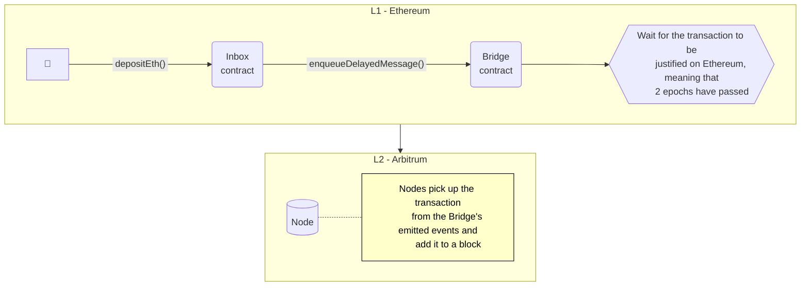

```mermaid
flowchart TB
  subgraph L2 ["L2 - Arbitrum"]
    %% Nodes
    NODE[(Node)]
    NODENOTE["
        Nodes pick up the transaction
        from the Bridge's emitted events and
        add it to a block
    "]:::noteBox

    %% Links
    NODE -.- NODENOTE
  end
  L1 --> L2
  subgraph L1 ["L1 - Ethereum"]
    %% Nodes
    USER["#128100;"]
    INBOX("Inbox\ncontract")
    BRIDGE("Bridge\ncontract")
    WAIT{{"
        Wait for the transaction to be
        justified on Ethereum, meaning that
        2 epochs have passed
    "}}

    %% Links
    USER --->|"&nbsp;depositEth()&nbsp;"| INBOX
    INBOX --->|"&nbsp;enqueueDelayedMessage()&nbsp;"| BRIDGE
    BRIDGE ---> WAIT
  end

%% Styling
classDef noteBox fill:#ffffcc,stroke:#000000,color:#000000
```