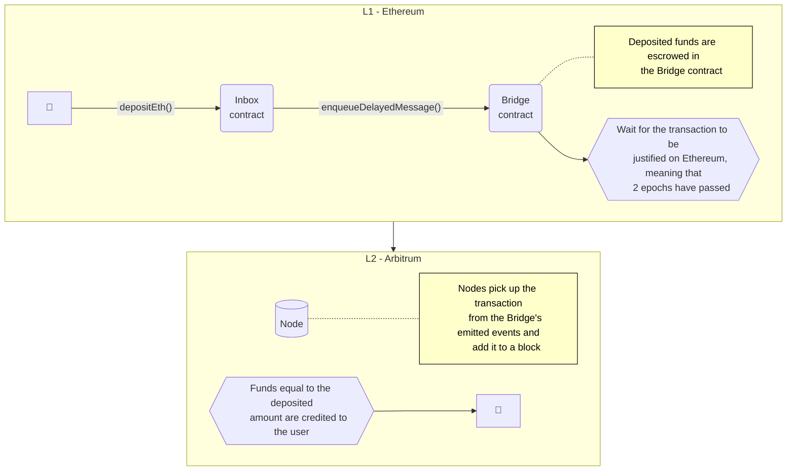

```mermaid
flowchart TB
  subgraph L1 ["L1 - Ethereum"]
    %% Nodes
    USERL1["#128100;"]
    INBOX("Inbox\ncontract")
    BRIDGE("Bridge\ncontract")
    WAIT{{"
      Wait for the transaction to be
      justified on Ethereum, meaning that
      2 epochs have passed
    "}}
    ESCROWNOTE["
      Deposited funds are escrowed in
      the Bridge contract
    "]:::noteBox

    %% Links
    USERL1 --->|"&nbsp;depositEth()&nbsp;"| INBOX
    INBOX --->|"&nbsp;enqueueDelayedMessage()&nbsp;"| BRIDGE
    BRIDGE -.- ESCROWNOTE
    BRIDGE --> WAIT
  end
  L1 --> L2
  subgraph L2 ["L2 - Arbitrum"]
    %% Nodes
    NODE[(Node)]
    NODENOTE["
      Nodes pick up the transaction
      from the Bridge's emitted events and
      add it to a block
    "]:::noteBox
    CREDITUSER{{"
      Funds equal to the deposited
      amount are credited to the user
    "}}
    USERL2["#128100;"]

    %% Links
    NODE -.- NODENOTE
    CREDITUSER --> USERL2
  end

%% Styling
classDef noteBox fill:#ffffcc,stroke:#000000,color:#000000
```