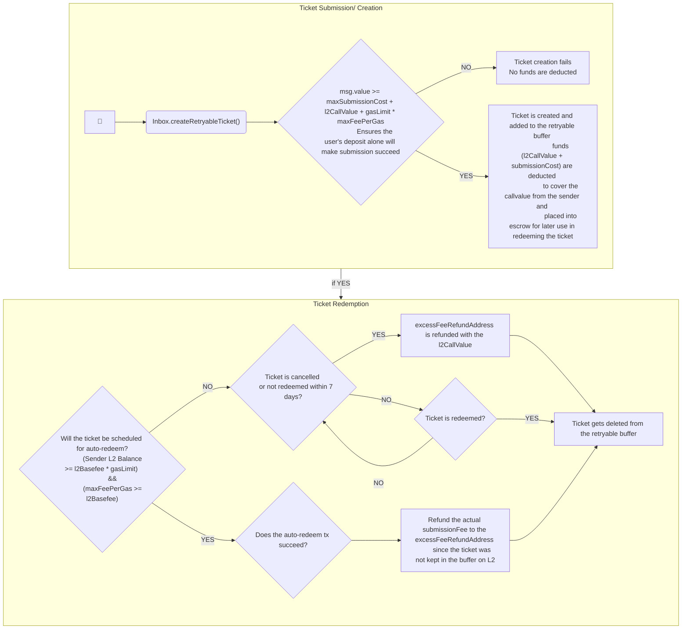

```mermaid
flowchart TB
    subgraph 1 ["Ticket Submission/ Creation"]

    USERL1["#128100;"] --> Inbox("Inbox.createRetryableTicket()")
    Inbox --> Decision1{"msg.value >= maxSubmissionCost + l2CallValue + gasLimit * maxFeePerGas
                Ensures the user's deposit alone will make submission succeed"}
    
    Decision1 -->|NO|D["Ticket creation fails
                    No funds are deducted"]
    
    Decision1 -->|YES|E["Ticket is created and added to the retryable buffer 
                    funds (l2CallValue + submissionCost) are deducted 
                    to cover the callvalue from the sender and 
                    placed into escrow for later use in redeeming the ticket"]
    end
    subgraph 2 [Ticket Redemption]
    
    
    Decision2{"Will the ticket be scheduled for auto-redeem?
            (Sender L2 Balance >= l2Basefee * gasLimit) 
            && 
            (maxFeePerGas >= l2Basefee)"}
    Decision2 -->|NO| F1{"Ticket is cancelled 
    or not redeemed within 7 days?"}


    F1 --> |YES| I["excessFeeRefundAddress is refunded with the l2CallValue"]
    I --> H

    F1 --> |NO| J{"Ticket is redeemed?"}

    J --> |YES| H
    J --> |NO| F1
    Decision2 -->|YES| F{Does the auto-redeem tx succeed?}
    
    F --> G["Refund the actual submissionFee to the excessFeeRefundAddress 
        since the ticket was not kept in the buffer on L2"]
    G --> H["Ticket gets deleted from the retryable buffer"]
    
    end
    
    1-->|if YES|2

```