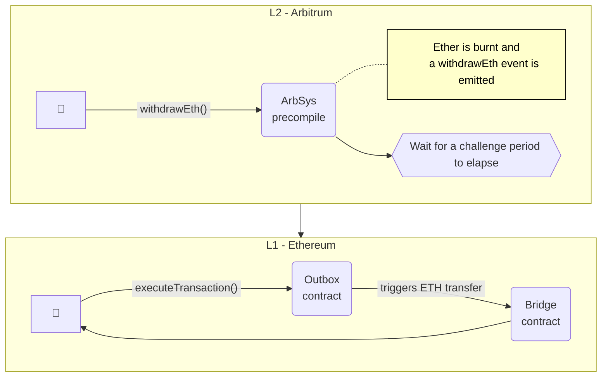

```mermaid
flowchart TB
  subgraph L2 ["L2 - Arbitrum"]
    %% Nodes
    USERL2["#128100;"]
    ARBSYS("ArbSys\nprecompile")
    BURNNOTE["
      Ether is burnt and
      a withdrawEth event is emitted
    "]:::noteBox
    WAIT{{"
      Wait for a challenge period to elapse
    "}}

    %% Links
    USERL2 --->|"&nbsp;withdrawEth()&nbsp;"| ARBSYS
    ARBSYS -.- BURNNOTE
    ARBSYS --> WAIT
  end
  L2 --> L1
  subgraph L1 ["L1 - Ethereum"]
    %% Nodes
    USERL1["#128100;"]
    OUTBOX("Outbox\ncontract")
    BRIDGE("Bridge\ncontract")

    %% Links
    USERL1 --->|"&nbsp;executeTransaction()&nbsp;"| OUTBOX
    OUTBOX -->|"&nbsp;triggers ETH transfer&nbsp;"| BRIDGE
    BRIDGE ---> USERL1
  end

%% Styling
classDef noteBox fill:#ffffcc,stroke:#000000,color:#000000
```
