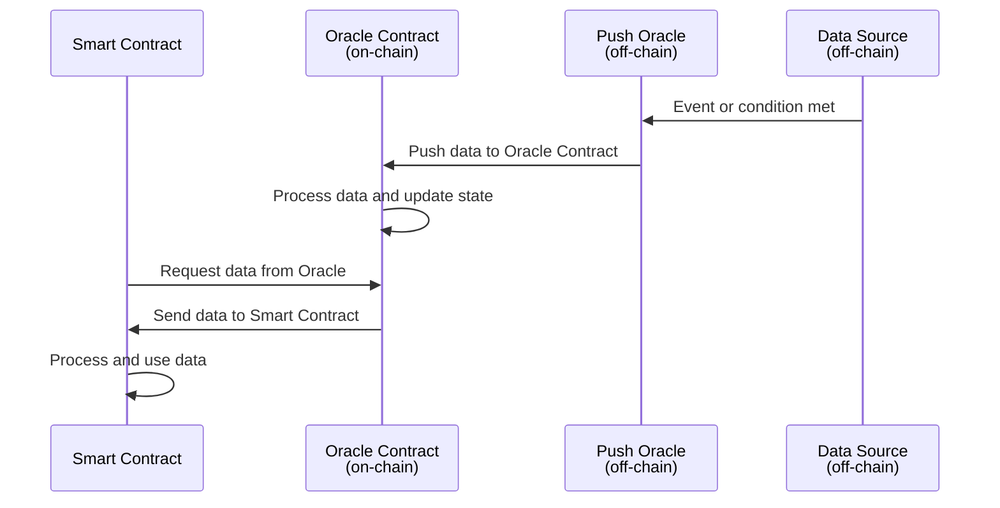
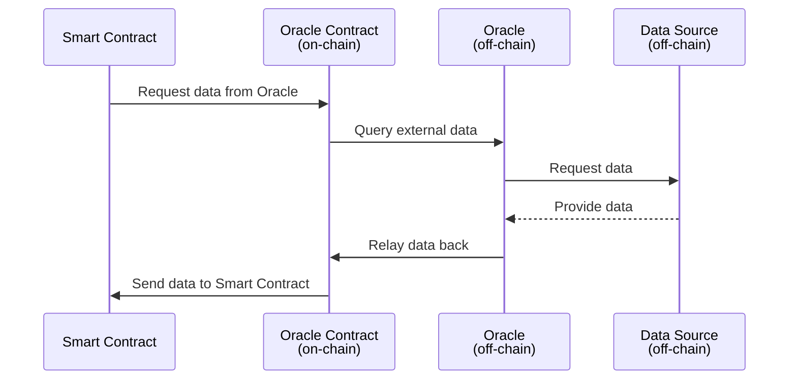

import PublicPreviewBannerPartial from '../../partials/_public-preview-banner-partial.md';

<PublicPreviewBannerPartial />

Oracles are services that let smart contracts interact with the world outside of the blockchain’s world state. In this conceptual overview, we’ll explore what Oracles are, how they work, and some general use cases for them. This guide will provide a foundational understanding of Oracles, setting expectations for developers who want to integrate them into their applications.

### What are Oracles?

Oracles are third-party services that provide smart contracts with external information. They act as a bridge between blockchains and the outside world, enabling smart contracts to access off-chain data. Oracles are essential in expanding the functionality of smart contracts by enabling them to interact with data sources beyond their native networks.

### Types of Oracles

Oracles can be classified based on their source, direction of information, trust, and the way they provide information to smart contracts. Some common types of Oracles include:

- Inbound and Outbound Oracles: Inbound Oracles transmit information from external sources to smart contracts, while outbound Oracles send information from smart contracts to the external world.
- Centralized and Decentralized Oracles: A centralized Oracle is controlled by a single entity and is the sole provider of information for a smart contract. Decentralized Oracles, on the other hand, increase reliability by relying on multiple sources of truth and distributing trust among various participants.
- Push and Pull Oracles: Push Oracles proactively provide data to smart contracts without being explicitly requested. They push data to the smart contract when a specified event or condition occurs. Pull Oracles, on the other hand, require smart contracts to request data explicitly. They pull data from external sources in response to a query from the smart contract.
- Software Oracles: These Oracles interact with online sources of information, such as databases, servers, or websites, and transmit the data to the blockchain. They often provide real-time information like exchange rates or digital asset prices.
- Hardware Oracles: These Oracles obtain information from the physical world using electronic sensors, barcode scanners, or other reading devices. They "translate" real-world events into digital values that can be understood by smart contracts.

### How do push Oracles work?

Push Oracles proactively provide data to smart contracts without being explicitly requested. When a specified event or condition occurs, the push Oracle triggers the smart contract with the relevant data. For example, a push Oracle might send weather data to a smart contract once the temperature reaches a certain threshold.

### How do pull Oracles work?

Pull Oracles, in contrast to push Oracles, require smart contracts to request data explicitly. A smart contract will send a query to the Oracle, which will then retrieve the requested information and relay it back to the contract. For example, a smart contract might request the current price of a specific digital asset from a pull Oracle.

### Use cases for Oracles

Oracles are used in various applications across different industries. Some general use cases include:

- Prediction markets: Oracles provide real-world data to prediction market platforms, allowing users to bet on future events or outcomes.
- Supply chain management: Hardware Oracles can track the location and status of goods throughout the supply chain, enabling smart contracts to automate various processes and improve efficiency.
- Insurance: Oracles can supply data on events like natural disasters, accidents, or price fluctuations, allowing smart contracts to automate claims processing and payouts.
- Decentralized finance (DeFi): Oracles provide critical price and market data to DeFi applications, enabling them to operate efficiently and securely.

In summary, Oracles are a crucial component of the blockchain ecosystem, bridging the gap between on-chain and off-chain data sources. They enhance the functionality of smart contracts and enable a wide range of applications across various industries. As blockchain technology continues to evolve, the development of secure and reliable Oracles will remain essential in unlocking the full potential of smart contracts and decentralized applications.