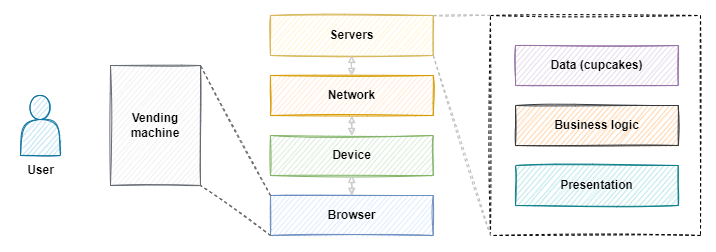

import PublicPreviewBannerPartial from '../partials/_public-preview-banner-partial.md'; 

<PublicPreviewBannerPartial />

This quickstart is for web developers who want to start building <a data-quicklook-from='decentralized-application'>decentralized applications</a> (dApps) using <a data-quicklook-from='arbitrum'>Arbitrum</a>. It makes no assumptions about your prior experience with Ethereum, Arbitrum, or Solidity. Familiarity with Javascript and package managers like `npm` and/or `yarn` is expected. If you're new to Ethereum, consider studying the [Ethereum documentation](https://ethereum.org/en/developers/docs/) before proceeding.

### What we're building

We're going to build a digital cupcake vending machine using Solidity smart contracts[^1]. Our vending machine will follow two rules:

1. The vending machine will distribute a cupcake to anyone who hasn't recently received one.
2. The vending machine's rules can't be changed by anyone.

Here's our vending machine implemented with Javascript:

import { VendingMachine } from '@site/src/components/VendingMachine/VendingMachine'

<VendingMachine id='dumb-cupcakes' type='web2' />

Note that although this vending machine follows Rule 1, it doesn't follow Rule 2 (yet)[^2].

### Prerequisites

- **VS Code**: The IDE we'll use to build our vending machine. See [code.visualstudio.com](https://code.visualstudio.com/) to install.
- **Metamask**: The <a data-quicklook-from='ethereum-wallet'>wallet</a> we'll use to interact with our vending machine. See [metamask.io](https://metamask.io/) to install.

We'll install the rest of our dependencies as we go.


### Ethereum and Arbitrum in a nutshell

 - Ethereum is a decentralized network of <a href='https://docs.prylabs.network/docs/concepts/nodes-networks'>nodes</a> that use Ethereum's client software (like Offchain's <a href='https://docs.prylabs.network/docs/getting-started'>Prysm</a>) to maintain a public <a data-quicklook-from='blockchain'>blockchain</a> data structure.
 - The data within Ethereum's blockchain data structure changes one <a data-quicklook-from='ethereum-transaction'>transaction</a> at a time.
 - <a data-quicklook-from='smart-contract'>Smart contracts</a> are small programs that execute transactions according to predefined rules. Ethereum's nodes host and execute smart contracts.
 - You can use smart contracts to build decentralized apps (dApps) that use Ethereum's network to process transactions and store data.
 - DApps let users carry their data and identity between applications without having to trust centralized service providers.
 - People who run Ethereum nodes[^3] (todo - enhance precision) receive rewards for processing and validating transactions on behalf of users and dApps.
 - These transactions can be expensive when the network is under heavy load. <a data-quicklook-from='layer-2'>Layer 2</a> (L2) scaling solutions like Arbitrum solve this problem.
 - Arbitrum is a suite of L2 scaling solutions for dApp developers. It lets you to build dApps that can process thousands of transactions per second with low latency and low transaction costs while inheriting Ethereum's high security standards[^3].


### Review our dumb contract

Here's our vending machine implemented as a Javascript class:

```js title="VendingMachine.js"
   // todo - pull from github / jsx before publishing to ensure latest is displayed
   class VendingMachine {
        // state variables = internal memory of the vending machine
        cupcakeBalances = {};
        cupcakeDistributionTimes = {};

        // Vend a cupcake to the caller
        giveCupcakeTo(userId) {
            if (this.cupcakeBalances[userId] === undefined) {
                this.cupcakeBalances[userId] = 0;
                this.cupcakeDistributionTimes[userId] = 0;
            }

            // Rule 1: The vending machine will distribute a cupcake to anyone who hasn't recently received one.
            const fiveSeconds = 5000;
            const userCanReceiveCupcake = this.cupcakeDistributionTimes[userId] + fiveSeconds <= Date.now();
            if (userCanReceiveCupcake) {
                this.cupcakeBalances[userId]++;
                this.cupcakeDistributionTimes[userId] = Date.now();
                console.log(`Enjoy your cupcake, ${userId}!`);
                return true;
            } else {
                console.error("HTTP 429: Too Many Cupcakes (you must wait at least 5 seconds between cupcakes)");
                return false;
            }
        }

        getCupcakeBalanceFor(userId) {
            return this.cupcakeBalances[userId];
        }
    }
```

The `VendingMachine` class uses *state variables* and *functions* to implement *predefined rules*. This implementation is useful because it automates cupcake distribution, but it's "dumb" because it's hosted by a centralized server that we (Offchain Labs) control. So it's technically possible for someone at Offchain to give their friends extra cupcakes by modifying the above contract's code.

This is a problem because it means that you have to trust us, and we have to trust our hosting provider. How do we keep our cupcakes secure without having to trust anyone?

DApps solve this problem by using Ethereum smart contracts to build <a data-quicklook-from='trustless'>*trustless*</a> end-user experiences that nobody in particular controls[^4]. This gives us a way to follow the second rule: *"The vending machine's rules can't be changed by anyone."*[^5]

Let's convert our dumb contract into a smart contract.


### Configure your project directory

Create a `decentralized-cupcakes` directory for your project and install [hardhat](https://hardhat.org/hardhat-runner/docs/getting-started#overview)[^6] using VS Code's integrated terminal:

```
mkdir decentralized-cupcakes
cd decentralized-cupcakes
yarn init -y
yarn add hardhat @nomicfoundation/hardhat-toolbox
```

This installs two packages: `hardhat` lets us test and deploy our smart contracts, and `hardhat-toolbox` is a bundle of popular Hardhat plugins that we'll use later.

Next, run `npx hardhat` to configure Hardhat. Select `Create a JavaScript project` when prompted. Make sure you specify your `decentralized-cupcakes` directory as the project root when asked.

At this point, you should see the following items (among others) in your `decentralized-cupcakes` project directory:

| Item                | Description                                                                                               |
| ------------------- | --------------------------------------------------------------------------------------------------------- |
| `contracts/`        | Contains your smart contracts. You should see the `Lock.sol` contract here.                               |
| `scripts/`          | Contains scripts that you can use to interact with your smart contracts. You should see `deploy.js` here. |
| `hardhat.config.js` | Contains the configuration settings for Hardhat.                                                          |


Replace the contents of `hardhat.config.js` with the following[^6]:

```javascript title="hardhat.config.js"
require("@nomicfoundation/hardhat-toolbox");

/** @type import('hardhat/config').HardhatUserConfig */
module.exports = {
  solidity: "0.8.18",
  networks: {
    hardhat: {
      chainId: 1337
    },
    arbitrumGoerli: {
      url: "https://goerli-rollup.arbitrum.io/rpc",
      chainId: 421613
      //accounts: [process.env.PRIVATE_KEY] TODOs
    },
    arbitrumOne: {
      url: "https://arb1.arbitrum.io/rpc",
      //accounts: [process.env.PRIVATE_KEY]
    },
    arbitrumNova: {
      url: "https://arbnova.com/rpc",
      //accounts: [process.env.PRIVATE_KEY]
    }
  }
};
```

Run `npx hardhat compile` to compile the default `contracts`. You may be prompted to install additional dependencies - follow those instructions until this command runs successfully[^6]. You should see `Compiled 1 Solidity file successfully` in the terminal output. You should also see a new `decentralized-cupcakes/artifacts/` directory. This directory contains the compiled smart contract[^7].

Open `scripts/deploy.js` and replace its contents with the following:

```javascript title="scripts/deploy.js"
const hre = require("hardhat");

async function main() {

  const VendingMachineFactory = await hre.ethers.getContractFactory("VendingMachine");
  const vendingMachine = await VendingMachineFactory.deploy();
  await vendingMachine.deployed();

  console.log(
    `Cupcake vending machine deployed to ${vendingMachine.address}`
  );
}

main().catch((error) => {
  console.error(error);
  process.exitCode = 1;
});
```

We'll use this to deploy our smart contract in a moment. Next, delete `contracts/Lock.sol` and replace it with `contracts/VendingMachine.sol`, the smarter alternative to our dumb Javascript contract:

```solidity title="VendingMachine.sol"
pragma solidity ^0.8.9;

// Rule 2: The vending machine's rules can't be changed by anyone.
contract VendingMachine {
    // state variables = internal memory of the vending machine
    mapping(address => uint) private _cupcakeBalances;
    mapping(address => uint) private _cupcakeDistributionTimes;

    function giveCupcakeTo(address userAddress) public returns (bool) {
        if (_cupcakeBalances[userAddress] == 0) {
            _cupcakeDistributionTimes[userAddress] = block.timestamp; // todo - decide whether or not there should be 1:1-ish mapping between js and solidity "contracts" for the sake of pattern recognition / learning; if so, mirror; if not, delete
        }

        // Rule 1: The vending machine will distribute a cupcake to anyone who hasn't recently received one.
        uint fiveSeconds = 5 * 1 seconds;
        bool userCanReceiveCupcake = _cupcakeDistributionTimes[userAddress] + fiveSeconds <= block.timestamp;
        if (userCanReceiveCupcake) {
            _cupcakeBalances[userAddress]++;
            _cupcakeDistributionTimes[userAddress] = block.timestamp;
            return true;
        } else {
            revert("HTTP 429: Too Many Cupcakes (you must wait at least 5 seconds between cupcakes)");
        }
    }

    // Getter function for the cupcake balance of a user
    function getCupcakeBalanceFor(address userAddress) public view returns (uint) {
        return _cupcakeBalances[userAddress];
    }
}
```

Run `npx hardhat compile` again. You should see `Compiled 1 Solidity file successfully` in the terminal output. You should also see a new `decentralized-cupcakes/artifacts/contracts/VendingMachine.sol` directory.


### Deploy the smart contract locally

To deploy our `VendingMachine` smart contract locally, we'll use two terminal windows and a wallet: 

1. We'll use the first terminal window to run Hardhat's built-in local Ethereum node
2. We'll then configure a wallet so we can interact with our smart contract after it's deployed to (1)
3. We'll then deploy our smart contract to (1)'s node


#### Run a local Ethereum node

// pull explanation up here - emulator etc

Run `npx hardhat node` from your `decentralized-cupcakes` directory to begin running a local Ethereum node. You should see something along the lines of `Started HTTP and WebSocket JSON-RPC server at http://127.0.0.1:8545/` in your terminal. You should also see a number of test accounts automatically generated for you:

```
Account #0: 0xf39Fd6e51aad88F6F4ce6aB8827279cffFb92266 (10000 ETH)
Private Key: 0xac0974bec39a17e36ba4a6b4d238ff944bacb478cbed5efcae784d7bf4f2ff80

...etc
```

<!-- todo: psst, don't ever share your mainnet wallet private keys or even copy them into your clipboard -->

Note that in the context of this quickstart, "account" refers to a public wallet address and its associated private key.

#### Configure Metamask

Next, open Metamask and create or import a wallet by following the displayed instructions. By default, Metamask will connect to Ethereum mainnet. To connect to our local "testnet", enable test networks through Metamask's settings. Then select the `Localhost 8545` network:


Your mainnet wallet won't have a balance on your local testnet's node, but we can import one of the test accounts into Metamask to gain access to 10,000 fake ETH. Copy the private key of one of the test accounts (**excluding** the `0x` prefix, so eg `ac0..f80`) and import it into Metamask:


You should see the account's balance update to 10,000 ETH. 


#### Deploy the smart contract to your local testnet

From another terminal instance, run `npx hardhat run scripts/deploy.js --network localhost`. This command will deploy your smart contract to the local testnet's node. You should see something like `Cupcake vending machine deployed to 0xe7f1725E7734CE288F8367e1Bb143E90bb3F0512` in your terminal. `0xe7...512` is the address of your smart contract in your local testnet.

// footnote about how addresses live in the "global state" of the network, which is mirrored across all nodes

Copy and paste your **contract address** below and click `Get cupcake!`. You should get a cupcake.

<VendingMachine id='smart-local-cupcakes' type='web3-localhost' />


### What's going on here?

Our first `VendingMachine` is labeled `WEB2` because it demonstrates traditional n-tier web application architecture: 



Our vending machine's `WEB3` architecture is similar to its `WEB2` architecture, but with the `WEB3` versions, the data and logic are deployed to a **decentralized** network of nodes instead of a **centralized** network of servers. Let's take a closer look at the differences between our `VendingMachine` implementations:


|                       | `WEB2`                                                                                  | `WEB3-LOCALHOST`                                                                  | `WEB3-ARB-GOERLI`                                                                                                | `WEB3-ARB-MAINNET`                                                                    |
| --------------------- | --------------------------------------------------------------------------------------- | --------------------------------------------------------------------------------- | ---------------------------------------------------------------------------------------------------------------- | ------------------------------------------------------------------------------------- |
| **Data** (cupcakes)   | Stored only in your browser. (Usually, stored by centralized infrastructure.)           | Stored on your device in an emulated Ethereum network (via smart contract).       | Stored by Ethereum's decentralized test network (via smart contract).                                            | Stored by Ethereum's decentralized mainnet network (via smart contract).              |
| **Logic** (vending)   | Served from Offchain's servers. Executed by your browser.                               | Stored and executed by your local emulated Ethereum network (via smart contract). | Stored and executed by Ethereum's decentralized test network (via smart contract).                               | Stored and executed by Ethereum's decentralized mainnet network (via smart contract). |
| **Presentation** (UI) | Served from Offchain's servers. Executed by your browser.                               | Served from Offchain's servers. Executed by your browser (via this page).         | Served from Offchain's servers. Executed by your browser (via this page).                                        | Served from Offchain's servers. Executed by your browser (via this page).             |
| **Money**             | Devs and users pay centralized service providers for server access using fiat currency. | <- same, but only for the frontend.                                               | <- same, but devs and users pay testnet $ETH to node-runners to deploy smart contracts and execute transactions. | <- same, but instead of testnet $ETH, they pay using mainnet $ETH.                    |


Let's deploy our smart contract to a testnet that's powered by real nodes. We'll use Arbitrum's Goerli testnet.

### Deploy the smart contract to the Arbitrum Goerli testnet

We were able to deploy to a local testnet for free because we were using [Hardhat's built-in Ethereum network emulator](https://hardhat.org/hardhat-network/docs/overview#hardhat-network). Because Arbitrum's Goerli testnet is powered by real nodes, we'll need to pay a transaction fee to deploy our smart contract. This fee will be paid with the Arbitrum Goerli testnet's token, $TODO.

There are a few ways to acquire $TODO:

1. Use an L2 Goerli ETH faucet: todo find functional faucet - https://faucet.quicknode.com/arbitrum/goerli doesn't work as of 3/14
2. Use an L1 Goerli ETH faucet and bridge it to L2: todo
3. Ask someone to send you some: todo

To deploy to Arbitrum's Goerli testnet, we'll need to update our deployment script...mnemonic...todo

deploy vending machine to arb-goerli: https://goerli-rollup.arbitrum.io/rpc (no api key needed)


inspect on blockchain explorer


get goerli cupcake

<VendingMachine id='smart-goerli-cupcakes' type='web3-arb-goerli' />


### Dumpster fire below this line
------

### Deploy the smart contract to Arbitrum Mainnet

todo

<VendingMachine id='smart-mainnet-cupcakes' type='web3-arb-mainnet' />


### Summary

todo


### Vending machine code walkthrough

visualize the components, layers, data structures, information flows, procedure

this is where we use Docusaurus' live code editor to let users play with the code in the browser

could highlight specific lines of code too


### Next steps / things to link / things to think about integrating

 - Testing
 - Samples
 - Blockchain exploring
 - Architecting
 - Patterns
 - Tutorials
 - Differences between Ethereum and Arbitrum - op codes etc
 - Upgrading contracts
 - Oracles
 - One vs Nova
 - https://yos.io/2019/11/10/smart-contract-development-best-practices/
// https://github.com/smartcontractkit/full-blockchain-solidity-course-js/discussions/4733


[^1]: Inspired by [Ethereum.org's "Introduction to Smart Contracts"](https://ethereum.org/en/developers/docs/smart-contracts/), which was inspired by [Nick Szabo's "From vending machines to smart contracts"](http://unenumerated.blogspot.com/2006/12/from-vending-machines-to-smart.html).
[^2]: Although application front-ends are usually hosted by centralized services, smart contracts allow the underlying logic and data to be partially or fully decentralized. These smart contracts are hosted by Ethereum's public, decentralized network of nodes. This means that instead of asking users to trust centralized service providers, web3 apps ask users to trust Ethereum's decentralized network of nodes and the open source client software that they use to process and validate transactions.
[^3]: todo
[^4]: When our `VendingMachine` contract is deployed to Ethereum, it'll be hosted by Ethereum's decentralized network of nodes. We won't be able to modify the contract's code after it's deployed.
[^5]: (footnote to elaborate on infeasibility vs impossibility, upgradeability).
[^6]: You can also use npm for this. 
[^6]: See https://hardhat.org/hardhat-network/docs/metamask-issue
[^6]: (windows-specific callouts)
[^7]: ABI explainer