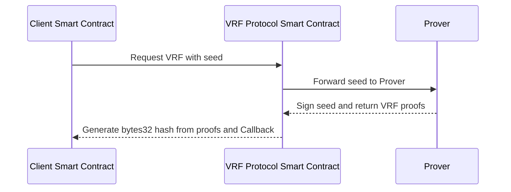

:::info Community member contribution

The following [third-party document](../../contribute#new-third-party-docs-protocol) was contributed by [@DeanPress](https://twitter.com/Deanpress). Give them a shoutout if you find it useful!

:::

**Random numbers** and **verifiable random functions** (VRFs) are key aspects of cryptographic systems, playing crucial roles in many blockchain-based applications. In this conceptual overview, we'll explore what random numbers and VRFs are, how they work, and some general use cases for them.

Note that Solidity doesn't offer native support for VRFs, but you can use a third-party VRF protocol like [Randomizer.ai](https://randomizer.ai/) to integrate this functionality into your smart contracts. Refer to [How to use Randomizer.ai's VRFs on Arbitrum](./how-to-use-vrfs) for instructions.

### What are random numbers and VRFs?

Random numbers are numbers generated in a manner that the values are statistically random and equally likely to be any of the possible outcomes. In the context of blockchain, they are used for many purposes, such as determining the outcomes in a decentralized lottery or generating NFT traits.

Verifiable random functions (VRFs) are cryptographic methods to generate random numbers in a way that is verifiable and unpredictable. That means anyone can verify that a given number was generated correctly, but no one can predict the output before it's generated, even if they know the input.

### Types of random number generation

Random numbers can be generated in different ways, depending on the level of security and decentralization required:

- **Pseudorandom number generators (PRNGs):** These generate numbers that appear to be random and unpredictable. They start with a seed value and produce a sequence of numbers using a deterministic algorithm. The same seed will always produce the same sequence of numbers, so they are not truly random.
- **True random number generators (TRNGs):** These generate numbers from a truly random physical process, such as atmospheric noise or radioactive decay. They do not use a deterministic algorithm, so they can't be reproduced. However, these are difficult to implement in a decentralized manner, since they require a source of physical randomness.
- **Verifiable random functions:** As mentioned above, VRFs are a cryptographic method of generating verifiable and unpredictable random numbers. They combine the advantages of PRNGs and TRNGs by ensuring that the numbers are both unpredictable and verifiable.

### How do VRFs work?

A VRF is a function that takes an input and produces a random output along with a proof. The same input will always produce the same output and proof, but without the proof, it's computationally infeasible to predict the output from the input. The proof can be used by anyone to verify that the output was generated correctly from the input.

### Use cases for random numbers and VRFs

Random numbers and VRFs are used in various applications across different industries. Some general use cases include:

- **Decentralized gaming:** Random numbers are used in many blockchain-based games to create unpredictable game outcomes (e.g. shuffling cards, hit rates in PvP games, treasure chest opening, XP gain). VRFs can make these outcomes verifiable, increasing trust in the game.
- **NFT minting:** VRFs can be used during the NFT minting process to randomly assign attributes, rarity or metadata to the NFTs, ensuring the fairness and unpredictability of the minting process.
- **On-chain Random Governance:** For DAOs or other on-chain governance models, VRFs can be used to randomly select a subset of members for decision-making to ensure a fair representation and prevent collusion.

In summary, random numbers and VRFs are key components of the blockchain ecosystem, ensuring fairness, security, and transparency in various applications.
