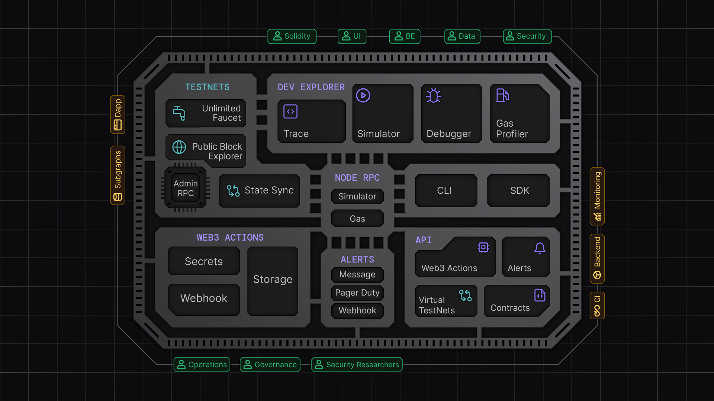

# Tenderly: Full Stack Web3 Infrastructure

[Tenderly](https://tenderly.co/?mtm_campaign=ext-docs&mtm_kwd=arbitrum) enhances development experience on Arbitrum by providing seamless integration with Arbitrum ecosystem. It offers a high-performance Node RPC with integrated mainnet-like development environments, intuitive developer tools, and real-time monitoring.

By integrating Tenderly’s full-stack infrastructure, you can **optimize your development workflows** and **scale your dapp** on a high-performance infrastructure.

Explore:
- How to [get started](#get-started)
- Understand Tenderly's key features:
  - [Development & Testing](./02-development-testing.mdx) tools and infrastructure
  - [Node RPC](./04-node-rpc.mdx)
  - [Monitoring & Security](./03-monitoring-security.mdx)
  - [Integration with your workflow](./05-integrating.mdx)
- How you can [integrate in your workflow](./05-integrating.mdx)
- Several [real world examples](#real-world-examples)

## Get Started

1. [Create an account](https://dashboard.tenderly.co/register?mtm_campaign=ext-docs&mtm_kwd=arbitrum)
2. [Create a virtual TestNet on Arbitrum](https://docs.tenderly.co/virtual-testnets/quickstart?mtm_campaign=ext-docs&mtm_kwd=arbitrum)
3. [Use unlimited faucet](https://docs.tenderly.co/virtual-testnets/unlimited-faucet?mtm_campaign=ext-docs&mtm_kwd=arbitrum)
4. Learn more on [**official docs**](https://docs.tenderly.co?mtm_campaign=ext-docs&mtm_kwd=arbitrum)

## How to use Tenderly

Web3 teams can use Tenderly’s infrastructure and tools to build and scale secure and high-quality Web3 software faster and more efficiently.

Here are some of the ways you can use Tenderly

- **Test and stage contracts and dapps**: Use [Virtual TestNets](https://docs.tenderly.co/virtual-testnets/?mtm_campaign=ext-docs&mtm_kwd=arbitrum) in CI/CD pipelines to deploy, test, and stage smart contracts in mainnet-like development environments, eliminating the need for local setups.
- **Optimize smart contracts**: Debug and optimize transaction inputs using [Simulator](https://docs.tenderly.co/simulator-ui?mtm_campaign=ext-docs&mtm_kwd=arbitrum) and [Debugger](https://docs.tenderly.co/debugger?mtm_campaign=ext-docs&mtm_kwd=arbitrum), reducing debugging time from hours to minutes with visual transaction trace inspection.
- **Predict transaction outcomes**: Integrate [Simulation RPC](https://docs.tenderly.co/simulations/single-simulations#simulate-via-rpc?mtm_campaign=ext-docs&mtm_kwd=arbitrum) to simulate transaction execution and gas costs, preventing errors and optimizing token transfers before submitting transactions on-chain.
- **Automate security responses**: Implement automated responses to on-chain events and protocol issues using real-time [Alerts](https://docs.tenderly.co/alerts/intro-to-alerts?mtm_campaign=ext-docs&mtm_kwd=arbitrum) and [Web3 Actions](https://docs.tenderly.co/web3-actions/intro-to-web3-actions?mtm_campaign=ext-docs&mtm_kwd=arbitrum) to safeguard your dapps and protocols.
- **Ensure high-performance dapp connectivity**: Use [Node RPC](https://docs.tenderly.co/node?mtm_campaign=ext-docs&mtm_kwd=arbitrum) to guarantee low-latency, high-reliability, and multi-region access for your dapp, ensuring smooth operation even during high traffic volumes and spikes.

<figure>
  
  <figcaption>Web3 full-stack infrastructure for dapps and teams</figcaption>
</figure>

## Real-world examples

Discover how some of the leading projects use Tenderly to streamline their development, enhance security, and improve user experience.

- [Maker DAO](https://makerdao.com/) performs [cross-DAO testing between different teams](https://blog.tenderly.co/case-studies/makerdao?mtm_campaign=ext-docs&mtm_kwd=arbitrum).
- [Maple Finance](https://maple.finance/) created [invariant monitoring](https://maplefinance.gitbook.io/maple/technical-resources/security/security#critical-monitoring?mtm_campaign=ext-docs&mtm_kwd=arbitrum).
- [Spark Protocol](https://spark.fi/) has set up invariant monitoring and [testing](https://devs.spark.fi/sparklend/features/testing-guide?mtm_campaign=ext-docs&mtm_kwd=arbitrum).
- [Yearn Finance](https://yearn.fi/) relies on Tenderly for [incident management](https://blog.tenderly.co/case-studies/what-good-war-room-emergency-procedure-yearn-finance-case/).
- [Uniswap](https://app.uniswap.org/) uses Tenderly for development, [incident responses](https://blog.tenderly.co/case-studies/uniswap?mtm_campaign=ext-docs&mtm_kwd=arbitrum), getting [100% correct gas](https://blog.tenderly.co/how-tenderly-enables-most-accurate-ethereum-gas-estimation/) estimates, and [governance seatbelt](https://github.com/Uniswap/governance-seatbelt).
- Safe [integrates Tenderly’s simulation infrastructure](https://blog.tenderly.co/case-studies/safe?mtm_campaign=ext-docs&mtm_kwd=arbitrum) in their multisig interface.