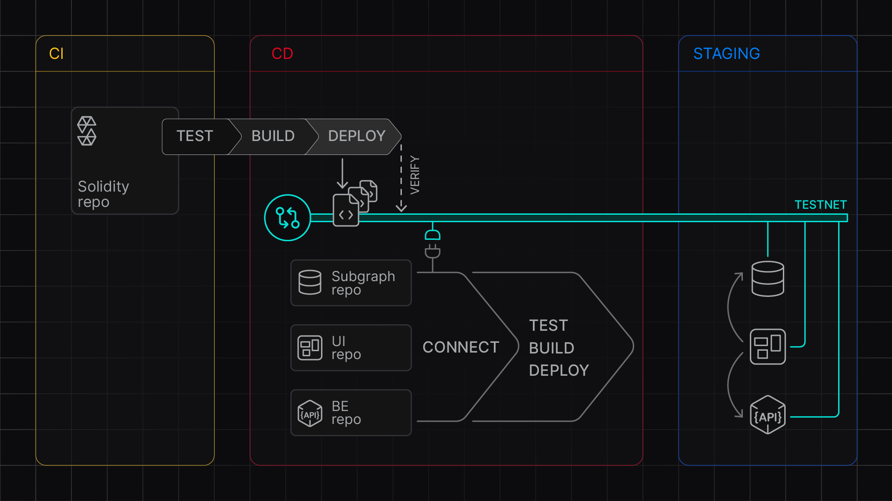
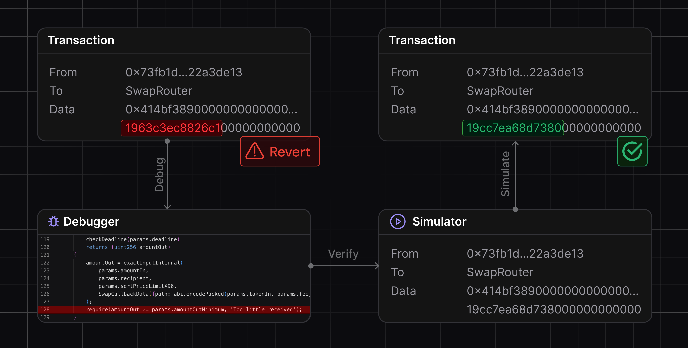

## Virtual TestNets

Accelerate your development cycle with instant, collaborative development environments that seamlessly integrate into your existing workflows, saving you hours of setup and configuration time.

**Using Virtual TestNets**:

Test and stage contracts and dapps using RPC development infrastructure that fully replicates mainnet conditions.

<figure>
  
  <figcaption>CI and CI workflow with Virtual TestNets</figcaption>
</figure>

- **Deploy and verify smart contracts** on dedicated development infrastructure for your whole team.
- **Stage and test your dapp** smart contracts, frontend, and backend in isolated, yet collaborative cloud-managed environments.
- **Set up CI/CD pipelines** free of running dedicated nodes and additional infrastructure management.
- **Use unlimited faucet** to Test contract and transaction execution more easily.
- **Debug and optimize smart contracts** using a built-in virtual explorer and debugging tools.
- **Access latest mainnet state while testing** in real time using State Sync.
- **Customize network states** to meet your unique testing requirements via `tenderly_` cheat-code RPCs.
- **Stage DAO proposals** and test protocol behavior as if the proposed change is applied.

**Try it now**: [Create your first Virtual TestNet](https://docs.tenderly.co/virtual-testnets/quickstart?mtm_campaign=ext-docs&mtm_kwd=arbitrum)

## Simulator UI & Debugger

Slash debugging time from hours to minutes with an intuitive visual interface that lets you step through transactions, decode state changes, and optimize your smart contracts effortlessly for any contract on any network, with no additional setup.

**Using Simulator and Debugger**:

Build proof-of-concept transactions and troubleshoot smart contracts without lengthy `console.log` debugging.

<figure>
  
  <figcaption>Bug fixing with Debugger and Simulator UI </figcaption>
</figure>

- **Understand transaction execution** with decoded arguments, events, and state changes.
- **Debug any transaction** on public networks and Virtual TestNets with the most detailed stack trace.
- **Edit source code in your browser** and simulate the execution to verify bug fixes.
- **Optimize transaction inputs** using the latest or historical mainnet data.
- **Build proof-of-concept transactions** for security research or optimization purposes.

**Try it now**: [Debug a transaction](https://docs.tenderly.co/simulator-ui/using-simulation-ui?mtm_campaign=ext-docs&mtm_kwd=arbitrum)