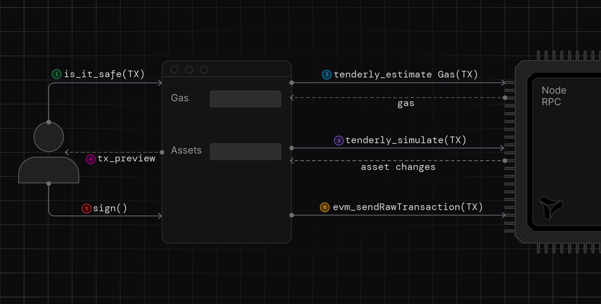
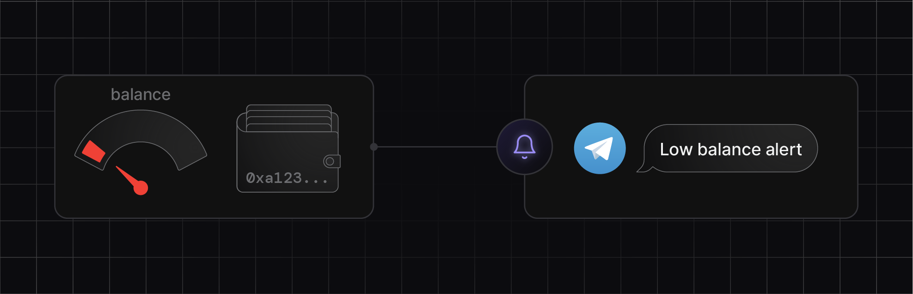
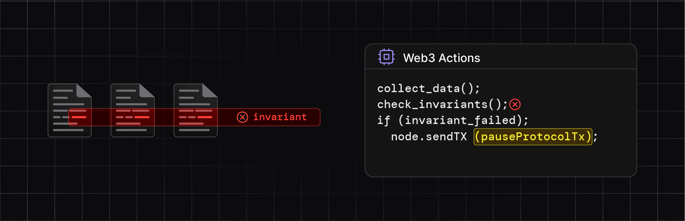

## Simulation and gas estimation RPC

Accurately predict transaction outcomes and gas costs without sending transactions on-chain to improve your dapp UX and prevent costly errors. Integrate Tenderly’s simulation infrastructure using `tenderly_simulateTransaction`, `tenderly_estimateGas`, and their bundled counterparts.

**Using Simulation RPC**:

<figure>
  
  <figcaption>Predicting gas and exchanged assets with Simulation RPC</figcaption>
</figure>

- **Predict token transfers** in transactions reliably for secure and cost-effective interactions in your dapp
- **Optimize bundles of transactions** by predicting execution and picking optimal results.
- **Optimize for best token transfers** by varying transaction inputs and other strategies in a different simulations.
- **Test hypothetical scenarios** by overriding contract variables and running custom simulations
- **Test and compare different strategies** by running simulations on historic network data.
- **Get 100% accurate gas estimates** to prevent failures caused by out-of-gas errors and save valuable resources.

**Try it now**: [Simulate a transaction](https://docs.tenderly.co/simulations/quickstart?mtm_campaign=ext-docs&mtm_kwd=arbitrum)

## Alerts & Web3 Actions

Automate protocol security and maintenance and respond instantly to on-chain events with customizable, real-time alerting and serverless Node.js backends for smart contracts.

**Using Alerts and Web3 Actions:**

Implement circuit breakers, monitor live contracts, and automate task execution.

<figure>
  
  <figcaption>Alerting when critical conditions happen</figcaption>
</figure>

- **Get real-time messages** for important on-chain events with Alerts.
- **Monitor the usage** of your smart contracts and dapp on-chain with Alerts.
- **Signal problems to external webhooks** by setting up alerts on transactions, events, and storage updates.
- **Automate responses to on-chain events** using Web3 Actions.
- **Set up invariant monitoring** for protocols, dapps, and entire architectures with Web3 Actions.
- **Build Tenderly-hosted webhooks** for dapps with Web3 Actions.

<figure>
  
  <figcaption>Pausing a protocol when Web3 Action detects invariant failure</figcaption>
</figure>

**Try it now**: [Set up your first alert](https://docs.tenderly.co/alerts/tutorials-and-quickstarts/alerting-quickstart-guide?mtm_campaign=ext-docs&mtm_kwd=arbitrum) | [Set up your first Web3 Action](https://docs.tenderly.co/web3-actions/tutorials-and-quickstarts/how-to-send-a-discord-message-about-a-new-uniswap-pool?mtm_campaign=ext-docs&mtm_kwd=arbitrum)