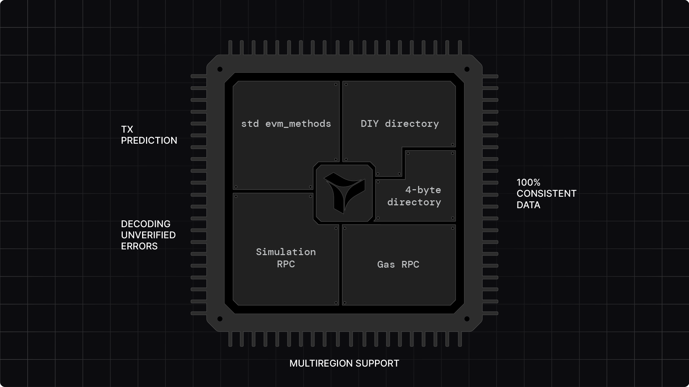

Ensure your dapp's performance with enterprise-grade RPC access that scales unnoticeably, ensuring low-latency and high-availability across multiple regions.

<figure>
  
  <figcaption>Tenderly Node RPC architecture with multi-region support and custom RPC method integration</figcaption>
</figure>

**Using Node RPC**:

Integrate Tenderly Node RPC for low-latency, high-reliability, multi-region blockchain infrastructure that scales with your dapp usage.

- **Rely on 100% consistent data** and uninterrupted access even with spiking usage.
- **Use `tenderly_` RPC methods** for simulations, 100% accurate gas estimation, tracing, and more directly from your dapps.
- **Integrate [`tenderly_gasPrice`](https://docs.tenderly.co/node/rpc-reference/ethereum-mainnet/tenderly_gasPrice?mtm_campaign=ext-docs&mtm_kwd=arbitrum)** to get prediction of gas price for the next block, at 3 likelihood levels for transaction inclusion.
- **Build custom RPC methods** that encapsulate unique dapp logic via Node Extensions.
- **Request multi-region support** and region-specific setup.

**Try it Now**: [Get started with Node RPC](https://docs.tenderly.co/node/integrations?mtm_campaign=ext-docs&mtm_kwd=arbitrum)