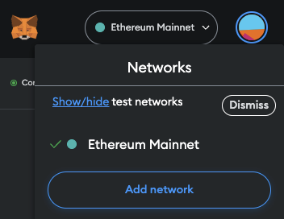

import PublicPreviewBannerPartial from './partials/_public-preview-banner-partial.md'; 

<PublicPreviewBannerPartial />

_**Note: before interacting with a mainnet chain, users should familiarize themselves with the risks; see [Mainnet Beta](mainnet-beta)**_.

#### 1- Get Some Native Currency

This tutorial assumes you have already downloaded a web3 wallet like MetaMask. If you don’t have a wallet, visit [portal page](https://portal.arbitrum.one/) to download one.

You'll also need a chain's native currency to transact. You can either acquire funds directly on an Arbitrum chain, or get funds on a chain's underlying L1 and bridge it across. You can get testnet Ether from the following faucets:

- [Goerli](https://goerlifaucet.com/)
- [Arbitrum Goerli](https://twitter.com/intent/tweet?text=Ok%20I%20need%20@arbitrum%20to%20give%20me%20Arbitrum%20Goerli%20testnet%20gas.%20I%20can't%20wait%20to%20start%20developing%20on%20@nitro_devnet.%20%20SEND%20HERE:%200xAddA0B73Fe69a6E3e7c1072Bb9523105753e08f8)

[Supported centralized exchanges](https://portal.arbitrum.one/#centralizedexchanges) allow you to purchase (mainnet) Ether and withdraw it directly onto Arbitrum One.

#### 1- Add a Network

To start using the Arbitrum bridge, you need to add the desired chain's RPC endpoint to your wallet. Here, we provide an example for doing this using the MetaMask wallet.
You need to first click on the MetaMask extension on your browser, click MetaMask's network selector dropdown, and then click the `Add Network` button. 
Click "Add a network manually" and then provide the information corresponding the the Arbitrum chain you want to connect to:

##### Arbitrum Goerli (testnet):
- Network Name: `Arbitrum Goerli`
- New RPC URL: `https://goerli-rollup.arbitrum.io/rpc`
- Chain ID: `421613`
- Currency Symbol: `AGOR`
- Block Explorer URL: `https://goerli.arbiscan.io`

##### Arbitrum One:
- Network Name: `Arbitrum One`
- New RPC URL: `https://arb1.arbitrum.io/rpc`
- Chain ID: `42161`
- Currency Symbol: `ETH`
- Block Explorer URL: `https://arbiscan.io`

##### Arbitrum Nova:
- Network Name: `Arbitrum Nova`
- New RPC URL: `https://nova.arbitrum.io/rpc`
- Chain ID: `42170`
- Currency Symbol: `ETH`
- Block Explorer URL: `https://nova.arbiscan.io/`

If you’re a developer you can also rely on some popular third party node providers to interact with public Arbitrum chain, see the list [here](node-running/node-providers.mdx).

#### 2- Deposit Your ETH/ Tokens (L1 → L2)

To move your Ether and tokens to Arbitrum chains, visit [bridge.arbitrum.io](https://bridge.arbitrum.io/). 
Login to the bridge with your wallet and make sure you are connected to the Ethereum mainnet network.
Now choose the desired network you wish to bridge to, e.g., Arbitrum One or Arbitrum Nova. Note that Arbitrum Goerli only appears if you are connected to the Goerli network rather than the Ethereum Mainnet.

Select the token you want to bridge in the token drop-down menu. You can also enable/disable the token lists by clicking `Manage Token lists` button on the bottom right corner of the drop-down menu.

Enter the amount of ETH/ tokens you want to bridge over in the “Mainnet” field and then press `deposit`. Follow the prompts on MetaMask.

_**Please make sure you leave enough ETH on your wallet to pay for the transaction, otherwise there will be no MetaMask popup.**_

After you submit the transaction through MetaMask you can expect your funds to arrive on Arbitrum One within roughly 10 minutes to an hour (depending on the chain congestion).

Also make sure your MetaMask wallet is set to any of the Arbitrum One **or** Arbitrum Nova **or** Arbitrum Goerli networks (depending on which one you chose to bridge to) so you can see your funds when they arrive.

#### 3- Withdraw Your ETH/ Tokens (L2 -> L1)

:::info There's At Least A 7 Day Withdrawal Period for Arbitrum One and Nova Networks
Once you move your funds from Arbitrum One or Nova through the Arbitrum bridge, you will have to wait for at least 7 days to recieve them on Ethereum Mainnet.
For more details, see [here](https://developer.arbitrum.io/for-users/troubleshooting-users#how-long-does-it-take-before-i-receive-my-funds-when-i-initiate-withdrawal-from-arbitrum-chains-one-and-nova).

:::

To move your funds back to Ethereum Mainnet, your need to be logged in to the [Arbitrum bridge](https://bridge.arbitrum.io/) with your wallet and make sure you are connected to the Arbitrum network you want to withdraw from (Arbitrum One, Arbitrum Nova, or Arbitrum Goerli).
Select the token you want to bridge in the token drop-down menu. 

Enter the amount of ETH/ tokens you want to bridge over in the `Arbitrum` field and then press `withdraw`. Follow the prompts on MetaMask.

_**Please make sure you leave enough ETH on your wallet to pay for the transaction, otherwise there will be no MetaMask popup.**_

A countdown will pop up stating you’ll get your funds in 7-8 days.

You can check the status of your withdrawal by clicking on your profile on the top right and opening the `Transactions` tab, and claim it there when it’s ready.

Once the countdown is done, switch to the Ethereum mainnet network on your wallet and press the `claim` button that has now turned blue to receive your funds!

#### What's Next?

The team working on Arbitrum is always interested and looking forward to engage with its users.
Why not follow us on [Twitter](https://twitter.com/arbitrum) or join our community on [Discord](https://discord.gg/5KE54JwyTs)?