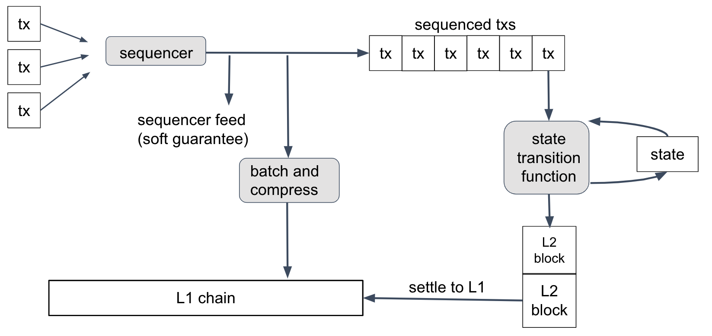

import ImageWithCaption from '@site/src/components/ImageCaptions/';

This document is a deep-dive explanation of Arbitrum Nitro’s design and the rationale for it. This isn’t API documentation, nor is it a guided tour of the code--look elsewhere for those. “Inside Arbitrum Nitro” is for people who want to understand Nitro's design.

The body of this document will describe Arbitrum Rollup, the primary use case of the Nitro technology and the one used on the Arbitrum One chain. There is a variant use case, called AnyTrust, which is used by the Arbitrum Nova chain. AnyTrust is covered by a section at the end of this document.

## Why use Arbitrum? Why use Nitro?

Arbitrum is an L2 scaling solution for Ethereum, offering a unique combination of benefits:

- Trustless security: security rooted in Ethereum, with any one party able to ensure correct Layer 2 results
- Compatibility with Ethereum: able to run unmodified EVM contracts and unmodified Ethereum transactions
- Scalability: moving contracts’ computation and storage off of the main Ethereum chain, allowing much higher throughput
- Minimum cost: designed and engineered to minimize the L1 gas footprint of the system, minimizing per-transaction cost.

Some other Layer 2 systems provide some of these features, but to our knowledge no other system offers the same combination of features at the same cost.

Nitro is a major upgrade to Arbitrum, improving over "classic" Arbitrum in several ways:

- **Advanced Calldata Compression,** which further drives down transaction costs on Arbitrum by reducing the amount of data posted to L1.
- **Separate Contexts For Common Execution and Fault Proving,** increasing the performance of L1 nodes, and thus offering lower fees.
- **Ethereum L1 Gas Compatibility,** bringing pricing and accounting for EVM operations perfectly in line with Ethereum.
- **Additional L1 Interoperability,** including tighter synchronization with L1 Block numbers, and full support for all Ethereum L1 precompiles.
- **Safe Retryables,** eliminating the failure mode where a retryable ticket fails to get created.
- **Geth Tracing,** for even broader debugging support.
- And many, many more changes.

## The Big Picture

At the most basic level, an Arbitrum chain works like this:

<ImageWithCaption
  caption="Original napkin sketch drawn by Arbitrum co-founder Ed Felten"
  src="https://lh4.googleusercontent.com/qwf_aYyB1AfX9s-_PQysOmPNtWB164_qA6isj3NhkDnmcro6J75f6MC2_AjlN60lpSkSw6DtZwNfrt13F3E_G8jdvjeWHX8EophDA2oUM0mEpPVeTlMbsjUCMmztEM0WvDpyWZ6R"
/>

Users and contracts put messages into the inbox. The chain reads the messages one at a time, and processes each one. This updates the state of the chain and produces some outputs.

If you want an Arbitrum chain to process a transaction for you, you need to put that transaction into the chain’s inbox. Then the chain will see your transaction, execute it, and produce some outputs: a transaction receipt, and any withdrawals that your transaction initiated.

Execution is deterministic -- which means that the chain’s behavior is uniquely determined by the contents of its inbox. Because of this, the result of your transaction is knowable as soon as your transaction has been put in the inbox. Any Arbitrum node will be able to tell you the result. (And you can run an Arbitrum node yourself if you want.)

All of the technical detail in this document is connected to this diagram. To get from this diagram to a full description of Arbitrum, we’ll need to answer questions like these:

- Who keeps track of the inbox, chain state, and outputs?
- How does Arbitrum make sure that the chain state and outputs are correct?
- How can Ethereum users and contracts interact with Arbitrum?
- How does Arbitrum support Ethereum-compatible contracts and transactions?
- How are ETH and tokens transferred into and out of Arbitrum chains, and how are they managed while on the chain?
- How can I run my own Arbitrum node or validator?

## Nitro's Design: The Four Big Ideas

The essence of Nitro, and its key innovations, lie in four big ideas. We'll list them here with a very quick summary of each, then we'll unpack them in more detail in later sections.

**Big Idea: Sequencing, Followed by Deterministic Execution**: Nitro processes transactions with a two-phase strategy. First, the transactions are organized into a single ordered sequence, and Nitro commits to that sequence. Then the transactions are processed, in that sequence, by a deterministic state transition function.

**Big Idea: Geth at the Core**: Nitro supports Ethereum's data structures, formats, and virtual machine by compiling in the core code of the popular go-ethereum ("Geth") Ethereum node software. Using Geth as a library in this way ensures a very high degree of compatibility with Ethereum.

**Big Idea: Separate Execution from Proving**: Nitro takes the same source code and compiles it twice, once to native code for execution in a Nitro node, optimized for speed, and again to WASM for use in proving, optimized for portability and security.

**Big Idea: Optimistic Rollup with Interactive Fraud Proofs**: Nitro settles transactions to the Layer 1 Ethereum chain using an optimistic rollup protocol, including the interactive fraud proofs pioneered by Arbitrum.

## Sequencing, Followed by Deterministic Execution

This diagram summarizes how transactions are processed in Nitro.

Let's follow a user's transaction through this process.

First, the user creates a transaction, uses their wallet to sign it, and sends it to the Nitro chain's Sequencer. The Sequencer's job, as its name implies, is to take the arriving transactions, put them into an ordered sequence, and publish that sequence.

Once the transactions are sequenced, they are run through the _state transition function_, one by one, in order. The state transition function takes as input the current state of the chain (account balances, contract code, and so on), along with the next transaction. It updates the state and sometimes emits a new Layer 2 block on the Nitro chain.

Because the protocol doesn't trust the Sequencer not to put garbage into its sequence, the state transition function will detect and discard any invalid (e.g., improperly formed) transactions in the sequence. A well-behaved Sequencer will filter out invalid transactions so the state transition function never sees them--and this reduces cost and therefore keeps transactions fees low--but Nitro will still work correctly no matter what the Sequencer puts into its feed. (Transactions in the feed are signed by their senders, so the Sequencer can't create forged transactions.)

The state transition function is deterministic, which means that its behavior depends only on the current state and the contents of the next transaction--and nothing else. Because of this determinism, the result of a transaction T will depend only on the genesis state of the chain, the transactions before T in the sequence, and T itself.

It follows that anyone who knows the transaction sequence can compute the state transition function for themselves--and all honest parties who do this are guaranteed to get identical results. This is the normal way that Nitro nodes operate: get the transaction sequence, and run the state transition function locally. No consensus mechanism is needed for this.
