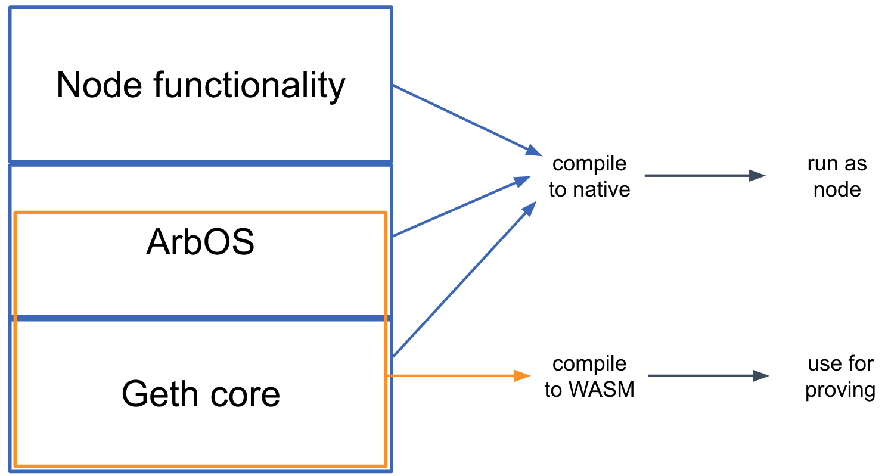

<!-- from inside-atrbitrum-nitro -->
## Geth at the Core

The second key design idea in Nitro is "geth at the core." Here "geth" refers to go-ethereum, the most common node software for Ethereum. As its name would suggest, go-ethereum is written in the Go programming language, as is almost all of Nitro.

The software that makes up a Nitro node can be thought of as built in three main layers, which are shown above:

- The base layer is the core of geth--the parts of Geth that emulate the execution of EVM contracts and maintain the data structures that make up the Ethereum state. Nitro compiles in this code as a library, with a few minor modifications to add necessary hooks.
- The middle layer, which we call ArbOS, is custom software that provides additional functions associated with Layer 2 functionality, such as decompressing and parsing the Sequencer's data batches, accounting for Layer 1 gas costs and collecting fees to reimburse for them, and supporting cross-chain bridge functionalities such as deposits of Ether and tokens from L1 and withdrawals of the same back to L1. We'll dig in to the details of ArbOS below.
- The top layer consists of node software, mostly drawn from geth. This handles connections and incoming RPC requests from clients and provides the other top-level functionality required to operate an Ethereum-compatible blockchain node.

Because the top and bottom layers rely heavily on code from geth, this structure has been dubbed a "geth sandwich." Strictly speaking, Geth plays the role of the bread in the sandwich, and ArbOS is the filling, but this sandwich is named for the bread.

The State Transition Function consists of the bottom Geth layer, and a portion of the middle ArbOS layer. In particular, the STF is a designated function in the source code, and implicitly includes all of the code called by that function. The STF takes as input the bytes of a transaction received in the inbox, and has access to a modifiable copy of the Ethereum state tree. Executing the STF may modify the state, and at the end will emit the header of a new block (in Ethereum's block header format) which will be appended to the Nitro chain.

## Separating Execution from Proving

One of the challenges in designing a practical rollup system is the tension between wanting the system to perform well in ordinary execution, versus being able to reliably prove the results of execution. Nitro resolves this tension by using the same source code for both execution and proving, but compiling it to different targets for the two cases.

When compiling the Nitro node software for _execution_, the ordinary Go compiler is used, producing native code for the target architecture, which of course will be different for different node deployments. (The node software is distributed in source code form, and as a Docker image containing a compiled binary.)

Separately, for _proving_, the portion of the code that is the State Transition Function is compiled by the Go compiler to WebAssembly (wasm), which is a typed, portable machine code format. The wasm code then goes through a simple transformation into a format we call WAVM, which is detailed below. If there is a dispute about the correct result of computing the STF, it is resolved with reference to the WAVM code.

#### WAVM

The wasm format has many features that make it a good vehicle for fraud proofs---it is portable, structured, well-specified, and has reasonably good tools and support---but it needs a few modifications to do the job completely. Nitro uses a slightly modified version of wasm, which we call WAVM. A simple transformation stage turns the wasm code produced by the Go compiler into WAVM code suitable for proving.

WAVM differs from wasm in three main ways. First, WAVM removes some features of wasm that are not generated by the Go compiler; the transformation phase verifies that these features are not present.

Second, WAVM restricts a few features of wasm. For example, WAVM does not contain floating-point instructions, so the transformer replaces floating-point instructions with calls to the Berkeley SoftFloat library. (We use software floating-point to reduce the risk of floating-point incompatibilities between architectures. The core Nitro functions never use floating-point, but the Go runtime does use some floating-point operations.) WAVM does not contain nested control flow, so the transformer flattens control flow constructs, turning control flow instructions into jumps. Some wasm instructions take a variable amount of time to execute, which we avoid in WAVM by transforming them into constructs using fixed cost instructions. These transformations simplify proving.

Third, WAVM adds a few opcodes to enable interaction with the blockchain environment. For example, new instructions allow the WAVM code to read and write the chain's global state, to get the next message from the chain's inbox, or to signal a successful end to executing the State Transition Function.

#### ReadPreImage and the Hash Oracle Trick

The most interesting new instruction is `ReadPreImage` which takes as input a hash `H` and an offset `I`, and returns the word of data at offset `I` in the preimage of `H` (and the number of bytes written, which is zero if `I` is at or after the end of the preimage). Of course, it is not feasible in general to produce a preimage from an arbitrary hash. For safety, the `ReadPreImage` instruction can only be used in a context where the preimage is publicly known, and where the size of the preimage is known to be less than a fixed upper bound of about 110 kbytes.

(In this context, "publicly known" information is information that can be derived or recovered efficiently by any honest party, assuming that the full history of the L1 Ethereum chain is available. For convenience, a hash preimage can also be supplied by a third party such as a public server, and the correctness of the supplied value is easily verified.)

As an example, the state of a Nitro chain is maintained in Ethereum's state tree format, which is organized as a Merkle tree. Nodes of the tree are stored in a database, indexed by the Merkle hash of the node. In Nitro, the state tree is kept outside of the State Transition Function's storage, with the STF only knowing the root hash of the tree. Given the hash of a tree node, the STF can recover the tree node's contents by using `ReadPreImage`, relying on the fact that the full contents of the tree are publicly known and that nodes in the Ethereum state tree will always be smaller than the upper bound on preimage size. In this manner, the STF is able to arbitrarily read and write to the state tree, despite only storing its root hash.

The only other use of `ReadPreImage` is to fetch the contents of recent L2 block headers, given the header hash. This is safe because the block headers are publicly known and have bounded size.

This "hash oracle trick" of storing the Merkle hash of a data structure, and relying on protocol participants to store the full structure and thereby support fetch-by-hash of the contents, goes back to the original Arbitrum design.

<!-- -->