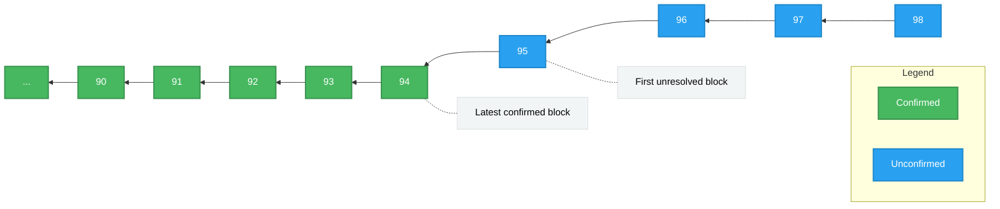
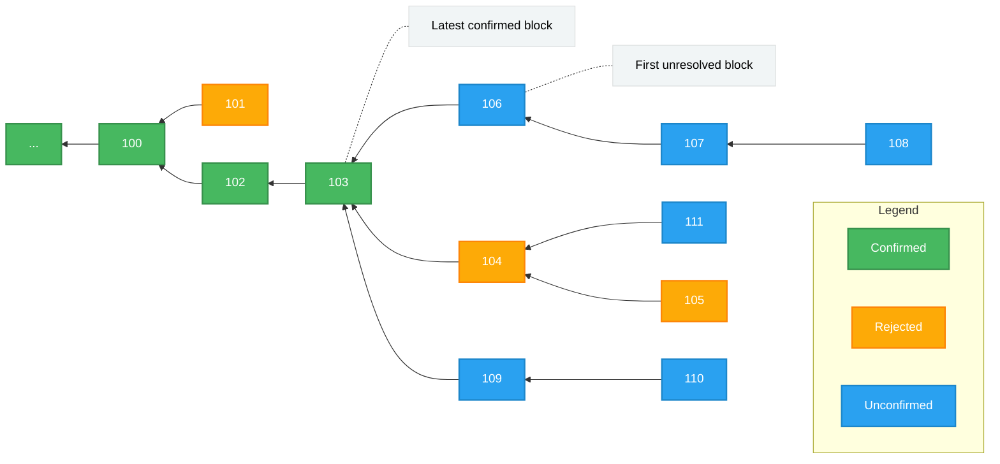
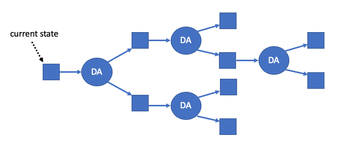

<!-- from inside-arbitrum-nitro -->
<!-- VALIDATION -->

## Optimistic Rollup

Arbitrum is an optimistic rollup. Let’s unpack that term.

_Rollup_

Arbitrum is a rollup, which means that the inputs to the chain -- the messages that are put into the inbox -- are all recorded on the Ethereum chain as calldata. Because of this, everyone has the information they would need to determine the current correct state of the chain -- they have the full history of the inbox, and the results are uniquely determined by the inbox history, so they can reconstruct the state of the chain based only on public information, if needed.

This also allows anyone to be a full participant in the Arbitrum protocol, to run an Arbitrum node or participate as a validator. Nothing about the history or state of the chain is a secret.

_Optimistic_

Arbitrum is optimistic, which means that Arbitrum advances the state of its chain by letting any party (a “validator”) post on Layer 1 a rollup block that that party claims is correct, and then giving everyone else a chance to challenge that claim. If the challenge period (6.4 days) passes and nobody has challenged the claimed rollup block, Arbitrum confirms the rollup block as correct. If someone challenges the claim during the challenge period, then Arbitrum uses an efficient dispute resolution protocol (detailed below) to identify which party is lying. The liar will forfeit a deposit, and the truth-teller will take part of that deposit as a reward for their efforts (some of the deposit is burned, guaranteeing that the liar is punished even if there's some collusion going on).

Because a party who tries to cheat will lose a deposit, attempts to cheat should be very rare, and the normal case will be a single party posting a correct rollup block, and nobody challenging it.

## Resolving disputes using interactive fraud proofs

Among optimistic rollups, the most important design decision is how to resolve disputes. Suppose Alice claims that the chain will produce a certain result, and Bob disagrees. How will the protocol decide which version to accept?

There are basically two choices: interactive proving, or re-executing transactions. Arbitrum uses interactive proving, which we believe is more efficient and more flexible. Much of the design of Arbitrum follows from this fact.

### Interactive proving

The idea of interactive proving is that Alice and Bob will engage in a back-and-forth protocol, refereed by an L1 contract, to resolve their dispute with minimal work required from any L1 contract.

Arbitrum's approach is based on dissection of the dispute. If Alice's claim covers N steps of execution, she posts two claims of size N/2 which combine to yield her initial N-step claim, then Bob picks one of Alice's N/2-step claims to challenge. Now the size of the dispute has been cut in half. This process continues, cutting the dispute in half at each stage, until they are disagreeing about a single step of execution. Note that so far the L1 referee hasn't had to think about execution "on the merits". It is only once the dispute is narrowed down to a single step that the L1 referee needs to resolve the dispute by looking at what the instruction actually does and whether Alice's claim about it is correct.

The key principle behind interactive proving is that if Alice and Bob are in a dispute, Alice and Bob should do as much off-chain work as possible needed to resolve their dispute, rather than putting that work onto an L1 contract.

### Re-executing transactions

The alternative to interactive proving would be to have a rollup block contain a claimed machine state hash after every individual transaction. Then in case of a dispute, the L1 referee would emulate the execution of an entire transaction, to see whether the outcome matches Alice's claim.

### Why interactive proving is better

We believe strongly that interactive proving is the superior approach, for the following reasons.

**More efficient in the optimistic case**: Because interactive proving can resolve disputes that are larger than one transaction, it can allow a rollup block to contain only a single claim about the end state of the chain after all of the execution covered by the block. By contrast, reexecution requires posting a state claim for each transaction within the rollup block. With hundred or thousands of transactions per rollup block, this is a substantial difference in L1 footprint -- and L1 footprint is the main component of cost.

**More efficient in the pessimistic case**: In case of a dispute, interactive proving requires the L1 referee contract only to check that Alice and Bob's actions "have the right shape", for example, that Alice has divided her N-step claim into two claims half as large. (The referee doesn't need to evaluate the correctness of Alice's claims--Bob does that, off-chain.) Only one instruction needs to be reexecuted. By contrast, reexecution requires the L1 referee to emulate the execution of an entire transaction.

**Higher per-tx gas limit:** Interactive proving can escape from Ethereum's tight per-transaction gas limit. The gas limit isn't infinite, for obvious reasons, but it can be larger than on Ethereum. As far as Ethereum is concerned, the only downside of a gas-heavy Arbitrum transaction is that it may require an interactive fraud proof with slightly more steps (and only if indeed it is fraudulent). By contrast, reexecution must impose a _lower_ gas limit than Ethereum, because it must be possible to emulate execution of the transaction (which is more expensive than executing it directly) within a single Ethereum transaction.

**More implementation flexibility:** Interactive proving allows more flexibility in implementation. All that is necessary is the ability to verify a one-step proof on Ethereum. By contrast, reexecution approaches are tethered to limitations of the EVM.

### Interactive proving drives the design of Arbitrum

Much of the design of Arbitrum is driven by the opportunities opened up by interactive proving. If you're reading about some feature of Arbitrum, and you're wondering why it exists, two good questions to ask are: "How does this support interactive proving?" and "How does this take advantage of interactive proving?" The answers to most "why" questions about Arbitrum relate to interactive proving.

## Arbitrum Rollup Protocol

Before diving into the rollup protocol, there are two things we need to cover.

First, _if you’re an Arbitrum user or developer, you don’t need to understand the rollup protocol_. You don’t ever need to think about it, unless you want to. Your relationship with it can be like a train passenger’s relationship with the train’s engine: you know it exists, you rely on it to keep working, but you don’t spend your time monitoring it or studying its internals.

You’re welcome to study, observe, and even participate in the rollup protocol, but you don’t need to, and most people won’t. So if you’re a typical train passenger who just wants to read or talk to your neighbor, you can skip right to the [next section](#validators) of this document. If not, read on!

The second thing to understand about the rollup protocol is that _the protocol doesn’t decide the results of transactions, it only confirms the results_. The results are uniquely determined by the sequence of messages in the chain’s inbox. So once your transaction message is in the chain’s inbox, its result is knowable--and Arbitrum nodes will report that your transaction is done. The role of the rollup protocol is to confirm transaction results that, as far as Arbitrum users are concerned, have already occurred. (This is why Arbitrum users can effectively ignore the rollup protocol.)

You might wonder why we need the rollup protocol. If everyone knows the results of transactions already, why bother confirming them? The rollup protocol exists for two reasons. First, somebody might lie about a result, and we need a definitive, trustless way to tell who is lying. Second, Ethereum doesn’t know the results. The whole point of a Layer 2 scaling system is to run transactions without Ethereum needing to do all of the work--and indeed Arbitrum can go fast enough that Ethereum couldn’t hope to monitor every Arbitrum transaction. But once a result is confirmed, Ethereum knows about it and can rely on it, enabling operations on Ethereum such as processing withdrawals of funds from Nitro back to L1.

With those preliminaries behind us, let’s jump into the details of the rollup protocol.

The parties who participate in the protocol are called _validators_. Some validators will choose to be bonders--they will place an ETH deposit which they’ll be able to recover if they’re not caught cheating. In the common case, it's expected that only one validator will be bonded, since as long as it's bonded on the current outcome, and there are no conflicting claims, there's no need for other parties to bond/take any action. The protocol allows for these roles to be permissionless in principle; currently on Arbitrum One, validators/bonders are allowlisted (see ["State of Progressive Decentralization"](https://docs.arbitrum.foundation/state-of-progressive-decentralization)). "Watchtower validators," who monitor the chain but don't take any on-chain actions, can be run permissionlessly (see ["validators"](#validators) below).

The key security property of the rollup protocol is that any one honest validator can force the correct execution of the chain to be confirmed. This means that execution of an Arbitrum chain is as trustless as Ethereum. You, and you alone (or someone you hire) can force your transactions to be processed correctly. And that is true no matter how many malicious people are trying to stop you.

### The Rollup Chain

The rollup protocol tracks a chain of rollup blocks---we'll call these "RBlocks" for clarity. They're not the same as Layer 1 Ethereum blocks, and also not the same as Layer 2 Nitro blocks. You can think of the RBlocks as forming a separate chain, which the Arbitrum rollup protocol manages and oversees.

Validators can propose RBlocks. New RBlocks will be _unresolved_ at first. Eventually every RBlock will be _resolved_, by being either _confirmed_ or _rejected_. The confirmed RBlocks make up the confirmed history of the chain.

:::note

Validators and proposers serve different roles. Validators validate transactions to the State Transition Function (STF) and chain state, whereas proposers can also assert and challenge the chain state.

:::

Each RBlock contains:

- the RBlock number
- the predecessor RBlock number: RBlock number of the last RBlock before this one that is (claimed to be) correct
- the number of L2 blocks that have been created in the chain's history
- the number of inbox messages that have been consumed in the chain’s history
- a hash of the outputs produced over the chain’s history.

Except for the RBlock number, the contents of the RBlock are all just claims by the RBlock's proposer. Arbitrum doesn’t know at first whether any of these fields are correct. If all of these fields are correct, the protocol should eventually confirm the RBlock. If one or more of these fields are incorrect, the protocol should eventually reject the RBlock.

An RBlock is implicitly claiming that its predecessor RBlock is correct. This implies, transitively, that an RBlock implicitly claims the correctness of a complete history of the chain: a sequence of ancestor RBlocks that reaches all the way back to the birth of the chain.

An RBlock is also implicitly claiming that its older siblings (older RBlocks with the same predecessor), if there are any, are incorrect. If two RBlocks are siblings, and the older sibling is correct, then the younger sibling is considered incorrect, even if everything else in the younger sibling is true.

The RBlock is assigned a deadline, which says how long other validators have to respond to it. If you’re a validator, and you agree that an RBlock is correct, you don’t need to do anything. If you disagree with an RBlock, you can post another RBlock with a different result, and you’ll probably end up in a challenge against the first RBlock's bonder. (More on challenges below.)

In the normal case, the rollup chain will look like this:

On the left, representing an earlier part of the chain’s history, we have confirmed RBlocks. These have been fully accepted and recorded by the Layer 1 contracts that manage the chain. The newest of the confirmed RBlocks, RBlock 94, is called the “latest confirmed RBlock.” On the right, we see a set of newer proposed RBlocks. The protocol can’t yet confirm or reject them, because their deadlines haven’t run out yet. The oldest RBlock whose fate has yet to be determined, RBlock 95, is called the “first unresolved RBlock.”

Notice that a proposed RBlock can build on an earlier proposed RBlock. This allows validators to continue proposing RBlocks without needing to wait for the protocol to confirm the previous one. Normally, all of the proposed RBlocks will be valid, so they will all eventually be accepted.

Here’s another example of what the chain state might look like, if several validators are being malicious. It’s a contrived example, designed to illustrate a variety of cases that can come up in the protocol, all smashed into a single scenario.

There’s a lot going on here, so let’s unpack it.

- RBlock 100 has been confirmed.
- RBlock 101 claimed to be a correct successor to RBlock 100, but 101 was rejected (hence it is orange).
- RBlock 102 was eventually confirmed as the correct successor to 100.
- RBlock 103 was confirmed and is now the latest confirmed RBlock.
- RBlock 104 was proposed as a successor to RBlock 103, and 105 was proposed as a successor to 104. 104 was rejected as incorrect, and as a consequence 105 was rejected because its predecessor was rejected.
- RBlock 106 is unresolved. It claims to be a correct successor to RBlock 103 but the protocol hasn’t yet decided whether to confirm or reject it. It is the first unresolved RBlock.
- RBlocks 107 and 108 claim to chain from 106. They are also unresolved. If 106 is rejected, they will be automatically rejected too.
- RBlock 109 disagrees with RBlock 106, because they both claim the same predecessor. At least one of them will eventually be rejected, but the protocol hasn’t yet resolved them.
- RBlock 110 claims to follow 109. It is unresolved. If 109 is rejected, 110 will be automatically rejected too.
- RBlock 111 claims to follow 104. 111 will inevitably be rejected because its predecessor has already been rejected. But it hasn’t been rejected yet, because the protocol resolves RBlocks in RBlock number order, so the protocol will have to resolve 106 through 110, in order, before it can resolve 111. After 110 has been resolved, 111 can be rejected immediately.

Again: this sort of thing is very unlikely in practice. In this diagram, at least four parties must have bonded on wrong RBlocks, and when the dust settles at least four parties will have lost their bonds. The protocol handles these cases correctly, of course, but they’re rare corner cases. This diagram is designed to illustrate the variety of situations that are possible in principle, and how the protocol would deal with them.

### Staking

At any given time, some validators will be bonders, and some will not. Bonders deposit funds that are held by the Arbitrum Layer 1 contracts and will be confiscated if the bonder loses a challenge. Nitro chains accept bonds in ETH.

A single bond can cover a chain of RBlocks. Every bonder is bonded on the latest confirmed RBlock; and if you’re bonded on an RBlock, you can also bond on one successor of that RBlock. So you might be bonded on a sequence of RBlocks that represent a single coherent claim about the correct history of the chain. A single bond suffices to commit you to that sequence of RBlocks.

In order to create a new RBlock, you must be a bonder, and you must already be bonded on the predecessor of the new RBlock you’re creating. The bond requirement for RBlock creation ensures that anyone who creates a new RBlock has something to lose if that RBlock is eventually rejected.

The protocol keeps track of the current required bond amount. Normally this will equal the base bond amount, which is a parameter of the Nitro chain. But if the chain has been slow to make progress lately, the required bond will increase, as described in more detail below.

The rules for staking are as follows:

- If you’re not bonded, you can bond on the latest confirmed RBlock. When doing this, you deposit the current minimum bond amount.
- If you’re bonded on an RBlock, you can also add your bond to any one successor of that RBlock. (The protocol tracks the maximum RBlock number you’re bonded on, and lets you add your bond to any successor of that RBlock, updating your maximum to that successor.) This doesn’t require you to place a new bond.
  - A special case of adding your bond to a successor RBlock is when you create a new RBlock as a successor to an RBlock you’re already bonded on.
- If you’re bonded only on the latest confirmed RBlock (and possibly earlier RBlocks), you or anyone else can ask to have your bond refunded. Your bonded funds will be returned to you, and you will no longer be a bonder.
- If you lose a challenge, your bond is removed from all RBlocks and you forfeit your bonded funds.

Notice that once you are bonded on an RBlock, there is no way to unbond. You are committed to that RBlock. Eventually one of two things will happen: that RBlock will be confirmed, or you will lose your bond. The only way to get your bond back is to wait until all of the RBlocks you are bonded on are confirmed.

#### Setting the current minimum bond amount

One detail we deferred earlier is how the current minimum bond amount is set. Normally, this is just equal to the base bond amount, which is a parameter of the Nitro chain. However, if the chain has been slow to make progress in confirming RBlocks, the bond requirement will escalate temporarily. Specifically, the base bond amount is multiplied by a factor that is exponential in the time since the deadline of the first unresolved RBlock passed. This ensures that if malicious parties are placing false bonds to try to delay progress (despite the fact that they’re losing those bonds), the bond requirement goes up so that the cost of such a delay attack increases exponentially. As RBlock resolution starts advancing again, the bond requirement will go back down.

### Rules for Confirming or Rejecting RBlocks

The rules for resolving RBlocks are fairly simple.

The first unresolved RBlock can be confirmed if:

- the RBlock's predecessor is the latest confirmed RBlock, and
- the RBlock's deadline has passed, and
- there is at least one bonder, and
- All bonders are bonded to the RBlock.

The first unresolved RBlock can be rejected if:

- the RBlock's predecessor has been rejected, or
- all of the following are true:
  - the RBlock's deadline has passed, and
  - there is at least one bonder, and
  - no bonder is bonded on the RBlock.

A consequence of these rules is that once the first unresolved RBlock's deadline has passed (and assuming there is at least one bonder bonded on something other than the latest confirmed RBlock), the only way the RBlock can be unresolvable is if at least one bonder is bonded on it and at least one bonder is bonded on a different RBlock with the same predecessor. If this happens, the two bonders are disagreeing about which RBlock is correct. It’s time for a challenge, to resolve the disagreement.

<!-- -->

<!-- fraud proofs/challenges -->
## Validators

Arbitrum full nodes normally "live at Layer 2" which means that they don’t worry about the rollup protocol but simply treat their Arbitrum chain as a mechanism that feeds inbox messages to the State Transition Function to evolve the Layer 2 chain and produce outputs.

Some Arbitrum nodes will choose to act as _validators_. This means that they watch the progress of the rollup protocol and participate in that protocol to advance the state of the chain securely.

Not all nodes will choose to do this. Because the rollup protocol doesn’t decide what the chain will do but merely confirms the correct behavior that is fully determined by the inbox messages, a node can ignore the rollup protocol and simply compute for itself the correct behavior. For more on what such nodes might do, see the [Full Nodes](#full-nodes) section.

Offchain Labs provides open source validator software, including a pre-built Docker image.

Every validator can choose their own approach, but we expect validators to follow three common strategies:

- The _active validator_ strategy tries to advance the state of the chain by proposing new RBlocks. An active validator is always bonded, because creating an RBlock requires being bonded. A chain really only needs one honest active validator; any more is an inefficient use of resources. For the Arbitrum One chain, Offchain Labs runs an active validator.
- The _defensive validator_ strategy watches the rollup protocol operate. If only correct RBlocks are proposed, this strategy doesn't bond. But if an incorrect RBlock is proposed, this strategy intervenes by posting a correct RBlock or staking on a correct RBlock that another party has posted. This strategy avoids staking when things are going well, but if someone is dishonest it bonds in order to defend the correct outcome.
- The _watchtower validator_ strategy never bonds. It simply watches the rollup protocol and if an incorrect RBlock is proposed, it raises the alarm (by whatever means it chooses) so that others can intervene. This strategy assumes that other parties who are willing to bond will be willing to intervene in order to take some of the dishonest proposer’s bond, and that that can happen before the dishonest RBlock’s deadline expires. (In practice this will allow several days for a response.)

Under normal conditions, validators using the defensive and watchtower strategies won’t do anything except observe. A malicious actor who is considering whether to try cheating won’t be able to tell how many defensive and watchtower validators are operating incognito. Perhaps some defensive validators will announce themselves, but others probably won’t, so a would-be attacker will always have to worry that defenders are waiting to emerge.

The underlying protocol supports permissionless validation, i.e.,--anyone can do it. Currently on Arbitrum One, validators that require bond (i.e., active and defensive validators) are whitelisted; see ["State of Progressive Decentralization"](https://docs.arbitrum.foundation/state-of-progressive-decentralization).

Who will be validators? Anyone will be able to do it, but most people will choose not to. In practice we expect people to validate a chain for several reasons.

- Validators could be paid for their work, by the party that created the chain or someone else. A chain could be configured such that a portion of the funds from user transaction fees are paid directly to validators.
- Parties who have significant assets at bond on a chain, such as dapp developers, exchanges, power-users, and liquidity providers, may choose to validate in order to protect their investment.
- Anyone who chooses to validate can do so. Some users will probably choose to validate in order to protect their own interests or just to be good citizens. But ordinary users don’t need to validate, and we expect that the vast majority of users won’t.
<!-- -->

<!-- from assertion-tree -->

# The Assertion Tree

### Overview

The state of an Arbitrum chain is confirmed back on Ethereum via "assertions," aka "disputable assertions" or "DAs." These are claims made by Arbitrum validators about the chain's state. To make an assertion, a validator must post a bond in Ether.

In the happy / common case, all outstanding assertions will be valid; i.e., a valid assertion will build on another valid assertion, which builds on another valid assertion, and so on. After the dispute period (~ 1 week) passes and an assertion goes unchallenged, it can be confirmed back on L1.

If, however, two or more conflicting assertions exist, the Assertion Tree bifurcates into multiple branches:

Crucially, the rules of advancing an Arbitrum chain are deterministic; this means that given a chain state and some new inputs, there is only one valid output. Thus, if the Assertion Tree contains more than one leaf, then at most only one leaf can represent the valid chain-state; if we assume there is at least one honest active validator, _exactly_ one leaf will be valid.

Two conflicting assertions can be put into a dispute; see [Interactive Challenges](/how-arbitrum-works/fraud-proofs/challenge-manager.mdx) for details on the dispute process. For the sake of understanding the Assertion Tree protocol, suffice it to say that 2-party disputes last at most a fixed amount of time (1 week), at the end of which one of the two conflicting assertions will be rejected, and the validator who posted it will lose their stake.

In order for an assertion to be confirmed and for its stake to be recovered, two conditions must be met: sufficient time for disputes must have passed, and no other conflicting branches in the Assertion Tree can exist (i.e., they've all been disputed / "pruned" off.)

These properties together ensure that as long as at least one honest, active validator exists, the valid chain state will ultimately be confirmed.

### Delays

Even if the Assertion Tree has multiple conflicting leaves and, say, multiple disputes are in progress, validators can continue making assertions; honest validators will simply build on the one valid leaf (intuitively: an assertion is also an implicit claim of the validity of all of its parent-assertions.) Likewise, users can continue transacting on L2, since transactions continue to be posted in the chain's inbox.

The only delay that users experience during a dispute is of their [L2 to L1 messages](/how-arbitrum-works/arbos/l2-l1-messaging.mdx) (i.e., "their withdrawals"). Note that a "delay attacker" who seeks to grief the system by deliberately causing such delays will find this attack quite costly, since each bit of delay-time gained requires the attacker lose another stake.

### Detailed Spec

For a more detailed breakdown / specification of the assertion tree protocol, see [Inside Arbitrum](/how-arbitrum-works/inside-arbitrum-nitro.mdx#arbitrum#rollup#protocol).

<!-- -->
