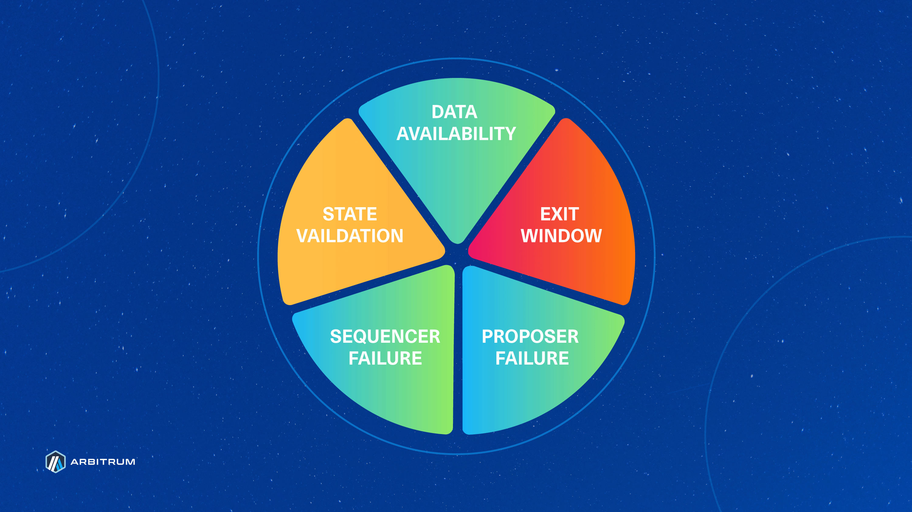
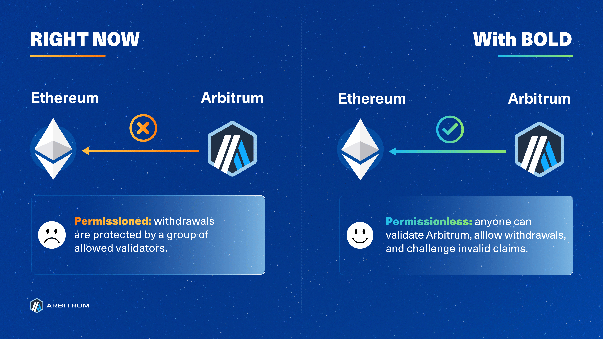

This introduction is for those who want to learn about BoLD: a new dispute protocol for optimistic rollups that can enable **permissionless validation for Arbitrum chains**. BoLD stands for Bounded Liquidity Delay and is currently deployed on a public testnet for anyone to join and test how challenges will work.

This next-generation dispute protocol technology will soon be available for any Arbitrum chain, and pending a governance vote, will eventually be made available on Arbitrum Sepolia, Arbitrum One, and Arbitrum Nova.

If the DAO proposal passes, BoLD will replace the permissioned fraud protocol in the future (for DAO chains).

## In a nutshell:

- Validation for Arbitrum One and Arbitrum Nova is a privileged action currently limited to an [allow-listed set of parties, maintained by the Arbitrum DAO](https://docs.arbitrum.foundation/state-of-progressive-decentralization#allowlisted-validators) to reduce the risks of _[delay attacks](https://medium.com/offchainlabs/solutions-to-delay-attacks-on-rollups-434f9d05a07a)_. _Delay attacks_ are a class of attacks where malicious entities can open as many disputes as they are willing to forfeit bonds during the challenge period to delay confirmations of assertions (equal to the time needed to resolve those disputes one by one).
- BoLD, an acronym for Bounded Liquidity Delay, is a new challenge resolution protocol for Arbitrum chains that enables permissionless validation by mitigating the risks of delay attacks against [Optimistic rollups like Arbitrum](/how-arbitrum-works/06-optimistic-rollup.mdx). This is possible because BoLD's design ensures disputes will be resolved within a fixed time window, currently set to equal one challenge period (~6.4 days) for Arbitrum One and Arbitrum Nova. If there is a dispute, BoLD guarantees the maximum total time to be equal to two challenge periods (one for raising disputes, one for resolving disputes), a two-day grace period for the Security Council to intervene if necessary, and a small delta for computing challenges.
- Enabling permissionless validation is key milestone on [Arbitrum’s journey to becoming a Stage 2 Rollup](https://docs.arbitrum.foundation/state-of-progressive-decentralization) - the most advanced and mature rollup technology categorization, according to [L2Beat](https://medium.com/l2beat/introducing-stages-a-framework-to-evaluate-rollups-maturity-d290bb22befe). With BoLD, **any honest party can validate and bond their funds to post a correct L2 state assertions to win disputes against malicious entities.**
- BoLD is currently considered to be in `alpha` release and is deployed on a public testnet. [Follow this guide](https://github.com/OffchainLabs/BoLD-validator-starter-kit) to deploy a BoLD validator to test and explore, first hand, how BoLD works to secure Arbitrum chains. To learn more about BoLD, please check out the [BoLD whitepaper](https://arxiv.org/abs/2404.10491) and [BoLD's code and specifications on Github](https://github.com/OffchainLabs/BoLD).

## What _exactly_ is BoLD?

BoLD, an acronym for Bounded Liquidity Delay Protocol, is an upgrade to Arbitrum's existing dispute protocol. Specifically, BoLD changes some of the rules used by validators to open and resolve disputes about Arbitrum’s state to ensure only valid states get confirmed on an Arbitrum chain’s parent chain, such as Ethereum.

The current dispute protocol has working fraud proofs and is used in production today by Arbitrum chains. The changes BoLD brings enable anyone to participate in the validation of the state of the chain and enhance security around all L2 to L1 messages (including withdrawals).

Under BoLD, a bonded validator’s responsibilities are to:

- Post claims about an Arbitrum chain’s state to its parent chain (for Arbitrum One, the parent chain is Ethereum),
- Open challenges to dispute invalid claims made by other validators, and
- Confirm valid claims by participating in and winning challenges.

The goal of BoLD is to unlock permissionless validation by ensuring that disputes are resolved within a fixed period (currently equivalent to two challenge periods, plus a two-day grace period for the Security Council to intervene if necessary and a small delta for computation), effectively removing the risk of delay attacks and making withdrawals to a parent chain more secure. BoLD accomplishes this by introducing a new dispute system that lets any single entity defend Arbitrum against malicious parties - effectively allowing anyone to validate, propose, and defend an Arbitrum chain’s state without needing permission to do so.

## Why does Arbitrum need a new dispute protocol?

While Arbitrum chains today benefit from working fraud proofs, BoLD introduces a few subtle but innovative changes that let _anyone_ challenge and win disputes - all within a fixed time period. In other words, Arbitrum chains will continue to be secured with an interactive proving game between validators using fraud proofs, but with the added benefit of this game being completely permissionless and time-bounded to the same length as 1 challenge period (or 6.4 days, by default).

Under the hood, the reason why BoLD can offer time-bound, permissionless validation is because a correct Arbitrum state assertion is **not tied to the entity that bonds their capital to a claim**. This property, coupled with the fact that L2 states are completely deterministic and can be proven on Ethereum, means that **any number of honest parties** can rely on BoLD to prove that their claim is correct. Lastly, a property that will not change with BoLD is the fact that there needs to only be 1 honest party defending Arbitrum.

### BoLD brings Arbitrum closer to being recognized as a Stage 2 rollup

Inspired by [Vitalik’s proposed milestones](https://ethereum-magicians.org/t/proposed-milestones-for-rollups-taking-off-training-wheels/11571), the team over at L2Beat has assembled a widely recognized framework for evaluating the development Ethereum Rollups. Both Vitalik and the [L2Beat framework](https://medium.com/l2beat/introducing-stages-a-framework-to-evaluate-rollups-maturity-d290bb22befe) refer to the final stage of rollup development as _“Stage 2 - No Training Wheels”_. A critical criterion for being considered a Stage 2 rollup is to allow anyone to validate the L2 state and post fraud proofs to Ethereum without restraints. This is considered a key requirement for Stage 2 because it ensures _[“that the system is not controlled by a limited set of entities and instead is subject to the collective scrutiny of the entire community”](https://medium.com/l2beat/introducing-stages-a-framework-to-evaluate-rollups-maturity-d290bb22befe)._

BoLD enables permissionless validation by allowing _anyone_ to challenge incorrect Arbitrum state assertions and therefore unlocks new avenues for participation in securing the network, fostering greater inclusivity and resilience. This is made possible because BoLD guarantees that a single, honest entity who has their capital bonded to the correct Arbitrum state assertion will always win against malicious adversaries. The research and work to bring BoLD to life underscores Arbitrum's commitment to scaling Ethereum without compromising on security.

With BoLD at its core, Arbitrum charts a course towards being recognized as a Stage 2 rollup by addressing the currently yellow (above) State Validation wedge in [L2Beat's risk analysis pie chart](https://l2beat.com/scaling/summary). BoLD contributes to a more permissionless, efficient, and robust rollup ecosystem. Additionally, BoLD will be available as an upgrade for all Orbit chains who wish to adopt it to reap the aforementioned benefits.

### BoLD makes withdrawals to L1 Ethereum safer

Today, there is a period of time, following a state assertion, called the “challenge period,” where any validator can open a dispute over the validity of a given L2 state root. If there are no disputes during the challenge period, the protocol confirms the state root and considers it to be valid - this property is what makes Arbitrum an optimistic rollup. This challenge period is why you must wait ~1 week (6.4 days to be exact) to withdraw assets from Arbitrum One, for example. While this design is secured with working fraud proofs, it is susceptible to [delay attacks](https://medium.com/offchainlabs/solutions-to-delay-attacks-on-rollups-434f9d05a07a), where malicious actors continuously open disputes to extend that challenge period for as long as they’re willing to sacrifice bonds - effectively extending the challenge period indefinitely by an amount equal to the time it takes to resolve each dispute, one by one. This risk is not ideal nor safe, and is why validation for Arbitrum One and Nova is confined to a permissioned set of entities overseen by the Arbitrum DAO.

BoLD addresses these challenges head-on by introducing a time limit on the existing rollup protocol for resolving disputes, effectively ensuring that challenges conclude within a 6.4-day window (this window can changed by the DAO for Arbitrum One and Nova). This is possible due to two reasons: (1) BoLD’s design allows for challenges between the honest party and any number of malicious adversaries to happen in parallel, and (2) the use of a time limit that will automatically confirm the honest party’s claims if the challenger fails to respond.

To summarize with an analogy and the diagram below: Arbitrum’s current dispute protocol assumes that any assertion that gets challenged must be defended against each unique challenger sequentially, like in a _“1v1 tournament”_. BoLD, on the other hand, enables any single honest party to defend the correct state and be guaranteed to win, similar to an _“all-vs-all battle royale”_ where there must and will always be a single winner in the end.

_Note that the timer/clocks above are arbitrary and instead represent the duration of challenges and how challenges are sequential today but can take place in parallel with BoLD. The duration of challenges are independent from one another._

## How is this possible?

The BoLD protocol provides the guardrails and rules for how validators challenge claims about the state of an Arbitrum chain. Since Arbitrum’s state is deterministic, there will always be only 1 correct state for a given input of on-chain operations and transactions. The beauty of BoLD’s design guarantees that disputes will be resolved within a fixed time window, removing the risk of delay attacks and ultimately enabling anyone to bond their funds to and successfully defend that singular correct state of Arbitrum.

Let’s dive in to an overview of how BoLD actually works.

1. **An assertion is made:** Validators begin by taking the most recent confirmed [RBlock](/how-arbitrum-works/06-optimistic-rollup.mdx#the-rollup-chain), called `Block A`, and assert that some number of transactions afterward, using Nitro’s deterministic State Transition Function (STF), will result in an end state, `Block Z`. If a validator claims that the end state represented by `Block Z` is correct, they will bond their funds to `Block Z` and propose that state to be posted to Ethereum. (For more details on how bonding works, see [Bold technical deep dive](/bold/concepts/bold-technical-deep-dive.mdx)). If nobody disagrees after a certain amount of time, known as the challenge period, then the state represented by the RBlock `Block Z` is confirmed as the correct state of an Arbitrum chain. However, if someone disagrees with the end state `Block Z`, they can submit a challenge. This is where BoLD comes into play.
2. **A challenge is opened:** When another validator observes and disagrees with the end state represented by `Block Z`, they can permissionlessly open a challenge by asserting and bonding capital to a claim on a different end state, represented by an RBlock `Block Y`. At this point in time, there are now 2 asserted states: `Block A → Block Z` and `Block A → Block Y`. Each of these asserted states, at this point in time now that there's a challenge, are referred to _edges_ while a Merkle tree of asserted states from some start to endpoint (e.g., `Block A → Block Z`) is more formally known as a _history commitment._ It is important to note that Ethereum at this point in time has no notion of which edge(s) is correct or incorrect - edges are simply a portion of a claim made by a validator about the history of the chain from some end state all the way back to some initial state. Also note that because a bond put up by a validator is tied to an assertion rather than the party who put up that bond, there can be any number of honest, anonymous parties that can open challenges against incorrect claims. It is important to note that the bonds put up to open challenges are held in a Gnosis Safe multi-sig wallet controlled by the Arbitrum Foundation. There is a prescribed procedure for what the Arbitrum Foundation is expected to do with these funds; see Step 5 below for a summary.
3. **Multi-level, interactive dissection begins:** To resolve the dispute, the disagreeing entities will need to come to an agreement on what the _actual, correct_ asserted state should be. [It would be tremendously expensive to re-execute](/how-arbitrum-works/06-optimistic-rollup.mdx#why-interactive-proving-is-better) and compare everything from `Block A → Block Z` and `Block A → Block Y`, especially since there could be potentially millions of transactions in between `A`, `Z`, and `Y`. Instead, entities take turns bisecting their respective _history commitments_ until they arrive at a single step of instruction where an arbiter, like Ethereum, can declare a winner. Note that [this system is very similar to how challenges are resolved on Arbitrum chains today](/how-arbitrum-works/07-interactive-fraud-proofs.mdx) - BoLD only changes some minor, but important, details in the resolution process. Let’s dive into what happens next:
   a. **Block challenges**: when a challenge is opened, the edges are called _level-zero edges_ since they are at the granularity of Arbitrum blocks. The disputing parties take turns bisecting their history commitments until they identify the specific block that they disagree on.
   b. **Big-step challenge:** Now that the parties have narrowed down their dispute to a single block, which we call `Block B`, the back-and-forth bisection exercise continues within that block. Note that `Block B` is claimed by all parties to be some state after the initial state `Block A` but before the final states `Block Z` and `Block Y`. This time, however, the parties will narrow down on a specific _range_ of instructions for the state transition function within the block - essentially working towards identifying a set of instructions within which their disagreement lies. This range is currently defined as 2^20 steps of WASM instructions, which is the assembly of choice for validating Arbitrum chains.
   c. **One-step challenge:** Within that range of 2^20 instructions, the back-and-forth bisecting continues until all parties arrive at a single step of instruction that they disagree on. At this point in time, parties agree on the initial state of Arbitrum before the step but disagree on the end state 1 step immediately after. Remember that since Arbitrum’s state is entirely deterministic, there is only one correct end state.
4. **One-step proof:** Once a challenge is isolated down to a dispute about a single step, both parties run that step to produce, and then submit, a one-step proof to the OneStepProof smart contract on the parent chain (e.g. Ethereum). A one-step proof is a proof that a single step of computation results in a particular state. The smart contract on the parent chain will execute the disputed step to validate the correctness of a submitted proof from the two parties. It is at this point that the honest party's proof will be deemed valid and its tree of edges will be confirmable by time, while the dishonest party will have their edges rejected by timeout.
5. **Confirmation:** Once the honest one-step edge is confirmed, the protocol will work on confirming or rejecting the parent edges until it reaches the level-zero edge of the honest party. With the honest party’s level-zero edge now confirmed, the honest party’s assertion bond can be withdrawn. Meanwhile, the dishonest party has their bonds taken away to ensure the dishonest party is always punished.
   - There is another way that a level-zero edge can get confirmed: time. At each of the mini-stages of the challenge (block challenge, big-step challenge, one-step challenge), a timer increments upwards towards some challenge period, _T_ defined by BoLD. This timer begins ticking for a party when they submit their bisected history commitment until their challenger submits their bisected history commitment in response. An edge is automatically confirmed if the timer reaches _T._
6. Reimbursements for the honest party's L1 gas costs and mini-bonds made at the other challenge levels are handled by the Arbitrum Foundation.

That’s it! We’ve now walked through each of the steps that validators will take to dispute challenges with the BoLD protocol. One final note here is that each of the steps explained above can take place concurrently and this is one of the reasons why BoLD can guarantee that disputes are resolved within a fixed time frame.

## Frequently asked questions about BoLD (FAQ):

#### Q: How does bonding work?

The entities responsible for posting assertions about Arbitrum state to Ethereum are called validators. If posting assertions were free, anyone could create conflicting assertions to always delay withdrawals by 14 days instead of 7. As such, Arbitrum requires validators to put in a “security deposit”, known as a bond, to be allowed to post assertions. Validators can withdraw their bond as soon as their latest posted assertion has been confirmed, and end their responsibilities. These bonds can be any ERC-20 token and should be set to a large enough value (e.g., 200 WETH) to make it economically infeasible for an adversary to attack an Arbitrum chain and to mitigate against spam (that would otherwise delay confirmations). Requiring a high bond to post assertions about Arbitrum seems centralizing, as we are replacing a whitelist of validators with instead a system that requires a lot of money to participate in. To address this, there is a [contract](https://github.com/OffchainLabs/BoLD/blob/main/contracts/src/assertionStakingPool/AssertionStakingPoolCreator.sol) that anyone can use to deploy a bonding pool as a way of crowdsourcing funds from others who wish to help defend Arbitrum but who may not individually be able to put up the large upfront bond itself. The use of bonding pools, coupled with the fact that there can be any number of honest anonymous parties ready to defend Arbitrum, means that these high bond values do not harm decentralization.

#### Q: Why are the bond sizes so high for Arbitrum One?

There are two types of “bonds” in BoLD: **assertion and challenge.** The below sizes are carefully calculated and set for Arbitrum One using a variety of factors, including TVL and optimizing for a balance between cost for honest parties and security of the protocol. As always, the exact bond sizes for an Orbit chain using BoLD is entirely up to the chain owner to decide, if they choose to adopt BoLD at all.

**Assertion bond sizes**

Assertion bond sizes can be thought of as a “security deposit” that an entity puts down to fulfill the role of a proposer (i.e., a validator who proposes state assertions to L1). The bond sizes are high because the role of a proposer is to ensure that the chain progresses and so whoever fulfills this role assumes a big responsibility. Accordingly, the bond is needed to deter delay attacks, where the attacker would sacrifice the bond in order to cause a week of delay in a group of withdrawals. If the bond is too small or free, there isn’t enough deterrence against this type of attack. Validators who choose to be proposers can withdraw their bond as soon as their most recent posted assertion has been confirmed by the protocol. We expect there to be very few proposers on Arbitrum One, and even one is sufficient for safety.

**Challenge bond sizes**

If someone disagrees with a posted assertion from a proposer, they can pool funds together to propose their own assertion that represents the correct history of the chain. Upon doing so, a challenge between the two claims will begin. Anyone can participate in the challenge, as it is not tied up to specific addresses. To resolve a challenge, participants will incur compute and gas costs due to the [interactive fraud proof game](https://docs.arbitrum.io/inside-arbitrum-nitro/#resolving-disputes-using-interactive-fraud-proofs), and certain moves within a challenge have an additional bond required to prevent resource exhaustion and spam from adversaries. These moves within a challenge require smaller, **challenge bonds**. The proposed challenge bonds for Arbitrum One are 1110 ETH to fully resolve a dispute, which will also get reimbursed upon the confirmation of assertions by the protocol.

The rationale behind the specific challenge bond size was made using something called a “resource ratio” - defined as the cost ratio between an adversary and an honest party when participating in the interactive fraud proof game. The value was chosen to ensure that the malicious party will pay 10x the marginal costs of the honest party. This resource ratio, coupled with the fact that an honest party will always get their bonds refunded while a malicious party loses everything, helps prevent and deter attacks to begin with.

To summarize with a scenario, this effectively means that defending against a $1B dollar attack would require ~$100M of bonds. The ~$100M would be reimbursed upon winning a challenge, where the $1B put up by an adversary would be lost. The proposal aims to send the confiscated funds to the treasury by setting the “excess state receiver” address to the [DAO’s treasury address](https://arbiscan.io/address/0xF3FC178157fb3c87548bAA86F9d24BA38E649B58). The tradeoff here is that the higher the resource ratio we want, the more expensive it is for both honest and evil parties to make claims in disputes.

**Bonding pools as a way to allow people to participate in assertion posting**

BoLD ships with trust-less bonding pools that allow any group of participants to pool their funds together to challenge a dishonest proposer, and win. That is, any group of entities can pool funds into a simple contract that will post an assertion to Ethereum without needing to trust each other. Upon observation of an invalid assertion, validators have 1 challenge period (~6.4 days) to pool funds in the contract and respond with a counter assertion. We believe that making it easy to pool the funds to participate in the defense of Arbitrum trustlessly and improves decentralization and the safety of BoLD.

#### Q: Does the bond requirement only mean that whales can validate Arbitrum One?

Validating Arbitrum One is **free and accessible**. All Arbitrum One nodes, by default, are watchtower validators meaning they can detect and report invalid assertions posted to Ethereum.

However, becoming an assertion proposer requires a bond, as without it, anyone could delay all Arbitrum bridged assets by one week. However, BoLD allows for anyone to propose assertions and also challenge invalid assertions via pool contracts, helping keep proposers accountable for their actions.

#### Q: How does BoLD disincentivize malicious actors from attacking an Arbitrum chain?

Bonds put up by honest parties will always be refunded while malicious actors always stand to lose 100% of their bond. Malicious actors stand to lose everything at each challenge. BoLD delay is bounded and additional challenges would not increase the delay of a particular assertion.

#### Q: In the event of a challenge, what happens to the confiscated funds from malicious actors for Arbitrum One?

Recall that BoLD enables any validator to put up a bond to propose assertions about the child chain state. These assertions about the child chain state are deterministic and so an honest party who puts up a bond on the correct assertion will always win in disputes. In these scenarios, the honest party will eventually have their bonds reimbursed while the malicious actor will lose all of their funds.

In BoLD, all costs spent by malicious actors are confiscated and sent to the Arbitrum DAO treasury. A small reward, called the Defender's Bounty, of 1% will be awarded to entities who put down challenge bonds in defense of Arbitrum One. For the remainder of the funds, the Arbitrum DAO will have full discretion over what to do with the funds confiscated from a malicious actor. This includes, but is not limited to:

- Using the confiscated funds to refund L1 gas costs to honest parties,
- Rewarding or reimbursing the honest parties with some, or all, of the confiscated funds in excess of the 1% Defender's Bounty,
- Burning some, or all, of the confiscated funds, or
- Keep some, or all, of the confiscated funds within the Arbitrum DAO Treasury.

As always, an Orbit chain can choose how they wish to structure and manage confiscated funds from dishonest parties.

#### Q: Why are honest parties not automatically rewarded with confiscated funds from a malicious actor?

It’s tempting to think that rewarding the honest proposer in a dispute can only make the protocol stronger, but this turns out not to be true, because an adversary can sometimes profit by placing the honest stakes themselves.

This creates perverse incentives that threaten the security of BoLD. Here’s an example, from Ed Felten:

<aside>
💡 *Suppose the top-level assertion bond is $5M. A delay attack, where the attacker wants to cause one week of delay at minimum cost, costs the attacker $5M. If we change the protocol to give the honest proposer 20% of the confiscated bond, then the attack only costs $4M, because the attacker can post both bonds ($10M total) and get back the honest $5M bond, plus a $1M reward. So, the protocol is weaker against delayed griefing. We can compensate by increasing the top-level assertion bond to $6.25M, so delay griefing still costs $5M, but that increases the cost, to an honest party, required to defend against other attacks. The intuition that giving bigger rewards for honest actions can only make the protocol stronger, though natural, turns out not to be correct. The reason for this is that large rewards create new strategic options for the attacker which might enable them to reduce their cost.*

</aside>

That said, there’s no harm in paying the honest proposer a fair interest rate on their bond, so they don’t suffer for having helped the protocol by locking up their capital in a bond.

Therefore, the BoLD AIP proposes that the honest parties be rewarded 1% of confiscated bonds from a dishonest party, in the event of a challenge. This reward applies only to entities who deposit challenge bonds and participate in defending Arbitrum against a challenge. The exact amount rewarded to honest parties will be proportional to the amount defender’s deposited into the protocol during a challenge, making bonding pool participants eligible. The process by which this reward is calculated will be done off-chain and payouts will require a DAO vote because the confiscated funds are always sent to a DAO-controlled address.

#### Q: Why is $ARB not the bonding token used in BoLD? on Arbitrum One?

Although BoLD supports using an ERC-20 token, Ethereum, specifically WETH, was chosen over $ARB for a few reasons:

1. **Arbitrum One & Arbitrum Nova both inherit their security from Ethereum already,** Arbitrum One and Nova rely on Ethereum for both data availability and as the referee for determining winners during fraud-proof disputes. It follows then that Ethereum continues to be used in BoLD, which is meant to permissionlessly secure Arbitrum even further. Ethereum’s value is also relatively independent of Arbitrum, especially when compared to $ARB.
2. Adversaries might be able to exploit the potential instability of $ARB when trying to win challenges. Suppose an adversary stakes in `$ARB`, and can create an impression that they have a nontrivial chance of winning the challenge. This might drive down the value of $ARB, which would decrease the adversary's cost to create more stakes (i.e., more spam) during the challenge, which in turn could increase the adversary's chances of winning (which would drive $ARB lower, making the attack cheaper still for the adversary, etc.)
3. **Access to liquidity**: Ethereum has greater liquidity than $ARB. In the event of an attack on Arbitrum, access and ease of pooling funds may become crucial.
4. **Fraud proofs are submitted to, and arbitrated on, L1 Ethereum.** The bonding of capital to make assertions is done so on L1 Ethereum, since Ethereum is the arbitrator of disputes. If BoLD were to use $ARB instead of Ethereum, a large amount of $ARB must be pre-positioned on L1 which is more difficult to do when compared to pre-positioning Ethereum on L1 Ethereum.

An Orbit chain owner may choose to use any token they wish for bonding, if they adopt and use BoLD permissionless validation.

#### Q: Can the required token for the validator be set to $ARB and can network $ETH revenues be distributed for validator incentives for Arbitrum One?

Yes. The asset that a validator uses to become a proposer in BoLD can be set to any `ERC-20` token, including `$ARB`. For Arbitrum One, `$ETH` is used for bonds for various reasons mentioned above. The Arbitrum DAO can change this asset type at any time via a governance proposal. Should such an economic incentive model exist, the source and denomination of funds used to incentivize validators will be at the discretion of the Arbitrum DAO. Again, though, we don't see `$ARB`-based bonding as a good idea at present; see the last question.

#### Q: How are honest parties reimbursed for bonding their capital to help secure Arbitrum One?

The Arbitrum DAO reimburses “active” proposers with a fair interest rate, as a way of removing the disincentive to participate, by reimbursing honest parties who bond their own capital and propose assertions for Arbitrum One. The interest rate should be denominated in `ETH` and should be equal to the annualized yield that Ethereum mainnet validators receive, which at the time of writing, is an APR between 3% to 4% (based on [CoinDesk Indices Composite Ether Staking Rate (CESR)](https://www.coindesk.com/indices/ether/cesr) benchmark and [_Rated.Network_](https://explorer.rated.network/network?network=mainnet&timeWindow=all&rewardsMetric=average&geoDistType=all&hostDistType=all&soloProDist=stake)). This interest is considered a reimbursement because this payment reimburses the honest party for the opportunity cost of locking up their capital and should not be perceived as a “reward” - for the [same reasons why the protocol does not reward honest parties with the funds confiscated from a malicious actor](https://www.notion.so/Arbitrum-BoLD-FAQ-93210f430a6a470792496be040ac9990?pvs=21). These reimbursement payments can be paid out upon an active proposer’s honest assertion being confirmed on Ethereum and will be calculated and handled off-chain by the Arbitrum Foundation.

BoLD makes it permissionless for any validator to become a proposer and also introduces a way to pay a service fee to honest parties for locking up capital to do so. Validators are not considered active proposers until they successfully propose an assertion _with_ a bond. In order to become an active \*\*proposer for Arbitrum One, post-BoLD, a validator has to propose an L2 state assertion to Ethereum. If they do not have an active bond on L1, they then need to attach a bond to their assertion in order to successfully post the assertion. Subsequent assertions posted by the same address will simply move the already-supplied bond to their latest proposed assertion. Meanwhile, if an entity, say Bob, has posted a successor assertion to one previously made by another entity, Alice, then Bob would be considered by the protocol to be the current active proposer. Alice would no longer be considered by the protocol as the active proposer and once Alice’s assertion is confirmed, then Alice gets her assertion bond refunded. There can only be 1 “active” proposer at any point in time.

The topic of economic and incentive models for BoLD on Arbitrum One is valuable and we believe it deserves the full focus and attention of the community via a separate proposal/discussion - decoupled from this proposal to bring BoLD to mainnet. Details around proposed economic or incentive models for BoLD will need continued research and development work, but the deployment of BoLD as-is represents a substantial improvement to the security of Arbitrum even without economic-related concerns being resolved. The DAO may choose, via governance, to fund other parties or change this reimbursement model at any time.

For Orbit chains, any economic model can be implemented alongside BoLD, if chain owners decide to adopt BoLD.

#### Q: For Arbitrum One proposers, is the service fee applied to the amount bonded? If that’s the case, the $ETH would be locked and thus unable to be used to generate yield elsewhere. So, which assets are used to generate this yield for the service fee? Would it involve some $ETH from the Arbitrum bridge?

The proposed service fee should correlate to the annualized income that Ethereum mainnet validators receive, over the same time period. At the time of writing, the estimated annual income for Ethereum mainnet validators is approximately 3% to 4% of their stake (based on [CoinDesk Indices Composite Ether Staking Rate (CESR)](https://www.coindesk.com/indices/ether/cesr) benchmark and [_Rated.Network_](https://explorer.rated.network/network?network=mainnet&timeWindow=all&rewardsMetric=average&geoDistType=all&hostDistType=all&soloProDist=stake)).

The fee is applied to the total amount bonded over the duration of time that a proposer is active. A validator will need to deposit $ETH into the contracts on L1 to become a proposer and so those deposited funds will indeed be unable to be used for yield in other scenarios. The decision on the source of funds for the yield is entirely up to the ArbitrumDAO to decide.

#### Q: For Arbitrum One, will the off-chain compute costs be reimbursed? (i.e. the costs for a validator computing the hashes for a challenge)

Reimbursement will not be made for off-chain compute costs as we view these to be costs borne by all honest operators, alongside the maintenance and infra costs that regularly arise from running a node.

Our testing has demonstrated that the cost of running a sub-challenge in BoLD, the most computationally-heavy step, on an AWS r5.4xlarge EC2 instance, costs around $2.50 USD (~$1/hour for one challenge with 2.5hour duration) using [on-demand prices for US East (N. Virginia)](https://instances.vantage.sh/aws/ec2/r5.4xlarge). Therefore, the additional costs from off-chain compute is assumed to be negligible relative to the regular infra costs of operating a node.

#### Q: How will BoLD impact Arbitrum Nova?

Although this AIP proposes that both Arbitrum One and Nova upgrade to use BoLD, we recommend for the removal of the [allowlist of validators for Arbitrum One while keeping Nova permissioned with a DAO-controlled allowlist of entities](https://docs.arbitrum.foundation/state-of-progressive-decentralization#allowlisted-validators) - unchanged from today.

This decision was made for two reasons. First, Arbitrum Nova’s TVL is much lower than Arbitrum One’s TVL, (~$17B vs. ~$46M at the time of writing, from [L2Beat](https://l2beat.com/scaling/summary)). This means that the high bond sizes necessary for preventing spam and delay attacks would make up a significant proportion of Nova’s TVL - which we believe introduces a centralization risk as very few parties would be incentivized to secure Nova. A solution here would be to lower the bond sizes, which brings us to the second reason: lower bond sizes reduce the costs of delay griefing attacks (where malicious actors delay the chain’s progress) and therefore hurt the security of the chain. We believe enabling permissionless validation for Nova is not worth the capital requirement tradeoffs, given the unique security model of AnyTrust chains.

Notably, since Arbitrum Nova's security already depends on at least one DAC member providing honest data availability, trusting the same committee to have at least one member provide honest validation does not add a major trust assumption. This requires all DAC members also to run validators. If the DAC is also validating the chain, a feature the Offchain Labs team has been working on, Fast Withdrawals, would allow users to withdraw assets from Nova in ~15 minutes, or the time it takes to reach L1 finality. This is made possible by the DAC attesting to and instantly confirming an assertion. Fast Withdrawals will be the subject of future forum post and snapshot vote.

#### Q: When it comes to viewing the upfront assertion bond (to be a proposer) as the security budget for Arbitrum One, is it possible for an attacker to go above the security budget and, if yes, what happens then?

The upfront capital to post assertions is 3600 ETH, with subsequent sub challenge assertions requiring 555/79 ETH (per level) - this applies to honest proposers as well as malicious entities. A malicious entity can post multiple invalid top level assertions and/or open multiple challenges and the honest entity can

It is critical to note that Arbitrum state transitions are entirely deterministic. An honest party bonded to the correct state assertion, the honest party will get all their costs refunded while a malicious entity stands to lose everything. Additionally, BoLD’s design ensures that any party bonded to the correct

If a malicious entity wanted to attack Arbitrum, they would need to deposit 3600 ETH to propose an invalid state assertion.

#### Q: How do BoLD-based L3s challenge periods operate, considering the worst-case scenario?

To recap, both Arbitrum’s current dispute protocol and BoLD require assertions to be posted to the parent chain and employ interactive proving, which involves a back-and-forth between two entities until a single step of disagreement is reached. That single step (of disagreement) is then submitted to contracts on the parent chain. Those contracts are used to declare a winner. For L2s, like Arbitrum One, BoLD must be deployed on a credibly-neutral, censorship-resistant backend to ensure disputes are fairly resolved. Ethereum, therefore, is the perfect candidate for deployment of the BoLD protocol for L2s.

But you might now be wondering: what about L3 Orbit chains that don’t settle to Ethereum? Unlike L2s that settle to Ethereum, assertions on an L3’s state need to be posted to an L2 either via (A) the L3 sequencer or (B) the delayed inbox queue managed by the L2 sequencer on L2. In the event that the parent chain (in this case, L2) is being repeatedly censored or if the L2 sequencer is offline, every block level assertion and/or sub-challenge assertion would need to wait 24 hours before they can bypass the sequencer (using the the`SequencerInbox`’s `forceInclusion` method described [here](https://docs.arbitrum.io/how-arbitrum-works/sequencer#unhappyuncommon-case-sequencer-isnt-doing-its-job)). If this were to happen, challenge resolution would be delayed by a time _t_ where _t_ = (24 hours) \* number of moves for a challenge. To illustrate with sample numbers, if a challenge takes 50 sequential moves to resolve, then the delay would be 50 days!

To mitigate the risk of this issue manifesting for Arbitrum chains, Offchain Labs has included a feature called _Delay Buffer_ as part of BoLD’s 1.0.0 release. The _Delay Buffer_ feature aims to limit the negative effects of: prolonged parent chain censorship, prolonged sequencer censorship, and/or unexpected sequencer outages. This is accomplished by implementing some time threshold that is decremented when unexpected delays occur. Once that time threshold is met, the force inclusion window is lowered - effectively enabling entities to make moves without the 24 hour delay-per-move.

Under reasonable parameterization, the sequencer could be offline / censoring for 24 hours twice, before the force inclusion window is effectively dropped from 24 hours to a minimum inclusion time. The force inclusion window gradually (over weeks) replenishes to it's original value over time as long as the sequencer is on "good behavior" - regularly sequencing messages without unexpected delays. We believe that the Delay Buffer feature provides stronger guarantees of censorship resistance for Arbitrum chains.

The methodology for calculating the parameters, specifically for L3 Orbit chains, will be made available at a later date for teams who wish to use BoLD.

#### Q: What is the user flow for using the assertion bonding pool contract?

:::warning
The autopooling feature is not available on Arbitrum Nitro as of yet.
:::

Anyone can deploy an assertion bonding pool using [`AssertionStakingPoolCreator.sol`](https://github.com/OffchainLabs/BoLD/blob/main/contracts/src/assertionStakingPool/AssertionStakingPoolCreator.sol) as a means to crowdsource funds to put up a bond for an assertion. To defend Arbitrum using a bonding pool, an entity would first deploy this pool with the assertion they believe is correct and wish to put up a bond to challenge an adversary's assertion. Then, anyone can verify that the claimed assertion is correct by running the inputs through their node's State Transition Function (STF). If other parties agree that the assertion is correct, then they can deposit their funds into the contract. When enough funds have been deposited, anyone can permissionlessly trigger the creation of the assertion on-chain to start the challenge. Finally, once the honest parties' assertion is confirmed by the dispute protocol, all involved entities can get their funds reimbursed and can withdraw. The Arbitrum Nitro node validation software also comes with an optional feature called "auto pooling," where the entire workflow of assertion bonding pool deployment and depositing funds into the said pool are automated. If "auto pooling" is activated & the private key controlling the validator has funds, a pool will be trustlessly deployed alongside an assertion with the available funds. If a validator with the "auto pooling" feature enabled sees an assertion on-chain that it agrees with _and_ a bonding pool already exists for that assertion, then the validator will automatically deposit funds into the bonding pool to "join" the others who are backing that on-chain assertion in a trustless manner.

#### Q: What type of hardware will be necessary to run a BoLD validator?

The minimum hardware requirements for running a BoLD validator is still being researched and finalized. The goal, however, is that regular consumer hardware (i.e. laptop) can effectively be used by an honest party to secure an Arbitrum chain using BoLD in the average case.

#### Q: How do BoLD validators communicate with one another? Is it over a P2P network?

BoLD validators for Arbitrum chains communicate directly with smart contracts on L1 Ethereum. This means that opening challenges, submitting bisected history commitments, one-step proofs, and confirmations are all refereed on Ethereum. There is no P2P between validators.

#### Q: For an L3 Orbit chain, secured using BoLD, that settles to Arbitrum One, does the one-step proof happen on the parent chain?

Yes; it happens on Arbitrum One.

#### Q: For Arbitrum One, does implementing BoLD reduce the scope or remove the need for the Arbitrum Security Council?

BoLD can limit the scope of Arbitrum One and Nova’s reliance on the Security Council as it takes Arbitrum chains one-step closer to full decentralization.
