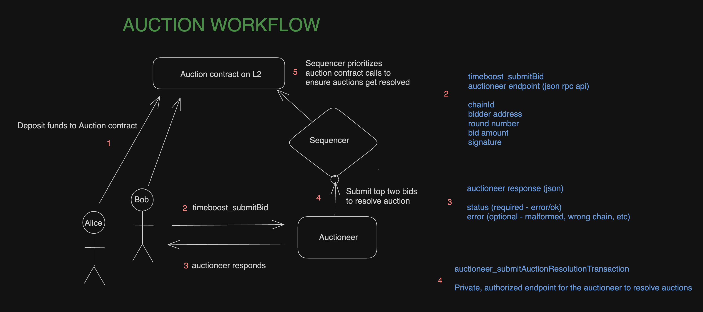

import ImageWithCaption from '@site/src/components/ImageCaptions/';

# A gentle Introduction: Timeboost

This introduction will walk you through Arbitrum Timeboost: a novel transaction ordering policy for Arbitrum chains that allows chain owners to capture MEV on their chain and reduce spam, all while preserving fast block times and protecting users from harmful types of MEV. 

Timeboost is the culmination of over a year of research and development by the team at Offchain Labs and will soon be available for any Arbitrum chain, including Arbitrum One and Arbitrum Nova (pending governance vote). Like all features and upgrades to the Arbitrum technology stack, Timeboost will be rolled out on Arbitrum Sepolia first for testing & chain owners have the option of adopting Timeboost at any time or customizing Timeboost in any way they choose.

## In a nutshell

### Why? 
Today, Arbitrum chains incoming transactions are ordered on a First-Come, First-Serve (FCFS) basis. The current FCFS ordering policy has many benefits, including offering users a great UX and protection from harmful MEV, but nearly all MEV on the chain is extracted by arbitrageurs who invest wastefully in hardware and spamming to win latency races (which negatively strains the network and leads to congestion. 
Timeboost is a new transaction ordering policy that preserves many of the great benefits of FCFS while unlocking a path for chain owners to capture some of the available MEV on their network & introducing an auction to latency racing, and ultimately, spam.

### What/How?
Timeboost is a new transaction ordering policy that introduces a few new parts to an Arbitrum chain’s infrastructure: a sealed-bid second-price auction and a new “Express Lane” at an Arbitrum chain’s sequencer. Valid transactions submitted to the Express Lane will be sequenced and included immediately with no delay, while all other transactions submitted to the chain’s sequencer will experience a nominal delay (default: 200ms). The winner of the auction is granted the sole right to control the Express Lane for a temporary amount of time.

### Who?
Timeboost is a optional feature for Arbitrum chains that serve two types of groups of entities: (1) chain owners and their ecosystems and (2) sophisticated on-chain actors and searchers. Chain owners can use Timeboost to capture additional revenue from the MEV their chain generates already and sophisticated on-chain actors and searchers will spend their resources on buying rights for the Express Lane (instead of spending those resources on winning latency races, which otherwise leads to spam and congestion on the network).

### When?
Timeboost will work with both centralized and decentralized sequencer setups. The specification for a centralized sequencer is public ([here](https://github.com/OffchainLabs/timeboost-design)) and engineering implementation is well underway. The [current proposal before the Arbitrum DAO](https://forum.arbitrum.foundation/t/constitutional-aip-proposal-to-adopt-timeboost-a-new-transaction-ordering-policy/25167/1) allows us to deliver Timeboost to market sooner, rather than waiting until the design with a decentralized sequencer set up and its implementation are complete.

## Why do Arbitrum chains need Timeboost?

Today, Arbitrum chains order incoming transactions on a First-Come, First-Serve (FCFS) basis. This ordering policy was chosen as the default for Arbitrum chains because it is simple to understand and implement, enables fast block times (starting at 250ms and down to 100ms if so desired), and prevents users from harmful types of MEV like front-running & sandwich attacks. 

However, there are a few downsides to a FCFS ordering policy. Under FCFS, arbitrageurs  are incentivized to win latency races by investing wastefully in hardware. Making a profit from arbitrage and liquidation opportunities involves a lot of spam, placing stress on chain infrastructure and contributing to congestion. Additionally, all of the captured MEV on an Arbitrum chain today under FCFS goes to arbitrageurs and searchers - returning none of the available MEV to the chain owner or the applications on the chain. 

Timeboost retains most FCFS benefits while addressing FCFS limitations. Specifically, Timeboost:

### Preserves the great UX that Arbitrum chains are known for
The default block time for Arbitrum chains will continue to be industry leading at 250ms, even after Timeboost. What will change with Timeboost instead is that some transactions not in the Express Lane will be delayed to the next block.
### Continues to protect users from harmful types of MEV
Timeboost only grants the auction winner a _temporary time-advantage_ - not the power to view or re-order incoming transactions or be the first in every block. Furthermore, the mempool for transactions will continue to be private, which means users, with Timeboost enabled, will continue to be protected from harmful MEV like front-running and sandwich attacks.
### Unlocks a new value accrual path for their chain
Chain owners may use Timeboost to capture a portion of the available MEV on their chain that would have otherwise went entirely to searchers. There are many flavors of this too - including the use of custom gas tokens and/or redistribution of these proceeds back to the applications and users on the chain.
### Reduces spam on the network
by introducing the ability to “purchase a time-advantage” through the Timeboost auction, it is expected that rational, profit-seeking actors will spend on auctions _instead of_ investing on hardware or infrastructure to win latency races. This diversion of resources by these actors is expected to reduce FCFS MEV-driven spam on the network.

One more thing to note here is that Timeboost will work with both centralized sequencer setups and _decentralized sequencer setups_, with the latter being a joint collaboration effort with _Espresso Systems_. 

## What is Timeboost and how does it work?

Timeboost is a _transaction ordering policy_. It's a set of rules that the sequencer of an Arbitrum chain is trusted to follow when ordering transactions that are submitted by users. In the near future, multiple sequencers will be able to enforce those rules with decentralized Timeboost.
 For Arbitrum chains, the sequencer’s sole job is to take arriving, valid transactions from users, place them into an order dictated by the transaction ordering policy, and then publish the final sequence to a real-time feed and in compressed batches to the chain’s data availability layer. The current transaction ordering policy is **F**irst **C**ome **F**irst **S**erve (FCFS) and Timeboost is a modified FCFS ordering policy.

Timeboost is implemented using three separate components that work together: 
### A special “Express Lane”
It allows valid transactions to be sequenced as soon as the sequencer receives them for a given round 
### An off-chain auction
For determining the controller of the express lane for a given round
### An auction contract
Deployed on the target chain to serve as the canonical source of truth for the auction results and handling of auction proceeds 

To start, the default duration of a round is 60 seconds. Transactions not in the Express Lane will be subject to a default 200 milisecond “speed bump” for their transaction to be sequenced, which means that non-express lane transactions may get delayed to the next block. It’s important to call out that the default Arbitrum block time will remain at 250 miliseconds (or lower for Orbit chains if desired). Let’s dive in to how each of these components work.

**The Express Lane**

The Express Lane is implemented using a special end point on the sequencer, formally titled `timeboost_sendExpressLaneTransaction`. This endpoint is special because transactions submitted to it will be sequenced immediately by the sequencer, hence the name, Express Lane. The sequencer will only accept valid transaction payloads to this endpoint if they are correctly signed by the current round’s Express Lane controller. Other transactions can still be submitted to the sequencer as normal, but these will be considered as non-Express Lane transactions and will therefore have their arrival timestamp delayed by 200 miliseconds. It is important to call out that transactions from both the Express Lane and the non-Express Lane are eventually sequenced together into a single, ordered stream of transactions for node operators to produce an assertion and for eventual posting of the data to a data availability layer. The Express Lane controller does not have the right to re-order transactions, have a guarantee that their transactions will always be first at the “top-of-the-block”, or guarantee a profit at all. The value of the Express Lane will essentially be 

**The Timeboost Auction**

Control of the Express Lane in each round (default: 60 seconds) is determined by a per-round auction, which is a sealed-bid, second-price auction. This auction is held to determine the Express Lane controller for a *future* round. In other words, the Express Lane controller at any point in time was determined in the past during one of these auction rounds. Bids for the auction can be made with any ERC20 token, in any amount, and be collected by any address - at the full discretion of the chain owner

The auction for a round has a closing time that is `auctionClosingSeconds` (default: 15) seconds before the beginning of the round. This means that, in the default parameters, parties have 45 seconds to submit bids before the auction will no longer accept bids. In the 15 seconds between when bids are no longer accepted and when the new round begins, the autonomous auctioneer will verify all bids, determine the winner, and make a call to the on-chain auction contract to formally resolve the auction. 

**Auction Contract**

Before bidding in the auction, a party must deposit funds into the Auction Contract. Deposits can be made, or funds added to an existing deposit, at any time. There is no minimum deposit amount but there is a starting minimum bid of 0.001 ETH (default amount and token). These deposits are fully withdrawable, with some nominal delay to not impact the outcome of an existing round.

Once an auction winner is determined by the autonomous auctioneer, the auction contract will deduct the second-highest bid amount from the account of the highest bidder, and transfer those funds to a `beneficiary` account designated by the chain owner, by default. The `expressLaneControllerAddress` specified in the highest bid will become the Express Lane controller for the round.

The auction contract also has functions that enable the Express Lane controller to update the address they wish to use for the Express Lane, which enables unique Express Lane control re-selling use cases.

**Default parameters**

Below are are a few of the default Timeboost parameters that were mentioned earlier. All of these parameters, and more, are configurable by the chain owner. 

- `roundDurationSeconds` - 60 seconds, the duration of time that the sequencer will honor the Express Lane privileges for transactions signed by the current round’s Express Lane controller
- `auctionClosingSeconds` - 15 seconds, the time before the next round that bids will no longer be accepted within
- `beneficiary` - chain owner address, the address to which auction proceeds will be paid to
- `_biddingToken` - WETH, but can be any ERC20 token (assumes the token address chosen does not have fee-on-transfer, rebasing, transfer hooks, or otherwise non-standard ERC20 logic)
- `nonExpressDelayMsec` - 200 miliseconds, the artificial delay or “speed bump” applied to the arrival timestamp of non-Express Lane transactions *before* they get sequenced.
- `_minReservePrice` - 0.001 WETH

## Who is Timeboost for and how do I use it?

Timeboost is an optional addition to an Arbitrum chain’s infrastructure - meaning that enabling Timeboost is at the discretion of the chain owner and that an Arbitrum chain can fully function normally without Timeboost too.

When enabled, Timeboost is meant to serve different groups of parties, with varying degrees of impact and benefits. Let’s go through them below:

### For regular users
Timeboost will have a minimal impact. Non-Express Lane transactions will be delayed by a nominal 200ms, which means to the average user, their transactions will take up to 450ms to be sequenced (up from 200ms). Regular users will continue to be protected from harmful MEV activity, such as sandwich attacks and front-running.
### For chain owners
Timeboost represents a unique way to accrue value to their token and/or generate revenue for the chain. Explicitly, chain owners can set up their Timeboost auction to collect bid proceeds in the same token used for gas on their network and then choose what to do with these proceeds afterwards.
### For searchers/arbitrageurs
Timeboost adds a unique twist to your existing or prospective MEV strategies that may end up becoming more profitable than before. For instance, purchasing the time advantage offered by Timeboost’s auction may end up costing *less* than the costs to invest in hardware and win latency races. Another example is the potential new business model of reselling Express Lane rights to other parties, either in time slots or as granular asa per-transaction basis.

### Timeboost for Orbit chains

As with many of the new features and upgrades to Arbitrum Nitro, Timeboost is an optional feature that chain owners may choose to deploy and customize in any way they see fit. Deploying and enabling/disabling Timeboost on a live Arbitrum chain will not halt or impact the chain but will instead influence the transaction ordering policy of the chain. An Orbit chain will, by default, fall back to FCFS if Timeboost is deployed but disabled or if there is no Express Lane controller for a given round.

It is recommended that Orbit teams holistically assess the applicability and use cases of Timeboost for their chain before deploying and enabling Timeboost. This is because some Orbit chains may not have that much MEV (e.g. arbitrage) to begin with. Furthermore, we recommend Orbit chains to start with the default parameters recommended by Offchain Labs and closely monitor the results and impacts on your chain’s ecosystem over time before considering adjusting any of the parameters.

### When mainnet?

Timeboost’s auction contract has completed a third-party audit and is rapidly approaching production readiness. Specifically for Arbitrum One and Arbitrum Nova, a temperature check vote on Snapshot has already passed and the AIP will move towards an on-chain Tally vote next hopefully before the end of Q4 2024.

In the meantime, please read the following resources to learn more about Timeboost:

- [Arbitrum DAO Forum Post on Timeboost](https://forum.arbitrum.foundation/t/constitutional-aip-proposal-to-adopt-timeboost-a-new-transaction-ordering-policy/25167/86)
- [Timeboost FAQ](https://www.notion.so/bba234acf92e476b8ca5db6855d7da45?pvs=21)
- [Debunking common misconceptions about Timeboost](https://medium.com/offchainlabs/debunking-common-misconceptions-about-timeboost-92d937568494)
- [Technical specification for Timeboost with a centralized sequencer](https://github.com/OffchainLabs/timeboost-design/blob/main/research_spec.md)
- [Engineering design of Timeboost with a centralized sequencer](https://github.com/OffchainLabs/timeboost-design/blob/main/implementation_design.md)
- [Implementation of Timeboost with a centralized sequencer](https://github.com/OffchainLabs/nitro/pull/2561)
- [Technical specification for Timeboost with a decentralized sequencer](https://github.com/OffchainLabs/decentralized-timeboost-spec)
