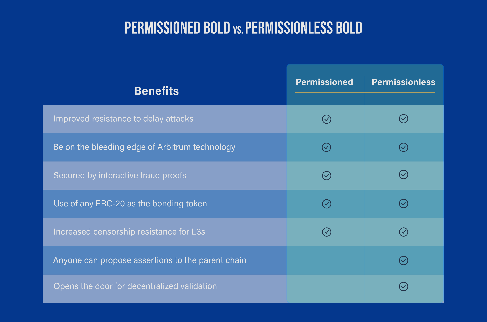

:::info PUBLIC PREVIEW DOCUMENT

This document is currently in **public preview** and may change significantly as feedback is captured from readers like you. Click the _Request an update_ button at the top of this document or [join the Arbitrum Discord](https://discord.gg/arbitrum) to share your feedback.

:::

## Launch details and key dates

- **Status:** Alpha - continued testing and evaluation of performance of BoLD with Stylus
- **Arbitrum Sepolia** Dec 11, 2024
- <a data-quicklook-from="arbitrum-one">**Arbitrum One**</a> 09:00 ET (GMT-5) on Feb 12, 2025{' '}
- <a data-quicklook-from="arbitrum-nova">**Arbitrum Nova**</a> 09:00 ET (GMT-5) on Feb 12, 2025{' '}

### tldr;

<a data-quicklook-from="bold">Arbitrum BoLD</a> is an upgrade to the dispute protocol on Arbitrum chains
that delivers both permissionless validation and core security benefits. As with all features on the
Arbitrum stack, Orbit chains can adopt BoLD at their own discretion and on their own timeline. To upgrade
to BoLD, it is required to upgrade both the Nitro node software and the rollup's smart contracts on its
parent chain.{' '}

### Recommended Adoption Path

BoLD brings new security benefits to Orbit chains, regardless of whether their validators are permissioned or permissionless. These new security benefits include improved resistance to delay attacks and increased censorship resistance for `L3s`. We strongly recommend Orbit chains adopt Arbitrum BoLD to register these security benefits while **keeping validation permissioned**. We currently recommend Orbit chain owners to adopt Arbitrum BoLD ~30 days after BoLD has been activated on Arbitrum One and Arbitrum Nova (timestamps [here](https://docs.arbitrum.foundation/network-upgrades#network-activation-statuses)) to minimize any stability risks/bugs.

:::warning

It is strongly recommended that existing and prospective Orbit chains upgrade to use Arbitrum BoLD but **keep validation permissioned** because of the increased risks associated with allowing any entity to advance and challenge the state of your chain. The risks are summarized below. Rigorous testing and research has been poured into the parameters chosen for Arbitrum One and so we cannot formally support or endorse use of permissionless Arbitrum BoLD in other configurations. Please note that when a chain upgrades to use Arbitrum BoLD, any withdrawals (to the parent chain) will be delayed by an additional challenge period. The default challenge period is 6.4 days. We recommend informing the Offchain Labs teams of your timelines and intent to upgrade so adequate warning can be provided to your chain's users on the [Arbitrum Bridge](https://bridge.arbitrum.io/).

:::

Below is a quick breakdown of the benefits of permissioned BoLD vs. permissionless BoLD for your Orbit chain:

### Benefits of adopting Arbitrum BoLD

Arbitrum BoLD enables an <a data-quicklook-from="arbitrum-chain">Arbitrum chain</a> to be permissionlessly validated thanks to several key improvements to the existing dispute protocol. These key improvements benefit an <a data-quicklook-from="arbitrum-orbit">Arbitrum Orbit</a> chain even if validation is kept permissioned on a BoLD-enabled Orbit chain.

Below are some benefits for an Orbit chain that come with adopting Arbitrum BoLD - **regardless of whether validation is kept permissioned or not**:

#### Improved resistance to delay attacks

Disputes on a BoLD-enabled chain are resolved in a round-robin style format where disputes can be concurrently resolved. This is an evolution from the current dispute protocol, where challenges are resolved one-by-one. This evolution means that an upper time bound can be placed on all disputes such that a malicious actor cannot delay the chain indefinitely like they can today. Even when validation is kept permissioned, this upper time bound is critical to mitigating the risk of [delay attacks](https://medium.com/offchainlabs/solutions-to-delay-attacks-on-rollups-434f9d05a07a) by parties on the validator allowlist for an Orbit chain.

#### Being on the latest version of Arbitrum technology

Adopting Arbitrum BoLD for your Orbit chain will require upgrading the Nitro node software and deploying a new set of contracts on your parent chain. While not specifically related to Arbitrum BoLD, it is always strongly recommended that Orbit chain owners upgrade and keep their chain on the latest stable releases of both Nitro node software and the relevant on-chain contracts. This is critical to ensure your Orbit chain benefits from the latest security improvements and features that the Offchain Labs team is constantly churning out.

#### Secured by interactive fraud-proofs

Arbitrum BoLD is not an upgrade to a different type of proving architecture and will continue to be secured with an interactive proving game between validators using fraud proofs. The same single-honest party assumption applies but now with strict improvements to security to the point where chains, like Arbitrum One, can be permissionlessly validated and have their state assertions be permissionlesly challenged.

#### Use of your project's native token as the bonding asset to secure the chain

Arbitrum BoLD enables the chain owner to use any `ERC-20` token on the parent chain as the bond for validators to participate in securing the network. By default, this token will be `WETH` for <a data-quicklook-from="arbitrum-one">Arbitrum One</a> and we do not recommend teams to use alternative tokens as the bonding asset. For more information on the rationale, we recommend teams consult our documentation to understand [why `WETH` was selected for Arbitrum One](https://docs.arbitrum.io/how-arbitrum-works/bold/gentle-introduction#q-why-is-arb-not-the-bonding-token-used-in-bold-on-arbitrum-one) (and not `ARB`).

#### Increased censorship resistance for `L3` Orbit chains

Today, the force inclusion window is a fixed 24 hours. This force inclusion window exists to enable both users and validators to force-include their transactions and assertions on the parent chain, with a 24-hour delay, if the sequencer is offline or censoring transactions. Arbitrum BoLD's release will come with the _Censorship Timeout_ feature that will automatically reduce the force inclusion time window if the parent chain or sequencer is maliciously censoring user transactions/assertions or the sequencer goes offline. This massively benefits Orbit `L3` chains (that settle to a BoLD-enabled parent chain) as it ensures the chain can advance with minimal UX degradation during periods of censorship. You can read more about how this feature works in the [gentle introduction to BoLD](https://docs.arbitrum.io/how-arbitrum-works/bold/gentle-introduction#q-how-do-bold-based-l3s-challenge-periods-operate-considering-the-worst-case-scenario).

### Caveats that come with adopting Arbitrum BoLD for permissionless validation

Arbitrum BoLD's implementation and specification have been thoroughly tested and audited. The upgrade to Arbitrum BoLD is not the subject of this section, but rather the caveats and nuances that come with whether to enable permissionless validation.

:::warning

It is strongly recommended that existing and prospective Orbit chains upgrade to use Arbitrum BoLD but **keep validation permissioned** because of the increased risks associated with allowing any entity to advance and challenge the state of your chain. The risks are summarized below. Rigorous testing and research has been poured into the parameters chosen for Arbitrum One and so we cannot formally support or endorse use of permissionless Arbitrum BoLD in other configurations.

:::

Enabling permissionless validation means that any entity can spin up a validator and open challenges to dispute invalid claims made by other validators on the network. This opens up an Orbit chain to the risk of spam and attacks by unknown and malicious entities. To mitigate this risk for Arbitrum One, a considerable amount of research and testing has been done to optimize the trade-offs between deterring attacks and managing the costs of defending Arbitrum for honest parties. This research includes carefully calculating all relevant bond sizes, challenge period durations, and relevant plans for operating the infrastructure. More information on this research can be found in the [BoLD whitepaper](https://arxiv.org/abs/2404.10491). Below are a few examples of various risks that an Orbit chain will hold should they pursue permissionless BoLD:

#### Risk of resource exhaustion attacks

Where malicious entities can acquire and utilize more resources than honest parties can put together during a challenge. Such an attack can take many forms and includes both on-chain and off-chain computational/infra costs. For example, a well-coordinated attack on an Orbit chain could overwhelm honest parties if the malicious actors can spend more gas and computational power and acquire more of the bonding asset than the defenders can. This risk can be mitigated by a combination of high bond sizes, use of a price-independent bonding asset, use of a bonding asset with high liquidity, strong economic guarantees that attackers will lose most of their resources, sufficiently long challenge periods, and robust infrastructure operations and resources that can respond and scale up when necessary. More information on resource exhaustion attacks and how Arbitrum BoLD's design accounts for this risk can be found in [Section 6.1.4 of the BoLD whitepaper](https://arxiv.org/abs/2404.10491). We recommend teams consider a resource exhaustion ratio greater than 5 assuming very high L1 gas costs (like 100gwei/gas).

#### Increased infrastructure costs and overhead

Related to, and expanding on, the above point about resource exhaustion attacks, the honest parties operating active validators and proposers for a BoLD-enabled chain will need to be ready to vertically scale their infrastructure, and cover the off-chain costs of doing so, in the event of an attack. This is because a malicious actor may choose to spam and overwhelm the honest defenders with multiple challenges. Making moves, honest or malicious, costs resources to perform bisections on history committments down to a single step of execution. If this happens, each malicious challenge must be met with an honest counter-challenge during the interactive fraud proof game. Orbit chains who decide to adopt Arbitrum BoLD in permissionless mode are strongly encouraged to work with their Rollup-as-a-Service (RaaS) team to: deploy robust monitoring for challenges, set aside a budget to vertically scale up infrastructure and fund counter-challenges, and have an incident response plan drafted and rehearsed to ensure prompt and decisive reactionary steps in the event of an attack.

#### Risks to liveness or delays of the chain

If the bond sizes are set too low, an adversary can cheaply create a challenge and delay confirmation of an assertion for up to an entire extra challenge period if they can censor honest BoLD moves. Remember that challenges, while time-bound, still take time to complete. Delaying the confirmation of assertions for a chain could negatively impact the chain in many ways that an attacker could benefit from (e.g., profiting from price volatility and price impacts on the Orbit chain's token may make delaying the chain worthwhile for an attacker). We recommend teams set bond sizes to be much greater than the opportunity cost of a week of delay, based on your chain's TVL (e.g. if your chain's TVL is $1B, then the opportunity cost of $1B should be used as a _floor_ for the block level bond amount size). We further recommend that the bonding token used is highly liquid on the parent chain and relatively non-volatile.

### Conclusion for Orbit chains considering BoLD Permissionless Validation

Due to the uniquely different tokenomics, sizes, and varying types of <a data-quicklook-from= "arbitrum-orbit">Arbitrum Orbit</a> chains deployed (or in active development) today, <a data-quicklook-from= "offchain-labs">Offchain Labs</a> does not provide a "one-size-fits-all" recommendation for how best to safely set up and enable permissionless validation for Orbit chains. Instead, we recommend teams adopt Arbitrum BoLD but keep validation permissioned.

Should Orbit teams strongly desire to adopt Arbitrum BoLD in permissionless mode, we do not endorse using configurations that differ from those on [Arbitrum One](https://github.com/OffchainLabs/nitro-contracts/blob/bold-merge/scripts/files/configs/arb1.ts). We especially do not recommend teams use custom ERC20 tokens as the bonding asset and/or with low bond minimums. If your team would like to have permissionless validation for your Orbit chain, please reach out to us [via this form](https://docs.google.com/forms/d/e/1FAIpQLSe5YWxFbJ8DgWcDNbIW2YYuTRmegtx2FHObym00_sOt0kq4wA/viewform) so that we can schedule some time to understand your needs better.

### How to adopt Arbitrum BoLD

As mentioned earlier, the upgrade to the dispute protocol involves both a Nitro node software upgrade and the deployment/upgrade of new smart contracts on your Orbit's parent chain.

More details on deploying Arbitrum BoLD for your Orbit chain will be added here when they are available.
