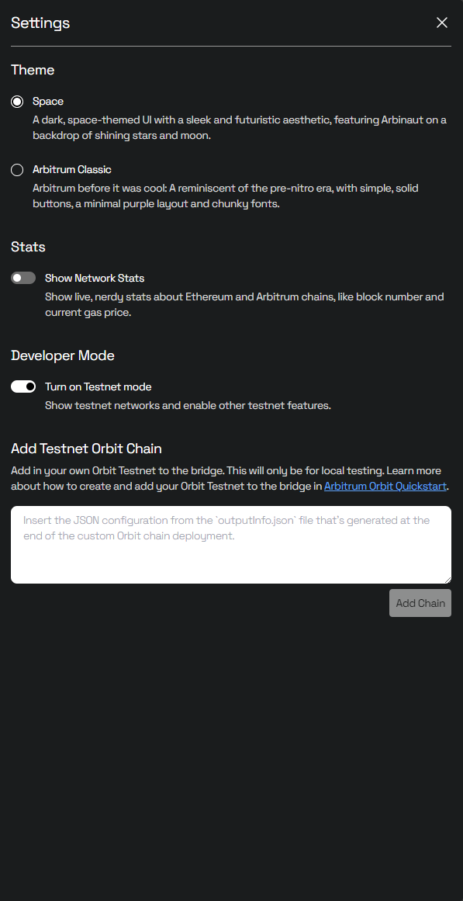

import PublicPreviewBannerPartial from '../partials/_orbit-public-preview-banner-partial.md';

<PublicPreviewBannerPartial />

This how-to will walk you through the process of adding your testnet Orbit chain to [Arbitrum's bridge](https://bridge.arbitrum.io/).

## Prerequisites

- A local Orbit testnet chain. See the [Orbit quickstart](/launch-orbit-chain/orbit-quickstart).
- A browser-based Ethereum wallet (like [MetaMask](https://chrome.google.com/webstore/detail/metamask/nkbihfbeogaeaoehlefnkodbefgpgknn))

## Procedure

1. Navigate to https://bridge.arbitrum.io/.
2. Connect to Arbitrum Sepolia using your wallet. The bridge UI will automatically switch to the correct testnet view.
   - If you're connected to mainnet, and don't want to switch networks manually in your wallet, then you can enable testnet mode in the bridge by clicking on your address in the top right corner -> Settings -> Turn on testnet mode.
3. Go to Settings (on the bridge UI) and scroll down to "Add Testnet Orbit Chain":
   
4. Copy and paste the JSON configuration from your generated `outputInfo.json` file.
5. Click "Add Chain".

Congratulations! Your chain should now appear in both the network dropdown in the top navigation pane, and as an option in the bridging UI directly.
