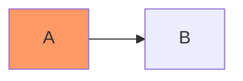
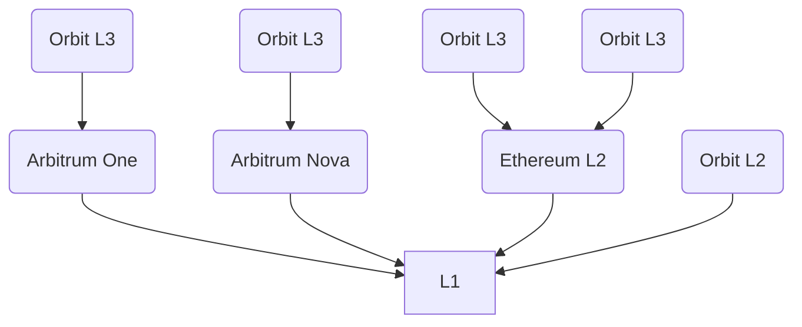
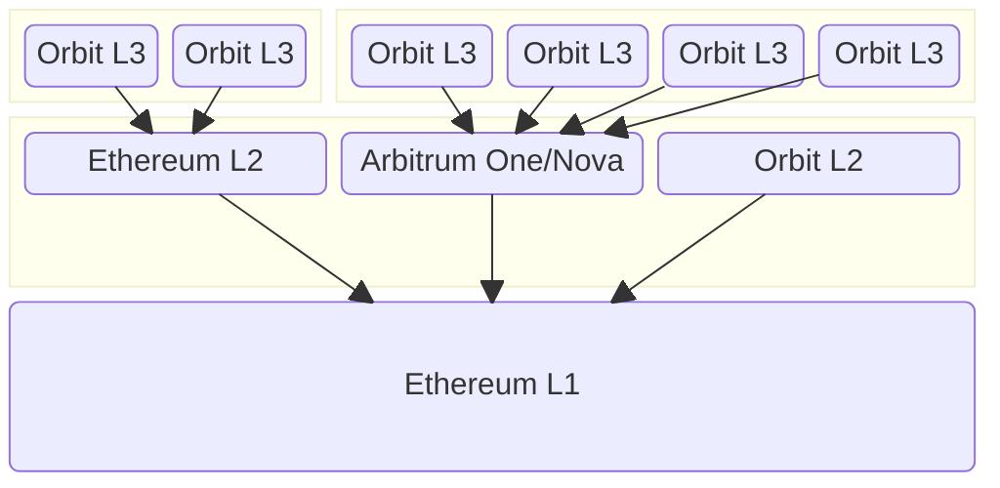
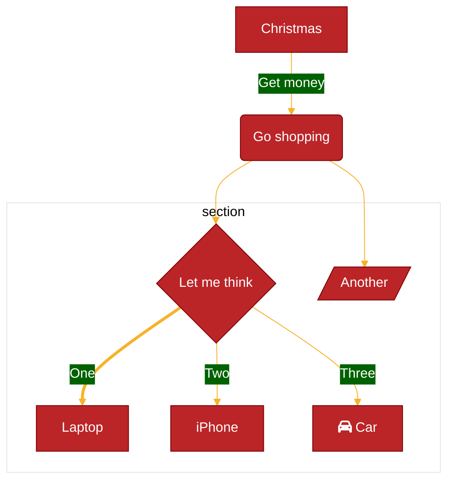

This is a WIP page to test Mermaid in OCL docs. It will be updated with more examples and information for use by contributors.

import { ClickableDiagram } from '@site/src/components/ClickableDiagram';

My Clickable SVG Diagram

Here is my clickable diagram:

<ClickableDiagram />

## Example 1

## Example 2

import Mermaid from '@theme/Mermaid';

<Mermaid
  value={`graph TD;
    A-->B;
    A-->C;
    B-->D;
    C-->D;`}
/>
