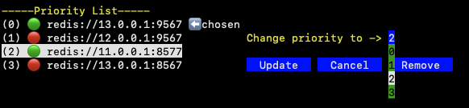
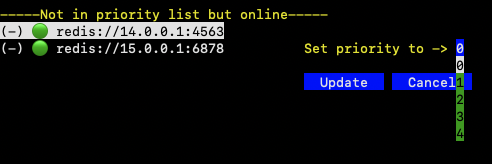

The Sequencer Coordinator Manager (SQM) is a command-line tool that allows you to manage the priority list of sequencers, update their positions, add new sequencers to the list, and refresh the lists from the Redis server.
The tool offers keyboard-only support. Any changes you make are stored locally until you choose to save and push them to the Redis server.

- Clone and enter nitro repository:
  ```shell
  git clone --branch @nitroVersionTag@ https://github.com/OffchainLabs/nitro.git
  cd nitro
  ```

- Before starting the Sequencer Coordinator Manager, please read and follow the commands in [Build Nitro's binaries natively (step1-step8)](../nitro/01-build-nitro-locally.mdx#build-nitros-binaries-natively) to install the necessary dependencies.

- Here is an example of how to start the Sequencer Coordinator Manager and connect to a local Redis server:
  ```shell
  // In nitro directory
  make target/bin/seq-coordinator-manager
  ./target/bin/seq-coordinator-manager redis://127.0.0.1:6379
  ```

If mouse support is enabled, you can use your mouse to explore the tool. Otherwise, use your keyboard to explore the UI. The `enter` key selects options; `c` switches focus between lists.
When you bring up any form, you can navigate within the form's options using the `Tab` key and use the up/down arrow keys to select options from the dropdown menu.


:::note
One of the sequencers is marked with a `chosen` indicator. This visual cue helps you identify the current chosen sequencer.
:::

You can click/enter on any sequencer element in the priority list to bring up a form for updating its position. Within this form, you have the options to make changes via a dropdown menu and then either click `Update` to see the change locally, `Cancel` to cancel the operation, or `Remove` to remove the sequencer from the priority list.

When a sequencer is removed, it is automatically added to the `--Not in priority list but online--` list if it is online. Please remember that all changes made using this method are local and need to be saved to the Redis server by pressing `s` from the keyboard shortcuts to make them permanent.



After selecting a sequencer from the non-priority list, you are given the option to add the selected sequencer to the priority list at any position of your choice. You can specify the position via a dropdown menu that lists all possible positions. Clicking `Update` will then display the updated priority list with the newly added sequencer in the chosen position.



You can also add a new sequencer to the priority list by pressing `a` from the keyboard shortcuts. This action will bring up a form to enter the sequencer details. After adding the sequencer URL, you can click `Add` to see the changes or `Cancel` to abort the operation.


To exit the tool, press `q` from the keyboard shortcuts.
