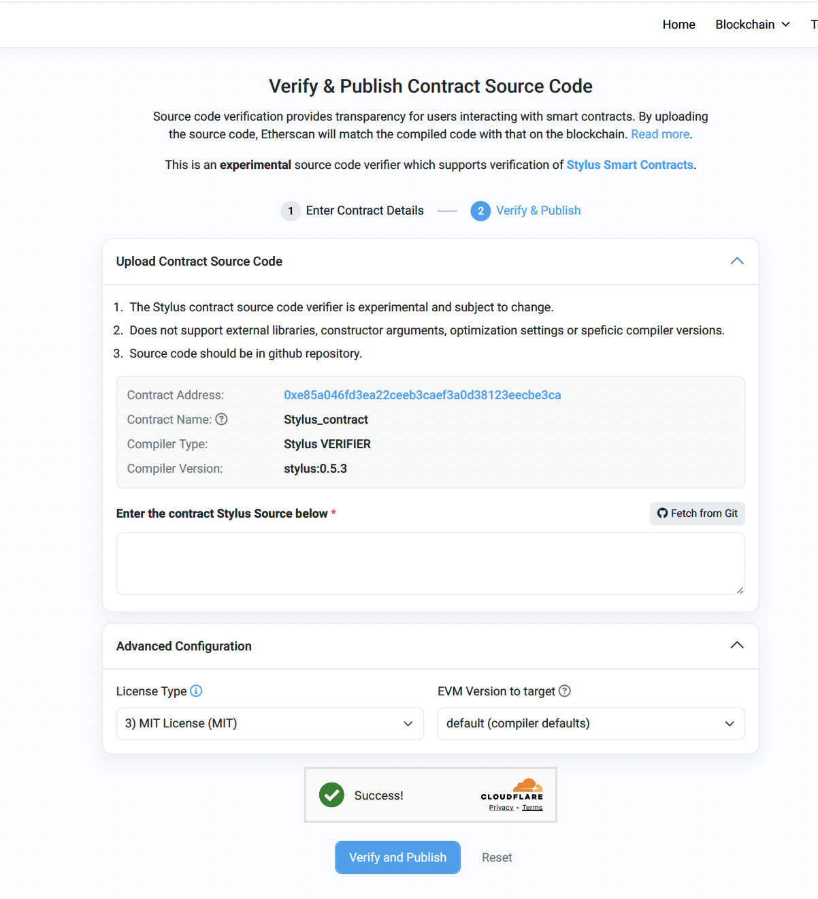

This how-to will show you how to verify deployed contracts using Arbiscan, Arbitrum's block explorer.

Here's an example of a verified contract: the [English Auction Stylus contract](https://github.com/OffchainLabs/stylus-english-auction), which has been verified on Arbitrum Sepolia. You can view the verified contract [here](https://sepolia.arbiscan.io/address/0xe85a046fd3ea22ceeb3caef3a0d38123eecbe3ca).

You can also see a list of all Stylus contracts verified on Arbiscan by visiting:

- [Verified Stylus Contracts on Arbitrum One](https://arbiscan.io/contractsVerified?filter=stylus).
- [Verified Stylus Contracts on Arbitrum Sepolia](https://sepolia.arbiscan.io/contractsVerified?filter=stylus).

Here are the steps to take to verify a contract on Arbiscan:

## Step 1: Navigate to the verification page

You have two options to access the contract verification page on Arbiscan:

1. **Direct link:** Visit [Arbiscan Verify Contract](https://arbiscan.io/verifyContract) to go directly to the verification form. This option is ideal if you already have the contract address and details ready.
2. **From the contract page:** If you're viewing the contract's page on Arbiscan:
   - Go to the **Contract** tab.
   - Click on **Verify and Publish**.

Both methods will take you to the contract verification form, where you can proceed to the next step.

## Step 2: Enter the contract's details

You will need to fill in the following fields on the contract verification page:

- **Contract address**: Enter the contract address you want to verify.
- **Compiler type**: Select **Stylus** for Stylus contracts.
- **Compiler version**: Choose the `cargo stylus` version that was used to deploy the contract.
- **Open source license type**: Select the appropriate license for your contract.

## Step 3: Submit source code

After entering the contract details, you’ll need to provide the contract's source code:

- **Manual submission**: Copy and paste the source code into the provided text box.
- **Fetch from GitHub (Recommended)**: It's recommended to use the **Fetch from Git** option, as it's easier and helps automate the process. However, note that contracts located in subdirectories of the repository cannot be verified. Ensure that the contract's code is placed directly in the repository's root for verification to succeed.

## Step 4: Set EVM version

The **EVM Version to Target** can be left as default unless specific requirements dictate otherwise.

## Step 5: Verify and publish

Click **Verify and Publish**. The verification process will take a few seconds. Refresh the contract page, and if successful, the contract will be marked as verified.

## Behavior when deploying a verified contract

When deploying another instance of a previously verified contract, if the bytecode matches, Arbiscan will automatically link the new instance to the verified source code, displaying a message like:

> "This contract matches the deployed Bytecode of the Source Code for Contract [verified contract address]."

However, the new contract will still appear as "Not Verified" until you explicitly verify it.
