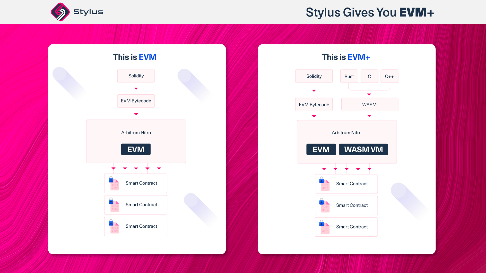

# A gentle introduction to Stylus

import PublicPreviewBannerPartial from './partials/_stylus-public-preview-banner-partial.md';

<PublicPreviewBannerPartial />

This introduction is for developers who are interested in learning about Stylus, a new way to write smart contracts in popular programming languages, like Rust, alongside the EVM.

### In a nutshell:

- Stylus lets you write smart contracts in programming languages that compile down to WASM, such as **Rust, C, C++, and many others**.
- Rich language support already exists for Rust: developers can use the Stylus SDK and CLI tool to **start building today.**
- Arbitrum's full **EVM equivalence would be maintained** while adding a second, coequal WASM virtual machine.
- Due to the superior efficiency of WASM programs, Stylus contracts are over **an order of magnitude faster with significantly lower gas fees**.
- **Memory is 100-500x cheaper** in Stylus, enabling new use cases now that consuming RAM is viable on the blockchain.

### What's Stylus?

Stylus is an upgrade to Arbitrum Nitro, the tech stack powering Arbitrum One, Arbitrum Nova, and Arbitrum Orbit chains. This upgrade adds a second, coequal virtual machine to the EVM, where EVM contracts continue to behave exactly as they would in Ethereum. We call this paradigm \*EVM**+\*** since **everything is entirely additive.**

This second virtual machine executes WebAssembly (WASM) rather than EVM bytecode. WASM is a modern binary format popularized by its use in major web standards, browsers, and companies to speed up computation. Built to be fast, portable, and human-readable, WASM also has sandboxed execution environments for security and simplicity. Working with WASM is nothing new for Arbitrum chains. Ever since the [Nitro upgrade](https://medium.com/offchainlabs/arbitrum-nitro-one-small-step-for-l2-one-giant-leap-for-ethereum-bc9108047450), WASM has been a fundamental component of Arbitrum's fully functioning fraud proofs.

With a WASM VM, any programming language that can compile down to WASM are within the bounds of Stylus. While many popular programming languages can be compiled into WASM, some compilers are more suitable for smart contract development than others, like with Rust, C, and C++. Other languages, such as Go, Sway, Move, and Cairo, can be supported as well. Languages that include their own runtimes, like Python and Javascript, are harder for Stylus to support, although not impossible. Third-party contribution in the form of libraries for new and existing languages is welcomed!

Compared to using Solidity, WASM programs are much more efficient. There are many reasons for this, including the decades of compiler development for Rust and C. WASM also has a faster runtime than the EVM, resulting in faster execution. Generally, a **10x improvement** has been seen for contracts using WASM languages compared to contracts using Solidity.

### How is this possible?

Stylus is only possible because of Arbitrum Nitro's unique fraud-proving technology. When there is a dispute on an Arbitrum network, Nitro replays the execution of the chain **in WASM.** Honest Arbitrum validators will then bisect what is being disputed until a single invalid step is identified and checked on-chain via a [“one-step proof.”](https://docs.arbitrum.io/proving/challenge-manager#general-bisection-protocol)

This means Nitro is able to deterministically prove **arbitrary WASM**.

If WASM can be proven in general, then the correctness of **any program** that compiles down to WASM can be proven. This is the key technological leap that makes Stylus possible.

For a detailed overview of Nitro's technical architecture, see the [documentation](https://developer.arbitrum.io/inside-arbitrum-nitro/) or the [Nitro whitepaper](https://github.com/OffchainLabs/nitro/blob/master/docs/Nitro-whitepaper.pdf).

### Why does this matter?

Stylus innovates on many levels, with the key ones described here:

#### One chain, many languages

There are estimated to be roughly 20k Solidity developers, compared to 3 million Rust developers or 12 million C developers [[1](https://www.slashdata.co/blog/state-of-the-developer-nation-23rd-edition-the-fall-of-web-frameworks-coding-languages-blockchain-and-more)]. Developers no longer have to choose a blockchain that supports their preferred programming language; it all happens on one. Scaling to the next billion users requires onboarding the next million developers.

#### EVM+

Stylus brings the best of both worlds. Developers still get all of the benefits of the EVM, including the ecosystem and liquidity, while getting efficiency improvements and access to existing libraries in Rust, C, and C++. All without changing anything about how the EVM works. EVM equivalence is no longer the ceiling, it's the floor.

#### Arbitrary cryptography is now inexpensive

Use cases not practical in the EVM are now possible in Stylus. Computation is over 10x improved. Memory is over 100x improved. Cryptography libraries can now be deployed as custom precompiles, permissionlessly. The greatest breeding ground for blockchain innovation has arrived.

#### Opt-in reentrancy

Stylus doesn't just improve on cost and speed. WASM programs are also safer. Reentrancy is a common vulnerability that developers can only attempt to mitigate in Solidity. Stylus provides cheap reentrancy detection, and using the Rust SDK, reentrancy is disabled by default, unless intentionally overridden.

#### Fully composable

Solidity programs and WASM programs are completely interoperable. If working in Solidity, a developer can call a Rust program or rely on another dependency in a different language. If working in Rust, all Solidity functionalities are accessible out of the box.

### How does it work?

There are four main steps for bringing a Stylus program to life — coding, compilation, execution, and proving.

#### Coding

In principle, developers can write smart contracts in any programming language that can be compiled into WASM. In practice, some high-level languages generate far more performant WASMs than others.

Initially, there will be support for Rust, C, and C++. However, the levels of support will differ at first. Rust has rich language support from day one, with an open-source SDK that makes writing smart contracts in Rust as easy as possible. C and C++ are supported off the bat too, which will enable deploying existing contracts in those languages on-chain with minimal modifications.

The Stylus SDK for Rust contains the smart contract development framework and language features most developers will need to use Stylus. The SDK also makes it possible to perform all of the EVM-specific functionalities that smart contract developers are used to. Check out the official [Stylus SDK](https://docs.arbitrum.io/) and [Rust crate](https://docs.arbitrum.io/).

#### Compilation

Stylus programs are compiled twice. Once from a high-level language (such as Rust, C, or C++) to WASM, and then once more, in a process called **activation**, from WASM to a node's native machine code (such as ARM or x86).

The first stage of compilation happens either using the CLI tool provided in the Stylus SDK for Rust or by using any other compiler, such as Clang for C and C++. Once compiled, the WASM is posted on-chain. While the contract's behavior is now defined, it still cannot be called until after it's activated.

Activating a Stylus program requires a new precompile, `ArbWasm`. This precompile produces efficient binary code tailored to a node's native assembly. During this step, a series of middlewares ensure user programs can be safely executed and deterministically fraud proven. Instrumentation includes gas metering, depth-checking, memory charging, and more to guarantee all WASM programs are safe for the chain to execute.

Gas metering is essential for certifying that computational resources are paid for. In Stylus, the unit for measuring cost is called “ink,” which is similar to Ethereum's gas but is thousands of times smaller. There are two reasons why a new measurement is used: First, WASM execution is so much faster than the EVM that thousands of WASM opcodes could be executed in the same time it takes the EVM to execute one. Second, the conversion rate of ink to gas can change based on future hardware or VM improvements.

#### Execution

Stylus programs are executed in a fork of [Wasmer](https://wasmer.io/), the leading WebAssembly runtime, with minimal changes made to optimize their codebase for blockchain-specific use cases. Wasmer executes native code much faster than Geth executes EVM bytecode, contributing to the significant gas savings that Stylus provides.

EVM contracts continue to execute the same way that they did prior to Stylus. When a contract is called, the difference between an EVM contract and a WASM program can be seen via an [EOF](https://notes.ethereum.org/@ipsilon/evm-object-format-overview)-inspired contract header. From there, the contract is executed using its corresponding runtime. Contracts written in Solidity and WASM languages can make cross-contract calls to each other, meaning a developer never has to consider what language the contract was written in. Everything is interoperable.

#### Proving

Nitro has a happy case and a sad case. Most of the time, it's in a happy case, compiling execution history to native code. In the sad case where there is a dispute between validators, Nitro compiles execution history to WASM to conduct interactive fraud proofs on Ethereum. Stylus is a natural extension to Nitro's fraud-proving technology, utilizing it to not only bisect over execution history but also any WASM programs deployed by developers.

### What can I do?

The Stylus testnet is open to all. A lot of thought has been given to creating the best programming experience possible. However, the work doesn't stop here. Feedback gained from developers will help drive Stylus to the next level, improving tooling, documentation, and language features. Becoming an early adopter of Stylus is the best way to get familiar with the opportunities it presents.

Many possibilities are enabled because of Stylus, to name a few:

- Custom precompiles for alternative signature schemes, such as secp256r1
- Generative art libraries that consume a bunch of RAM
- Bringing existing games written in C++ on-chain
- Compute-heavy AI models

The most exciting part about Stylus is all of the novel use cases that haven't even been dreamt of in the EVM. This is because none of this was possible, until today.

While many developers will be drawn to the net new use cases, rebuilding existing applications in Stylus will also open the door to innovation. dApps have never been faster, cheaper, or safer.

If you're a developer interested in Stylus, visit the [quickstart](https://docs.arbitrum.io/), join the [Discord channel](https://docs.arbitrum.io/), and start building!
