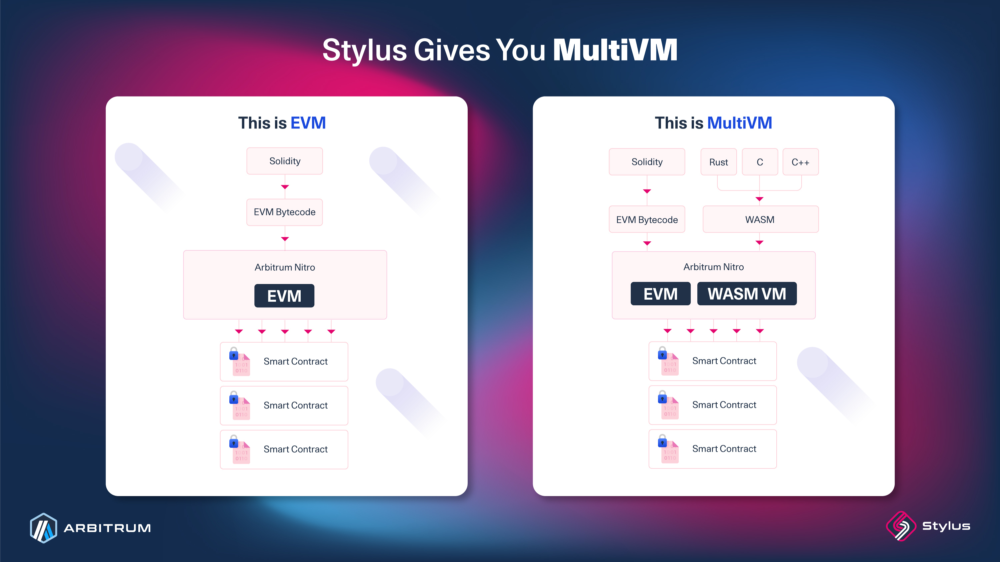

# A gentle introduction: Stylus

This introduction is for developers who want to build on <a data-quicklook-from="arbitrum">Arbitrum</a> using popular programming languages like Rust. This capability is made possible by <a data-quicklook-from="stylus">Stylus</a>, a new way to write EVM-compatible smart contracts using your favorite programming languages.

### In a nutshell:

- Stylus lets you write smart contracts in programming languages that compile to WASM, such as **Rust, C, C++, and many others**. Rich language and tooling support already exists for Rust, try out our SDK and CLI with the [quickstart](https://docs.arbitrum.io/stylus/stylus-quickstart) today.
- Solidity contracts and Stylus contracts are fully interoperable. In Solidity, you can call a Rust program and vice versa, thanks to a second, coequal WASM virtual machine.
- Stylus contracts are significantly faster and have lower gas fees due to the superior efficiency of <a data-quicklook-from="wasm">WASM</a> programs. It viable to consume more gas on the blockchain because it can greatly optimize memory use, enabling new use cases.

### What's Stylus?

Stylus is an upgrade to Arbitrum Nitro [(ArbOS 32)](https://docs.arbitrum.io/run-arbitrum-node/arbos-releases/arbos32), the tech stack powering Arbitrum One, Arbitrum Nova, and Arbitrum Orbit chains. This upgrade adds a second, coequal virtual machine to the EVM, where EVM contracts continue to behave exactly as they would in Ethereum. We call this paradigm **MultiVM** since **everything is entirely additive.**

This second virtual machine executes WebAssembly (WASM) rather than EVM bytecode. WASM is a modern binary format popularized by its use in major web standards, browsers, and companies to speed up computation. WASM is built to be fast, portable, and human-readable. It has sandboxed execution environments for security and simplicity. Working with WASM is nothing new for Arbitrum chains. Ever since the [Nitro upgrade](https://medium.com/offchainlabs/arbitrum-nitro-one-small-step-for-l2-one-giant-leap-for-ethereum-bc9108047450), WASM has been a fundamental component of Arbitrum's fully functioning fraud proofs.

With a WASM VM, any programming language that can compile to WASM is within Stylus's scope. While many popular programming languages can be compiled into WASM, some compilers are more suitable for smart contract development than others, like Rust, C, and C++. Other languages like Go, Sway, Move, and Cairo can also be supported. Languages that include their own runtimes, like Python and Javascript, are more complex for Stylus to support, although not impossible. Third-party contribution in the form of libraries for new and existing languages is welcomed!

Compared to using Solidity, WASM programs are much more efficient for memory intensive applications. There are many reasons for this, including the decades of compiler development for Rust and C. WASM also has a faster runtime than the EVM, resulting in faster execution.

### New use cases

It's impossible to list all of the use cases Stylus enables, think about the properties of all WASM compatible languages!

That said, here are some new features that are particularly exciting:

- Generative art libraries that consume a bunch of RAM
- Bringing existing games written in C++ on-chain
- Compute-heavy AI models
- Projects using alternative signature schemes, such as `secp256r1`, via custom precompiles
- Optimization of Solidity-based projects for speed and cost

We are actively looking for builders exploring any of the areas above or any ecosystem and tooling around Stylus. Over $5M in grants funding via the Stylus Sprint - apply now!

While many developers will be drawn to new use cases, rebuilding existing applications in Stylus will also open the door to innovation and optimization. dApps have never been faster, cheaper, or safer.

Stylus is open to all. Much thought has been given to creating the best programming experience possible. However, the work continues. Feedback gained from developers will help drive Stylus to the next level, improving tooling, documentation, and language features. Becoming an early adopter of Stylus is the best way to familiarize oneself with its opportunities.

If you're a developer interested in Stylus, visit the [quickstart](https://docs.arbitrum.io/stylus/stylus-quickstart), join the [Discord channel](https://discord.com/invite/arbitrum) or [Telegram](t.me/arbitrum_stylus) to join fellow builders and ask questions, and start building!

You may also find the following channels useful to keep up with the latest Arbitrum and Stylus news:
- Subscribe to the [Arbitrum Node Upgrade Announcement channel on Telegram](https://t.me/arbitrumnodeupgrade)
- Join both the `#dev-announcements` and `#node-runners` Discord channels in the [Arbitrum Discord server](https://discord.gg/arbitrum)
- Follow the official Arbitrum ([`@Arbitrum`](https://twitter.com/arbitrum)) and Arbitrum Developers ([`@ArbitrumDevs`](https://twitter.com/ArbitrumDevs)) X accounts, formerly Twitter.
