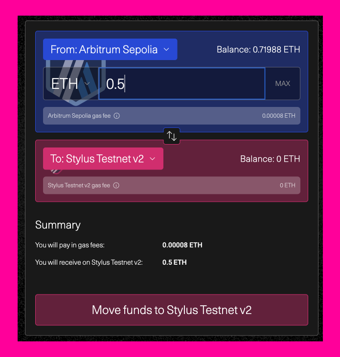

import PublicPreviewBannerPartial from './partials/_stylus-public-preview-banner-partial.md';

<PublicPreviewBannerPartial />

This tutorial will guide you through the process of deploying a smart contract in Rust using Styus. We'll cover the following steps:

1. Setting up your development environment
2. Creating a new Stylus project
3. Checking the validity of your program
4. Deploying your program


## Prerequisites

Before we dive into the tutorial, make sure you have the following prerequisites set up:

### Rust toolchain

Follow the instructions on [Rust Lang’s installation page](https://www.rust-lang.org/tools/install) to get a full Rust toolchain installed on your system. Make sure after installation that you have access to the programs `rustup`, `rustc`, and `cargo` from your preferred command line terminal (programs should be added to your system’s PATH, more instructions available on Rust’s website)

### VS Code

We recommend VS Code as the IDE of choice for developing Stylus contracts for its excellent Rust support. See **[code.visualstudio.com](https://code.visualstudio.com/)** to install. Feel free to use another text editor or IDE if you’re comfortable with those.

Some helpful VS Code extensions for Rust development:

- [rust-analyzer](https://marketplace.visualstudio.com/items?itemName=rust-lang.rust-analyzer): Provides advanced features like smart code completion and on-the-fly error checks.
- [Error Lens](https://marketplace.visualstudio.com/items?itemName=usernamehw.errorlens): Immediately highlights errors and warnings in the code.
- [Even Better TOML](https://marketplace.visualstudio.com/items?itemName=tamasfe.even-better-toml): Improves syntax highlighting and other features for TOML files, often used in Rust projects.
- [crates](https://marketplace.visualstudio.com/items?itemName=serayuzgur.crates): Helps manage Rust crate versions directly from the editor.


### Setting Up a Developer Wallet

When working on a testnet, it's important to use a separate wallet that holds no real assets. This is because you'll often need to input private keys into your command line to manage transactions, and you should never use personal accounts for development purposes. **_So avoid using personal accounts for development_**.

If you're using [MetaMask](https://metamask.io/), here’s how to set up a new account:

1. Open MetaMask and click the dropdown menu at the top middle of the plugin.
2. Select “Add Account” to create a new wallet. Consider naming it something like "dev wallet" or "Stylus" to remind you of its purpose.
3. You'll need the private key of this new account—and some testnet ETH (like Sepolia ETH) if you plan to deploy smart contracts. To get your private key, follow the steps provided on [MetaMask’s support page](https://support.metamask.io/ko/managing-my-wallet/secret-recovery-phrase-and-private-keys/how-to-export-an-accounts-private-key/).

This setup ensures that your real assets are safe while you develop and test on Arbitrum.

:::caution

**_Never share your “secret recovery phrase” with anyone_**. Never enter it anywhere. A _private key_ is valid for an individual account only, but a _secret recovery phrase_ can be used to gain access to ALL accounts in your wallet.

:::

To interact with the Stylus testnet, you need to manually configure two specific networks in your MetaMask plugin. Here’s how to set them up (for more details, refer to the [MetaMask documentation](https://docs.metamask.io/wallet/how-to/manage-networks/add-network/)):

1. Arbitrum Sepolia:  

- **Network Name**: Arbitrum Sepolia
- **New RPC URL**: `https://sepolia-rollup.arbitrum.io/rpc`
- **Chain ID**: 421614
- **Currency Symbol**: ETH
- **Block Explorer URL**: `https://sepolia.arbiscan.io`

2. Arbitrum Stylus Testnet:

- **Network Name**: Stylus testnet
- **New RPC URL**: `https://stylus-testnet.arbitrum.io/rpc`
- **Chain ID**: 23011913
- **Currency Symbol**: ETH
- **Block Explorer URL**: `https://stylus-testnet-explorer.arbitrum.io/`


### Acquiring and Bridging Testnet ETH

To engage with the Stylus testnet, you will first need to acquire Sepolia ETH and then bridge it over:

1. Visit a faucet such as [Bware Labs' Arbitrum Stylus Testnet faucet](https://bwarelabs.com/faucets/arbitrum-stylus-testnet).
2. Enter your wallet address.
3. Click `Claim` to receive your testnet ETH. Some faucets may require additional steps to get more tokens.

After these steps, you should see Sepolia ETH in your Sepolia testnet wallet.

Alternative faucets:

- [QuickNode Faucet for Arbitrum Sepolia](https://faucet.quicknode.com/arbitrum/sepolia)
- [Alchemy Sepolia Faucet](https://sepoliafaucet.com/)
- [Sepolia Faucet by PK910](https://sepolia-faucet.pk910.de/)

Next, bridge the Sepolia ETH to the Stylus Testnet:

1. Go to the [Arbitrum Bridge](https://bridge.arbitrum.io/?destinationChain=stylus-testnet&sourceChain=arbitrum-sepolia).
2. Choose Arbitrum Sepolia as the source and Stylus Testnet as the destination.
3. Connect your wallet and authorize the bridge to access your tokens.
4. Specify the amount of Sepolia ETH you want to bridge and initiate the transfer by clicking `Move funds to Stylus Testnet`. Make sure to keep some ETH in the source chain to cover transaction fees.

To verify the transfer, you can track the transaction on the [Arbiscan block explorer]((https://sepolia.arbiscan.io/) for the source and the [Stylus testnet block explorer](https://stylus-testnet-explorer.arbitrum.io/) for the destination.

<p align="center">
  
</p>

To check the existence and balance of your testnet ETH, use the [Stylus testnet block explorer](https://stylus-testnet-explorer.arbitrum.io/address/0x44E623584f90D6FBaBe930221d47E0De4248e935/coin-balances#address-tabs). This tool allows you to view transaction details and confirm that your ETH is available in the testnet environment. Simply navigate to the provided link and enter your specific wallet address to see your balance and recent transactions.

## Your First Stylus Program

`cargo-stylus` is a command-line tool that simplifies the process of building, verifying, and deploying Arbitrum Stylus programs written in Rust. It functions as a plugin to Cargo, the standard build tool for Rust, allowing seamless integration into existing Rust workflows.

### Installation

Ensure that Rust is installed on your system. You can install it from [the Rust installation page](https://www.rust-lang.org/tools/install).

Next, install the `cargo-stylus` tool by executing the following command in your terminal:

```bash
RUSTFLAGS="-C link-args=-rdynamic" cargo install --force cargo-stylus
```

To prepare your Rust environment for building [WebAssembly (WASM)](https://webassembly.org/) modules, add WASM as a build target with this command:

```bash
rustup target add wasm32-unknown-unknown
```

After installation, `cargo-stylus` is accessible through the cargo command. To view the available options and commands, use:


```bash
cargo stylus --help
```

This will display the following usage options:


```plaintext
Cargo command for developing Arbitrum Stylus projects

Usage: cargo stylus <COMMAND>

Commands:
  new         Create a new Rust project
  export-abi  Export a Solidity ABI
  check       Check that a contract can be activated onchain
  deploy      Deploy a stylus contract
  replay      Replay a transaction in gdb
  trace       Trace a transaction
  help        Print this message or the help of the given subcommand(s)

Options:
  -h, --help     Print help
  -V, --version  Print version
```

### Creating a new Stylus project

The cargo stylus command comes with useful commands such as `new`, `check` and `deploy`, and `export-abi` for developing and deploying Stylus programs to Arbitrum chains. Here's a common workflow:

Start a new Stylus project with

```bash
cargo stylus new <YOUR_PROJECT_NAME>
```

This command clones a local copy of the [stylus-hello-world](https://github.com/OffchainLabs/stylus-hello-world) repository, which contains a Rust implementation of the Solidity `Counter` smart contract example. For further details, refer to the [README](https://github.com/OffchainLabs/stylus-hello-world/blob/main/README.md) in the `stylus-hello-world` repository.

For a simpler setup, especially suitable for projects that do not require the full capabilities of Solidity, you can create a minimal project structure using:

```bash
cargo stylus new --minimal <YOUR_PROJECT_NAME>
```

This creates a project with just the essential Stylus entrypoint locally.

Continue to develop your Rust program using the features provided in the [[stylus-sdk](https://github.com/OffchainLabs/stylus-sdk-rs)]. 

### Checking Program Validity

Before deploying your program onchain, ensure its it works:

```bash
cargo stylus check
```

This command verifies that your program can be deployed and activated onchain without a transaction, by connecting to a specified JSON-RPC endpoint. The defalt endpoint is the Arbitrum Stylus testnet: `https://stylus-testnet.arbitrum.io/rpc`.

For additional options, consult the help guide:

```bash
cargo stylus check --help
```

A successful validation will display something like:

```
Finished `release` profile [optimized] target(s) in 0.20s

Reading WASM file at [YOUR-DIRECTORY]/target/wasm32-unknown-unknown/release/deps/stylus_hello_world.wasm
Uncompressed WASM size: 25.0 KB
Compressed WASM size to be deployed onchain: 9.0 KB
Connecting to Stylus RPC endpoint: https://stylus-testnet.arbitrum.io/rpc
Program succeeded Stylus onchain activation checks with Stylus version: 1
```

If the check fails, the output provides detailed error information, such as:

```
Reading WASM file at bad-export.wat
Compressed WASM size: 55 B
Stylus checks failed: program predeployment check failed when checking against
ARB_WASM_ADDRESS 0x0000…0071: (code: -32000, message: program activation failed: failed to parse program)

Caused by:
    binary exports reserved symbol stylus_ink_left

Location:
    prover/src/binary.rs:493:9, data: None)
```

For guidelines on what constitutes a valid or invalid WASM program, refer to [VALID_WASM](https://github.com/OffchainLabs/cargo-stylus/blob/main/VALID_WASM.md). 


### Deploying Your Program

Once validated, you can deploy your program using the `cargo stylus deploy` subcommand. Start by estimating the gas required for deployment. `--private-key-path` is a text file containing your private key. 

```bash
cargo stylus deploy \
  --private-key-path=<PRIVKEY_FILE_PATH> \
  --estimate-gas-only
```

Among other details, you'll see an estimated gas cost for deployment:

```bash
...
====DEPLOYMENT====
Deploying program to address 0xD6bC450ED8D8054b7c971f6d42631Fc4ed59A099
Base fee: 0.100000000 gwei
Estimated gas for deployment: 11266639 gas units
```

Next, attempt an actual deployment. Two transactions will be sent onchain.

```bash
cargo stylus deploy \
  --private-key-path=<PRIVKEY_FILE_PATH>
```

You'll see details about the deployment process, such as:

```bash
...
Uncompressed WASM size: 25.0 KB
Compressed WASM size to be deployed onchain: 9.0 KB
Connecting to Stylus RPC endpoint: https://stylus-testnet.arbitrum.io/rpc
Program succeeded Stylus onchain activation checks with Stylus version: 1
Deployer address: 0x44E623584f90D6FBaBe930221d47E0De4248e935

====DEPLOYMENT====
Deploying program to address 0xD6bC450ED8D8054b7c971f6d42631Fc4ed59A099
Base fee: 0.100000000 gwei
Estimated gas for deployment: 11266639 gas units
Submitting deployment tx...
Confirmed deployment tx 0xc95d7fab996934b38d2eb5e4559977aa222a658fb13e994bdea0f74746219ad5
Gas units used 10318928, effective gas price 0.100000000 gwei
Transaction fee: 0.001031892800000000 ETH

====ACTIVATION====
Activating program at address 0xD6bC450ED8D8054b7c971f6d42631Fc4ed59A099
Base fee: 0.100000000 gwei
Estimated gas for activation: 14224495 gas units
Submitting activation tx...
Confirmed activation tx 0x908459dab815e1403c36e21838673ac55877665c9d95c9c87bfb1c4543eab0e8
Gas units used 14184722, effective gas price 0.100000000 gwei
Transaction fee: 0.001418472200000000 ETH
```

You can verify the deployment and activation of your program on the [Stylus testnet block explorer](https://stylus-testnet-explorer.arbitrum.io/address/0xD6bC450ED8D8054b7c971f6d42631Fc4ed59A099/transactions#address-tabs).

For further deployment options and transaction details, consult `cargo stylus deploy --help`.


## Deploying Non-Rust WASM Projects

The Stylus CLI tool can also deploy non-Rust, WASM projects to Stylus by specifying the WASM file directly with the `--wasm-file-path` flag to any of the cargo stylus commands.

Even WebAssembly Text [(WAT)](https://www.webassemblyman.com/wat_webassembly_text_format.html) files are supported. This means projects that are just individual WASM files can be deployed onchain without needing to have been compiled by Rust. WASMs produced by other languages, such as C, can be used with the tool this way.

For example:

```wasm
(module
    (type $t0 (func (param i32) (result i32)))
    (func $add_one (export "add_one") (type $t0) (param $p0 i32) (result i32)
        get_local $p0
        i32.const 1
        i32.add))
```

can be saved as `add.wat` and used as `cargo stylus check --wasm-file-path=add.wat` or `cargo stylus deploy --priv-key-path=<YOUR PRIV KEY FILE PATH> --wasm-file-path=add.wat`

## Exporting Solidity ABIs

Stylus Rust projects that use the [stylus-sdk](https://github.com/OffchainLabs/stylus-sdk-rs) have the option of exporting Solidity ABIs. The cargo stylus tool also makes this easy with the `export-abi` command:

`cargo stylus export-abi`
