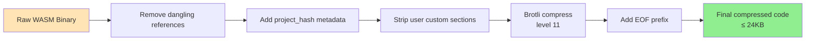
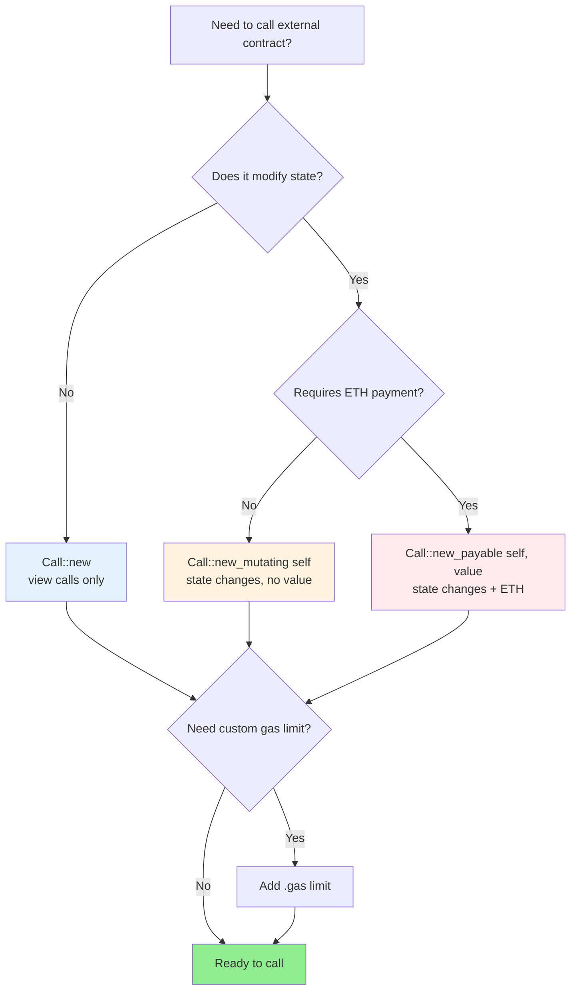

# Stylus Documentation Restructure - Implementation Guide

**Status:** Ready for execution
**Total Duration:** 5 weeks (5 phases)
**Files Affected:** ~100+ files
**Plan Source:** `~/.claude/plans/hashed-scribbling-finch.md`

## Overview

This guide provides step-by-step instructions, scripts, and checklists for implementing the Stylus documentation restructure. Each phase can be executed independently with built-in validation and rollback capabilities.

## Quick Start

```bash
# Navigate to project root
cd /Users/allup/OCL/stylus-V10

# Create backup before starting
git checkout -b stylus-docs-restructure
git add -A
git commit -m "checkpoint: before restructure"

# Execute phases in order
./scripts/restructure/phase1.sh
./scripts/restructure/phase2.sh
./scripts/restructure/phase3.sh
./scripts/restructure/phase4.sh
./scripts/restructure/phase5.sh
```

## Pre-Flight Checklist

Before starting any phase:

- [ ] All changes committed to git
- [ ] Working on feature branch `stylus-docs-restructure`
- [ ] Backup created
- [ ] Build passing (`yarn build`)
- [ ] No uncommitted changes

## Phase Execution Order

**IMPORTANT:** Phases must be executed in order due to dependencies:

1. **Phase 1** → Clean foundation (delete duplicates, fix compliance)
2. **Phase 2** → Directory structure (depends on Phase 1 cleanup)
3. **Phase 3** → Content consolidation (depends on Phase 2 structure)
4. **Phase 4** → New content (depends on Phase 3 structure)
5. **Phase 5** → Expansion & validation (depends on all previous phases)

## Validation Between Phases

After each phase:

```bash
# Check build
yarn build

# Check for broken links
yarn build 2>&1 | grep -i "broken"

# Verify no uncommitted files
git status

# Test dev server
yarn start --no-open
# Visit http://localhost:3000/stylus and verify navigation
```

## Rollback Procedures

If issues arise during any phase:

```bash
# Rollback to pre-phase state
git reset --hard HEAD~1

# Or rollback specific files
git checkout HEAD~1 -- docs/stylus/path/to/file.mdx

# Or rollback entire phase using tag
git reset --hard phase-1-start
```

## Success Metrics

Track these metrics after each phase:

| Metric | Target | Command |
|--------|--------|---------|
| Build success | Pass | `yarn build` |
| Broken links | 0 | `yarn build 2>&1 \| grep broken` |
| Terminology violations | 0 | See Phase 1 audit scripts |
| Missing frontmatter | 0 | See Phase 1 validation |
| Diagram rendering | 100% | Visual inspection |
| Accessibility score | ≥95% | Lighthouse audit |

---

## Phase 1: Foundation & Compliance (Week 1)

**Goal:** Fix critical issues, ensure CLAUDE.md compliance, complete frontmatter

**Duration:** ~8 hours
**Files Modified:** ~28 files
**New Files:** 2
**Deleted Files:** 3
**Diagrams Added:** 3

### Phase 1 Checklist

- [ ] Delete duplicate overview.md file
- [ ] Create missing advanced/_category_.yml
- [ ] Run terminology audit and fix all violations
- [ ] Complete missing frontmatter
- [ ] Merge verification docs
- [ ] Move faucets partial
- [ ] Add 3 quick-win diagrams
- [ ] Validate build
- [ ] Commit changes

### Phase 1 Tasks

#### Task 1.1: Delete Duplicate Files

```bash
# Verify files are identical
diff docs/stylus/reference/overview.md docs/stylus/reference/overview.mdx

# Delete the .md version (keep .mdx)
rm docs/stylus/reference/overview.md

# Verify
git status
```

**Expected output:** 1 file deleted

#### Task 1.2: Create Missing Configuration

```bash
# Create advanced/_category_.yml
cat > docs/stylus/advanced/_category_.yml << 'EOF'
label: 'Advanced'
position: 8
link:
  type: generated-index
  description: Deep dives into Stylus internals, advanced patterns, and optimization techniques.
EOF

# Verify
cat docs/stylus/advanced/_category_.yml
```

**Expected output:** New _category_.yml file created

#### Task 1.3: Terminology Audit & Fixes

Create audit script:

```bash
# Create audit script
mkdir -p scripts/restructure
cat > scripts/restructure/terminology-audit.sh << 'EOF'
#!/bin/bash

echo "=== Stylus Terminology Audit ==="
echo ""

violations=0

# Check for "js" instead of "JavaScript"
echo "Checking for 'js' (should be 'JavaScript')..."
results=$(grep -rn '\bjs\b' docs/stylus/ --include="*.mdx" --include="*.md" | grep -v "ts.js" | grep -v ".js" | grep -v "js/")
if [ ! -z "$results" ]; then
    echo "$results"
    violations=$((violations + 1))
fi

# Check for "smartcontract" instead of "smart contract"
echo ""
echo "Checking for 'smartcontract' (should be 'smart contract')..."
results=$(grep -rin 'smartcontract' docs/stylus/ --include="*.mdx" --include="*.md")
if [ ! -z "$results" ]; then
    echo "$results"
    violations=$((violations + 1))
fi

# Check for "whitelist/blacklist" instead of "allowlist/denylist"
echo ""
echo "Checking for 'whitelist/blacklist' (should be 'allowlist/denylist')..."
results=$(grep -rin 'whitelist\|blacklist' docs/stylus/ --include="*.mdx" --include="*.md")
if [ ! -z "$results" ]; then
    echo "$results"
    violations=$((violations + 1))
fi

# Check for "on-chain" instead of "onchain"
echo ""
echo "Checking for 'on-chain/on chain' (should be 'onchain')..."
results=$(grep -rn 'on-chain\|on chain' docs/stylus/ --include="*.mdx" --include="*.md")
if [ ! -z "$results" ]; then
    echo "$results"
    violations=$((violations + 1))
fi

# Check for "ERC20" instead of "ERC-20"
echo ""
echo "Checking for 'ERC20/ERC721' (should be 'ERC-20/ERC-721')..."
results=$(grep -rn 'ERC20\|ERC721\|ERC1155' docs/stylus/ --include="*.mdx" --include="*.md" | grep -v "ERC-")
if [ ! -z "$results" ]; then
    echo "$results"
    violations=$((violations + 1))
fi

# Check for "Layer-1/L1" instead of "Parent chain"
echo ""
echo "Checking for 'Layer-1/L1/layer 1' (should be 'Parent chain')..."
results=$(grep -rin 'Layer-1\|Layer 1\|\bL1\b' docs/stylus/ --include="*.mdx" --include="*.md")
if [ ! -z "$results" ]; then
    echo "$results"
    violations=$((violations + 1))
fi

# Check for "Layer-2/L2" instead of "Child chain"
echo ""
echo "Checking for 'Layer-2/L2/layer 2' (should be 'Child chain')..."
results=$(grep -rin 'Layer-2\|Layer 2\|\bL2\b' docs/stylus/ --include="*.mdx" --include="*.md")
if [ ! -z "$results" ]; then
    echo "$results"
    violations=$((violations + 1))
fi

echo ""
echo "=== Audit Complete ==="
echo "Total violation types found: $violations"
echo ""

if [ $violations -eq 0 ]; then
    echo "✅ No terminology violations found!"
    exit 0
else
    echo "❌ Terminology violations found. Please fix manually."
    exit 1
fi
EOF

chmod +x scripts/restructure/terminology-audit.sh
```

Run the audit:

```bash
# Run audit
./scripts/restructure/terminology-audit.sh

# Fix violations manually based on output
# For each file flagged, open and fix the terminology
```

**Manual fixes required:** Review each flagged file and update terminology according to CLAUDE.md standards.

#### Task 1.4: Frontmatter Audit & Completion

Create frontmatter audit script:

```bash
cat > scripts/restructure/frontmatter-audit.sh << 'EOF'
#!/bin/bash

echo "=== Frontmatter Audit ==="
echo ""

missing_user_story=()
missing_content_type=()

# Check all .mdx and .md files
for file in $(find docs/stylus -name "*.mdx" -o -name "*.md" | grep -v "partials"); do
    # Check for user_story
    if ! grep -q "user_story:" "$file"; then
        missing_user_story+=("$file")
    fi

    # Check for content_type
    if ! grep -q "content_type:" "$file"; then
        missing_content_type+=("$file")
    fi
done

echo "Files missing user_story:"
printf '%s\n' "${missing_user_story[@]}"
echo ""
echo "Total: ${#missing_user_story[@]}"
echo ""

echo "Files missing content_type:"
printf '%s\n' "${missing_content_type[@]}"
echo ""
echo "Total: ${#missing_content_type[@]}"
echo ""

if [ ${#missing_user_story[@]} -eq 0 ] && [ ${#missing_content_type[@]} -eq 0 ]; then
    echo "✅ All files have complete frontmatter!"
    exit 0
else
    echo "❌ Some files missing frontmatter fields"
    exit 1
fi
EOF

chmod +x scripts/restructure/frontmatter-audit.sh
```

Run and fix:

```bash
# Run audit
./scripts/restructure/frontmatter-audit.sh

# For each file missing fields, add:
# user_story: 'As a <role>, I want to <goal>'
# content_type: 'how-to' # or: concept, reference, quickstart, tutorial, faq
```

#### Task 1.5: Merge Verification Docs

**Manual task:** Combine two verification files into one.

```bash
# Read both files
cat docs/stylus/how-tos/verifying-contracts.mdx
cat docs/stylus/how-tos/verifying-contracts-arbiscan.mdx

# Create merged version (do this manually by combining content)
# The merged file should have:
# - Overview (what/why verification)
# - Local verification section (from verifying-contracts.mdx)
# - Arbiscan verification section (from verifying-contracts-arbiscan.mdx)
# - Troubleshooting section

# After creating merged version, delete originals
rm docs/stylus/how-tos/verifying-contracts-arbiscan.mdx
```

**Note:** The merged file will be moved to `cli-tools/` in Phase 2.

#### Task 1.6: Move Partials

```bash
# Move faucets partial
mv docs/stylus/reference/partials/_stylus-faucets.mdx docs/stylus/partials/

# Update all imports (search and replace)
# Old: import StylusFaucets from '../reference/partials/_stylus-faucets.mdx';
# New: import StylusFaucets from '../partials/_stylus-faucets.mdx';

# Find files that import this partial
grep -r "reference/partials/_stylus-faucets" docs/stylus/

# Update each file found
```

#### Task 1.7: Add Quick-Win Diagrams

**Diagram #3: WASM Processing Pipeline** (docs/stylus/concepts/activation.mdx)

Find the existing ASCII art (around lines 74-90) and replace with:

```mdx
The following diagram shows the complete WASM processing pipeline:



*Figure 1: WASM binary processing pipeline showing transformation from raw binary to deployment-ready compressed code.*

The deployment process ensures...
```

**Diagram #8: Call Configuration Decision Tree** (docs/stylus/how-tos/importing-interfaces.mdx)

Add after the "Configuring your calls" section introduction:

```mdx
Use this decision tree to choose the correct Call constructor:



*Figure 2: Decision tree for selecting the appropriate Call constructor based on state modification and payment requirements.*
```

**Diagram #12: Storage Type Hierarchy** (docs/stylus/reference/data-types/storage.mdx)

Add at the beginning of the document after the introduction:

```mdx
The Stylus SDK provides a comprehensive hierarchy of storage types:

```mermaid
graph TB
    Root[Storage Types] --> Primitives
    Root --> Collections
    Root --> Custom[Custom Structs]

    Primitives --> Bool[StorageBool]
    Primitives --> Uint[StorageU256, U128, U64, etc.]
    Primitives --> Int[StorageI256, I128, I64, etc.]
    Primitives --> Addr[StorageAddress]
    Primitives --> Bytes[StorageB256, B32, etc.]

    Collections --> Vec[StorageVec T]
    Collections --> Array[StorageArray T, N]
    Collections --> Map[StorageMap K, V]
    Collections --> Str[StorageString]
    Collections --> BytesCol[StorageBytes]

    Custom --> Struct[#[storage] annotated structs]

    style Root fill:#E1BEE7
    style Primitives fill:#BBDEFB
    style Collections fill:#C8E6C9
    style Custom fill:#FFE0B2
```

*Figure 3: Storage type hierarchy showing primitives, collections, and custom struct options.*
```

#### Task 1.8: Validate Phase 1

```bash
# Run build
yarn build

# Run terminology audit
./scripts/restructure/terminology-audit.sh

# Run frontmatter audit
./scripts/restructure/frontmatter-audit.sh

# Check git status
git status

# Verify diagrams render
yarn start --no-open
# Visit the 3 pages with diagrams and verify they render correctly
```

#### Task 1.9: Commit Phase 1

```bash
# Stage all changes
git add -A

# Commit with descriptive message
git commit -m "docs(stylus): Phase 1 - Foundation & Compliance

- Delete duplicate reference/overview.md
- Create missing advanced/_category_.yml
- Fix all terminology violations per CLAUDE.md
- Complete missing frontmatter (user_story, content_type)
- Merge verification docs into single file
- Move faucets partial to partials/ directory
- Add 3 quick-win Mermaid diagrams (#3, #8, #12)

Files modified: ~28
Diagrams added: 3
Compliance: 100% terminology, 100% frontmatter"

# Tag for rollback point
git tag phase-1-complete
```

### Phase 1 Success Criteria

- [ ] ✅ Build passes without errors
- [ ] ✅ Zero terminology violations
- [ ] ✅ All files have complete frontmatter
- [ ] ✅ 3 diagrams render correctly
- [ ] ✅ No broken links
- [ ] ✅ Changes committed and tagged

---

## Phase 2: Directory Restructure (Week 2)

**Goal:** Create flatter, clearer directory structure with better categorization

**Duration:** ~10 hours
**Files Modified:** ~20 files
**New Files:** 8
**Directories Created:** 5

### Phase 2 Checklist

- [ ] Create new directory structure
- [ ] Move files to fundamentals/
- [ ] Move files to guides/
- [ ] Create cli-tools/ section
- [ ] Update sidebars.js
- [ ] Update all imports
- [ ] Validate build
- [ ] Commit changes

### Phase 2 Tasks

#### Task 2.1: Create New Directory Structure

```bash
# Create new top-level directories
mkdir -p docs/stylus/fundamentals
mkdir -p docs/stylus/guides
mkdir -p docs/stylus/cli-tools
mkdir -p docs/stylus/best-practices
mkdir -p docs/stylus/troubleshooting

# Create _category_.yml for each
cat > docs/stylus/fundamentals/_category_.yml << 'EOF'
label: 'Fundamentals'
position: 2
collapsed: false
link:
  type: generated-index
  description: Essential Stylus SDK concepts, prerequisites, and core development skills.
EOF

cat > docs/stylus/guides/_category_.yml << 'EOF'
label: 'Guides'
position: 3
link:
  type: generated-index
  description: Practical guides for common Stylus development tasks.
EOF

cat > docs/stylus/cli-tools/_category_.yml << 'EOF'
label: 'CLI tools'
position: 4
link:
  type: generated-index
  description: cargo-stylus command-line tools for building, deploying, and verifying contracts.
EOF

cat > docs/stylus/best-practices/_category_.yml << 'EOF'
label: 'Best practices'
position: 6
link:
  type: generated-index
  description: Security, performance, and gas optimization patterns for production Stylus contracts.
EOF

cat > docs/stylus/troubleshooting/_category_.yml << 'EOF'
label: 'Troubleshooting'
position: 8
link:
  type: generated-index
  description: Common issues, error messages, and debugging strategies.
EOF
```

#### Task 2.2: Move Files to fundamentals/

```bash
# Move SDK basics to fundamentals
mv docs/stylus/reference/project-structure.mdx docs/stylus/fundamentals/
mv docs/stylus/reference/contracts.mdx docs/stylus/fundamentals/
mv docs/stylus/reference/global-variables-and-functions.mdx docs/stylus/fundamentals/
mv docs/stylus/reference/data-types docs/stylus/fundamentals/

# Move testing (core skill)
mv docs/stylus/how-tos/testing-contracts.mdx docs/stylus/fundamentals/

# Update frontmatter in each moved file to fix sidebar_position
# This needs to be done manually for each file
```

#### Task 2.3: Move Files to guides/

```bash
# Rename how-tos to guides
# First, move all files from how-tos to guides (except those already moved)
for file in docs/stylus/how-tos/*.mdx; do
    mv "$file" docs/stylus/guides/$(basename "$file")
done

# Remove empty how-tos directory (after Phase 2 complete)
```

#### Task 2.4: Create cli-tools/ Section

```bash
# Transform using-cli.mdx into cli-tools/overview.mdx
cp docs/stylus/using-cli.mdx docs/stylus/cli-tools/overview.mdx

# Move CLI-related files
mv docs/stylus/guides/check-and-deploy.mdx docs/stylus/cli-tools/
mv docs/stylus/guides/verifying-contracts.mdx docs/stylus/cli-tools/verify-contracts.mdx
mv docs/stylus/guides/debugging-tx.mdx docs/stylus/cli-tools/
```

Create cli-tools/commands-reference.mdx:

```mdx
---
title: 'cargo-stylus command reference'
description: 'Complete reference for all cargo-stylus CLI commands'
user_story: 'As a Stylus developer, I want a complete reference of all CLI commands'
content_type: reference
author: offchainlabs
sidebar_position: 5
---

# cargo-stylus command reference

Complete reference for all `cargo-stylus` commands.

## new

Create a new Stylus project.

**Usage:**
```shell
cargo stylus new <PROJECT_NAME>
```

**Options:**
- `--minimal` - Create minimal project structure

**Example:**
```shell
cargo stylus new my-stylus-contract
```

## check

Verify a contract compiles to valid WASM.

**Usage:**
```shell
cargo stylus check
```

**Options:**
- `--endpoint <URL>` - RPC endpoint (default: http://localhost:8547)

## deploy

Deploy a Stylus contract.

**Usage:**
```shell
cargo stylus deploy \\
  --endpoint <RPC_URL> \\
  --private-key <PRIVATE_KEY>
```

**Options:**
- `--endpoint <URL>` - RPC endpoint
- `--private-key <KEY>` - Private key for deployment
- `--estimate-gas` - Estimate gas only, don't deploy

## activate

Activate a deployed contract.

**Usage:**
```shell
cargo stylus activate \\
  --endpoint <RPC_URL> \\
  --private-key <PRIVATE_KEY> \\
  --address <CONTRACT_ADDRESS>
```

## verify

Verify contract source code.

**Usage:**
```shell
cargo stylus verify \\
  --deployment-tx <TX_HASH>
```

**Options:**
- `--endpoint <URL>` - RPC endpoint

## cache

Manage contract caching.

**Usage:**
```shell
cargo stylus cache bid <ADDRESS>
cargo stylus cache status <ADDRESS>
```

## export-abi

Export contract ABI.

**Usage:**
```shell
cargo stylus export-abi
```

**Output:**
Generates Solidity interface compatible ABI.

---

For detailed usage examples, see the [CLI tools guides](/stylus/cli-tools/overview).
```

#### Task 2.5: Update sidebars.js

This is a critical file that needs careful updating. Create a backup first:

```bash
cp sidebars.js sidebars.js.backup
```

Then update the Stylus section (around lines 1572-1791) to reflect the new flatter structure:

```javascript
// In sidebars.js, find the buildStylusSidebar section and update:

{
  type: 'category',
  label: 'Build apps with Stylus',
  link: {
    type: 'generated-index',
    title: 'Build apps with Stylus',
    description: 'Learn how to build decentralized applications using Stylus, Arbitrum\'s next-generation smart contract platform supporting Rust, C, and C++.',
    slug: '/stylus',
  },
  collapsed: false,
  items: [
    'stylus/gentle-introduction',
    'stylus/quickstart',
    {
      type: 'category',
      label: 'Fundamentals',
      collapsed: false,
      link: {
        type: 'generated-index',
      },
      items: [
        'stylus/fundamentals/project-structure',
        'stylus/fundamentals/contracts',
        'stylus/fundamentals/global-variables-and-functions',
        {
          type: 'category',
          label: 'Data types',
          items: [
            'stylus/fundamentals/data-types/primitives',
            'stylus/fundamentals/data-types/compound-types',
            'stylus/fundamentals/data-types/storage',
            'stylus/fundamentals/data-types/conversions-between-types',
          ],
        },
        'stylus/fundamentals/testing-contracts',
      ],
    },
    {
      type: 'category',
      label: 'Guides',
      items: [
        'stylus/guides/using-constructors',
        'stylus/guides/using-inheritance',
        'stylus/guides/importing-interfaces',
        'stylus/guides/exporting-abi',
        'stylus/guides/optimizing-binaries',
        'stylus/guides/caching-contracts',
        'stylus/guides/deploy-non-rust-contracts',
        'stylus/guides/add-language-support',
      ],
    },
    {
      type: 'category',
      label: 'CLI tools',
      items: [
        'stylus/cli-tools/overview',
        'stylus/cli-tools/check-and-deploy',
        'stylus/cli-tools/verify-contracts',
        'stylus/cli-tools/debugging-tx',
        'stylus/cli-tools/commands-reference',
      ],
    },
    {
      type: 'category',
      label: 'Concepts',
      items: [
        'stylus/concepts/webassembly',
        'stylus/concepts/activation',
        'stylus/concepts/gas-metering',
        'stylus/concepts/evm-differences',
        'stylus/concepts/public-preview-expectations',
      ],
    },
    {
      type: 'category',
      label: 'Best practices',
      items: [
        // Phase 4 will add files here
      ],
    },
    {
      type: 'category',
      label: 'Advanced',
      items: [
        'stylus/advanced/solidity-differences',
        'stylus/advanced/minimal-entrypoint-contracts',
        'stylus/advanced/hostio-exports',
        'stylus/advanced/recommended-libraries',
      ],
    },
    {
      type: 'category',
      label: 'Troubleshooting',
      items: [
        // Phase 4 will add files here
      ],
    },
    {
      type: 'category',
      label: 'Reference',
      items: [
        'stylus/reference/overview',
        'stylus/reference/opcode-hostio-pricing',
        // Phase 3 will add rust-sdk/* here
      ],
    },
  ],
},
```

#### Task 2.6: Update Imports

After moving files, all imports need updating. Create a script:

```bash
cat > scripts/restructure/update-imports.sh << 'EOF'
#!/bin/bash

echo "Updating imports for moved files..."

# Update imports for files moved to fundamentals/
find docs/stylus -name "*.mdx" -exec sed -i '' \
  -e 's|../reference/project-structure|../fundamentals/project-structure|g' \
  -e 's|../reference/contracts|../fundamentals/contracts|g' \
  -e 's|../reference/global-variables-and-functions|../fundamentals/global-variables-and-functions|g' \
  -e 's|../reference/data-types|../fundamentals/data-types|g' \
  {} \;

# Update imports for CLI tools
find docs/stylus -name "*.mdx" -exec sed -i '' \
  -e 's|../using-cli|../cli-tools/overview|g' \
  -e 's|how-tos/check-and-deploy|cli-tools/check-and-deploy|g' \
  -e 's|how-tos/debugging-tx|cli-tools/debugging-tx|g' \
  {} \;

# Update imports for guides (how-tos → guides)
find docs/stylus -name "*.mdx" -exec sed -i '' \
  -e 's|/how-tos/|/guides/|g' \
  {} \;

echo "✅ Imports updated"
EOF

chmod +x scripts/restructure/update-imports.sh
./scripts/restructure/update-imports.sh
```

**Note:** On Linux, remove the `''` after `-i` in sed commands.

#### Task 2.7: Validate Phase 2

```bash
# Run build
yarn build

# Check for broken links
yarn build 2>&1 | grep -i "broken\|error"

# Start dev server
yarn start --no-open

# Manual verification:
# - Navigate to /stylus
# - Verify new sidebar structure
# - Click through all sections
# - Verify no 404s
```

#### Task 2.8: Commit Phase 2

```bash
git add -A
git commit -m "docs(stylus): Phase 2 - Directory Restructure

- Create 5 new top-level directories (fundamentals, guides, cli-tools, best-practices, troubleshooting)
- Move SDK basics to fundamentals/ (project-structure, contracts, data-types, testing)
- Rename how-tos/ to guides/ and flatten structure
- Create cli-tools/ section with overview and commands reference
- Update sidebars.js to max 3-level depth
- Update all imports for moved files

Files modified: ~20
New directories: 5
Sidebar depth: Reduced from 4+ to 3 levels"

git tag phase-2-complete
```

### Phase 2 Success Criteria

- [ ] ✅ Build passes
- [ ] ✅ All sections appear in sidebar
- [ ] ✅ No broken internal links
- [ ] ✅ Max 3 sidebar levels
- [ ] ✅ Changes committed and tagged

---

## Phase 3: Content Consolidation (Week 3)

**Goal:** Merge overlapping content and break up large files

**Duration:** ~12 hours
**Files Modified:** 4
**New Files:** 12
**Deleted Files:** 2
**Diagrams Added:** 1

See detailed implementation in `IMPLEMENTATION_GUIDE_PHASE3.md` (to be created).

---

## Phase 4: Create New Content (Week 4)

**Goal:** Fill identified gaps with new documentation

**Duration:** ~16 hours
**New Files:** 15
**Diagrams Added:** 6

See detailed implementation in `IMPLEMENTATION_GUIDE_PHASE4.md` (to be created).

---

## Phase 5: Expansion & Validation (Week 5)

**Goal:** Expand stub files, final reviews, and comprehensive validation

**Duration:** ~12 hours
**Files Modified:** ~18
**Diagrams Added:** 3

See detailed implementation in `IMPLEMENTATION_GUIDE_PHASE5.md` (to be created).

---

## Rollback Scripts

### Rollback Phase 1

```bash
git reset --hard phase-1-start
# or
git revert phase-1-complete
```

### Rollback Phase 2

```bash
git reset --hard phase-1-complete
# or
git revert phase-2-complete
```

### Full Rollback

```bash
git reset --hard HEAD~5  # Rollback last 5 commits
# or
git checkout stylus-docs-restructure-backup
```

---

## Testing & Validation

### Automated Tests

```bash
# Run all validation scripts
./scripts/restructure/terminology-audit.sh
./scripts/restructure/frontmatter-audit.sh
./scripts/restructure/broken-links-check.sh

# Build test
yarn build

# Lighthouse accessibility audit
lighthouse http://localhost:3000/stylus --only-categories=accessibility
```

### Manual Testing

1. **Navigation Testing**
   - [ ] All sidebar items clickable
   - [ ] No 404 pages
   - [ ] Breadcrumbs work correctly

2. **Content Testing**
   - [ ] All diagrams render
   - [ ] Code blocks formatted correctly
   - [ ] Images load properly

3. **Mobile Testing**
   - [ ] Sidebar navigation works
   - [ ] Diagrams responsive
   - [ ] Touch targets adequate

4. **Search Testing**
   - [ ] Search finds moved content
   - [ ] Search results link correctly

---

## Appendix: File Move Matrix

Complete mapping of all file moves:

| Old Path | New Path | Phase |
|----------|----------|-------|
| `reference/project-structure.mdx` | `fundamentals/project-structure.mdx` | 2 |
| `reference/contracts.mdx` | `fundamentals/contracts.mdx` | 2 |
| `reference/global-variables-and-functions.mdx` | `fundamentals/global-variables-and-functions.mdx` | 2 |
| `reference/data-types/*` | `fundamentals/data-types/*` | 2 |
| `how-tos/testing-contracts.mdx` | `fundamentals/testing-contracts.mdx` | 2 |
| `how-tos/*.mdx` | `guides/*.mdx` | 2 |
| `using-cli.mdx` | `cli-tools/overview.mdx` | 2 |
| `how-tos/check-and-deploy.mdx` | `cli-tools/check-and-deploy.mdx` | 2 |
| `how-tos/verifying-contracts.mdx` | `cli-tools/verify-contracts.mdx` | 2 |
| `how-tos/debugging-tx.mdx` | `cli-tools/debugging-tx.mdx` | 2 |
| `reference/rust-sdk-guide.md` | `reference/rust-sdk/*.mdx` (split) | 3 |
| `concepts/evm-differences.mdx` | `concepts/vm-differences.mdx` (merged) | 3 |

---

## Support & Questions

If you encounter issues during implementation:

1. Check the rollback procedures above
2. Verify all prerequisite checks were completed
3. Review the validation steps for the failed phase
4. Check git status for unexpected changes
5. Review build output for specific errors

For additional guidance, refer to the original plan at `~/.claude/plans/hashed-scribbling-finch.md`.
