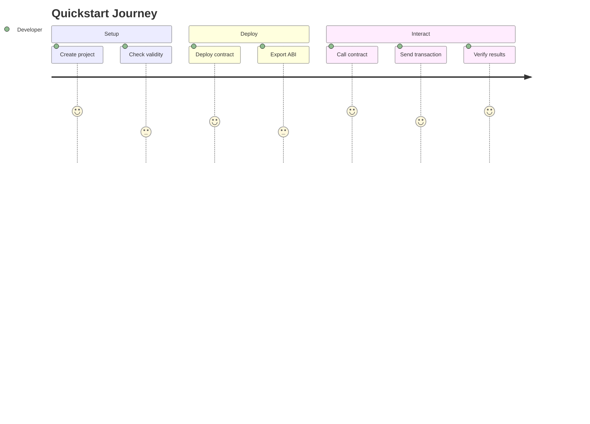

# Phase 3: Content Consolidation - Implementation Guide

**Duration:** ~12 hours
**Files Modified:** 4
**New Files:** 12 (8 SDK files + prerequisites + 3 partials)
**Deleted Files:** 2
**Diagrams Added:** 1

## Overview

Phase 3 focuses on eliminating content duplication by:
1. Merging overlapping conceptual content
2. Breaking up oversized files (rust-sdk-guide.md at 536 lines)
3. Extracting repeated setup instructions into reusable partials
4. Adding visual journey map to quickstart

## Pre-Phase 3 Checklist

- [ ] Phase 1 completed successfully
- [ ] Phase 2 completed successfully
- [ ] Current build passes
- [ ] Working on branch `stylus-docs-restructure`
- [ ] Tag `phase-2-complete` exists

## Phase 3 Tasks

### Task 3.1: Merge VM/Language Differences

**Goal:** Consolidate `evm-differences.mdx` and parts of `solidity-differences.mdx` into `vm-differences.mdx`

#### Step 1: Create vm-differences.mdx

Read both existing files:

```bash
cat docs/stylus/concepts/evm-differences.mdx
cat docs/stylus/advanced/solidity-differences.mdx
```

Create the merged file `docs/stylus/concepts/vm-differences.mdx`:

```mdx
---
title: 'VM and execution differences'
description: 'Understand the differences between EVM and WASM execution models in Stylus'
user_story: 'As a developer, I want to understand how WASM execution differs from EVM'
content_type: concept
author: offchainlabs
sme: offchainlabs
sidebar_position: 4
---

# VM and execution differences

Stylus introduces a WebAssembly (WASM) execution environment alongside the traditional Ethereum Virtual Machine (EVM). Understanding these differences is crucial for effective Stylus development.

## Execution model comparison

### EVM: Stack-based architecture

The EVM operates on a stack-based architecture:
- Instructions manipulate a 256-bit stack
- Each opcode is interpreted at runtime
- Gas charged before each operation
- Limited to 256-bit word size

### WASM: Register-based architecture

Stylus WASM uses a register-based model:
- Instructions operate on typed local variables
- Compiled to native code (AOT compilation)
- Ink charged in batches, converted to gas
- Supports 32-bit and 64-bit operations natively

[MERGE CONTENT FROM BOTH FILES HERE - Include execution model, memory model, gas metering differences, etc.]

## Key takeaways

- **Performance**: WASM execution is significantly faster due to native compilation
- **Gas efficiency**: Batch ink charging reduces overhead
- **Interoperability**: Both VMs share the same state, enabling seamless cross-VM calls
- **Developer experience**: Rust provides memory safety and modern tooling

---

For language-specific comparison between Rust and Solidity, see [Rust to Solidity differences](/stylus/advanced/rust-to-solidity-differences).
```

#### Step 2: Rename solidity-differences.mdx

```bash
# Rename to make purpose clearer
mv docs/stylus/advanced/solidity-differences.mdx docs/stylus/advanced/rust-to-solidity-differences.mdx

# Update frontmatter in the file
# Change title to: "Rust to Solidity differences"
# This file should focus on LANGUAGE differences, not VM differences
```

#### Step 3: Delete old evm-differences.mdx

```bash
rm docs/stylus/concepts/evm-differences.mdx
```

#### Step 4: Update sidebar

In `sidebars.js`, update the concepts section:

```javascript
{
  type: 'category',
  label: 'Concepts',
  items: [
    'stylus/concepts/webassembly',
    'stylus/concepts/activation',
    'stylus/concepts/gas-metering',
    'stylus/concepts/vm-differences',  // Changed from evm-differences
    'stylus/concepts/public-preview-expectations',
  ],
},
```

### Task 3.2: Break Up rust-sdk-guide.md

**Goal:** Split 536-line file into 8 focused files

#### Step 1: Create directory structure

```bash
mkdir -p docs/stylus/reference/rust-sdk
```

#### Step 2: Read the original file

```bash
cat docs/stylus/reference/rust-sdk-guide.md
```

#### Step 3: Create split files

Create each file by extracting relevant sections from the original:

**index.mdx** (~50 lines)
```mdx
---
title: 'Rust SDK overview'
description: 'Overview of the Stylus Rust SDK for building smart contracts'
user_story: 'As a Rust developer, I want to understand the Rust SDK structure'
content_type: reference
---

# Rust SDK overview

The Stylus Rust SDK provides a comprehensive framework for building smart contracts in Rust...

[Extract overview section from original]

## SDK components

- **Storage**: Persistent state management
- **Methods**: External and view functions
- **Events**: Emit and index blockchain events
- **Errors**: Type-safe error handling
- **Calls**: Inter-contract communication
- **Crypto**: Cryptographic operations
- **Bytes**: Low-level byte manipulation

## Getting started

```rust
use stylus_sdk::prelude::*;

#[storage]
pub struct Counter {
    count: StorageU256,
}
```

## Next steps

- [Storage management](./storage)
- [Defining methods](./methods)
- [Emitting events](./events)
```

**storage.mdx** (~80 lines)
```mdx
---
title: 'Storage management'
description: 'Persistent storage in Stylus contracts using the Rust SDK'
user_story: 'As a developer, I want to manage persistent state in my Stylus contract'
content_type: reference
---

# Storage management

[Extract storage section from original rust-sdk-guide.md]
```

**methods.mdx** (~70 lines)
```mdx
---
title: 'Contract methods'
description: 'Defining external and view methods in Stylus contracts'
user_story: 'As a developer, I want to create callable functions in my contract'
content_type: reference
---

# Contract methods

[Extract methods section]
```

**events.mdx** (~50 lines)
```mdx
---
title: 'Events and logging'
description: 'Emit and index events from Stylus contracts'
user_story: 'As a developer, I want to emit events from my contract'
content_type: reference
---

# Events and logging

[Extract events section]
```

**errors.mdx** (~40 lines)
```mdx
---
title: 'Error handling'
description: 'Type-safe error handling in Stylus contracts'
user_story: 'As a developer, I want to handle errors gracefully'
content_type: reference
---

# Error handling

[Extract errors section]
```

**calls.mdx** (~90 lines)
```mdx
---
title: 'Contract calls'
description: 'Make calls to other contracts from Stylus'
user_story: 'As a developer, I want to call other contracts'
content_type: reference
---

# Contract calls

[Extract calls section]
```

**crypto.mdx** (~60 lines)
```mdx
---
title: 'Cryptographic operations'
description: 'Hashing and cryptography in Stylus contracts'
user_story: 'As a developer, I want to use cryptographic functions'
content_type: reference
---

# Cryptographic operations

[Extract crypto section]
```

**bytes-programming.mdx** (~96 lines)
```mdx
---
title: 'Bytes programming'
description: 'Low-level byte manipulation in Stylus'
user_story: 'As a developer, I want to work with raw bytes efficiently'
content_type: reference
---

# Bytes programming

[Extract bytes programming section]
```

#### Step 4: Delete original file

```bash
rm docs/stylus/reference/rust-sdk-guide.md
```

#### Step 5: Update sidebar

```javascript
{
  type: 'category',
  label: 'Reference',
  items: [
    'stylus/reference/overview',
    {
      type: 'category',
      label: 'Rust SDK',
      items: [
        'stylus/reference/rust-sdk/index',
        'stylus/reference/rust-sdk/storage',
        'stylus/reference/rust-sdk/methods',
        'stylus/reference/rust-sdk/events',
        'stylus/reference/rust-sdk/errors',
        'stylus/reference/rust-sdk/calls',
        'stylus/reference/rust-sdk/crypto',
        'stylus/reference/rust-sdk/bytes-programming',
      ],
    },
    'stylus/reference/opcode-hostio-pricing',
  ],
},
```

### Task 3.3: Extract Setup from Quickstart

**Goal:** Create `fundamentals/prerequisites.mdx` and extract duplicate setup instructions

#### Step 1: Create prerequisites.mdx

```bash
cat > docs/stylus/fundamentals/prerequisites.mdx << 'EOF'
---
title: 'Prerequisites and setup'
description: 'Set up your development environment for Stylus'
user_story: 'As a new Stylus developer, I want to set up my development environment'
content_type: how-to
sidebar_position: 1
---

import RustSetup from '../partials/_setup-rust-toolchain.mdx';
import CargoStylusSetup from '../partials/_setup-cargo-stylus.mdx';
import DockerSetup from '../partials/_setup-docker-nitro.mdx';

# Prerequisites and setup

This guide will help you set up everything you need to develop Stylus contracts.

## System requirements

- **Operating System**: macOS, Linux, or Windows (WSL2)
- **RAM**: Minimum 8GB, 16GB recommended
- **Disk Space**: At least 20GB free

## Install Rust

<RustSetup />

## Install cargo-stylus CLI

<CargoStylusSetup />

## Install Docker (for local testnet)

<DockerSetup />

## Verify installation

```shell
# Check Rust version
rustc --version

# Check cargo-stylus
cargo stylus --version

# Check Docker
docker --version
```

Expected output:
```
rustc 1.75.0 (or higher)
cargo-stylus 0.x.x
Docker version 24.0.0 (or higher)
```

## Next steps

- [Create your first project](/stylus/quickstart)
- [Understand project structure](/stylus/fundamentals/project-structure)
- [Learn about contracts](/stylus/fundamentals/contracts)
EOF
```

#### Step 2: Create setup partials

**Rust toolchain partial:**

```bash
cat > docs/stylus/partials/_setup-rust-toolchain.mdx << 'EOF'
### Installing Rust

The Rust toolchain includes `rustc` (compiler), `cargo` (package manager), and `rustup` (version manager).

**macOS/Linux:**

```shell
curl --proto '=https' --tlsv1.2 -sSf https://sh.rustup.rs | sh
```

**Windows:**

Download and run [rustup-init.exe](https://rustup.rs/).

**Configure for WASM:**

```shell
rustup target add wasm32-unknown-unknown
```

**Verify:**

```shell
rustc --version
cargo --version
```
EOF
```

**cargo-stylus partial:**

```bash
cat > docs/stylus/partials/_setup-cargo-stylus.mdx << 'EOF'
### Installing cargo-stylus

The `cargo-stylus` CLI tool helps you create, build, and deploy Stylus contracts.

**Install:**

```shell
cargo install cargo-stylus
```

**Verify:**

```shell
cargo stylus --version
```

**Update:**

```shell
cargo install cargo-stylus --force
```
EOF
```

**Docker setup partial:**

```bash
cat > docs/stylus/partials/_setup-docker-nitro.mdx << 'EOF'
### Installing Docker for local testing

A local Arbitrum Nitro devnode allows you to test contracts before deploying to testnet.

**macOS:**

Download [Docker Desktop for Mac](https://docs.docker.com/desktop/install/mac-install/).

**Linux:**

```shell
curl -fsSL https://get.docker.com -o get-docker.sh
sudo sh get-docker.sh
```

**Windows:**

Download [Docker Desktop for Windows](https://docs.docker.com/desktop/install/windows-install/) (requires WSL2).

**Start Nitro devnode:**

```shell
docker run -p 8547:8547 offchainlabs/nitro-node:latest --dev
```

**Verify:**

```shell
curl -X POST http://localhost:8547 \
  -H "Content-Type: application/json" \
  -d '{"jsonrpc":"2.0","method":"eth_blockNumber","params":[],"id":1}'
```
EOF
```

#### Step 3: Streamline quickstart.mdx

Update `docs/stylus/quickstart.mdx` to reference prerequisites instead of duplicating:

```mdx
---
title: 'Quickstart: Build your first Stylus contract'
---

# Quickstart: Build your first Stylus contract

In this quickstart, you'll create, deploy, and interact with a simple counter contract written in Rust.

**Time to complete:** ~15 minutes

## Prerequisites

Before starting, ensure you have:
- Rust toolchain installed
- cargo-stylus CLI installed
- Access to an Arbitrum testnet

Don't have these set up? See [Prerequisites and setup](/stylus/fundamentals/prerequisites).

## Step 1: Create a new project

[Continue with hands-on steps, no setup duplication]
```

### Task 3.4: Add Quickstart Journey Diagram

Add Diagram #13 to quickstart.mdx after the introduction:

```mdx
## Your journey

This quickstart follows a simple path:



*Figure: Your path through this quickstart guide, from project creation to successful contract interaction.*

Let's get started!

## Step 1: Create a new project
```

### Task 3.5: Validate Phase 3

```bash
# Run build
yarn build

# Check for broken links
yarn build 2>&1 | grep -i "broken"

# Verify new structure
ls docs/stylus/reference/rust-sdk/
ls docs/stylus/fundamentals/prerequisites.mdx
ls docs/stylus/partials/_setup-*.mdx

# Test imports
grep -r "setup-rust-toolchain" docs/stylus/

# Start dev server and test
yarn start --no-open
# Check:
# - VM differences page exists
# - Rust SDK has 8 sub-pages
# - Prerequisites page renders with partials
# - Quickstart journey diagram renders
```

### Task 3.6: Commit Phase 3

```bash
git add -A
git commit -m "docs(stylus): Phase 3 - Content Consolidation

- Merge evm-differences + solidity-differences → vm-differences
- Rename solidity-differences → rust-to-solidity-differences
- Split rust-sdk-guide.md into 8 focused files
- Create fundamentals/prerequisites.mdx with setup partials
- Extract setup instructions into 3 reusable partials
- Streamline quickstart.mdx to reference prerequisites
- Add quickstart journey diagram (#13)

Files modified: 4
New files: 12 (8 SDK + prerequisites + 3 partials)
Deleted files: 2
Diagrams added: 1"

git tag phase-3-complete
```

## Phase 3 Success Criteria

- [ ] ✅ Build passes
- [ ] ✅ No duplicate setup instructions
- [ ] ✅ Rust SDK has 8 sub-pages
- [ ] ✅ VM differences merged successfully
- [ ] ✅ Quickstart journey diagram renders
- [ ] ✅ All partials import correctly
- [ ] ✅ Changes committed and tagged

## Rollback Phase 3

```bash
git reset --hard phase-2-complete
# or
git revert phase-3-complete
```

## Next Phase

Continue to Phase 4 in `IMPLEMENTATION_GUIDE_PHASE4.md` to create new content including best practices, troubleshooting, and core concept diagrams.
