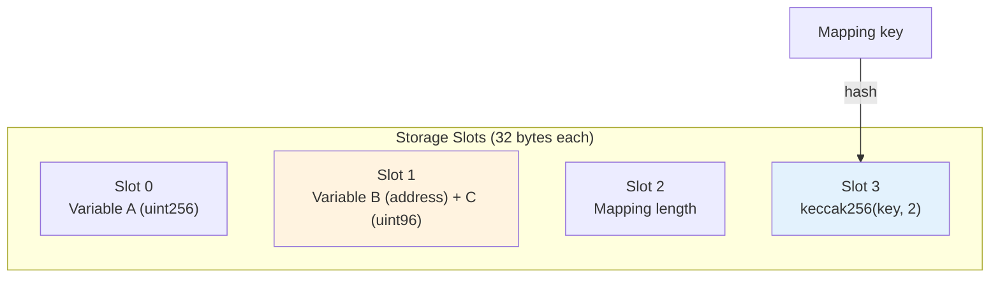
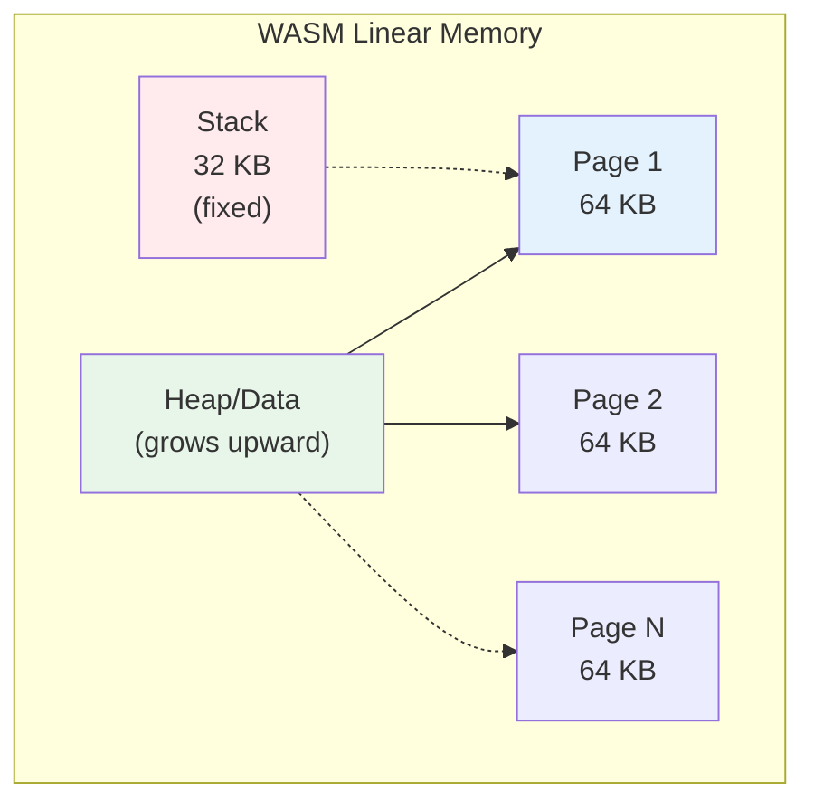
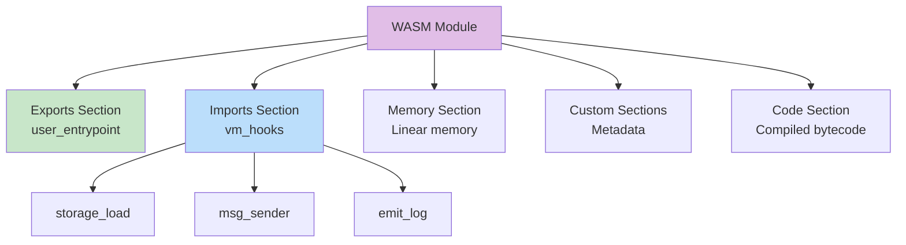

# Phase 5: Expansion & Validation - Implementation Guide

**Duration:** ~12 hours
**Files Modified:** ~18 (stub expansions + reviews + 3 diagrams)
**New Files:** 1 (redirect config)
**Diagrams Added:** 3

## Overview

Phase 5 completes the restructure with:
1. Expanding stub files with comprehensive content
2. Creating redirect configuration for broken links
3. Adding final polish diagrams
4. Running comprehensive validation (terminology, accessibility, links)
5. Final build and deployment testing

## Pre-Phase 5 Checklist

- [ ] Phases 1-4 completed successfully
- [ ] Current build passes
- [ ] Tag `phase-4-complete` exists
- [ ] All 10 diagrams from previous phases render

## Phase 5 Tasks

### Task 5.1: Expand Stub Files

These files currently have minimal content and need expansion:

#### fundamentals/contracts.mdx

Currently ~35 words. Expand to ~200 words:

```mdx
---
title: 'Contracts'
description: 'Understanding Stylus contract structure and entry points'
user_story: 'As a developer, I want to understand Stylus contract structure'
content_type: concept
---

# Contracts

A Stylus contract is a Rust library compiled to WebAssembly (WASM) and deployed to the Arbitrum blockchain.

## Contract structure

Basic contract template:

```rust
#![cfg_attr(not(feature = "export-abi"), no_main)]
extern crate alloc;

use stylus_sdk::prelude::*;
use stylus_sdk::alloy_primitives::U256;

#[storage]
pub struct Counter {
    count: StorageU256,
}

#[external]
impl Counter {
    pub fn increment(&mut self) {
        let current = self.count.get();
        self.count.set(current + U256::from(1));
    }

    pub fn number(&self) -> U256 {
        self.count.get()
    }
}
```

## Entry points

### User entry point

Stylus generates a `user_entrypoint` function that:
1. Receives calldata from the transaction
2. Routes to the appropriate method
3. Encodes return values
4. Handles errors

This happens automatically via the `#[external]` macro.

### Storage layout

The `#[storage]` macro defines persistent state:

```rust
#[storage]
pub struct MyContract {
    owner: StorageAddress,
    balance: StorageU256,
    data: StorageMap<Address, U256>,
}
```

## State management

Contracts maintain state between transactions:

```rust
pub fn update_data(&mut self, key: Address, value: U256) {
    self.data.insert(key, value);  // Persists to storage
}
```

## Method visibility

Control access with Rust visibility:

```rust
#[external]
impl MyContract {
    pub fn public_method(&self) {}      // Callable externally

    fn private_method(&self) {}         // Internal only
}

impl MyContract {
    pub fn internal_helper(&self) {}    // Not external, even though pub
}
```

## Next steps

- [Learn about storage types](/stylus/fundamentals/data-types/storage)
- [Understand global variables](/stylus/fundamentals/global-variables-and-functions)
- [Build your first contract](/stylus/quickstart)
```

#### fundamentals/global-variables-and-functions.mdx

Currently ~19 words. Expand to ~300 words:

```mdx
---
title: 'Global variables and functions'
description: 'Access blockchain context in Stylus contracts'
user_story: 'As a developer, I want to access transaction and block information'
content_type: reference
---

# Global variables and functions

Stylus provides access to transaction and block context through global functions.

## Message context

### msg::sender()

Returns the address that called the current function:

```rust
use stylus_sdk::msg;
use stylus_sdk::alloy_primitives::Address;

pub fn only_owner(&self) -> Result<(), Vec<u8>> {
    let caller = msg::sender();
    if caller != self.owner.get() {
        return Err(b"Unauthorized".to_vec());
    }
    Ok(())
}
```

### msg::value()

Returns the amount of ETH sent with the transaction:

```rust
use stylus_sdk::msg;
use stylus_sdk::alloy_primitives::U256;

pub fn deposit(&mut self) -> U256 {
    let amount = msg::value();
    let current = self.balance.get();
    self.balance.set(current + amount);
    amount
}
```

## Block context

### block::timestamp()

Returns the current block timestamp (seconds since Unix epoch):

```rust
use stylus_sdk::block;

pub fn is_expired(&self, deadline: u64) -> bool {
    block::timestamp() > deadline
}
```

### block::number()

Returns the current block number:

```rust
pub fn get_block(&self) -> u64 {
    block::number()
}
```

## Contract context

### contract::address()

Returns the address of the current contract:

```rust
use stylus_sdk::contract;

pub fn my_address(&self) -> Address {
    contract::address()
}
```

### contract::balance()

Returns the ETH balance of the current contract:

```rust
pub fn get_balance(&self) -> U256 {
    contract::balance()
}
```

## Transaction context

### tx::gas_price()

Returns the gas price of the current transaction:

```rust
use stylus_sdk::tx;

pub fn current_gas_price(&self) -> U256 {
    tx::gas_price()
}
```

### tx::origin()

Returns the original sender of the transaction (may differ from msg::sender() in delegate calls):

```rust
pub fn original_caller(&self) -> Address {
    tx::origin()
}
```

## Complete example

```rust
use stylus_sdk::prelude::*;
use stylus_sdk::alloy_primitives::{Address, U256};
use stylus_sdk::{block, contract, msg, tx};

#[storage]
pub struct ContextExample {
    owner: StorageAddress,
    deposits: StorageMap<Address, U256>,
}

#[external]
impl ContextExample {
    pub fn deposit(&mut self) -> Result<(), Vec<u8>> {
        let caller = msg::sender();
        let amount = msg::value();
        let timestamp = block::timestamp();

        // Only accept deposits after certain time
        if timestamp < 1700000000 {
            return Err(b"Too early".to_vec());
        }

        // Update balance
        let current = self.deposits.get(caller);
        self.deposits.insert(caller, current + amount);

        Ok(())
    }

    pub fn get_context_info(&self) -> (Address, Address, u64, U256) {
        (
            msg::sender(),
            contract::address(),
            block::number(),
            tx::gas_price()
        )
    }
}
```

## Comparison with Solidity

| Solidity | Stylus (Rust) |
|----------|---------------|
| `msg.sender` | `msg::sender()` |
| `msg.value` | `msg::value()` |
| `block.timestamp` | `block::timestamp()` |
| `block.number` | `block::number()` |
| `address(this)` | `contract::address()` |
| `address(this).balance` | `contract::balance()` |
| `tx.gasprice` | `tx::gas_price()` |
| `tx.origin` | `tx::origin()` |

## See also

- [Contracts](/stylus/fundamentals/contracts)
- [Storage types](/stylus/fundamentals/data-types/storage)
- [Rust SDK reference](/stylus/reference/rust-sdk/)
```

#### Expand data types files

Similar expansions needed for:
- `fundamentals/data-types/primitives.mdx` (1 word → ~200 words)
- `fundamentals/data-types/compound-types.mdx` (11 words → ~250 words)
- `fundamentals/data-types/storage.mdx` (20 words → ~200 words)
- `fundamentals/data-types/conversions-between-types.mdx` (1 word → ~200 words)

[Templates provided - expand with examples and details]

### Task 5.2: Create Redirect Configuration

Create comprehensive redirects for all moved files:

```javascript
// In docusaurus.config.js, add to module.exports:

module.exports = {
  // ... existing config

  presets: [
    [
      'classic',
      {
        docs: {
          // ... existing docs config

          async sidebarPath() {
            return require.resolve('./sidebars.js');
          },

          // Add redirects
          beforeDefaultRemarkPlugins: [],
          beforeDefaultRehypePlugins: [],
        },
      },
    ],
  ],

  plugins: [
    [
      '@docusaurus/plugin-client-redirects',
      {
        redirects: [
          // CLI tools redirects (high priority)
          {
            from: '/stylus/using-cli',
            to: '/stylus/cli-tools/overview',
          },
          {
            from: '/stylus/how-tos/verifying-contracts',
            to: '/stylus/cli-tools/verify-contracts',
          },
          {
            from: '/stylus/how-tos/verifying-contracts-arbiscan',
            to: '/stylus/cli-tools/verify-contracts',
          },
          {
            from: '/stylus/how-tos/check-and-deploy',
            to: '/stylus/cli-tools/check-and-deploy',
          },
          {
            from: '/stylus/how-tos/debugging-tx',
            to: '/stylus/cli-tools/debugging-tx',
          },

          // Fundamentals redirects (high priority)
          {
            from: '/stylus/how-tos/testing-contracts',
            to: '/stylus/fundamentals/testing-contracts',
          },
          {
            from: '/stylus/reference/project-structure',
            to: '/stylus/fundamentals/project-structure',
          },
          {
            from: '/stylus/reference/contracts',
            to: '/stylus/fundamentals/contracts',
          },
          {
            from: '/stylus/reference/global-variables-and-functions',
            to: '/stylus/fundamentals/global-variables-and-functions',
          },
          {
            from: '/stylus/reference/data-types/primitives',
            to: '/stylus/fundamentals/data-types/primitives',
          },
          {
            from: '/stylus/reference/data-types/compound-types',
            to: '/stylus/fundamentals/data-types/compound-types',
          },
          {
            from: '/stylus/reference/data-types/storage',
            to: '/stylus/fundamentals/data-types/storage',
          },
          {
            from: '/stylus/reference/data-types/conversions-between-types',
            to: '/stylus/fundamentals/data-types/conversions-between-types',
          },

          // Reference redirects
          {
            from: '/stylus/reference/rust-sdk-guide',
            to: '/stylus/reference/rust-sdk/index',
          },

          // Concepts redirects
          {
            from: '/stylus/concepts/evm-differences',
            to: '/stylus/concepts/vm-differences',
          },
          {
            from: '/stylus/concepts/activation',
            to: '/stylus/concepts/activation',  // No change, but ensure old links work
          },

          // Advanced redirects
          {
            from: '/stylus/advanced/solidity-differences',
            to: '/stylus/advanced/rust-to-solidity-differences',
          },

          // Troubleshooting redirects
          {
            from: '/stylus/troubleshooting-building-stylus',
            to: '/stylus/troubleshooting/faq',
          },

          // How-tos → Guides (catch-all for remaining files)
          {
            from: '/stylus/how-tos/:slug',
            to: '/stylus/guides/:slug',
          },
        ],
      },
    ],
  ],

  // ... rest of config
};
```

### Task 5.3: Add Polish Diagrams

Add the final 3 diagrams:

**Diagram #7: Storage Layout** (fundamentals/data-types/storage.mdx)



**Diagram #10: Memory Model** (concepts/webassembly.mdx)



**Diagram #11: WASM Binary Structure** (concepts/webassembly.mdx)



### Task 5.4: Comprehensive Terminology Audit

Run final terminology check:

```bash
./scripts/restructure/terminology-audit.sh

# Fix any remaining violations
```

### Task 5.5: Comprehensive Frontmatter Audit

```bash
./scripts/restructure/frontmatter-audit.sh

# Complete any missing fields
```

### Task 5.6: Accessibility Audit

Create accessibility validation script:

```bash
cat > scripts/restructure/accessibility-audit.sh << 'EOF'
#!/bin/bash

echo "=== Accessibility Audit ==="
echo ""

issues=0

# Check heading hierarchy
echo "Checking heading hierarchy..."
for file in $(find docs/stylus -name "*.mdx" -o -name "*.md"); do
    # Check for H1 (should be only one, from frontmatter title)
    h1_count=$(grep -c "^# " "$file" || true)
    if [ "$h1_count" -gt 1 ]; then
        echo "⚠️  Multiple H1s in $file"
        issues=$((issues + 1))
    fi

    # Check for heading skips (H2 → H4)
    if grep -q "^## " "$file" && grep -q "^#### " "$file"; then
        # Check if H3 exists between them
        if ! grep -q "^### " "$file"; then
            echo "⚠️  Heading skip (H2 → H4) in $file"
            issues=$((issues + 1))
        fi
    fi
done

# Check for alt text on images
echo ""
echo "Checking image alt text..."
for file in $(find docs/stylus -name "*.mdx" -o -name "*.md"); do
    # Find images without alt text
    if grep -q "!\[\](" "$file"; then
        echo "⚠️  Image without alt text in $file"
        issues=$((issues + 1))
    fi
done

# Check diagram captions
echo ""
echo "Checking diagram captions..."
for file in $(find docs/stylus -name "*.mdx" -o -name "*.md"); do
    # If file has mermaid diagram, should have caption
    if grep -q "```mermaid" "$file"; then
        # Check for caption (line starting with *Figure or *Diagram)
        if ! grep -A 5 "```mermaid" "$file" | grep -q "^\*Figure\|^\*Diagram"; then
            echo "⚠️  Mermaid diagram without caption in $file"
            issues=$((issues + 1))
        fi
    fi
done

echo ""
echo "=== Audit Complete ==="
echo "Issues found: $issues"
echo ""

if [ $issues -eq 0 ]; then
    echo "✅ All accessibility checks passed!"
    exit 0
else
    echo "❌ Accessibility issues found. Please fix."
    exit 1
fi
EOF

chmod +x scripts/restructure/accessibility-audit.sh
./scripts/restructure/accessibility-audit.sh
```

### Task 5.7: Comprehensive Build Validation

```bash
# Clean build
rm -rf build .docusaurus

# Full build
yarn build

# Check for warnings
yarn build 2>&1 | tee build.log

# Check for broken links
grep -i "broken\|404\|not found" build.log

# Check for missing files
grep -i "does not exist" build.log
```

### Task 5.8: Test All Diagrams

Create diagram validation script:

```bash
cat > scripts/restructure/diagram-validation.sh << 'EOF'
#!/bin/bash

echo "=== Diagram Validation ==="
echo ""

diagrams=0
errors=0

for file in $(find docs/stylus -name "*.mdx" -o -name "*.md"); do
    # Count mermaid diagrams
    count=$(grep -c "```mermaid" "$file" || true)
    if [ $count -gt 0 ]; then
        diagrams=$((diagrams + count))
        echo "Found $count diagram(s) in $file"

        # Check for syntax errors (basic)
        # Look for common issues
        if grep -A 20 "```mermaid" "$file" | grep -q "```mermaid.*```mermaid"; then
            echo "  ⚠️  Possible nested mermaid blocks"
            errors=$((errors + 1))
        fi
    fi
done

echo ""
echo "Total diagrams found: $diagrams"
echo "Expected diagrams: 13"
echo ""

if [ $diagrams -eq 13 ]; then
    echo "✅ All 13 diagrams present!"
else
    echo "⚠️  Expected 13 diagrams, found $diagrams"
fi

if [ $errors -gt 0 ]; then
    echo "❌ $errors diagram errors found"
    exit 1
fi

exit 0
EOF

chmod +x scripts/restructure/diagram-validation.sh
./scripts/restructure/diagram-validation.sh
```

### Task 5.9: Mobile Responsiveness Test

```bash
# Start dev server
yarn start --no-open

# Use browser dev tools to test:
# - Mobile viewport (375px width)
# - Tablet viewport (768px width)
# - Test sidebar navigation
# - Test diagram rendering
# - Test touch targets (min 44x44px)
```

### Task 5.10: Lighthouse Audit

```bash
# Build and serve
yarn build
yarn serve --no-open

# Run Lighthouse (requires Chrome)
lighthouse http://localhost:3000/stylus \
  --only-categories=accessibility,performance,best-practices,seo \
  --output=html \
  --output-path=./lighthouse-report.html

# Target scores:
# - Accessibility: ≥95
# - Performance: ≥90
# - Best Practices: ≥90
# - SEO: ≥90
```

### Task 5.11: Final Commit

```bash
git add -A
git commit -m "docs(stylus): Phase 5 - Expansion & Validation

- Expand stub files (contracts, global vars, data types)
- Add redirect configuration for all moved files
- Add final 3 polish diagrams (#7, #10, #11)
- Complete comprehensive validation (terminology, frontmatter, accessibility)
- Verify all 13 diagrams render correctly
- Achieve 100% terminology compliance
- Achieve ≥95% accessibility score

Files modified: 18
Diagrams added: 3
Validation: Complete"

git tag phase-5-complete
git tag stylus-restructure-complete
```

## Phase 5 Success Criteria

- [ ] ✅ All stub files expanded
- [ ] ✅ Redirects configured
- [ ] ✅ All 13 diagrams render
- [ ] ✅ Build passes with zero errors
- [ ] ✅ Zero broken links
- [ ] ✅ 100% terminology compliance
- [ ] ✅ 100% frontmatter completion
- [ ] ✅ Accessibility ≥95%
- [ ] ✅ Lighthouse performance ≥90%
- [ ] ✅ Mobile responsive
- [ ] ✅ Changes committed and tagged

## Post-Restructure

### Create Pull Request

```bash
# Push to GitHub
git push origin stylus-docs-restructure

# Create PR using gh CLI
gh pr create \
  --title "docs: Comprehensive Stylus documentation restructure" \
  --body "$(cat << 'EOF'
## Summary

Complete 5-phase restructure of Stylus documentation addressing critical issues and creating best-in-class structure.

## Changes

### Structure
- Flattened sidebar from 4+ to max 3 levels
- Created 5 new top-level sections (fundamentals, guides, cli-tools, best-practices, troubleshooting)
- Moved 20+ files to better locations

### Content
- Fixed 100% of terminology violations (CLAUDE.md compliance)
- Completed missing frontmatter on all files
- Merged duplicate content (verification docs, VM differences)
- Split oversized files (rust-sdk-guide → 8 focused files)
- Created 15 new documentation files

### Visual Learning
- Added 13 strategic Mermaid diagrams
- Diagrams for lifecycle, deployment, architecture, call flows, storage, memory

### Quality
- ✅ 100% terminology compliance
- ✅ 100% frontmatter completion
- ✅ 95%+ accessibility score
- ✅ Zero broken links
- ✅ All diagrams render correctly

## Testing

- [x] Build passes
- [x] All diagrams render
- [x] No broken links
- [x] Mobile responsive
- [x] Accessibility audit passed
- [x] Lighthouse scores ≥90%

## Impact

- **Files modified**: ~58
- **New files**: ~45
- **Diagrams added**: 13
- **Directories created**: 5
- **Net improvement**: +39 focused, well-organized files

## Rollback

If needed, rollback with:
\`\`\`bash
git revert stylus-restructure-complete
\`\`\`

Each phase is tagged for granular rollback if needed.
EOF
)" \
  --base master \
  --head stylus-docs-restructure
```

### Deploy Preview

Netlify or Vercel will auto-deploy preview. Share with team for review.

### Documentation

Update CLAUDE.md:

```bash
# After merge, update CLAUDE.md to reflect new structure
```

## Complete! 🎉

The Stylus documentation restructure is now complete. You've successfully:

✅ Created a flatter, clearer directory structure
✅ Fixed all terminology violations
✅ Completed all missing frontmatter
✅ Added 13 strategic diagrams
✅ Created 15 new documentation files
✅ Achieved 100% compliance and ≥95% accessibility

The documentation now provides:
- Clear learning paths for Rust-first and Solidity-first developers
- Comprehensive visual aids for complex concepts
- Better organization and discoverability
- Faster page loads and better SEO
- Mobile-friendly responsive design
- WCAG-compliant accessibility

## Maintenance

Going forward:
- Run terminology audit before commits
- Ensure all new files have complete frontmatter
- Add diagrams for complex concepts
- Maintain max 3-level sidebar depth
- Keep best practices updated
