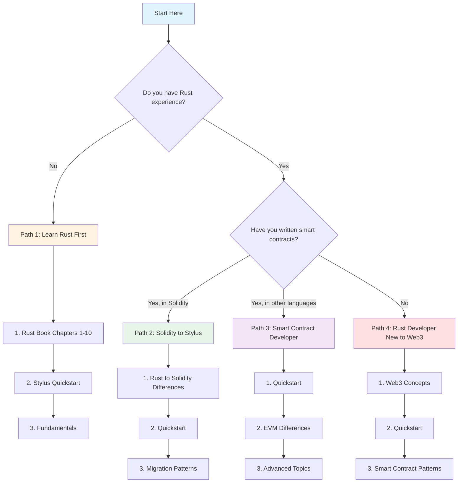

import ImageZoom from '@site/src/components/ImageZoom';

# Choose your learning path

Not sure where to start with Stylus? This guide helps you find the optimal learning path based on your background and goals.

## Quick path selector

_Figure: Choose your learning path based on your background and experience._

## Path 1: New to Rust

**Best for**: Developers experienced with other languages but new to Rust.

### Prerequisites

- Basic programming knowledge
- Familiarity with concepts like variables, functions, and control flow
- Optional: Smart contract development experience

### Recommended journey

1. **Learn Rust basics** (1-2 weeks)

   - Work through [The Rust Book](https://doc.rust-lang.org/book/) chapters 1-10
   - Focus on: ownership, borrowing, structs, enums, error handling
   - Practice with [Rustlings](https://github.com/rust-lang/rustlings)

2. **Start with Stylus** (2-3 days)

   - Complete the [Quickstart](/stylus/quickstart)
   - Understand [project structure](/stylus/fundamentals/project-structure)
   - Deploy your first contract

3. **Build fundamentals** (1 week)

   - Study [data types](/stylus/fundamentals/data-types/primitives)
   - Learn [storage patterns](/stylus/fundamentals/data-types/storage)
   - Practice [writing tests](/stylus/fundamentals/testing-contracts)

4. **Explore advanced topics** (ongoing)
   - Review [best practices](/stylus/best-practices/security)
   - Study [gas optimization](/stylus/best-practices/gas-optimization)
   - Build real projects

### Key resources

- [The Rust Book](https://doc.rust-lang.org/book/)
- [Stylus Quickstart](/stylus/quickstart)
- [Stylus by Example](https://stylus-by-example.org/)

---

## Path 2: Solidity developer

**Best for**: Experienced Solidity developers transitioning to Stylus.

### Prerequisites

- Strong Solidity knowledge
- Understanding of EVM and smart contract security
- No Rust experience required

### Recommended journey

1. **Understand the differences** (1 day)

   - Read [Rust to Solidity differences](/stylus/advanced/rust-to-solidity-differences)
   - Review [VM differences](/stylus/concepts/vm-differences)
   - Understand [type conversions](/stylus/fundamentals/data-types/conversions-between-types)

2. **Quick start** (1-2 days)

   - Complete the [Quickstart](/stylus/quickstart)
   - Compare with familiar Solidity patterns
   - Deploy a simple contract

3. **Learn Rust patterns** (3-5 days)

   - Study [ownership and borrowing](https://doc.rust-lang.org/book/ch04-00-understanding-ownership.html)
   - Learn [error handling](/stylus/fundamentals/data-types/primitives)
   - Understand [storage macros](/stylus/fundamentals/data-types/storage)

4. **Port existing contracts** (ongoing)
   - Start with simple contracts
   - Apply [security best practices](/stylus/best-practices/security)
   - Optimize for [gas efficiency](/stylus/best-practices/gas-optimization)

### Common migration patterns

| Solidity Pattern              | Stylus Equivalent           | Guide                                                                   |
| ----------------------------- | --------------------------- | ----------------------------------------------------------------------- |
| `mapping(address => uint)`    | `StorageMap<Address, U256>` | [Storage types](/stylus/fundamentals/data-types/storage)                |
| `require(condition, "error")` | `ensure!(condition, Error)` | [Error handling](/stylus/fundamentals/contracts#error-handling)         |
| `msg.sender`                  | `msg::sender()`             | [Global functions](/stylus/fundamentals/global-variables-and-functions) |
| `constructor`                 | `impl` with initialization  | [Contracts](/stylus/fundamentals/contracts)                             |
| Events                        | Derive `Erase` trait        | See Stylus SDK documentation                                            |

### Key resources

- [Rust to Solidity Differences](/stylus/advanced/rust-to-solidity-differences)
- [Stylus by Example](https://stylus-by-example.org/)
- [Solidity to Rust Cheat Sheet](https://docs.arbitrum.io/stylus)

---

## Path 3: Smart contract developer (non-Solidity)

**Best for**: Developers experienced with other smart contract platforms (Move, Cairo, Clarity, etc.).

### Prerequisites

- Smart contract development experience
- Understanding of blockchain concepts
- Basic programming knowledge

### Recommended journey

1. **Jump right in** (1-2 days)

   - Complete the [Quickstart](/stylus/quickstart)
   - Explore [project structure](/stylus/fundamentals/project-structure)
   - Deploy and interact with a contract

2. **Understand the execution model** (2-3 days)

   - Study [WebAssembly concepts](/stylus/concepts/webassembly)
   - Review [VM differences](/stylus/concepts/vm-differences)
   - Learn about [activation](/stylus/concepts/activation)

3. **Master Rust for smart contracts** (1 week)

   - Focus on [storage patterns](/stylus/fundamentals/data-types/storage)
   - Learn [contract structure](/stylus/fundamentals/contracts)
   - Understand [testing approaches](/stylus/fundamentals/testing-contracts)

4. **Advanced development** (ongoing)
   - Apply platform-specific optimizations
   - Implement cross-contract calls
   - Build production applications

### Key resources

- [Quickstart](/stylus/quickstart)
- [WebAssembly Concepts](/stylus/concepts/webassembly)
- [Advanced Topics](/stylus/advanced/rust-to-solidity-differences)

---

## Path 4: Rust developer new to Web3

**Best for**: Experienced Rust developers entering blockchain development.

### Prerequisites

- Strong Rust knowledge
- Understanding of ownership, traits, and async programming
- No blockchain experience required

### Recommended journey

1. **Learn blockchain basics** (2-3 days)

   - Understand [smart contracts](https://ethereum.org/en/developers/docs/smart-contracts/)
   - Learn about [gas and transactions](https://ethereum.org/en/developers/docs/gas/)
   - Study [EVM basics](https://ethereum.org/en/developers/docs/evm/)

2. **Quick start with Stylus** (1 day)

   - Complete the [Quickstart](/stylus/quickstart)
   - Your Rust skills transfer directly!
   - Deploy your first contract

3. **Web3-specific patterns** (3-5 days)

   - Learn [storage patterns](/stylus/fundamentals/data-types/storage)
   - Understand [global variables](/stylus/fundamentals/global-variables-and-functions)
   - Study [security considerations](/stylus/best-practices/security)

4. **Build applications** (ongoing)
   - Start with simple DeFi primitives
   - Implement events and logs
   - Optimize for [gas efficiency](/stylus/best-practices/gas-optimization)

### Rust skills that transfer well

- **Ownership model**: Natural fit for secure contract design
- **Type safety**: Prevents common smart contract bugs
- **Error handling**: `Result<T, E>` maps perfectly to contract errors
- **Testing**: Your testing skills apply directly
- **Performance optimization**: Critical for gas efficiency

### Key resources

- [Ethereum Smart Contracts](https://ethereum.org/en/developers/docs/smart-contracts/)
- [Stylus Quickstart](/stylus/quickstart)
- [Storage Patterns](/stylus/fundamentals/data-types/storage)

---

## General learning resources

Regardless of your path, these resources are valuable:

### Official documentation

- [Stylus Rust SDK Docs](https://docs.rs/stylus-sdk/latest/stylus_sdk/)
- [Cargo Stylus CLI](https://github.com/OffchainLabs/cargo-stylus)
- [Stylus by Example](https://stylus-by-example.org/)

### Community and support

- [Arbitrum Discord](https://discord.gg/arbitrum)
- [Developer Forums](https://forum.arbitrum.foundation/)
- [GitHub Discussions](https://github.com/OffchainLabs/stylus-sdk-rs/discussions)

### Practice projects

1. **Token contract**: Implement ERC-20 token standard
2. **NFT contract**: Build ERC-721 compatible NFT
3. **Simple DeFi**: Create a basic AMM or lending protocol
4. **DAO governance**: Implement voting and proposal system

## Need help choosing?

Still not sure which path is right for you? Consider these questions:

- **Do you want to learn Rust?** → Path 1 or Path 4
- **Do you already know Solidity?** → Path 2
- **Are you experienced with other smart contract platforms?** → Path 3
- **Do you want the fastest path to deployment?** → Path 2 or Path 3
- **Do you want to deeply understand the technology?** → Path 1 or Path 4

## Next steps

Ready to start? Begin with these essential guides:

1. [Prerequisites and setup](/stylus/fundamentals/prerequisites)
2. [Quickstart: Deploy your first contract](/stylus/quickstart)
3. [Project structure](/stylus/fundamentals/project-structure)

Good luck on your Stylus journey!
