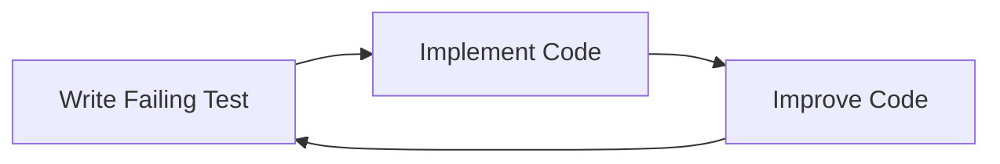

# Test Architecture - Complete Implementation Guide

**Arbitrum Documentation Graph Tool - Test Infrastructure**

---

## 📋 Overview

This repository contains a comprehensive test architecture for implementing three high-priority enhancements to the documentation-graph tool using Test-Driven Development (TDD). All test infrastructure, utilities, mocks, and documentation have been created and are ready for implementation.

---

## 🎯 What's Been Delivered

### ✅ Complete Test Infrastructure

1. **Configuration Files**

   - `/jest.config.js` - Comprehensive Jest configuration
   - `/babel.config.test.js` - ES module transformation
   - Path aliases, coverage thresholds, test sequencing

2. **Test Setup Files**

   - `/test/setup/jest.setup.js` - Custom matchers and global utilities
   - `/test/setup/testSequencer.js` - Ordered test execution (unit → integration → performance)
   - `/test/setup/globalSetup.js` - Pre-test environment setup
   - `/test/setup/globalTeardown.js` - Post-test cleanup

3. **Mock Implementations**

   - `/test/mocks/fileSystemMock.js` - In-memory file system
   - `/test/mocks/loggerMock.js` - Silent logger with spies

4. **Test Utilities**

   - `/test/helpers/testDataBuilder.js` - Fluent data builders (Graph, Document, Concept, Analysis, Visualization)
   - `/test/helpers/fixtureLoader.js` - Fixture loading utilities
   - `/test/helpers/assertionHelpers.js` - 20+ domain-specific assertions
   - `/test/helpers/performanceHelpers.js` - Performance measurement and benchmarking

5. **Documentation**
   - `/docs/TEST_ARCHITECTURE.md` - Complete architecture guide (30+ pages)
   - `/docs/TEST_SPECIFICATIONS.md` - Detailed test specifications (656 test cases)
   - `/docs/TEST_ARCHITECTURE_SUMMARY.md` - Quick reference guide
   - `/docs/TEST_ARCHITECTURE_DIAGRAM.md` - Visual diagrams (Mermaid)
   - `/docs/high-priority-enhancements-architecture.md` - Enhancement architecture

---

## 📁 Directory Structure

```
/Users/allup/dev/OCL/arbitrum-docs/documentation-graph/
│
├── jest.config.js                          ✅ Created
├── babel.config.test.js                    ✅ Created
├── TEST_ARCHITECTURE_README.md             ✅ Created (this file)
│
├── test/
│   ├── setup/                              ✅ Created
│   │   ├── jest.setup.js                   ✅ Custom matchers, utilities
│   │   ├── testSequencer.js                ✅ Test ordering
│   │   ├── globalSetup.js                  ✅ Environment setup
│   │   └── globalTeardown.js               ✅ Cleanup
│   │
│   ├── mocks/                              ✅ Created
│   │   ├── fileSystemMock.js               ✅ In-memory FS
│   │   └── loggerMock.js                   ✅ Logger mock
│   │
│   ├── helpers/                            ✅ Created
│   │   ├── testDataBuilder.js              ✅ Fluent builders
│   │   ├── fixtureLoader.js                ✅ Fixture utilities
│   │   ├── assertionHelpers.js             ✅ Custom assertions
│   │   └── performanceHelpers.js           ✅ Performance tools
│   │
│   ├── fixtures/                           ⏳ To be created
│   │   ├── schemas/                        ⏳ Valid fixtures
│   │   ├── invalid/                        ⏳ Error testing
│   │   ├── analysis/                       ⏳ Complete datasets
│   │   └── reports/                        ⏳ Expected outputs
│   │
│   ├── unit/                               ⏳ To be implemented
│   │   ├── validators/
│   │   ├── reporters/
│   │   └── visualizers/
│   │
│   ├── integration/                        ⏳ To be implemented
│   └── performance/                        ⏳ To be implemented
│
└── docs/
    ├── TEST_ARCHITECTURE.md                ✅ Complete guide
    ├── TEST_SPECIFICATIONS.md              ✅ Test specs
    ├── TEST_ARCHITECTURE_SUMMARY.md        ✅ Quick reference
    ├── TEST_ARCHITECTURE_DIAGRAM.md        ✅ Visual diagrams
    └── high-priority-enhancements-architecture.md
```

---

## 🚀 Quick Start

### 1. Install Dependencies

First, ensure all testing dependencies are installed:

```shell
npm install --save-dev \
  @jest/globals \
  jest \
  jest-extended \
  @babel/core \
  @babel/preset-env \
  @babel/plugin-transform-runtime \
  babel-jest
```

### 2. Verify Setup

Run the setup verification:

```shell
# Check Jest configuration
npm test -- --showConfig

# Run any existing tests
npm test
```

### 3. Create First Test

```javascript
// test/unit/validators/SchemaValidator.test.js
import { describe, test, expect, beforeEach } from '@jest/globals';
import { createMockFileSystem } from '@test/mocks/fileSystemMock';

describe('SchemaValidator', () => {
  let mockFs;

  beforeEach(() => {
    mockFs = createMockFileSystem();
  });

  test('should load schema files', async () => {
    // This test will fail - implement SchemaValidator to make it pass
    mockFs.addFile('/schemas/graph-schema.json', {
      $schema: 'http://json-schema.org/draft-07/schema#',
      $id: 'graph-schema.json',
      type: 'object',
    });

    // TODO: Implement SchemaValidator
    // const validator = new SchemaValidator();
    // await validator.loadSchemas();
    // expect(validator.schemas.size).toBeGreaterThan(0);
  });
});
```

---

## 📚 Available Test Utilities

### Custom Matchers

```javascript
// Schema validation
expect(schema).toBeValidSchema();

// Markdown validation
expect(markdown).toContainValidMarkdownTable();

// Cytoscape elements
expect(element).toBeValidCytoscapeElement();

// Validation results
expect(result).toBeValidationResult();
```

### Data Builders

```javascript
import {
  createGraphBuilder,
  createDocumentBuilder,
  createConceptBuilder,
  createAnalysisBuilder,
  createVisualizationBuilder,
} from '@test/helpers/testDataBuilder';

// Build test graph
const graph = createGraphBuilder().withRandomNodes(100, 'document').withRandomEdges(200).build();

// Build documents
const docs = createDocumentBuilder().withRandomDocuments(50).build();

// Build analysis for graph
const analysis = createAnalysisBuilder().forGraph(graph).build();
```

### Mocks

```javascript
import { createMockFileSystem } from '@test/mocks/fileSystemMock';
import { createMockLogger } from '@test/mocks/loggerMock';

const mockFs = createMockFileSystem();
mockFs.addFile('/test/data.json', { test: 'data' });

const mockLogger = createMockLogger();
// Logger is silent but records all calls
```

### Assertions

```javascript
import {
  assertValidGraph,
  assertValidNode,
  assertMarkdownTable,
  assertPerformance,
  assertMemoryUsage,
} from '@test/helpers/assertionHelpers';

assertValidGraph(graph);
assertMarkdownTable(report, ['Rank', 'Concept', 'Frequency']);
assertPerformance(duration, 5000, 'Operation name');
```

### Performance Helpers

```javascript
import { measureTime, measureMemory, benchmark } from '@test/helpers/performanceHelpers';

// Measure execution time
const { result, duration } = await measureTime(async () => {
  return await someOperation();
});

// Run benchmark
const stats = await benchmark(async () => {
  await operation();
}, 10); // 10 iterations

console.log(`Avg: ${stats.time.avg}ms`);
```

---

## 🧪 Running Tests

### Basic Commands

```shell
# Run all tests
npm test

# Run unit tests only
npm test -- test/unit

# Run specific test file
npm test -- test/unit/validators/SchemaValidator.test.js

# Run with coverage
npm test -- --coverage

# Run in watch mode
npm test -- --watch

# Run with verbose output
npm test -- --verbose
```

### Advanced Commands

```shell
# Run performance tests with GC
node --expose-gc node_modules/.bin/jest test/performance

# Run specific test by name
npm test -- -t "should validate graph data"

# Run with custom environment
VERBOSE_TESTS=true npm test
KEEP_TEST_OUTPUT=true npm test

# CI mode
npm run test:ci
```

### Package.json Scripts

Add these to your `package.json`:

```json
{
  "scripts": {
    "test": "jest",
    "test:unit": "jest test/unit",
    "test:integration": "jest test/integration",
    "test:performance": "node --expose-gc node_modules/.bin/jest test/performance",
    "test:watch": "jest --watch",
    "test:coverage": "jest --coverage",
    "test:ci": "jest --ci --coverage --maxWorkers=2"
  }
}
```

---

## 📊 Coverage Requirements

### Thresholds

| Metric     | Minimum | Target |
| ---------- | ------- | ------ |
| Lines      | 90%     | 95%    |
| Functions  | 90%     | 95%    |
| Branches   | 85%     | 90%    |
| Statements | 90%     | 95%    |

### Component-Specific

| Component   | Target |
| ----------- | ------ |
| Validators  | 95%    |
| Reporters   | 90%    |
| Visualizers | 95%    |
| Integration | 85%    |

### Viewing Coverage

```shell
# Generate coverage report
npm test -- --coverage

# Open in browser
open coverage/lcov-report/index.html

# Check thresholds
npm test -- --coverage --coverageThreshold='{
  "global": {"lines": 90, "functions": 90, "branches": 85}
}'
```

---

## 🎯 TDD Workflow

### Red-Green-Refactor Cycle



### Step-by-Step Process

1. **Write Failing Test (Red)**

   ```javascript
   test('should validate graph data', () => {
     const graph = createGraphBuilder().build();
     const validator = new DataValidator();
     const result = validator.validateGraph(graph);
     expect(result.valid).toBe(true);
   });
   ```

2. **Run Test - Verify Failure**

   ```shell
   npm test -- -t "should validate graph data"
   # Expected: Test fails (red)
   ```

3. **Implement Minimum Code (Green)**

   ```javascript
   class DataValidator {
     validateGraph(graph) {
       return { valid: true, errors: [] };
     }
   }
   ```

4. **Run Test - Verify Pass**

   ```shell
   npm test -- -t "should validate graph data"
   # Expected: Test passes (green)
   ```

5. **Refactor**
   - Improve code quality
   - Add proper validation logic
   - Keep tests passing

---

## 📝 Next Steps

### Week 1: Foundation ✅

- [x] Set up test infrastructure
- [x] Create mocks and utilities
- [x] Write documentation
- [ ] Create fixtures (in progress)

### Week 2-3: Enhancement 1 (JSON Schema)

**Tasks**:

1. Create schema fixtures
2. Write failing tests for schema definitions
3. Implement schemas (9 files)
4. Write failing tests for SchemaValidator
5. Implement SchemaValidator
6. Write failing tests for DataValidator
7. Implement DataValidator
8. Integration tests

**Files to Create**:

- `src/schemas/*.json` (9 schema files)
- `src/validators/SchemaValidator.js`
- `src/validators/DataValidator.js`
- `test/unit/validators/*.test.js`

### Week 4-5: Enhancement 2 (Report Generator)

**Tasks**:

1. Write failing tests for ReportBuilder
2. Implement ReportBuilder
3. Write failing tests for formatters (3 files)
4. Implement formatters
5. Write failing tests for sections (7 files)
6. Implement sections
7. Write failing tests for MarkdownReportGenerator
8. Implement MarkdownReportGenerator
9. Integration tests

**Files to Create**:

- `src/reporters/ReportBuilder.js`
- `src/reporters/formatters/*.js`
- `src/reporters/sections/*.js`
- `src/reporters/MarkdownReportGenerator.js`
- `test/unit/reporters/*.test.js`

### Week 6-7: Enhancement 3 (Visualization)

**Tasks**:

1. Write failing tests for DataExtractor
2. Implement DataExtractor
3. Write failing tests for ChunkedDataWriter
4. Implement ChunkedDataWriter
5. Modify HTML visualizer
6. Integration tests

**Files to Create**:

- `src/visualizers/DataExtractor.js`
- `src/visualizers/ChunkedDataWriter.js`
- Modify `src/visualizers/htmlVisualizer.js`
- `test/unit/visualizers/*.test.js`

### Week 8: Finalization

- [ ] Performance testing
- [ ] Full pipeline integration tests
- [ ] CI/CD setup
- [ ] Final review

---

## 📖 Documentation Reference

### Main Documents

1. **TEST_ARCHITECTURE.md** (30+ pages)

   - Complete architecture guide
   - Detailed setup instructions
   - Best practices

2. **TEST_SPECIFICATIONS.md** (74+ pages)

   - 656 detailed test cases
   - Acceptance criteria
   - Performance benchmarks

3. **TEST_ARCHITECTURE_SUMMARY.md**

   - Quick reference guide
   - Usage examples
   - Command cheat sheet

4. **TEST_ARCHITECTURE_DIAGRAM.md**

   - Visual diagrams (Mermaid)
   - Architecture flows
   - Component relationships

5. **high-priority-enhancements-architecture.md**
   - Enhancement designs
   - Implementation plans
   - Integration strategies

### Quick Links

- [Test Architecture](/Users/allup/dev/OCL/arbitrum-docs/documentation-graph/docs/TEST_ARCHITECTURE.md)
- [Test Specifications](/Users/allup/dev/OCL/arbitrum-docs/documentation-graph/docs/TEST_SPECIFICATIONS.md)
- [Architecture Summary](/Users/allup/dev/OCL/arbitrum-docs/documentation-graph/docs/TEST_ARCHITECTURE_SUMMARY.md)
- [Visual Diagrams](/Users/allup/dev/OCL/arbitrum-docs/documentation-graph/docs/TEST_ARCHITECTURE_DIAGRAM.md)

---

## 🔧 Troubleshooting

### Common Issues

**Issue**: Tests fail with module resolution errors

```shell
# Solution: Check Jest moduleNameMapper in jest.config.js
# Ensure path aliases are correct
```

**Issue**: Coverage not collected

```shell
# Solution: Run with explicit coverage flag
npm test -- --coverage --collectCoverageFrom='src/**/*.js'
```

**Issue**: Performance tests timeout

```shell
# Solution: Increase timeout in jest.config.js or test file
jest.setTimeout(120000); // 2 minutes
```

**Issue**: Memory tests inaccurate

```shell
# Solution: Run with --expose-gc
node --expose-gc node_modules/.bin/jest test/performance
```

### Debug Mode

```shell
# Run single test in debug mode
node --inspect-brk node_modules/.bin/jest test/unit/validators/SchemaValidator.test.js

# Open Chrome DevTools
# Navigate to chrome://inspect
# Click "inspect" on the Node.js target
```

---

## 🎉 Success Criteria

### Infrastructure ✅

- [x] Jest configured with coverage thresholds
- [x] Custom matchers implemented
- [x] Mocks created (file system, logger)
- [x] Test utilities built (builders, loaders, assertions, performance)
- [x] Documentation complete

### Testing (To Be Completed)

- [ ] 656 test cases implemented
- [ ] 90%+ overall coverage achieved
- [ ] All enhancements validated
- [ ] Performance benchmarks met
- [ ] CI/CD pipeline configured

### Deliverables ✅

- [x] Complete test architecture
- [x] Comprehensive documentation
- [x] Reusable test utilities
- [x] Mock implementations
- [x] Configuration files

---

## 📞 Support

### Files Created

All files are located at:

```
/Users/allup/dev/OCL/arbitrum-docs/documentation-graph/
```

### Key Files

- **Configuration**: `/jest.config.js`, `/babel.config.test.js`
- **Setup**: `/test/setup/*.js` (4 files)
- **Mocks**: `/test/mocks/*.js` (2 files)
- **Helpers**: `/test/helpers/*.js` (4 files)
- **Docs**: `/docs/TEST_*.md` (4 files)

### External Resources

- [Jest Documentation](https://jestjs.io/docs/getting-started)
- [TDD Best Practices](https://martinfowler.com/bliki/TestDrivenDevelopment.html)
- [JavaScript Testing Best Practices](https://github.com/goldbergyoni/javascript-testing-best-practices)

---

## ✅ Checklist for Implementation

### Setup ✅

- [x] Install Jest and dependencies
- [x] Configure Jest (`jest.config.js`)
- [x] Configure Babel (`babel.config.test.js`)
- [x] Create custom matchers
- [x] Create mocks (FS, Logger)
- [x] Create test utilities
- [x] Write documentation

### Next Steps

- [ ] Create test fixtures
- [ ] Implement Enhancement 1 (JSON Schema)
  - [ ] Schema definitions
  - [ ] SchemaValidator
  - [ ] DataValidator
  - [ ] Integration tests
- [ ] Implement Enhancement 2 (Report Generator)
  - [ ] ReportBuilder
  - [ ] Formatters
  - [ ] Section generators
  - [ ] Integration tests
- [ ] Implement Enhancement 3 (Visualization)
  - [ ] DataExtractor
  - [ ] ChunkedDataWriter
  - [ ] HTML modifications
  - [ ] Integration tests
- [ ] Set up CI/CD
- [ ] Final review and handoff

---

**Status**: ✅ Test infrastructure complete and ready for implementation

**Last Updated**: 2025-10-02

**Version**: 1.0.0
