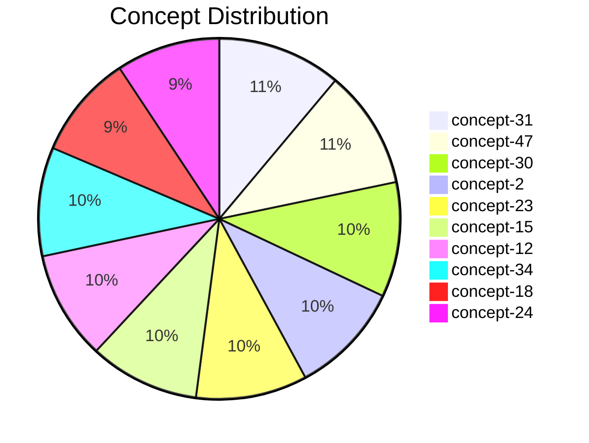

# Arbitrum Documentation Knowledge Graph - Phase 1 Analysis Report

<!-- Report Metadata
generated: 2025-10-03T17:49:00.464Z
documentsAnalyzed: 20
conceptsExtracted: 50
totalNodes: 20
totalEdges: 30
-->

## Table of Contents

1. [Executive summary](#executive-summary)
2. [Concept analysis](#concept-analysis)
3. [Hub documents](#hub-documents)
4. [Orphaned content](#orphaned-content)
5. [Quality assessment](#quality-assessment)
6. [Structure breakdown](#structure-breakdown)
7. [Recommendations](#recommendations)
8. [Interactive Visualization](#interactive-visualization)

## Executive summary

This report presents a comprehensive analysis of the documentation repository. The analysis examined 20 documents, extracted 50 unique concepts, and built a knowledge graph with 20 nodes and 30 edges.

### Key metrics

| Metric          | Value  | Details                           |
| --------------- | ------ | --------------------------------- |
| Total documents | 20     | Documentation files analyzed      |
| Unique concepts | 50     | Concepts extracted via NLP        |
| Graph nodes     | 20     | Total nodes in knowledge graph    |
| Graph edges     | 30     | Relationships between nodes       |
| Graph density   | 15.79% | Ratio of actual to possible edges |
| Avg connections | 3.00   | Average edges per node            |
| Quality score   | 75     | Overall documentation quality     |

### Critical findings

- **concept-31** is the most mentioned concept with 99 occurrences across 9 files
- Documentation has disconnected components requiring linking
- Overall quality score: 75/100

## Concept analysis

Extracted 50 unique concepts through NLP analysis. The following table shows the top 50 concepts by frequency.

### Top concepts by frequency

| Rank | Concept    | Frequency | Files | Category    | Type      |
| ---- | ---------- | --------- | ----- | ----------- | --------- |
| 1    | concept-31 | 99.0      | 9     | development | technical |
| 2    | concept-47 | 95.0      | 14    | development | general   |
| 3    | concept-30 | 92.0      | 5     | technical   | domain    |
| 4    | concept-2  | 90.0      | 14    | technical   | general   |
| 5    | concept-23 | 89.0      | 10    | development | general   |
| 6    | concept-15 | 88.0      | 5     | development | domain    |
| 7    | concept-12 | 87.0      | 13    | blockchain  | domain    |
| 8    | concept-34 | 87.0      | 17    | technical   | technical |
| 9    | concept-18 | 83.0      | 12    | technical   | domain    |
| 10   | concept-24 | 83.0      | 7     | blockchain  | domain    |
| 11   | concept-38 | 81.0      | 10    | technical   | general   |
| 12   | concept-21 | 73.0      | 17    | arbitrum    | domain    |
| 13   | concept-29 | 72.0      | 14    | arbitrum    | general   |
| 14   | concept-9  | 70.0      | 13    | arbitrum    | domain    |
| 15   | concept-5  | 69.0      | 3     | arbitrum    | general   |
| 16   | concept-37 | 66.0      | 9     | arbitrum    | technical |
| 17   | concept-48 | 65.0      | 13    | blockchain  | domain    |
| 18   | concept-22 | 63.0      | 4     | technical   | technical |
| 19   | concept-20 | 62.0      | 7     | blockchain  | general   |
| 20   | concept-0  | 61.0      | 18    | blockchain  | domain    |
| 21   | concept-14 | 59.0      | 4     | technical   | general   |
| 22   | concept-1  | 56.0      | 13    | arbitrum    | technical |
| 23   | concept-45 | 53.0      | 6     | arbitrum    | domain    |
| 24   | concept-32 | 52.0      | 16    | blockchain  | general   |
| 25   | concept-27 | 50.0      | 18    | development | domain    |
| 26   | concept-26 | 49.0      | 16    | technical   | general   |
| 27   | concept-33 | 49.0      | 17    | arbitrum    | domain    |
| 28   | concept-7  | 45.0      | 15    | development | technical |
| 29   | concept-6  | 41.0      | 19    | technical   | domain    |
| 30   | concept-41 | 41.0      | 14    | arbitrum    | general   |
| 31   | concept-35 | 38.0      | 12    | development | general   |
| 32   | concept-3  | 37.0      | 1     | development | domain    |
| 33   | concept-40 | 36.0      | 8     | blockchain  | technical |
| 34   | concept-44 | 36.0      | 20    | blockchain  | general   |
| 35   | concept-25 | 32.0      | 13    | arbitrum    | technical |
| 36   | concept-42 | 31.0      | 14    | technical   | domain    |
| 37   | concept-49 | 30.0      | 20    | arbitrum    | technical |
| 38   | concept-19 | 29.0      | 14    | development | technical |
| 39   | concept-4  | 28.0      | 17    | blockchain  | technical |
| 40   | concept-10 | 26.0      | 9     | technical   | technical |
| 41   | concept-11 | 26.0      | 14    | development | general   |
| 42   | concept-46 | 26.0      | 16    | technical   | technical |
| 43   | concept-16 | 21.0      | 18    | blockchain  | technical |
| 44   | concept-28 | 17.0      | 20    | blockchain  | technical |
| 45   | concept-36 | 17.0      | 2     | blockchain  | domain    |
| 46   | concept-39 | 16.0      | 10    | development | domain    |
| 47   | concept-8  | 11.0      | 15    | blockchain  | general   |
| 48   | concept-43 | 11.0      | 2     | development | technical |
| 49   | concept-17 | 10.0      | 16    | arbitrum    | general   |
| 50   | concept-13 | 7.0       | 15    | arbitrum    | technical |

### Concept categories

| Category    | Count | Percentage |
| ----------- | ----- | ---------- |
| development | 12    | 24.00%     |
| technical   | 12    | 24.00%     |
| blockchain  | 13    | 26.00%     |
| arbitrum    | 13    | 26.00%     |

### Top 10 concepts visualization



## Hub documents

Hub documents analysis will be implemented in a future phase.

## Orphaned content

Orphaned content analysis will be implemented in a future phase.

## Quality assessment

Quality assessment will be implemented in a future phase.

## Structure breakdown

Structure breakdown will be implemented in a future phase.

## Recommendations

Recommendations will be implemented in a future phase.

## Interactive Visualization

An interactive knowledge graph visualization has been generated. This visualization provides dynamic exploration of the documentation structure.

### Accessing the visualization

To view the interactive visualization, run the following command:

```shell
npm run serve
```

Then open your browser to http://localhost:8080 to explore the knowledge graph.

### Visualization features

- Dynamic exploration of document relationships
- Centrality analysis highlighting important documents
- Search functionality to find specific documents or concepts
- Filter options to focus on specific content areas
- Export capabilities for sharing insights
