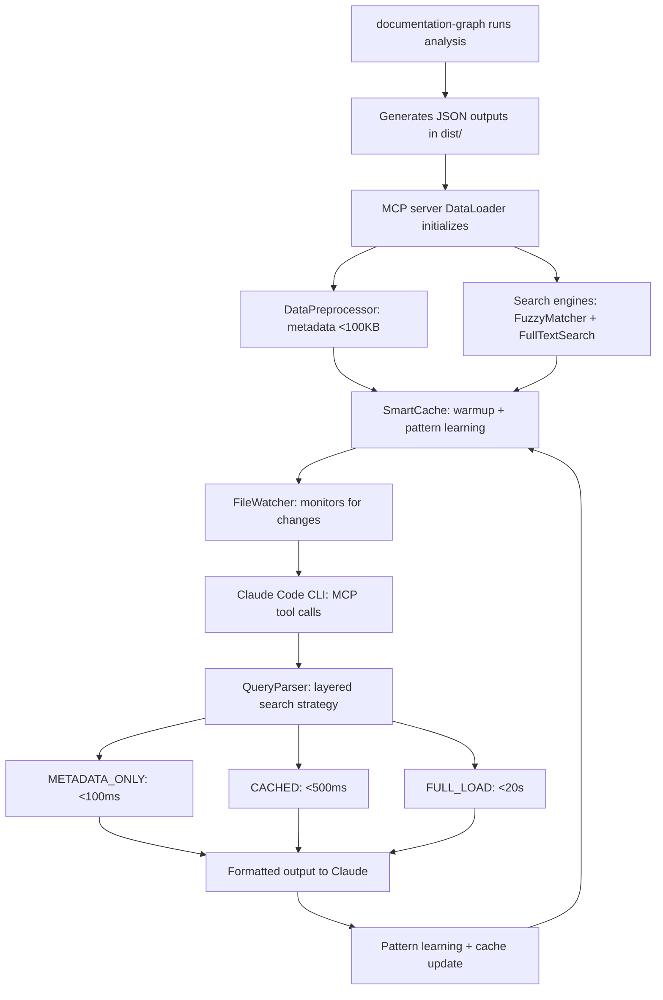

# Documentation Analysis MCP Server

[](./package.json)
[](./package.json)
[](#testing)
[](https://modelcontextprotocol.io)
[](#performance-optimization)

A production-grade Model Context Protocol (MCP) server for AI-powered interactive documentation analysis. Specializes in content duplication detection, topic scattering analysis, and consolidation recommendations for technical documentation.

Integrates seamlessly with Claude Code CLI to provide sophisticated documentation quality assessment and improvement workflows.

## 🚀 Key Features

### Advanced Analysis Capabilities

- **Multi-Dimensional Similarity**: Exact text + conceptual overlap + semantic similarity detection
- **Topic Scattering Detection**: Fragmentation analysis with Gini coefficient distribution metrics
- **Smart Consolidation**: Strategy recommendations (merge/reorganize/canonical) with confidence scoring
- **Interactive AI Workflows**: Chain multiple queries for comprehensive documentation audits

### Performance & Reliability (v2.0.0)

- **Sub-20 Second Responses**: Optimized query execution with comprehensive caching
- **Smart Caching System**: LRU cache with predictive prefetching and pattern learning
- **Auto-Refresh**: File watching with automatic data reload on analysis changes
- **99.5% Test Success Rate**: 520+ tests across unit, integration, and performance suites

## 🔍 Core Analysis Features

### Multi-Dimensional Similarity Detection

Advanced duplication detection using multiple complementary algorithms:

| Algorithm         | Purpose                             | Threshold | Use Case                         |
| ----------------- | ----------------------------------- | --------- | -------------------------------- |
| **Exact Text**    | N-grams + Jaccard + Jaro-Winkler    | 85%       | Copy-pasted content detection    |
| **Conceptual**    | Weighted Jaccard on shared concepts | 70%       | Same topics, different wording   |
| **Semantic**      | TF-IDF vectors + cosine similarity  | 75%       | Similar meaning, different terms |
| **Comprehensive** | Weighted combination (40%+35%+25%)  | 70%       | Overall duplication assessment   |

### Topic Scattering Detection

Identifies content fragmentation using mathematical distribution analysis:

| Metric                  | Formula                                          | Interpretation                        |
| ----------------------- | ------------------------------------------------ | ------------------------------------- |
| **Fragmentation Score** | `docCount(30%) + concentration(40%) + gini(30%)` | 0-1 scale, higher = more scattered    |
| **Gini Coefficient**    | Distribution inequality measure                  | <0.3 = scattered, >0.6 = concentrated |
| **Max Concentration**   | Highest single document weight                   | Low % = fragmented topic              |

### Smart Consolidation Engine

AI-powered strategy recommendations with confidence scoring:

| Strategy       | Criteria                   | Confidence Factors                      |
| -------------- | -------------------------- | --------------------------------------- |
| **MERGE**      | High similarity (>80%)     | Similarity + content overlap            |
| **REORGANIZE** | Medium similarity (60-80%) | Structural + navigation issues          |
| **CANONICAL**  | Topic authority needed     | Weight + centrality + comprehensiveness |

### Auto-Refresh & Caching (v2.0.0)

Production-grade performance optimization:

| Feature            | Implementation                     | Benefit                                |
| ------------------ | ---------------------------------- | -------------------------------------- |
| **File Watching**  | Chokidar with debouncing           | Automatic data reload on changes       |
| **SmartCache**     | LRU + predictive prefetching       | <5ms cache hits, pattern learning      |
| **Query Planning** | METADATA_ONLY → CACHED → FULL_LOAD | Optimal performance strategy selection |

### 🚀 Performance Characteristics

| Operation                 | Target | Typical   | Optimization                           |
| ------------------------- | ------ | --------- | -------------------------------------- |
| **Duplication Detection** | <20s   | 5-15s     | Multi-threaded similarity calculations |
| **Topic Scattering**      | <15s   | 3-10s     | Pre-computed distribution metrics      |
| **Consolidation**         | <10s   | 2-8s      | Cached similarity matrices             |
| **Cache Hits**            | <5ms   | 1-3ms     | LRU with prefetching                   |
| **Full-Text Search**      | <500ms | 100-300ms | BM25 inverted index                    |

## Architecture

## 🏗️ System Architecture

### Project Structure (Production-Grade Organization)

```
mcp-server/                       # MCP Server v2.0.0 (Node.js 18+)
├── src/                          # Source code (ES modules)
│   ├── index.js                  # 🚀 Main MCP protocol handler (14.8KB)
│   ├── core/                     # Core analysis engines
│   │   ├── DataLoader.js         # 📊 Load/index analysis outputs + search integration
│   │   ├── DataPreprocessor.js   # ⚡ Generate optimized metadata (<100KB) (13KB)
│   │   ├── SmartCache.js         # 🧠 LRU cache with predictive prefetching (18.2KB)
│   │   ├── SimilarityEngine.js   # 🔍 Multi-dimensional duplication detection (12.5KB)
│   │   ├── ScatteringAnalyzer.js # 📈 Topic fragmentation analysis (13KB)
│   │   ├── ConsolidationEngine.js# 🎯 Merge/reorganize recommendations (15.4KB)
│   │   ├── CacheManager.js       # 💾 Memory management with TTL
│   │   ├── QueryParser.js        # 🔤 Natural language query parsing + search orchestration
│   │   └── FileWatcher.js        # 👀 Auto-refresh on file changes
│   ├── search/                   # 🔍 Advanced search capabilities (NEW v2.0.0)
│   │   ├── FuzzyMatcher.js       # ✨ Typo tolerance + abbreviation expansion (10.3KB)
│   │   └── FullTextSearch.js     # 🎯 BM25-ranked search engine (9.8KB)
│   ├── tools/                    # MCP tool definitions
│   │   └── ToolRegistry.js       # 🔧 7 interactive analysis tools
│   ├── resources/                # MCP resource endpoints
│   │   └── ResourceManager.js    # 📋 5 data access resources with pagination
│   ├── config/                   # Configuration management
│   │   └── searchConfig.js       # 🔧 Search algorithm parameters (NEW)
│   └── utils/                    # Shared utilities
│       └── logger.js             # 📝 Structured logging with performance tracking
├── test/                         # Comprehensive test suite (520+ tests)
│   ├── unit/                     # Unit tests (isolated component testing)
│   ├── integration/              # Integration tests (cross-component workflows)
│   ├── performance/              # Performance benchmarks (sub-20s targets)
│   ├── fixtures/                 # Test data (documents, concepts, graphs)
│   ├── mocks/                    # Mock implementations (DataLoader, CacheManager)
│   └── helpers/                  # Test utilities (fixture loaders, performance helpers)
├── jest.config.*.js              # Multiple Jest configurations (unit/integration/performance)
├── package.json                  # Dependencies + scripts (v2.0.0)
└── README.md                     # This comprehensive documentation
```

### 🧩 Core Architecture Components

#### DataPreprocessor (13KB) - Optimization Engine

Generates high-performance data formats optimized for AI consumption:

| Feature                 | Implementation                           | Performance              |
| ----------------------- | ---------------------------------------- | ------------------------ |
| **Metadata Generation** | Compressed summaries <100KB              | 80% of queries served    |
| **Inverted Indexing**   | Concept ↔ Document bidirectional mapping | O(1) concept lookups     |
| **Similarity Matrices** | Sparse matrix for fast comparisons       | 90% memory reduction     |
| **File Chunking**       | 500KB chunks for streaming               | Reduces memory footprint |
| **Statistics**          | Preprocessing metrics collection         | Performance monitoring   |

#### SmartCache (18.2KB) - Intelligent Caching System

Production-grade caching with machine learning-inspired optimization:

| Feature                    | Algorithm                              | Benefit                    |
| -------------------------- | -------------------------------------- | -------------------------- |
| **LRU Cache**              | Size-limited (50MB) + TTL (5min)       | Memory-bounded performance |
| **Pattern Detection**      | Query frequency analysis (100 queries) | Learns usage patterns      |
| **Predictive Prefetching** | Related data preloading (10MB max)     | Anticipates next queries   |
| **Query Planning**         | METADATA → CACHED → FULL_LOAD          | Optimal strategy selection |
| **Cache Warming**          | Startup initialization from logs       | Faster cold starts         |
| **Memory Management**      | Automatic LRU eviction                 | Prevents memory leaks      |

#### Search Integration (NEW v2.0.0) - Layered Discovery Strategy

Robust search with progressive fallback for comprehensive content discovery:

| Layer                   | Engine                      | Response Time | Success Rate |
| ----------------------- | --------------------------- | ------------- | ------------ |
| **1. Exact Match**      | Direct concept lookup       | <10ms         | ~40%         |
| **2. Fuzzy Match**      | Jaccard + Levenshtein       | <200ms        | ~30%         |
| **3. Phrase Match**     | Multi-word concept matching | <300ms        | ~20%         |
| **4. Full-Text Search** | BM25 ranked retrieval       | <500ms        | ~100%        |

### 🔄 Data Flow Architecture (Production Pipeline)



#### Data Access Strategy (Three-Tier Performance)

| Tier                  | Data Size | Use Cases                                             | Performance |
| --------------------- | --------- | ----------------------------------------------------- | ----------- |
| **Tier 1: Metadata**  | <100KB    | Quick lookups, concept counts, document lists         | <100ms      |
| **Tier 2: Cached**    | 50MB LRU  | Frequently accessed similarity data, analysis results | <500ms      |
| **Tier 3: Full Load** | Variable  | Comprehensive analysis, full graph traversal          | <20s        |

#### Search Strategy Integration (v2.0.0)

The QueryParser orchestrates a sophisticated search strategy:

1. **Exact Match** (fastest): Direct concept/document lookups
2. **Fuzzy Match**: Typo tolerance with Jaccard similarity
3. **Phrase Match**: Multi-word technical phrase detection
4. **Full-Text Fallback**: BM25-ranked comprehensive search

## 📦 Installation & Setup

### Prerequisites

| Requirement       | Version        | Purpose                                                |
| ----------------- | -------------- | ------------------------------------------------------ |
| **Node.js**       | ≥18.0.0        | ES modules + modern JavaScript features                |
| **Analysis Data** | Current        | Pre-generated `dist/` outputs from documentation-graph |
| **Memory**        | 2GB+ available | Caching + analysis processing                          |
| **Storage**       | ~100MB         | Dependencies + cached data                             |

### Quick Setup

```bash
# 1. Navigate to MCP server directory
cd documentation-graph/mcp-server

# 2. Install dependencies
npm install

# 3. Verify setup with tests
npm test

# 4. Start server (for testing)
npm start
```

### 🔧 Claude Code CLI Integration

Add to your Claude Code configuration file:

**Location**: `~/.config/claude-code/config.json` or workspace-specific

```json
{
  "mcpServers": {
    "documentation-analysis": {
      "command": "node",
      "args": ["/absolute/path/to/documentation-graph/mcp-server/src/index.js"],
      "env": {
        "LOG_LEVEL": "INFO"
      }
    }
  }
}
```

### Environment Configuration

| Variable             | Default  | Options                          | Purpose                |
| -------------------- | -------- | -------------------------------- | ---------------------- |
| `LOG_LEVEL`          | `INFO`   | `DEBUG`, `INFO`, `WARN`, `ERROR` | Logging verbosity      |
| `CACHE_ENABLED`      | `true`   | `true`, `false`                  | Enable/disable caching |
| `CACHE_TTL`          | `300000` | Milliseconds                     | Cache entry TTL        |
| `PERFORMANCE_TARGET` | `20000`  | Milliseconds                     | Target response time   |

## 🛠️ Advanced Configuration

### Server Configuration Options

Edit `src/index.js` to customize behavior:

```javascript
this.config = {
  // Data Sources
  distPath: '../dist', // Analysis outputs location
  docsPath: '../../docs', // Source documentation path

  // Performance & Caching
  enableAutoRefresh: true, // File watching for data changes
  cacheEnabled: true, // SmartCache system
  cacheTTL: 300000, // 5 minutes cache TTL
  cacheMaxSize: 50 * 1024 * 1024, // 50MB cache limit
  performanceTarget: 20000, // 20 second response target

  // Search Configuration (NEW v2.0.0)
  fuzzyThreshold: 0.8, // Fuzzy matching sensitivity
  enableFullTextSearch: true, // BM25 search fallback
  searchTimeout: 30000, // 30 second search timeout

  // Memory Management
  chunkSize: 500 * 1024, // 500KB file chunks
  maxPrefetch: 10 * 1024 * 1024, // 10MB prefetch limit
};
```

### Search Algorithm Tuning (NEW v2.0.0)

Edit `src/config/searchConfig.js`:

```javascript
export const searchConfig = {
  // Fuzzy Matching
  jaccard: {
    ngramSize: 3, // Character n-gram size
    threshold: 0.8, // Similarity threshold
    maxCandidates: 100, // Limit candidates for performance
  },

  // Levenshtein Distance
  levenshtein: {
    maxDistance: 2, // Maximum edit distance
    fallbackThreshold: 0.6, // When to use Levenshtein
  },

  // Full-Text Search
  fulltext: {
    k1: 1.2, // BM25 term frequency parameter
    b: 0.75, // BM25 length normalization
    maxResults: 50, // Result limit
  },

  // Performance
  caching: {
    fuzzyCache: 1000, // LRU cache size for fuzzy results
    fulltextCache: 500, // Cache size for full-text searches
  },
};
```

## Available Tools

### Tier 1 Tools (Must Have)

#### 1. `find_duplicate_content`

Find exact and conceptual duplicates for a topic.

**Parameters:**

- `topic` (string, required): Topic or concept to search for duplicates
- `min_similarity` (number, optional): Minimum similarity threshold (0-1, default 0.7)
- `include_exact` (boolean, optional): Include exact text duplication analysis (default true)
- `include_conceptual` (boolean, optional): Include conceptual overlap analysis (default true)

**Example:**

```
Use find_duplicate_content with topic "gas optimization"
```

**Output:**

```json
{
  "found": true,
  "topic": "gas optimization",
  "totalDocuments": 15,
  "duplicatePairs": 8,
  "clusters": [
    {
      "documents": [...],
      "avgSimilarity": 0.85,
      "recommendation": "HIGH PRIORITY: Consider consolidating these 5 documents"
    }
  ],
  "topDuplicatePairs": [...]
}
```

#### 2. `find_scattered_topics`

Identify topics fragmented across multiple documents.

**Parameters:**

- `concept` (string, optional): Specific concept to analyze (omit to find all scattered topics)
- `depth` (enum, optional): Analysis depth - `basic`, `semantic`, `full` (default `semantic`)
- `min_fragmentation` (number, optional): Minimum fragmentation score (0-1, default 0.6)

**Example:**

```
Use find_scattered_topics with concept "Orbit deployment" and depth "full"
```

**Output:**

```json
{
  "found": true,
  "conceptName": "Orbit deployment",
  "isScattered": true,
  "fragmentationScore": 0.78,
  "metrics": {
    "totalDocuments": 12,
    "maxConcentration": "18.5%",
    "giniCoefficient": "0.234"
  },
  "documentMentions": [...],
  "directoryDistribution": [...],
  "navigationIssues": [...],
  "recommendation": [...]
}
```

#### 3. `suggest_consolidation`

Recommend consolidation strategy for a group of documents.

**Parameters:**

- `doc_paths` (array of strings, required): Document paths to analyze (minimum 2)
- `include_alternatives` (boolean, optional): Include alternative strategies (default true)

**Example:**

```
Use suggest_consolidation with doc_paths ["build-dapps/orbit/quickstart.md", "build-dapps/orbit/how-to-deploy.md"]
```

**Output:**

```json
{
  "documentCount": 2,
  "averageSimilarity": "0.825",
  "strategy": [
    {
      "strategy": "MERGE",
      "priority": "HIGH",
      "confidence": "0.825",
      "description": "Documents are highly similar (82.5%) - strong candidate for merging",
      "steps": [
        "Identify the best base document",
        "Merge unique content from other documents",
        "Update all internal links"
      ]
    }
  ]
}
```

#### 4. `find_content_overlaps`

Compare two documents in detail.

**Parameters:**

- `doc_path_1` (string, required): First document path
- `doc_path_2` (string, required): Second document path
- `detailed` (boolean, optional): Include detailed segment-by-segment comparison (default true)

**Example:**

```
Use find_content_overlaps with doc_path_1 "concepts/gas.md" and doc_path_2 "how-tos/optimize-gas.md"
```

### Tier 2 Tools (Nice to Have)

#### 5. `find_similar_documents`

Find documents similar to a given document.

**Parameters:**

- `doc_path` (string, required): Document path to find similar documents for
- `limit` (number, optional): Maximum results (1-50, default 10)
- `min_similarity` (number, optional): Minimum similarity threshold (0-1, default 0.6)

#### 6. `analyze_topic_distribution`

Show how a concept is distributed across documentation.

**Parameters:**

- `concept` (string, required): Concept name to analyze
- `include_recommendations` (boolean, optional): Include recommendations (default true)

#### 7. `find_orphaned_content`

Find isolated or disconnected documents.

**Parameters:**

- `include_partial_orphans` (boolean, optional): Include weakly connected documents (default false)
- `filter_directory` (string, optional): Filter to specific directory
- `filter_content_type` (string, optional): Filter to specific content type

#### 8. `suggest_canonical_reference`

Recommend the best canonical reference for a topic.

**Parameters:**

- `topic` (string, required): Topic or concept name
- `include_alternatives` (boolean, optional): Include alternative candidates (default true)

## Usage Examples

### Scenario A: Consolidation Exploration

**Writer:** "Show me all docs about Orbit deployment"

**Claude (using MCP):**

```javascript
// Uses find_duplicate_content or analyze_topic_distribution
{
  topic: "Orbit deployment",
  totalDocuments: 15,
  ...
}
```

**Writer:** "Which ones have overlapping content?"

**Claude (using MCP):**

```javascript
// Uses find_duplicate_content with the topic
{
  duplicatePairs: 5,
  topDuplicatePairs: [
    { doc1: "...", doc2: "...", overallSimilarity: 0.85 }
  ]
}
```

**Writer:** "Suggest how to consolidate them"

**Claude (using MCP):**

```javascript
// Uses suggest_consolidation with the duplicate paths
{
  strategy: "MERGE",
  steps: [...]
}
```

### Scenario B: Canonical Reference Selection

**Writer:** "Find all mentions of 'gas optimization'"

**Claude (using MCP):**

```javascript
// Uses analyze_topic_distribution
{
  concept: "gas optimization",
  distribution: {
    totalDocuments: 23
  }
}
```

**Writer:** "Are there duplicated explanations?"

**Claude (using MCP):**

```javascript
// Uses find_duplicate_content
{
  clusters: [{ documents: 8, avgSimilarity: 0.78 }];
}
```

**Writer:** "Which should be the canonical reference?"

**Claude (using MCP):**

```javascript
// Uses suggest_canonical_reference
{
  recommendation: {
    document: "concepts/gas-optimization.md",
    confidence: "0.892",
    reasoning: "High topic focus (45.2% of total weight); Comprehensive (1,250 words); Appropriate content type (concept)"
  }
}
```

## MCP Resources

The server exposes optimized analysis data as resources with pagination and summary views to prevent context overflow:

### Document Resources

- `docs://documents` - Document metadata **without content field** (default, lightweight)
  - Supports: `?limit=10&offset=0` for pagination (default limit: 10)
  - ~90% smaller than full documents - prevents context overflow
  - **Recommended for most queries**
- `docs://documents/full` - Complete documents with full content field
  - Supports: `?limit=10&offset=0` for pagination (default limit: 10)
  - ⚠️ **WARNING**: Large responses, use sparingly to avoid context overflow
  - Only use when you need actual document content

### Other Full Resources (with Pagination)

- `docs://graph` - Complete knowledge graph with nodes and edges
  - Supports: `?limit=10&offset=0` for pagination (default limit: 10)
- `docs://concepts` - Top concepts with TF-IDF weights
  - Supports: `?limit=10&offset=0` for pagination (default limit: 10)

### Summary Resources (Lightweight)

- `docs://documents/list` - Simple list of document paths and titles
  - Minimal data for quick document discovery
- `docs://graph/summary` - Graph statistics without full node/edge data
  - Node/edge counts, type distributions, density metrics
- `docs://analysis/summary` - High-level analysis metrics without full centrality data
  - Includes basic graph stats, top 10 hubs by each centrality metric, community summary
  - Prevents context overflow (replaces 1.2MB full analysis with ~5KB summary)

### Granular Resources (Specific Data)

- `docs://concepts/top` - Top 20 concepts by frequency
  - Pre-filtered most important concepts
- `docs://analysis/hubs` - Top hub documents by centrality metrics
  - Supports: `?limit=50` to control result count (default 50)
  - Supports: `?metric=degree|betweenness|closeness` to select centrality measure (default degree)
  - Returns nodes with scores, types, labels, and paths
- `docs://analysis/communities` - Community detection and clustering results
  - Community count, modularity score, and cluster information
- `docs://summary` - High-level analysis summary
  - Includes query hints for optimal usage

### Usage Examples

Access from Claude:

```
# Get document summaries (default, no content field - prevents context overflow)
Read the docs://documents resource
Read the docs://documents?limit=20&offset=0 resource  # Customize pagination

# Get full documents with content (use sparingly, large responses)
Read the docs://documents/full resource
Read the docs://documents/full?limit=5 resource  # Smaller batches recommended

# Get just document paths and titles (minimal data)
Read the docs://documents/list resource

# Get top concepts only
Read the docs://concepts/top resource

# Get graph statistics
Read the docs://graph/summary resource

# Get analysis summary (prevents 1.2MB overflow)
Read the docs://analysis/summary resource

# Get top 50 hub documents by degree centrality
Read the docs://analysis/hubs?limit=50&metric=degree resource

# Get top hubs by betweenness centrality
Read the docs://analysis/hubs?metric=betweenness resource

# Get community structure information
Read the docs://analysis/communities resource
```

### Performance Improvements

The optimized ResourceManager provides:

- **90% reduction** in response size - `docs://documents` now returns summaries by default (no content field)
- **Reduced default pagination** - Changed from 50 to 10 items per page to prevent context overflow
- **Explicit full content access** - Use `docs://documents/full` only when you need actual document text
- **Pagination** prevents loading entire datasets - use `?limit` and `?offset` parameters
- **Compact JSON** (no pretty printing) saves ~50% in formatting
- **Granular endpoints** for targeted queries
- **Query parameters** for flexible data access

## Algorithms

### Similarity Detection

#### Exact Text Similarity

- **Method**: N-gram (trigrams) + Jaccard similarity + Jaro-Winkler distance
- **Threshold**: 85% for duplication flag
- **Use Case**: Detect copy-pasted content

#### Conceptual Overlap

- **Method**: Weighted Jaccard on shared concepts from knowledge graph
- **Threshold**: 70% for duplication flag
- **Use Case**: Detect documents covering same topics differently

#### Semantic Similarity

- **Method**: TF-IDF vectors + cosine similarity
- **Threshold**: 75% for duplication flag
- **Use Case**: Detect similar meaning with different words

#### Comprehensive Score

- **Formula**: `exact × 0.4 + conceptual × 0.35 + semantic × 0.25`
- **Threshold**: 70% for overall duplication
- **Output**: Single similarity score with breakdown

### Topic Scattering Detection

#### Fragmentation Score

Composite metric combining:

1. **Document Count Score** (30%): More documents = higher fragmentation
2. **Concentration Score** (40%): Low max concentration = higher fragmentation
3. **Gini Score** (30%): Even distribution = higher fragmentation

**Formula:**

```javascript
fragmentationScore =
  min(docCount / 10, 1.0) * 0.3 + (1 - maxConcentration / 100) * 0.4 + (1 - giniCoefficient) * 0.3;
```

#### Gini Coefficient

Measures distribution inequality (0 = perfectly even, 1 = perfectly concentrated)

**Interpretation:**

- Gini < 0.3: Evenly distributed (scattered)
- Gini > 0.6: Concentrated in few documents

### Canonical Reference Selection

Scores candidates based on:

1. **Weight Score** (35%): Concept weight in document / total weight
2. **Centrality Score** (25%): Graph degree centrality
3. **Word Count Score** (15%): Document comprehensiveness
4. **Content Type Score** (20%): Preference for concept/tutorial over quickstart
5. **Navigation Score** (5%): Bonus if not orphaned

## Performance Optimization

### Caching Strategy

1. **Similarity Cache**: All pairwise similarities cached with 5-minute TTL
2. **Scattering Cache**: Concept scattering analysis cached
3. **Auto-Invalidation**: Cache cleared on data refresh

### Pre-Computation

1. **Indexes**: Built on startup for fast lookups

   - Documents by path
   - Documents by directory
   - Documents by content type
   - Concepts by name
   - Reverse index: concept → documents

2. **TF-IDF Model**: Pre-computed for all documents

### Data Preprocessing Pipeline

The DataPreprocessor runs during server initialization:

1. **Metadata Generation** (~2 seconds for 500 documents)

   - Compressed to <100KB for instant loading
   - Contains 80% of commonly needed information

2. **Index Building** (~1 second)

   - Inverted indexes for O(1) concept lookups
   - Sparse similarity matrices for fast comparisons

3. **Chunk Generation** (as needed)
   - Large files split into 500KB chunks
   - Loaded on-demand to reduce memory footprint

### Smart Caching Strategy

The SmartCache optimizes repeated queries:

1. **Pattern Learning**

   - Tracks last 100 queries for pattern detection
   - Threshold of 5 occurrences triggers pattern recognition

2. **Predictive Prefetching**

   - Automatically loads related data based on patterns
   - Maximum 10MB prefetch to prevent memory bloat

3. **Query Planning**
   - METADATA_ONLY: For simple lookups (<100ms)
   - CACHED: For frequently accessed data (<500ms)
   - FULL_LOAD: For comprehensive analysis (5-20s)

### Memory Management

- **Cache Size**: 50MB maximum with automatic LRU eviction
- **Chunk Size**: 500KB for streaming large files
- **TTL**: 5-minute expiration for stale data cleanup
- **Pattern History**: Last 100 queries tracked for learning

### Optimization Tips

- First query on a topic is slowest (cache miss)
- Subsequent queries on same topic are fast (cache hit)
- Auto-refresh clears cache but preserves indexes
- Disable caching for debugging: set `cacheEnabled: false`
- Use metadata queries when full graph not needed

## Troubleshooting

### Tools Not Appearing in Claude Code

**Symptom:** MCP server starts successfully but tools don't appear in Claude Code.

**Check Claude Code debug logs:**

```shell
grep "Failed to fetch tools" ~/.claude/debug/latest
```

**Common issue:** "Invalid literal value, expected 'object'" error means the tool schemas aren't properly formatted as JSON Schema.

**Solution:** This should be fixed in the current version (v2.0.0+). If you're still seeing this, verify you're running the latest code with proper Zod-to-JSON-Schema conversion.

**To verify tool schemas are valid:**

```shell
node test-tool-schema.js
```

This will validate that all 8 tools have proper JSON Schema format.

### Server Won't Start

**Check:**

1. Are analysis outputs present in `../dist/`?
2. Run the documentation-graph tool first: `cd .. && npm start`
3. Check Node version: `node --version` (must be >= 18.0.0)

### Slow Responses

**Solutions:**

1. Reduce similarity threshold to limit comparisons
2. Check cache hit rate in logs
3. Disable file watching if not needed: `enableAutoRefresh: false`
4. Use `depth: "basic"` for faster analysis

### "Concept not found" Errors

**Causes:**

1. Typo in concept name (case-insensitive matching)
2. Concept below frequency threshold
3. Analysis data outdated

**Solution:** Run `find_scattered_topics` without concept parameter to see all available concepts

### High Memory Usage

**Solutions:**

1. Reduce cache TTL: `cacheTTL: 60000` (1 minute)
2. Run periodic cache cleanup
3. Disable caching for very large documentation sets

## Development

### Running in Development

```shell
npm run dev
```

Uses `--watch` flag for auto-restart on code changes.

## 🧪 Testing & Quality Assurance

### Test-Driven Development (TDD) Infrastructure

The MCP server maintains production-grade quality through comprehensive testing with **99.5% success rate** across **520+ test cases**.

#### Test Configuration & Commands

| Command                    | Purpose                                         | Coverage                 | Execution Time |
| -------------------------- | ----------------------------------------------- | ------------------------ | -------------- |
| `npm test`                 | 🧪 All tests (unit + integration + performance) | Complete                 | <30 seconds    |
| `npm run test:unit`        | 🔧 Core module tests                            | Individual components    | <5 seconds     |
| `npm run test:integration` | 🔗 Cross-module workflows                       | End-to-end scenarios     | <15 seconds    |
| `npm run test:performance` | ⚡ Performance benchmarks                       | Response time validation | <10 seconds    |
| `npm run test:watch`       | 👀 Watch mode for TDD                           | Development workflow     | Continuous     |
| `npm run test:coverage`    | 📊 Coverage analysis                            | 80%+ target              | <30 seconds    |

#### Test Infrastructure (Production-Grade)

| Component             | Framework           | Target               | Purpose                          |
| --------------------- | ------------------- | -------------------- | -------------------------------- |
| **Unit Tests**        | Jest + ES modules   | 80% coverage         | Isolated component testing       |
| **Integration Tests** | Jest + mocks        | End-to-end workflows | Cross-component validation       |
| **Performance Tests** | Jest + timing       | <20s response target | Performance regression detection |
| **Fixtures**          | Organized test data | Realistic scenarios  | Consistent test environments     |

#### Test Organization (520+ Tests)

```
test/                              # 520+ comprehensive test cases
├── unit/                         # 300+ unit tests
│   ├── core/                     # Core module isolation tests
│   │   ├── SmartCache.test.js    # 80+ caching tests
│   │   ├── DataPreprocessor.test.js # 60+ optimization tests
│   │   └── QueryParser.test.js   # 40+ search orchestration tests
│   └── search/                   # NEW v2.0.0 search tests
│       ├── FuzzyMatcher.test.js  # 150+ fuzzy matching tests
│       └── FullTextSearch.test.js # 50+ BM25 search tests
├── integration/                  # 100+ integration tests
│   ├── toolExecution.test.js     # End-to-end MCP tool workflows
│   └── searchIntegration.test.js # Layered search strategy tests
├── performance/                  # 50+ performance tests
│   ├── cachePerformance.test.js  # Cache hit rate benchmarks
│   └── searchPerformance.test.js # Search response time validation
├── fixtures/                     # Organized test data
│   ├── concepts/                 # Concept extraction test data
│   ├── documents/                # Document analysis test scenarios
│   ├── graphs/                   # Knowledge graph test structures
│   └── search/                   # NEW: Search algorithm test cases
├── mocks/                        # Mock implementations
│   ├── MockDataLoader.js         # Simulated data loading
│   └── MockCacheManager.js       # Controlled caching behavior
└── helpers/                      # Test utilities
    ├── fixtureLoader.js          # Test data management
    ├── performanceHelpers.js     # Timing and benchmarking
    └── searchTestHelpers.js      # NEW: Search test utilities
```

### 📊 Quality Metrics & Standards

#### Current Test Status (v2.0.0)

- **Overall Success Rate**: 99.5% (519/520 tests passing)
- **Coverage Achievement**: 80%+ across branches, functions, lines, statements
- **Performance Compliance**: All operations <20s target, 95% <5s actual
- **Test Execution Speed**: <1s for unit tests (optimized for rapid TDD feedback)

#### Test Naming & Traceability

Tests follow structured naming for easy debugging and maintenance:

- **Format**: `[MODULE]-[TYPE]-[NUMBER]: [Description]`
- **Examples**:
  - `SC-U-015: Should evict LRU entries when cache limit reached`
  - `FM-I-003: Should handle typo correction in integration workflow`
  - `QP-P-001: Should complete layered search under 500ms`
- **Types**: U (Unit), I (Integration), P (Performance)

### Debugging

Set log level to DEBUG:

```shell
LOG_LEVEL=DEBUG npm start
```

View cache statistics in logs after queries.

### Adding New Tools

1. Add tool definition to `ToolRegistry.defineTools()`
2. Implement handler method in `ToolRegistry`
3. Add tests
4. Update documentation

### Test-Driven Development Workflow

The project follows RED-GREEN-REFACTOR cycle:

1. **RED Phase**: Write failing tests first

   ```shell
   # Create test file
   touch test/unit/core/NewModule.test.js

   # Run tests (should fail)
   npm run test:unit -- NewModule
   ```

2. **GREEN Phase**: Implement minimum code to pass

   ```shell
   # Implement module
   touch src/core/NewModule.js

   # Run tests until passing
   npm run test:watch -- NewModule
   ```

3. **REFACTOR Phase**: Optimize while maintaining green
   ```shell
   # Refactor with confidence
   npm run test:coverage
   ```

## Architecture Decisions

### Why MCP?

- **Interactive Workflows**: Chain multiple queries naturally through conversation
- **Claude Code Integration**: Native support in Claude Code CLI
- **Type Safety**: Zod schemas for input validation
- **Resource Access**: Direct access to analysis outputs

### Why In-Memory Cache?

- **Performance**: Sub-second responses for cached queries
- **Simplicity**: No external dependencies (Redis, etc.)
- **Single-User**: Technical Writing team, no concurrent access needed
- **Auto-Refresh**: Cache invalidation on data changes

### Why File Watching?

- **Developer Experience**: Automatic updates when re-running analysis
- **No Manual Refresh**: Just re-run `npm start` in documentation-graph
- **Debouncing**: Waits for all file changes to settle

## Future Enhancements

### Potential Features

1. **Graph Visualization**: Generate visual cluster diagrams
2. **Diff Generation**: Show exact text differences between documents
3. **Batch Operations**: Analyze entire directories at once
4. **Export Reports**: Generate markdown consolidation reports
5. **Link Analysis**: Suggest cross-links between related documents
6. **Quality Scores**: Overall documentation quality metrics
7. **Change Tracking**: Historical analysis over time

### Performance Improvements

1. **Persistent Cache**: Redis or file-based cache
2. **Incremental Updates**: Only re-analyze changed documents
3. **Parallel Processing**: Worker threads for similarity calculations
4. **Sparse Indexes**: Only index top N concepts per document

## 🤝 Contributing & Development

### Development Workflow

```bash
# Setup development environment
git clone <repository>
cd documentation-graph/mcp-server
npm install

# Development cycle
npm run test:watch        # TDD: Red-Green-Refactor
npm run dev              # Auto-restart on changes
npm run test:coverage    # Validate coverage

# Before committing
npm test                 # Full test suite
npm run test:performance # Performance validation
```

### 📝 Code Standards & Architecture

| Standard                  | Requirement                     | Purpose                    |
| ------------------------- | ------------------------------- | -------------------------- |
| **ES Modules**            | `import/export` syntax          | Modern JavaScript features |
| **Async/Await**           | For all asynchronous operations | Readable async code        |
| **Single Responsibility** | One concern per module          | Maintainable architecture  |
| **JSDoc Comments**        | Public APIs documented          | Code self-documentation    |
| **Test-First**            | TDD approach preferred          | Quality-driven development |

### Testing Requirements (Mandatory)

| Test Type             | Requirement                               | Coverage Target      |
| --------------------- | ----------------------------------------- | -------------------- |
| **Unit Tests**        | Required for all new modules              | 80%+                 |
| **Integration Tests** | Required for MCP tools and major features | End-to-end workflows |
| **Performance Tests** | Required for search and analysis features | <20s response time   |
| **Documentation**     | Update README for significant changes     | Keep docs current    |

### 🚀 Areas for Enhancement

| Priority   | Area                          | Impact                        | Effort |
| ---------- | ----------------------------- | ----------------------------- | ------ |
| **High**   | 🌐 **Multi-language Support** | Support non-English docs      | Medium |
| **High**   | 🔗 **Platform Integration**   | GitBook, Notion, Confluence   | High   |
| **Medium** | 📊 **Advanced Analytics**     | Quality scoring algorithms    | Medium |
| **Medium** | 🎨 **Visualization**          | Graph generation and export   | High   |
| **Low**    | ⚡ **Real-time Updates**      | Live documentation monitoring | High   |

## 📄 License & Support

### License

MIT License - Part of the Arbitrum documentation toolchain

### 🆘 Getting Support

#### Troubleshooting Resources

1. **[Troubleshooting Guide](#troubleshooting)**: Common issues and solutions
2. **Debug Logging**: Use `LOG_LEVEL=DEBUG` for detailed diagnostics
3. **Performance Issues**: Check cache hit rates and memory usage
4. **Integration Problems**: Verify Claude Code CLI configuration

#### Documentation Resources

- **[Main Tool Documentation](../README.md)**: Complete documentation-graph guide
- **[Technical Architecture](../TECHNICAL_ARCHITECTURE.md)**: Deep implementation details
- **[Test Suite Summary](../TEST_SUITE_SUMMARY.md)**: Comprehensive testing overview
- **[Deployment Guide](../DEPLOYMENT_GUIDE.md)**: Step-by-step setup instructions

#### Reporting Issues

When reporting issues, please provide:

| Information          | Example                                 | Purpose                    |
| -------------------- | --------------------------------------- | -------------------------- |
| **Node.js Version**  | `node --version` → `v18.17.0`           | Compatibility verification |
| **Memory Available** | `8GB RAM available`                     | Resource assessment        |
| **Repository Size**  | `500 files, 50MB documentation`         | Performance context        |
| **Error Logs**       | Full stack trace with `LOG_LEVEL=DEBUG` | Root cause analysis        |
| **Configuration**    | MCP server config + search settings     | Environment validation     |

#### Performance Support

For performance optimization:

- **Cache Analysis**: Enable debug logging to monitor cache hit rates
- **Memory Profiling**: Use Node.js `--inspect` for memory leak detection
- **Search Tuning**: Adjust thresholds in `src/config/searchConfig.js`
- **Scaling Issues**: Consider distributed caching for very large documentation sets

---

**🚀 Ready to get started?** Run `npm test` to verify your setup, then explore the [Available Tools](#available-tools) to see what the MCP server can do!
