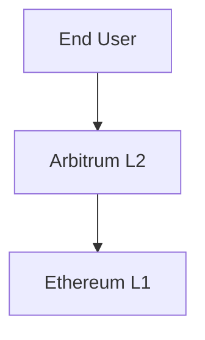
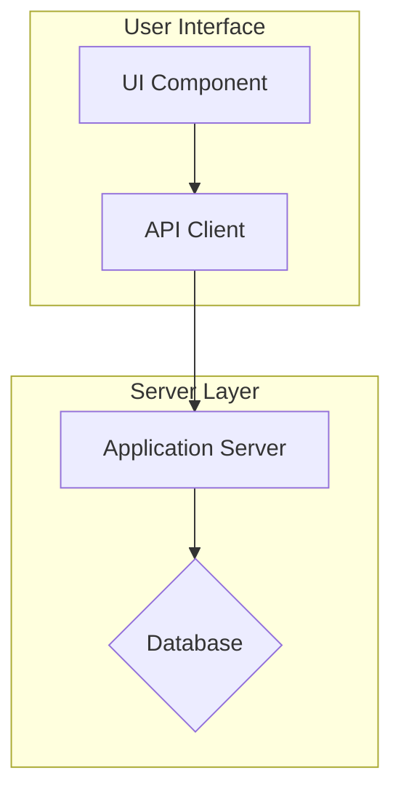
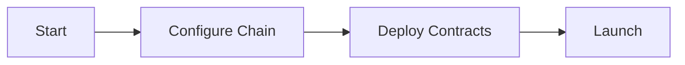
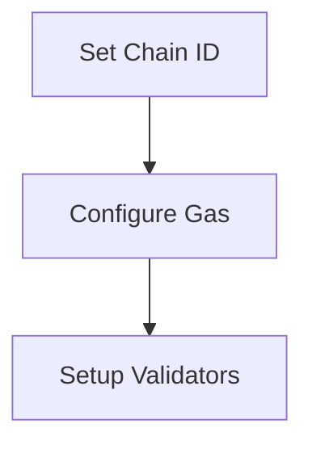

# Interactive Diagram Navigation System

Click-through diagram navigation for Arbitrum Docs using React Flow and Mermaid.

## Overview

This system allows contributors to create interactive diagrams where clicking on nodes navigates to detailed sub-diagrams. Users can explore complex system architectures at different levels of detail.

## Features

- **Click Navigation**: Click nodes to navigate to detailed diagrams
- **Subgraph Support**: Organize nodes into visual containers with colored borders
- **Shape-Based Coloring**: 5 distinct node colors based on shape (rect, diamond, circle, stadium, round)
- **Back Button**: Navigate through history stack to return to previous diagrams
- **Theme Integration**: Automatically adapts to Docusaurus light/dark mode with transparent backgrounds in dark mode
- **Keyboard Accessible**: Tab to focus nodes, Enter/Space to navigate
- **Responsive**: Works on mobile, tablet, and desktop
- **SSG Compatible**: Uses Docusaurus BrowserOnly for static site generation

## Quick Start

### 1. Create Mermaid Diagram Files

Create `.mmd` files in `static/diagrams/`:

**Basic Diagram**:



**With Subgraphs**:



**Link Syntax**: `NodeID[Label]:::link:/diagrams/target-diagram.mmd`

### 2. Use in MDX Pages

```mdx
---
title: 'Architecture'
---

import MermaidReactFlow from '@site/src/components/MermaidReactFlow';

# System Architecture

<MermaidReactFlow diagramFile="/diagrams/overview.mmd" height="500px" />
```

## Component API

### MermaidReactFlow Props

| Prop          | Type   | Default   | Description                             |
| ------------- | ------ | --------- | --------------------------------------- |
| `diagramFile` | string | required  | Path to .mmd file (relative to static/) |
| `height`      | string | `"500px"` | Container height                        |
| `className`   | string | `""`      | Additional CSS classes                  |

## Link Metadata Syntax

Add `:::link:/path/to/diagram.mmd` after node labels:

```mermaid
# Clickable node (blue)
A[Node Label]:::link:/diagrams/detail.mmd

# Non-clickable node (gray)
B[Static Node]

# Connection
A --> B
```

## Navigation Behavior

1. **Initial Load**: Displays the specified `diagramFile`
2. **Click Node**: If node has `:::link:`, loads that diagram
3. **History Stack**: Each navigation adds current diagram to history
4. **Back Button**: Appears when history.length > 0, returns to previous diagram
5. **Non-Linear**: Users can explore in any order

## File Structure

```
src/components/MermaidReactFlow/
├── index.tsx                    # Main export with BrowserOnly wrapper
├── NavigableDiagram.tsx         # Navigation state management
├── ClickableNode.tsx            # Custom node component
├── SubgraphNode.tsx             # Subgraph container component
├── types.ts                     # TypeScript interfaces
└── utils/
    ├── mermaidToReactFlow.ts   # Mermaid → React Flow conversion (3-phase layout)
    └── linkParser.ts           # Parse :::link: syntax

static/diagrams/                 # Mermaid diagram files
├── overview.mmd
├── ethereum-details.mmd
├── arbitrum-details.mmd
└── inbox-details.mmd

src/css/partials/
└── _mermaid-reactflow.scss     # Theme-integrated styling
```

## Styling

### Theme Integration

The component uses Docusaurus CSS variables for seamless theme integration:

```scss
// Light mode
&[data-theme='light'] {
  .react-flow__node {
    box-shadow: 0 2px 8px rgba(0, 0, 0, 0.1);
  }
}

// Dark mode
&[data-theme='dark'] {
  .react-flow__node {
    box-shadow: 0 2px 8px rgba(255, 255, 255, 0.1);
  }
}
```

### Node Colors by Shape

All nodes use shape-based coloring for better visual differentiation:

- **Rectangle** (blue): `#E3F2FD` background, `#1976D2` border
- **Diamond** (orange): `#FFF3E0` background, `#F57C00` border
- **Circle** (green): `#E8F5E8` background, `#388E3C` border
- **Stadium** (purple): `#F3E5F5` background, `#7B1FA2` border
- **Round** (pink): `#FCE4EC` background, `#C2185B` border

**Dark Mode**: Background opacity reduced to 0.2 for better contrast

### Node Interactions

- **Clickable Nodes**: Have `:::link:` metadata

  - Cursor: pointer
  - Hover: translateY(-2px) + shadow
  - Focus: 2px outline

- **Static Nodes**: No link metadata
  - Cursor: default
  - Clickable nodes still show colored backgrounds

### Subgraph Containers

Subgraphs use a rotating 5-color palette:

1. Blue: `rgba(227, 242, 253, 0.4)` with `#1976D2` border
2. Green: `rgba(232, 245, 233, 0.4)` with `#388E3C` border
3. Purple: `rgba(243, 229, 245, 0.4)` with `#7B1FA2` border
4. Orange: `rgba(255, 243, 224, 0.4)` with `#F57C00` border
5. Pink: `rgba(252, 228, 236, 0.4)` with `#C2185B` border

**Dark Mode**: Container opacity reduced to 0.15 for subtlety

### Accessibility

- **Keyboard Navigation**: Nodes are focusable with Tab, activated with Enter/Space
- **High Contrast**: Increased border width in `prefers-contrast: high`
- **Reduced Motion**: No transitions in `prefers-reduced-motion: reduce`
- **ARIA Labels**: Nodes have descriptive labels for screen readers

## Example Usage

### Multi-Level Navigation

```
static/diagrams/
├── launch-chain-overview.mmd
├── configure-chain.mmd
└── validator-setup.mmd
```

**launch-chain-overview.mmd**:



**configure-chain.mmd**:



**Usage**:

```mdx
<MermaidReactFlow diagramFile="/diagrams/launch-chain-overview.mmd" height="400px" />
```

**Navigation Flow**:

1. Overview → Click "Configure Chain"
2. Config → Click "Setup Validators"
3. Validators → Click "Back"
4. Config → Click "Back"
5. Overview (back button hidden)

## Testing

### Test Page

Visit `/docs/test-interactive-diagrams` to see the system in action with sample diagrams.

### Manual Testing Checklist

- [ ] Click blue nodes navigates to new diagram
- [ ] Click gray nodes does nothing
- [ ] Back button appears after navigation
- [ ] Back button returns to previous diagram
- [ ] Back button disappears at root
- [ ] Theme switching updates colors
- [ ] Keyboard Tab focuses nodes
- [ ] Enter/Space activates focused nodes
- [ ] Mobile responsive
- [ ] No console errors

## Troubleshooting

### Diagram Not Loading

**Error**: "Failed to load diagram: /diagrams/xxx.mmd"

**Solution**:

- Ensure file exists in `static/diagrams/`
- Check path starts with `/diagrams/` (not `static/diagrams/`)
- Verify file extension is `.mmd`

### Node Not Clickable

**Symptom**: Node appears gray instead of blue

**Solution**:

- Check syntax: `NodeID[Label]:::link:/diagrams/target.mmd`
- Ensure no space between `]` and `:::`
- Verify target path is correct

### Build Errors

**Error**: "Cannot find module 'reactflow'"

**Solution**:

```bash
yarn install
```

**Error**: TypeScript errors in MermaidReactFlow

**Solution**: Check `types.ts` imports match component usage

## Dependencies

- **reactflow** (^11.11.4): Interactive node-based UI
- **dagre** (^0.8.5): Graph layout algorithm
- **@docusaurus/theme-common**: Theme integration
- **@docusaurus/BrowserOnly**: SSG compatibility

## Performance

- **Lazy Loading**: Component only loads client-side (BrowserOnly wrapper)
- **Memoization**: Node types and callbacks memoized to prevent re-renders
- **Static Files**: Diagrams loaded as static assets (fast)
- **Bundle Impact**: ~200KB for React Flow + Dagre

## Supported Mermaid Features

### Node Shapes

- ✅ Rectangle: `A[Label]`
- ✅ Rounded: `A(Label)`
- ✅ Stadium: `A([Label])`
- ✅ Circle: `A((Label))`
- ✅ Diamond: `A{Label}`

### Edge Types

- ✅ Solid arrow: `-->`
- ✅ Dashed: `---`
- ✅ Dotted: `-.-`
- ✅ Thick/Heavy: `==>`
- ✅ Edge labels: `A -->|Label| B`

### Layout Features

- ✅ Top-to-bottom graphs: `graph TB`
- ✅ Subgraphs with titles: `subgraph ID[Title]`
- ✅ Nested node positioning
- ✅ Cross-subgraph edges
- ✅ Auto-centering with 20% padding

## Future Enhancements

Potential features for future development:

- [ ] More node shapes (hexagon, trapezoid)
- [ ] External link support (https://)
- [ ] Diagram export (PNG, SVG)
- [ ] Minimap option
- [ ] Search/filter nodes
- [ ] Zoom to node
- [ ] URL-based navigation (deep linking)
- [ ] Left-to-right layout support

## Contributing

When adding new diagrams:

1. Create `.mmd` file in `static/diagrams/`
2. Use `:::link:` syntax for clickable nodes
3. Test navigation flow
4. Update documentation if needed
5. Commit with descriptive message

## License

Part of Arbitrum Docs - see main repository license.
