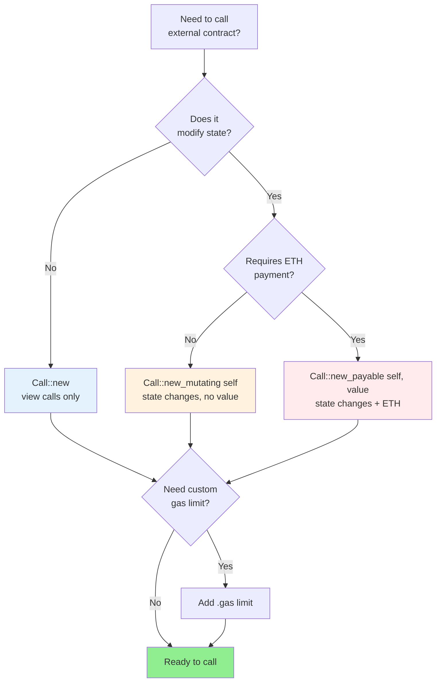

```mermaid
flowchart TD
    Start[Need to call<br/>external contract?] --> Modify{Does it<br/>modify state?}
    Modify -->|No| View[Call::new<br/>view calls only]
    Modify -->|Yes| ETH{Requires ETH<br/>payment?}
    ETH -->|No| Mutating[Call::new_mutating self<br/>state changes, no value]
    ETH -->|Yes| Payable[Call::new_payable self, value<br/>state changes + ETH]

    View --> Gas{Need custom<br/>gas limit?}
    Mutating --> Gas
    Payable --> Gas

    Gas -->|Yes| AddGas[Add .gas limit]
    Gas -->|No| Done[Ready to call]
    AddGas --> Done

    style View fill:#E3F2FD
    style Mutating fill:#FFF3E0
    style Payable fill:#FFEBEE
    style Done fill:#90EE90
```
