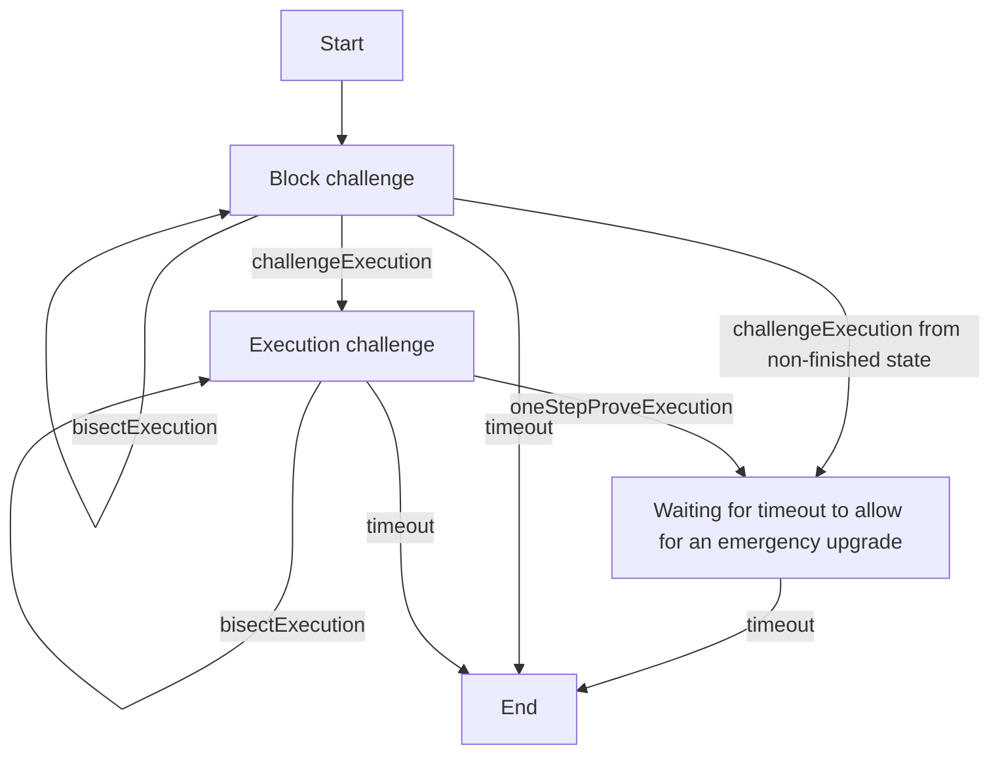

```mermaid
flowchart TD
    B[Block challenge]
    E[Execution challenge]
    W[Waiting for timeout to allow for an emergency upgrade]
    Start --> B
    B -->|bisectExecution| B
    B -->|challengeExecution| E
    B -->|challengeExecution from non-finished state| W
    E -->|bisectExecution| E
    E -->|oneStepProveExecution| W
    W -->|timeout| End
    B -->|timeout| End
    E -->|timeout| End
```
